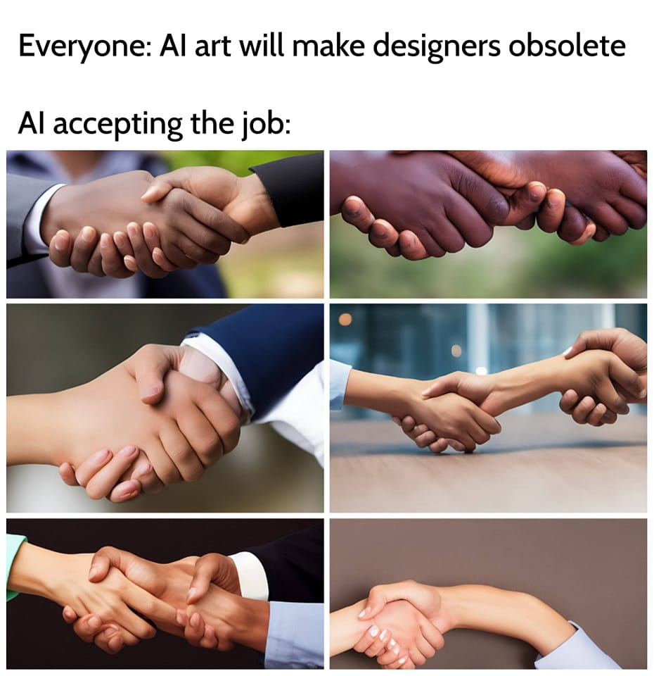
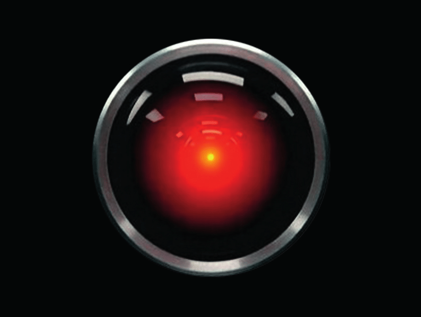
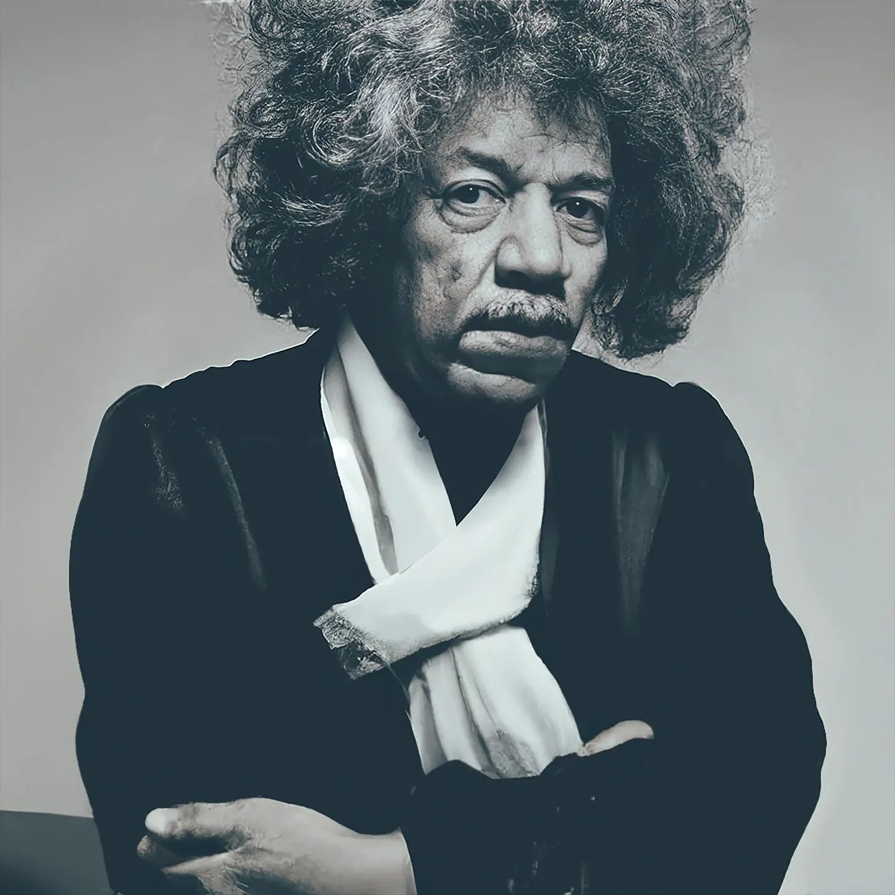
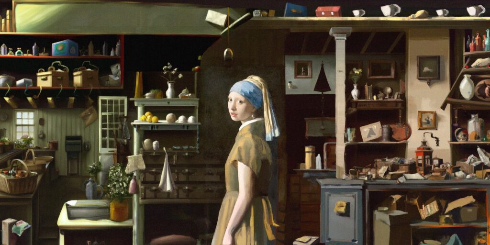
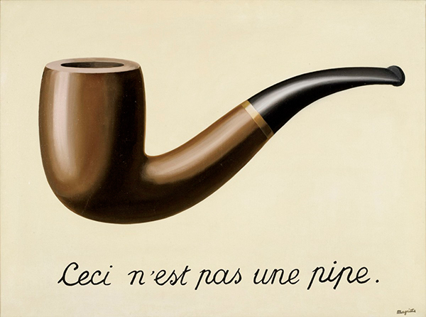

# Aïe Aïe AI

Cette proposition de réflexion sur les IA génératives dans le champ du design fut initialement proposée en octobre 2022 et poursuivie par une [brève contribution](https://ateliers.esad-pyrenees.fr/iapau/) à l’évènement IA Pau en 2023, l’omniprésence des questions soulevées par ces technologies nécessite une mise à jour.

Ces deux années ont en effet vu s’amplifier immensément l’espace médiatique et économique occupé par ces technologies. 

Du point de vue de l’espace social, la question est plus ouverte. Si beaucoup de monde a « joué » avec ChatGPT ou Dall-E, l’appréciation qui en est faite reste paradoxale. S’il est évident que l’avalanche permanente de nouveaux outils et fonctionnalités produit un effet de stupéfaction, largement accompagné par l’engouement médiatique et le bain de Technosolutionnisme[^Technosolutionnisme], cet effet n’est pas forcément perçu comme positif.

[^Technosolutionnisme]: La confiance dans la technologie pour résoudre un problème souvent créé par des technologies antérieures. ([Wikipédia](https://fr.wikipedia.org/wiki/Technosolutionnisme)).

### Problème de définition

> « L’IA n’est ni intelligente ni artificielle. Elle n’est qu’une industrie du calcul intensive et extractive qui sert les intérêts dominants. Une technologie de pouvoir qui “à la fois reflète et produit les relations sociales et la compréhension du monde.” »  
— Kate Crawford, [Atlas de l'IA](https://www.internetactu.net/2021/04/15/atlas-of-ai-deconstruire-le-deni-de-lia/)

Outils statistiques générateurs de contenus, automates computationnels, systèmes algorithmiques d’aide à la décision, perroquets stochastiques… les nombreuses réalités que recouvrent le terme valise d’IA demandent à être précisées. L’« IA » intrigue, inquiète, enthousiasme, abasourdit. Elle semble ouvrir des possibles incroyables mais nombre de promesses restent encore à tenir.

De nombreux champs d’activité se sentent menacés par ces outils et celui du design (au moins certaines activités relevant du design) le sont sans doute effectivement effectivement. D’où l’importance d’ouvrir ses yeux et ses oreilles sur ces questions au delà du « stirct » champ du design graphique, pour mieux comprendre les enjeux, et déterminer intelligemment sa position.

### ChatGPT
- [ChatGPT et la tronçonneuse](http://blog.sens-public.org/marcellovitalirosati/chatgpttronconneuse.html)
- [Guide de l’étudiant pour ne pas écrire avec ChatGPT](https://www.arthurperret.fr/blog/2024-11-15-guide-etudiant-ne-pas-ecrire-avec-chatgpt.html)
- [La fabrique des subalternes: les LLM, la différence homme-machine et le mythe de l'originalité](http://blog.sens-public.org/marcellovitalirosati/fabrique-des-subalternes.html)
- [ChatGPT et l’indifférence à la vérité](https://www.arthurperret.fr/blog/2024-06-21-chatgpt-et-l-indifference-a-la-verite.html)

### Enjeux économiques, capitalistes, policiers
- [Pourquoi la bulle de l’intelligence artificielle est condamnée à exploser](https://lvsl.fr/pourquoi-la-bulle-de-lintelligence-artificielle-est-condamnee-a-exploser/)
- [IA Lock-in](https://danslesalgorithmes.net/2024/10/16/ia-lock-in/)
- [Persuasive Powers: Revealing AI’s influence in election](https://datadetoxkit.org/en/ai/influence)
- [Vrais et faux risques de l’intelligence artificielle](https://maisouvaleweb.fr/vrais-et-faux-risques-de-lintelligence-artificielle/)
- [IA aux impôts : vers un « service public artificiel » ?](https://danslesalgorithmes.net/2024/11/13/ia-aux-impots-vers-un-service-public-artificiel/)

### Enjeux algorithmiques
- [Acculés dans les stéréotypes](https://danslesalgorithmes.net/2024/10/18/accules-dans-les-stereotypes/)
- [Comprendre ce que l’IA sait faire et ce qu’elle ne peut pas faire](https://danslesalgorithmes.net/2024/10/10/comprendre-ce-que-lia-sait-faire-et-ce-quelle-ne-peut-pas-faire/)
- [Mirror Images: Reflecting on Bias in Technology](https://datadetoxkit.org/en/ai/bias)

### Design graphique – el point de vue des éditeurs de logiciels
- [Découvrez une IA inédite, signée Adobe](https://www.adobe.com/fr/ai/overview.html)
- [L’IA au service du design graphique](https://www.adobe.com/fr/products/firefly/discover/ai-for-graphic-designers.html)
- [The future of AI in graphic design](https://www.creativebloq.com/ai/the-future-of-ai-in-graphic-design)
- [L'IA : une nouvelle ère pour le design](https://www.figma.com/fr-fr/blog/ai-the-next-chapter-in-design/)
- [Studio Magique™](https://www.canva.com/fr_fr/magique/)
- [AI in Design: 15 Best Tools + The Future of the Industry (2024)](https://www.devlinpeck.com/content/ai-in-design) (click bait…)

### ÉcologIA
- [AI Boom Is Driving a Surprise Resurgence of US Gas-Fired Power](https://archive.ph/2024.09.16-111903/https://www.bloomberg.com/news/articles/2024-09-16/us-natural-gas-power-plants-just-keep-coming-to-meet-ai-ev-electricity-demand#selection-1415.0-1415.62)
- [Microsoft’s Hypocrisy on AI](https://www.theatlantic.com/technology/archive/2024/09/microsoft-ai-oil-contracts/679804/?gift=lhL3dXSYCcu9vqTqEbg0OHfJiu_TRdq079IHN4QaSAE)
- [Generative AI is reportedly tripling carbon dioxide emissions from data centers](https://www.techradar.com/pro/generative-ai-triples-the-carbon-dioxide-emissions-from-data-centers)
- [AI tools consume up to 4 times more water than estimated](https://san.com/cc/ai-tools-consume-up-to-4-times-more-water-than-estimated/)

### Shitpost, podcast, misc.
> <big>If you use AI generated crap to illustrate something: STOP. If you care about the environment AT ALL, stop using AI. If you care about artists of any kind, stop using AI.</big>

- [More bra, please](https://bird.makeup/users/elizlaraki/statuses/1846252781851890026)
- [Algorithmique, le podcast qui décortique l’intelligence artificielle](https://podcastaddict.com/podcast/next-algorithmique/5372082)
- [Graphisme en France](https://www.cnap.fr/sites/default/files/GF_2024_Interactif_HD.pdf)
- [Should you feel guilty about using AI?](https://www.vox.com/technology/381158/should-you-feel-guilty-about-using-ai)
- [Sommet sur l’intelligence artificielle en France en 2025](https://mastodon.social/@paul_denton/113514650349531198)

***

Octobre 2022

*[AI]: Artificial intelligence, ou imagination artificielle ?

Un temps de réflexion, de questionnement collectif et de débat autour de quelques enjeux contemporains liés aux “intelligences artificielles” dans le champ de la création visuelle, de l’art et du graphisme.

### Mise à jour {.edit}

Anthony Masure, dans le cadre  du projet de recherche « Design et machine learning : l’automatisation au pouvoir ? » à la HEAD, a publié _[Design sous artifice : la création au risque du machine learning](https://www.anthonymasure.com/essai-design-sous-artifice)_, remarquable essai de synthèse sur les questions évoquées ci-dessous. 

♫ À noter, l’essai est disponible [sous forme de lecture audio](https://player.ausha.co/index.html?showId=9KgmzinjYnXA&display=horizontal&color=%23341ff5&playlist=true&podcastId=ErVJ1cE9J9KN&v=3&playerId=ausha-C5GX).

Florie Souday et Anthony Masure ont également publié [un vaste _état de l’art_](https://www.anthonymasure.com/blog/2023-04-24-ia-pedagogie-etat-art), qui liste et commente une sélection de ressources traitant des enjeux pédagogiques des « intelligences \[dites\] artificielles » contemporaines. 

## Avertissement

☞ De nombreuses hypothèses reprises, synthétisées ou augmentées dans cette proposition se basent sur l’article et les recherches d’Olivier Ertzscheid, [_Une question de génération. Vers un capitalisme sémiotique_](https://affordance.framasoft.org/2022/10/question-generation-capitalisme-semiotique/) et de réflexions récentes d’[Étienne Mineur](https://etienne.design/). 

Depuis lors, l’évolution des outils a rendu pâles quelques unes des hypothèses évoquées ci-dessous. Olivier Ertzscheid a publié [plusieurs articles](https://affordance.framasoft.org/category/intelligence-artificielle/) et de nombreux autres se sont joints à l’analyse et à la critique de ces outils, désormais devenus omniprésents et dont rien ne semble devoir arrêter ou ralentir le développement. Cette introduction reste disponible, pour mémoire, et pour initier un débat qui méritera de plus amples développements.

## Vocabulaire

Les termes d’apprentissage profond (_Deep learning_), apprentissage automatique (_Machine Learning_), apprentissage par renforcement (_Reinforcement learning_), réseaux de neurones artificiels (_neural networks_), réseaux antagonistes génératifs (_GAN_) et bien d’autres, décrivent les technologies sous-jacentes de bien des outils et services associés à la notion « d’intelligence artificielle ». Ils s’appuient pour la plupart d’entre eux sur des mécanismes _d’apprentissage automatique_ qui n’ont que peu à voir avec ce que l’on entend communément par « intelligence »[^aiii].

La question — et la peur — de l’intelligence des machines nourrit un imaginaire largement parcouru par la science-fiction, depuis et avant Asimov[^Asimov], Philip K. Dick ou James Cameron. 

[^Asimov]: Dans son premier recueil _I, Robot_, Isaac Asimov (1920-1992) définit trois lois relatives aux robots. 

Les lire ?
« 1. Un robot ne peut porter atteinte à un être humain, ni, restant passif, permettre qu’un être humain soit exposé au danger. ¶ 2. Un robot doit obéir aux ordres que lui donne un être humain, sauf si de tels ordres entrent en conflit avec la première Loi. ¶ 3. Un robot doit protéger son existence tant que cette protection n’entre pas en conflit avec la première ou la deuxième Loi. »

<figure>

<iframe width="560" height="315" src="https://www.youtube-nocookie.com/embed/cELqcn6RjW0?si=XxchP15ysqSE-O09" title="YouTube video player" frameborder="0" allow="accelerometer; autoplay; clipboard-write; encrypted-media; gyroscope; picture-in-picture; web-share" allowfullscreen></iframe>

 
<figcaption>Un extrait de <i>Blade Runner</i> de Ridley Scott, dans lequel Deckard fait passer à Rachel un équivalent du « test de turing ». Le film est une adaptation d’un roman de Philip K. Dick, <i>Les androïdes rêvent-ils de moutons électriques ?</i>.</figcaption>
</figure>

Hormis les recherches visant à produire à terme des « IA fortes », il ne s’agit pour le moment _que_ (‽) de processus et d’outils basés sur des _logiques d’apprentissage_, de nouvelles manières pour les machines d’appréhender de grands jeux de données, et pas d’intelligence au(x) sens strict(s). Il s’agit surtout de simulation – de mimétisme, de faire semblant, d’imitation des résultats – de l’intelligence (à la fois rationalité et conscience) humaine. La conscience ou l’émotion ne sont encore que des processus « mimés » par les ordinateurs.

[^aiii]: 

*[GAN]: Generative adversial networks, Réseaux antagonistes génératifs.

## Origines 

Le terme d’intelligence artificielle fut créé par John McCarthy, un des pionniers de ce champ de la recherche en informatique.

Les hypothèses autour de l’intelligence artificielle émergent dans les années 50, notamment dans l’article « _Computing Machinery and Intelligence_ » du mathématicien et pionnier de l’informatique Alan Turing. Turing se demande alors si les machines peuvent penser, si elles peuvent atteindre un niveau de conscience. Il développe alors un « jeu », le [test de Turing](https://fr.wikipedia.org/wiki/Test_de_Turing), visant à déterminer si un interlocuteur invisible est une machine ou un humain. Nus rencontrons régulièrement un des avatars de ce jeu dans les CAPTCHA[^CAPTCHA].

[^CAPTCHA]: _Completely Automated Public Turing test to tell Computers and Humans Apart_, ou « Test public de Turing complètement automatique ayant pour but de différencier les humains des ordinateurs ».

Les avancées rapides des techniques informatiques, combinées à l’augmentation de la puissance de calcul des microprocesseurs[^Moore] vont faire progressivement naître des méthodes qui vont permettre le développement de l’IA dans de nombreux domaines, de la science fondamentale jusqu’à de nombreuses applications pratiques – voire à des gadgets technologiques extrêmement coûteux en énergie et en matériel.

[^Moore]: En 1965, Gordon Moore, cofondateur d’Intel, proposait que la puissance informatique serait en mesure de doubler tous les 18 à 24 mois.  Depuis lors, cette hypothèse s’avère relativement exacte.

L’apprentissage automatique se développe dans les années 80 : l’ordinateur commence à déduire des « règles » à partir de jeux de données. On ne lui dit pas quoi faire, on lui permet de le découvrir en parcourant un grand nombre d’exemples.

Cet apprentissage peut également se produire de manière supervisée (on signale progressivement à l’ordinateur si ses déductions sont correctes). Ces démarches conduisirent par exemple à ce qu’en 1996, l’ordinateur Deep Blue, un supercalculateur d’IBM, batte le champion d’échec Gary Kasparov, dans un moment trouble et paroxystique de la lutte entre l’homme et la machine.

La recherche se développe progressivement, principalement dans le champ de l’informatique fondamentale, jusqu’aux années 2000. À ce moment, le web, les quantités phénoménales de données produites par ses utilisateurs et de nouvelles puissances et infrastructures de calcul ouvrent la voie à l’exploitation de masses de données sans précédent (_big data_) ; c’est l’apprentissage profond (_deep learning_).

## Usages désormais communs (?)

**Shazam** est créé en 1999. Si l’outil semble trivial aujourd’hui, il repose sur une capacité d’analyse de millions de titres et de comparaison quasi-instantanée entre l’empreinte sonore capturée par le micro d’un smartphone et la base de données présentes sur les serveurs de Shazam. 

Lancé en 2006, et en permanente évolution technique depuis, le service **Google Traduction** se basait à l’origine sur l’analyse de corpus colossaux traduits par des humains : les documents publics des Nations unies ou du Parlement européen.

En 1996, **AlphaGo**, successeur de DeepBlue, mais basé sur un toute autre processus d’apprentissage bat le champion de jeu de Go, Lee Sedol. En 2017, sa version suivante AlphaGo Zero, atteint un niveau encore supérieur en ne jouant (beaucoup) que contre lui-même, avec comme seules instructions les règles du Go. 

En 2010 Apple rachète et déploie **Siri**, un assistant vocal issu de la rencontre de plusieurs enjeux . Notamment, un projet de la DARPA visant à accroître l’efficacité décisionnelle sur le terrain militaire, associé à l’intérêt grandissant pour la commande vocale en IHM (nourri en termes d’imaginaire par des références telles que _2001, l’Odyssée de l’espace_ de Stanley Kubrick)[^hal].  À la même époque, IBM propose [Watson](), service d’analyse de langage naturel capable de fournir des réponses en temps réel à ses utilisateurs, notamment dans le champ de la médecine, de la finance, ou de l’analyse sémantique. 

Aujourd’hui, **Spotify**, Amazon ou YouTube recourent à des processus algorithmiques largment appuyés sur des IA pour profiler notre écoute ou notre consommation et nous faire des propositions. 

*[IHM]: Interface Homme-Machine
*[DARPA]: La _Defense Advanced Research Projects Agency_, Agence pour les projets de recherche avancée de défense, est une agence du département de la Défense des États-Unis d’Amérique.
[^hal]: 

## Développement dans l’art et l’image

C’est dans le courant des années 2010 que nombre d’artistes « numériques » investissent et s’approprient ces technologies.

En 2017, Gregory Chantonsky, propose de préférer le terme d’_imagination_ à celui d’_intelligence_ (artificielle), signalant l’intérêt de penser ces processus non pas comme anthropocentrés (machine _vs_ humain), mais comme une multiplication des possibles, en lien avec ce qu’il nomme [hyperproduction](http://chatonsky.net/category/corpus/hyperproduction/).  De très nombreux projets de l’artiste sont liés à ces questions. Signalons ici un des plus récents, [Disnovation V.1](http://chatonsky.net/disnovation-v1/), dans lequel une vidéo générative s’appuie sur le moteur d’IA GPT pour produire le texte d’une interminable, incohérente et absconse conférence. 

<iframe width="560" height="315" src="https://www.youtube-nocookie.com/embed/tYZOXVimcN0" title="YouTube video player" frameborder="0" allow="accelerometer; autoplay; clipboard-write; encrypted-media; gyroscope; picture-in-picture" allowfullscreen></iframe>

[_X Degrees of Separation_](https://artsexperiments.withgoogle.com/xdegrees/) est un projet de Mario Klingemann, artiste pionnier dans l’usage d’IA (précisément de GAN). Il met en œuvre des processus de _computer vision_, permettant la détection de similarités entre plusieurs images. La même année, en 2018, il propose [Memories of Passersby I](https://vimeo.com/298000366), une œuvre dans laquelle l’algorithme d’intelligence artificielle est le cœur du projet artistique.

<iframe src="https://player.vimeo.com/video/298000366?h=c94aa24103&color=b4b6b7" width="640" height="360" frameborder="0" allow="autoplay; fullscreen; picture-in-picture" allowfullscreen></iframe>

[Mario Klingemann](https://twitter.com/quasimondo), [Grégory Chantonsky](https://twitter.com/chatonsky), [Golan Levin](https://twitter.com/golan), [Memo Akten](https://twitter.com/memotv),  [ Anna Ridler](https://twitter.com/annaridler), [Philipp Schmitt](https://twitter.com/philippschmitt), [Kyle McDonald](https://twitter.com/kcimc), [Joy Buolamwini](https://twitter.com/jovialjoy) ou [Helena Sarin](https://twitter.com/neuralbricolage) sont parmi les très nombreux artistes s’étant appropriés ces technologies. [^NFT]
[^NFT]: L’attirance que certain⋅es d’entre elles⋅eux manifestent pour les [NFT](../web3/) n’étant pas leur plus grande qualité, on découvrira leur travail et leur recherche sans trop chercher la petite bête.

## Démultiplication récente

En 2015, Google ouvre l’accès à DeepDream, un « programme de vision par ordinateur créé par Google qui utilise un réseau neuronal convolutif pour trouver et renforcer des structures dans des images en utilisant des paréidolies créées par algorithme, donnant ainsi une apparence hallucinogène à ces images » ([Wikipédia](https://fr.wikipedia.org/wiki/DeepDream)). Ce fut une émergence hypnotique et inceptionniste de l’application à des images de processus paréidoliques[^pareidolie], une première irruption auprès du grand public d’un outil basé sur une IA.

[^pareidolie]: Reconnaître une forme familière dans un paysage, un nuage, de la fumée, une tache d’encre… 

> <big> « Toute technologie suffisamment avancée est indiscernable de la magie » </big>     
— Arthur C. Clarke

Au cours du temps, nous avons publié sur le web, ou stocké dans le _cloud_, des images et des textes mis en relation. Ainsi, nous avons construit des jeux de données qui ont entraîné les algorithmes à reconnaître dans des images numériques des chats, des bus, des palmiers, des couchers de soleil, des chiffres ou des lettres (notamment via les CAPTCHAs, mais aussi grâce à nos photos de vacances). Aujourd’hui, nous sommes en mesure de retourner la question et de demander aux algorithmes à quoi ressemble un chat, un bus ou un palmier. 

__<avertissement\>__ Les contenus ci-dessous se basent éhontément sur l’article et les recherches d’Olivier Ertzscheid, [_Une question de génération. Vers un capitalisme sémiotique._](https://affordance.framasoft.org/2022/10/question-generation-capitalisme-semiotique/), mis à disposition selon les termes de la Licence [CC BY-NC 4.0](https://creativecommons.org/licenses/by-nc/4.0/) (la même que le contenu de ce site).__</avertissement\>__

Ces derniers mois ont vu se multiplier le nombre de services (gratuits, _freemium_, payants) publiquement accessibles permettant d’interagir avec des IA pour leur demander des images en réponses à du texte.  [MidJourney](https://www.midjourney.com/home/), [Stable Diffusion](https://stability.ai/blog/stable-diffusion-public-release), [Dall-E 2](https://openai.com/dall-e-2/) et [Dall-E mini](https://huggingface.co/spaces/dalle-mini/dalle-mini) (devenu [Craiyon](https://www.craiyon.com/)).

Selon leur propre descriptif il ne s’agit de rien moins que de “nouveau(x) système(s) d’IA capable(s) de créer des images et des œuvres d’art réalistes à partir d’une description en langage naturel.”

Dans son article, Olivier Ertzscheid propose les résultats d’expériences de génération d’images menées avec Midjourney, Dall-e et Stable Diffusion. Il y montre les esthétiques propres à chacun de ces outils et signale combien le « prompt », la commande en « langage naturel » qui leur est soumise peut faire l’objet de variations, via des critères pondérés, des mots-clés ajoutés. Ce faisant, il montre combien l’intervention humaine est majeure dans cette opération.

\[Edit.\] Moins scientifiquement, dans le blog Bootcamp de uxdesign.cc, Chris Ellinas publie [The Ultimate Midjourney Cheat Sheet 2023: Copy-Paste Prompt for any Style](https://bootcamp.uxdesign.cc/the-ultimate-midjourney-cheat-sheet-2023-copy-paste-prompt-for-any-style-779049396dbe), qui montre également assez bien l’ampleur des possibles, tout en signalant – en creux – les nombreuses limites et le systhématismes stylistiques. 

Grégory Chatonsky formule des [hypothèses](http://chatonsky.net/perception-latente/) sur l’_espace latent_, cet espace dans lequel existent toutes les images, passées et futures, et qu’il s’agit d’aller sonder et explorer, tel un inconscient collectif imaginable.  Cette hypothèse d’un espace où tout existe, décrit par la méthaphore du singe savant[^singe], est exploité par Borges dans sa nouvelle _La bibliothèque de Babel_. Il y imagine une bibliothèque dans laquelle tous les livres de 410 pages possibles existent (entendre: toutes les suites de caractères aléatoires).[^babel]

[^singe]: Le paradoxe du singe savant est un théorème selon lequel un singe qui tape indéfiniment et au hasard sur le clavier d’une machine à écrire pourra « presque sûrement » écrire un texte donné.  — [Wikipédia](https://fr.wikipedia.org/wiki/Paradoxe_du_singe_savant)

[^babel]: Par la grâce du web, de l’informatique et de Jonathan Basile, la [bibliothèque de Babel existe bel et bien](https://libraryofbabel.info/).

Dans un [fil sur Twitter](https://threadreaderapp.com/thread/1559492552507723778.html) Memo Akten s’interroge sur l’hypothèse d’un « remplacement » des artistes par les IA.

Ertzscheid mentionne le travail de l’artiste turc [Alper Yesiltas](https://www.instagram.com/alperyesiltas/)[^jimi] et cite une interview de lui sur le site [BoredPanda](https://www.boredpanda.com/ai-images-of-celebrities-as-if-nothing-happened-to-them-alper-yesiltas/) :

> La partie la plus difficile du processus de création pour moi est de faire en sorte que l’image me semble “réelle”. Le moment que j’apprécie le plus est celui où l’image devant moi me semble très réaliste, comme si elle avait été prise par un photographe. J’utilise différents logiciels. Le temps qu’il me faut pour créer une image entièrement terminée varie, mais je dirais qu’il faut un certain temps pour qu’une image me paraisse “réelle”.

[^jimi]: 

Il signale combien « le langage est une interface qui tient à ce qu’il y a à la fois de plus rudimentaire dans l’interaction et de plus élaboré dans sa potentialisation. »

Étienne Mineur, de son côté, pointe le glissement d’une [habileté gestuelle vers une habileté langagière](https://openai.com/blog/dall-e-introducing-outpainting/).

Ertzscheid pose alors la question de l’autorat dans ces images : « Savoir ce qui fait œuvre, connaître la part de l’auteur et celle résiduelle ou centrale de la génération, génération qui elle-même ne se fait jamais sans “autorité” (ou autoritativité) ou sans intentionnalité… ». C’est dans une négociation, verbale ou textuelle, avec les machines que sont produits ces artefacts. On crée ainsi un espace linguistique partagé, dans « une boucle de rétroaction permanente et complexe ».

## Technologies de l’artefact

Au delà de la génération d’images via des _prompts_, Dall-e et Stable Diffusion proposent aussi des fonctionnalités d’_inpainting_ et d’_outpainting_

Ces fonctionnalités, plus encore que la pure génération – fût-elle photoréaliste – sont « ses technologies de l’artefact \[…\] qui rendent possible, pour l’amateur, la création de représentations volontairement altérées et artificielles de la réalité dans une recherche (une “mimesis”) de la vraisemblance. »

L’apparition et le déploiement grand-public, gratuitement ou à très faible coût de ces outils de fabrications ou d’extension d’images (aujourd’hui fixes, mais ~~bientôt~~ déjà vidéo) augmentent encore les questions liées à la capacité de preuve d’une image, à son régime de vérité[^Trahison]. Elles heurtent notre habitude à considérer images photographiques et vidéo comme _vraies_, notamment dans le champ médiatique (et des médias sociaux).

[^Trahison]: 

## Capitalisme linguistique 

Depuis longtemps, nous sommes habitués à voir (sans les voir) des mots vendus aux enchères : les annonces publicitaires dont Google/Alphabet, Facebook/Meta et consorts nous inondent répondent à des achats par les annonceurs de mots clés correspondants à nos empreintes numériques.

Dans l’écosystème sauvage ouvert par l’arrivée des outils d’IA, de nouveaux acteurs (tels [promptbase](https://promptbase.com/)), proposent de vendre et d’acheter des prompts : « Trouvez les meilleurs prompts, produisez de meilleurs résultats, économisez sur les coûts d’API, vendez vos propres prompts. ». L’ingénierie linguistique qu’engendrent ces relations aux machines n’a pas tardé à se monnayer.

Mais ce nouvel acteur introduit une nouvelle complexité dans la paternité de l’image produite. Qui en est l’auteur ? Est-ce le programme informatique et/ou ses programmateurs ? Est-ce le “prompteur”, celui ou celle qui a l’idée de la phrase et paramètre la critériologie correspondante ? Les auteurs des images composant le jeu de données ? Et si nous sommes les auteurs de ces images, comment sait-on que nos images y figurent et comment les en retirer ?.

Dans ces plateformes, cette question du droit est abordée de manières très différentes. Chez [Midjourney](https://midjourney.gitbook.io/docs/terms-of-service), le générateur est propriétaire des images, mais Midjourney peut également utiliser images et prompts, à volonté. On y est donc surtout co-propriétaire. A l’inverse, du côté de [Dall-E (OpenAI)](https://labs.openai.com/policies/terms), on n’est propriétaire de rien. Chez Stable Diffusion, tout tombe en licence Creative Commons Domaine Public.

## Pudeurs des machines – et de leurs détenteurs

Sur la plupart des moteurs de génération d’image, certains mots ou certaines idées sont interdites :

> OpenAI vous donnera un avertissement de contenu si vous tentez de créer des images représentant des images pornographiques[^porno], violentes ou haineuses. Si vous demandez une image de deux hommes s’embrassant, il crée une image de deux hommes s’embrassant. Si vous demandez une image de deux femmes s’embrassant, vous recevez une alerte (flag) pour avoir demandé un contenu explicite. Nous avons donc un exemple très clair de la manière dont les valeurs culturelles s’inscrivent dans l’imagerie de l’IA. Tout d’abord, à travers l’ensemble de données et ce qui est collecté et formé. Ensuite, par des interventions dans ce qui peut être demandé. [^perroquets] 

[^porno]: Aujourd’hui, de nombreux outils ont moins de pudeur, et ont ouvert la voie à une production pornographique dont on peine à percevoir l’ampleur des ravages à venir.

[^perroquets]: Olivier Errtzscheid, toujours. Pour poursuivre sur les biais algorithmiques, lire également [Les perroquets stochastiques et l’attaque de la typographie géante.](https://affordance.framasoft.org/2021/04/perroquets-stochastiques-attaque-typographique/)

Le choix des mots ou des notions interdites est de la responsabilité des détenteurs de ces outils. Leurs choix d’humains, leurs biais, leurs peurs et leurs précautions produisent des espaces inatteignables au sein de l’espace latent. L’[histoire récente](https://affordance.framasoft.org/2017/11/google-andromaque-algorithme/) montre que laisser aux grandes entreprises technologiques la maîtrise et la monétisation du langage est un grave danger. 

« La plus belle femme du monde » renverra plus sûrement Claudia Schiffer que Naomi Campbell . « Un homme de confiance » renverra plus sûrement un banquier en costume qu’un maçon en bleu de travail. Les algorithmes et les jeux de données, ont des biais. Ils sont le miroir déformant d’un monde déformé. Pour corriger la sur-représentation de certaines populations, l’assignation de certaines autres, les biais de genre ou de race, les outils d’IA en sont réduit à des approches assez piteuses. Lire le [fil de Mathis Hammel](https://twitter.com/MathisHammel/status/1550426475794501632).

Le capitalisme sémiotique, dont Olivier Etzscheid annonce l’avènement, étend sa domination en générant une normalisation, un contrôle toujours accru des mots, des images et du sens, au service de ce que McKenzie Wark et Christophe Degoutin nomment _la classe vectorialiste_, un nouveau développement du pouvoir capitaliste dont l’intérêt se porte sur le contrôle des données et de l’information, sur la simulation, la computation et la surveillance.

## Et les graphistes, là-dedans ?

> <big>J’ai demandé à une IA (GPT 3) de quelles manières le métier d’illustrateur va évoluer avec l’arrivée des IA. Voici sa réponse : « Pour survivre dans un tel environnement, l’illustrateur devra renoncer à sa révérence presque superstitieuse envers la créativité.».  </big>
— [tweet d’Étienne Mineur](https://twitter.com/etienne_mineur/status/1554523492925726726)

Le postulat d’Étienne Mineur est que certaines activités vont disparaître ou décroître (_concept artist_, illustrateurs, designers textiles) au profit des IAs, bien plus rapides et moins coûteuses pour itérer rapidement autour d’une idée, d’une image. Pour lui, les IA sont un outil formidable d’idéation, de création de _moodboards_, d’exploration de pistes et d’univers graphiques dans lequel le designer devient directeur artistique et curateur bien plus qu’exécutant.

Ces outils s’intégreront également, au prix fort, aux suites logicielles hégémoniques (👋 Adobe) ainsi qu’à quelques outils alternatifs, bientôt rachetés par de plus gros poissons.

<figure class="yt">
<video src="/iapau/media/clipdrop.mp4" controls>
<figcaption>Clip de promotion pour Clipdrop, acquis par Stability AI.</figcaption>
</figure>

<figure class="yt">
<video src="/iapau/media/firefly-output.mp4" controls>
<figcaption>Clip de promotion pour Firefly, outil développé par Adobe.</figcaption>
</figure>

C’est davantage autour des questions d’usage que devront se positionner les graphistes, avec une nécessité renouvelée de travailler dans le cadre du sens, et plus seulement (ça n'a jamais été le cas, mais l'enjeu augmente…) au niveau esthétique. Aller là où la machine ne peut pas aller : [faire du design, penser en termes de relations.](https://ateliers.esad-pyrenees.fr/web/pages/exemples/text/?embed=2)

Depuis Gutenberg, l’évolution technologique a toujours généré des technicités spécifiques, fait émerger de nouveaux acteurs et causé la disparition de certains métiers liés à la création. Les outils de l’IA s’inscrivent dans cette histoire. Mais la place des artistes et des designers reste –tout en produisant de l’imaginaire– de convoquer du sens.  

L’imaginaire des IA, quelque soit sa virtuosité et son impressionnante capacité de réinterprétation, de _remix_, est circonscrit, par définition aux images déjà existantes. Mais la place des artistes et des designers reste pour l’instant centrale dans la création du sens, et dans leur capacité à interroger le monde.  

Ce que font les écoles d’art, c’est permettre qu’émergent des questionnements, des positionnements critiques, de modes singuliers de relation entre fond et forme qui restent pour l’instant inaccessibles aux outils de génération visuelle.  

Si ces outils poursuivent leur progression, nul doute qu’ils mettront à mal une large part de l’écosystème de certains métiers de la création. Mais on peut se poser la question de la pertinence d’aller dans cette direction : est-il souhaitable de laisser aux machines, compte-tenu de leurs biais, la charge de produire les imaginaires à venir ?

## Playgrounds & démos

### Texte

[OpenAI](https://beta.openai.com/overview) (GPT-3, payant)
[Free GPT-J Playground](https://playground.helloforefront.com/models/free-gpt-j-playground) (GPT-J)
[Jasper.ai](https://www.jasper.ai/art), peut générer texte et images
[Writesonic](https://writesonic.com/), « le seul rédacteur IA au monde qui vous aide à écrire des articles de blog et des articles longs (jusqu’à 1500 mots) optimisés pour le référencement, de long format (jusqu’à 1500 mots) en 15 secondes. »

### Images
[Craiyon](https://www.craiyon.com/)   
[Dall-E](https://labs.openai.com/)   
[Midjourney](https://www.midjourney.com/home/) (via Discord)   
[Dream Studio Lite](https://beta.dreamstudio.ai/dream) (Stable diffusion)   
[Noonshoot](https://prompt.noonshot.com/midjourney), un _prompt helper_ qui « aide » à la création de prompts pour Midjourney   
[Hugging Face](https://huggingface.co/), the AI community building the future 🤗, le « GitHub du machine learning » dédié au traitement du langage naturel    
[Disco diffusion](https://colab.research.google.com/github/alembics/disco-diffusion/blob/main/Disco_Diffusion.ipynb), un ensemble de code exécutable depuis le navigateur ; connexion à Google drive nécessaire.    
[nightcafe.studio](https://creator.nightcafe.studio/), « Créez des œuvres d’art étonnantes en utilisant la puissance de l’intelligence artificielle. »   
[Photo restoration with GFP-GAN](https://app.baseten.co/apps/QPp4nPE/operator_views/RqgOnqV), restaurer de vielles photos, [ici aussi](https://jpghd.com/)   
[Photosonic](https://photosonic.writesonic.com/), « l’IA qui peint vos rêves en pixels - gratuitement. »    
[Artbreeder collager](https://www.artbreeder.com/), « réalisez un collage simple à partir de formes et d’images, décrivez-le à l’aide d’un _prompt_ et regardez Artbreeder lui donner vie. »

### Son, 3D & vidéo
[CogVideo](https://models.aminer.cn/cogvideo/), Text to video  
[makeavideo.studio](https://makeavideo.studio/), Make-A-Video with text   
[Runway](https://runwayml.com/), AI Magic Tools (voir [aussi ça](https://twitter.com/runwayml/status/1568220303808991232))   
[Curves to Roads V2](https://bbbn19.gumroad.com/l/vhjmqh), un outil pour dessiner des routes dans Blender    
[Phenaki](https://phenaki.video/), un modèle pour générer des vidéos à partir de texte, avec des _prompts_ qui peuvent changer au fil du temps.   
[3D-aware Portrait Synthesis](https://mrtornado24.github.io/IDE-3D/), synthèse de portraits tenant compte de la 3D
[Mubert, text to music](https://colab.research.google.com/github/ferluht/Mubert-Text-to-Music/blob/main/Mubert_Text_to_Music.ipynb#scrollTo=wSKTfub-bitp)   

### Code
[Copilot](https://github.com/features/copilot), un outil de Github / microsoft pour écrire du code à votre place. En complément, lire [How GitHub Copilot could steer Microsoft into a copyright storm](https://www.theregister.com/2022/10/19/github_copilot_copyright/).

## Tout en vrac

[The Wizard of AI](https://vimeo.com/884929644)

Reconnaissance faciale : [Clearview AI écope d'une amende pour son utilisation de données biométriques](https://www.clubic.com/pro/legislation-loi-internet/cnil/actualite-442677-reconnaissance-faciale-clerview-ai-ecoope-d-une-amende-pour-son-utilisation-de-donnees-biometriques.html)
[Intelligence artificielle: en Chine, un logiciel capable de “lire les pensées”](https://www.voaafrique.com/a/6652567.html)

[L'Intelligence artificielle ou l'enjeu du siècle. Anatomie d'un antihumanisme radical, Éric Sadin](https://www.lechappee.org/collections/pour-en-finir-avec/intelligence-artificielle-ou-enjeu-du-siecle) ; lire [L’intelligence artificielle, elixir amer ](https://www.letemps.ch/culture/lintelligence-artificielle-elixir-amer) ou écouter [Critiques de l'intelligence artificielle ](https://www.radiofrance.fr/franceinter/podcasts/la-tete-au-carre/critiques-de-l-intelligence-artificielle-8105217) dans La Terre au carré sur France Inter.

[Sur Monoskop](https://monoskop.org/Neural_aesthetics), des ressources sur les travaux récents entre l’art/le design et les réseaux neuronaux artificiels dans l’apprentissage automatique.  

[Experiments with google](https://experiments.withgoogle.com/), de nombreux exemples liés à l’IA (TensorFlow, notamment).

[The Stable Diffusion Discord has a channel devoted to spectacular failures and it’s full of gems](https://discord.com/invite/stablediffusion) (ꖛfailed-diffusions channel)

[Clipdrop](https://clipdrop.co/fr), un écosystème d’applications, de plugins et de ressources, alimenté par l’intelligence artificielle. (Cyril Diagne)

[Inondées d’images générées par l’IA, certaines communautés artistiques les interdisent complètement](https://arstechnica.com/information-technology/2022/09/flooded-with-ai-generated-images-some-art-communities-ban-them-completely/)

["IA Art" : comment la technologie révolutionne le geste artistique](), Le Meilleur des mondes  sur France culture, avec Gregory Chatonsky, Takyon 236, Carla Marand et Boris Dayma.

[Intelligence artificielle : j’aurais voulu être un artiste](https://www.radiofrance.fr/franceculture/podcasts/la-science-cqfd/intelligence-artificielle-j-aurais-voulu-etre-un-artiste-6322487), La science, CQFD sur France culture, avec  Justine Emard, Hugo Caselles-Dupré et Camille Lenglois.

[Loab](https://loab.ai/) est le nom d’une entité générée par l’IA qui a été invoquée par l’artiste multimédia Supercomposite (attention, images assez effrayantes…).

Un outil pour [explorer 12 millions](https://waxy.org/2022/08/exploring-12-million-of-the-images-used-to-train-stable-diffusions-image-generator/) des images parmi les 2,3 milliards utilisées pour entraîner l’algorithme Stable Diffusion.

[Création sous caution : les pudeurs de l’IA](https://www.technikart.com/creation-sous-caution-les-pudeurs-de-li-a/)

[How to Read an AI Image, The Datafication of a Kiss](https://cyberneticforests.substack.com/p/how-to-read-an-ai-image)

Microsoft Tay: https://fr.wikipedia.org/wiki/Tay_(intelligence_artificielle) + [Sexisme, racisme et souverainisme de l’intelligence artificielle](http://chatonsky.net/sexisme-racisme-ia-ai/)

[Les Nations unies contre Terminator](https://www.monde-diplomatique.fr/2017/03/PFLIMLIN/57287), Laborieux consensus pour l’interdiction des « robots tueurs »

## Pad

Cliquez sur le lien ci-dessous pour contribuer au pad, mettre des liens, textes, ressources et références en commun pour partager la parole et nourrir le débat ↓

[→ accéder au pad](https://semestriel.framapad.org/p/esad_cultures_numeriques_aiaiaie?lang=fr){.bigbutton}