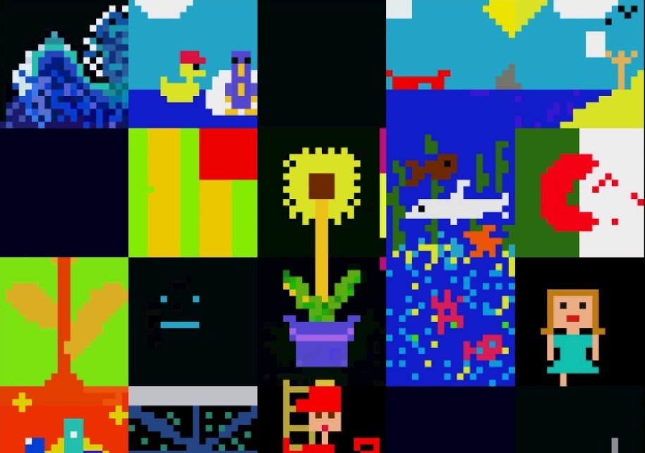
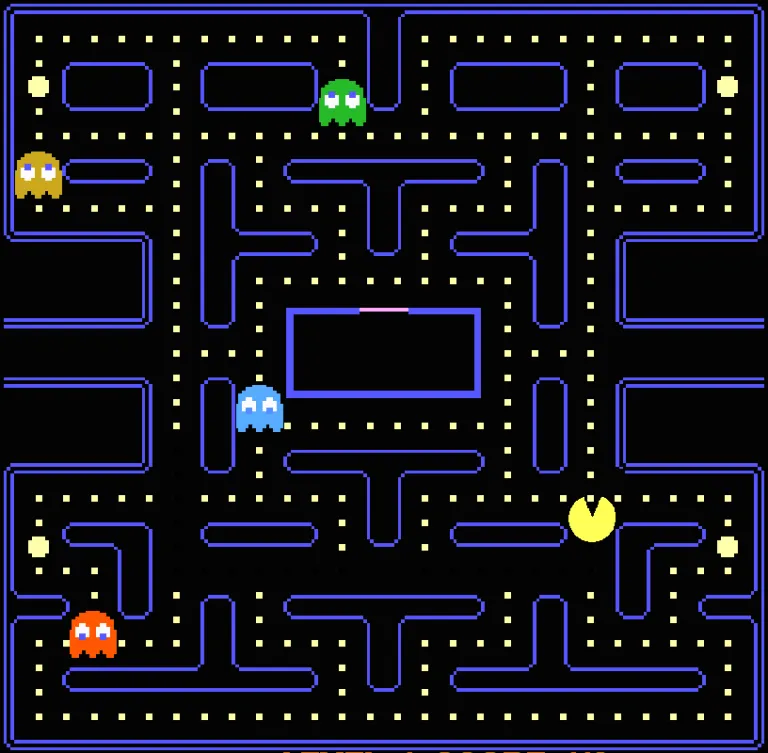
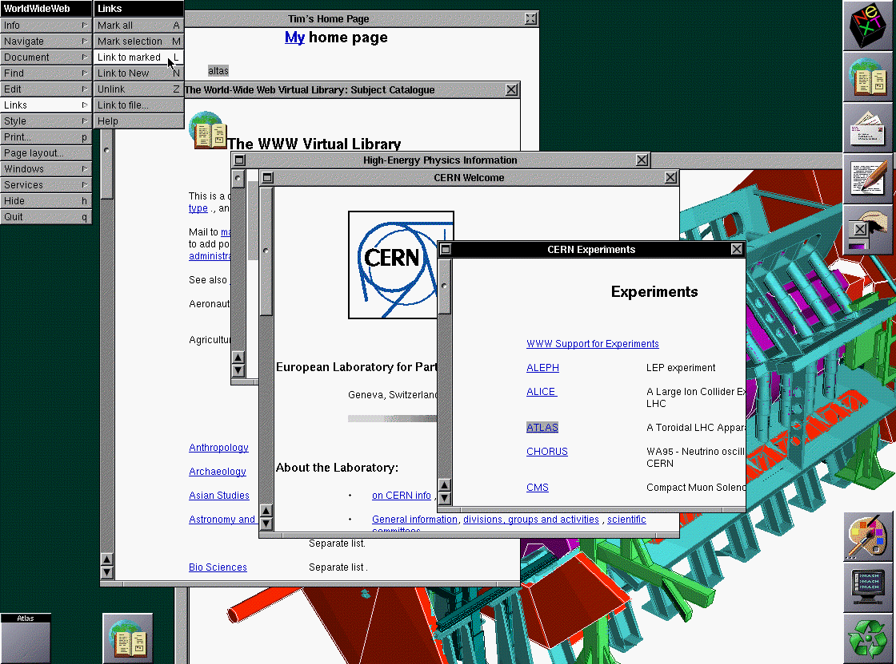
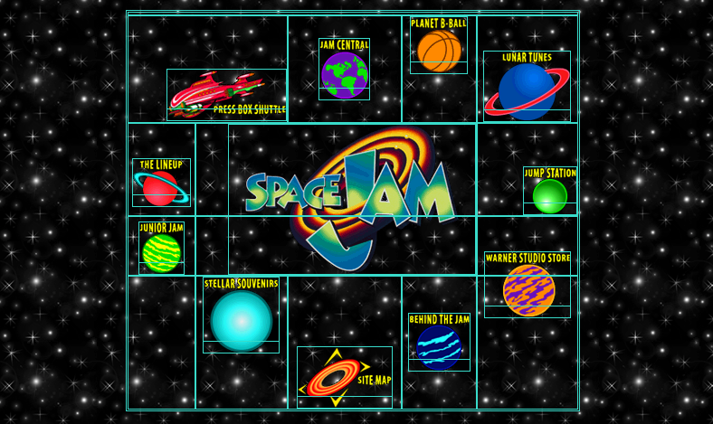
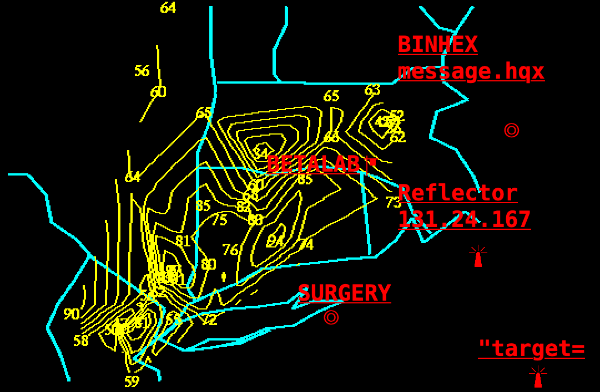
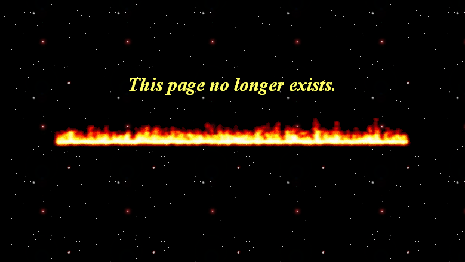
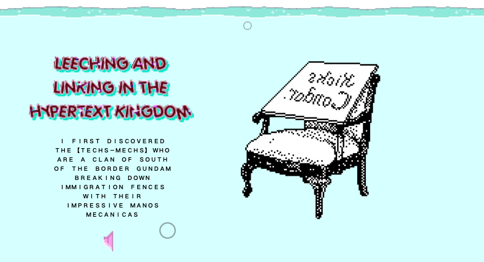

# Folklore de la zone mondiale

> Zoom à l’intérieur de la présentation “[Make it boing](https://radicalweb.design/makeitboing/)” proposée lors de la journée d’étude [“Rendre visible”](https://esad-pyrenees.fr/agenda/rendre-lisible) du mardi 16 novembre 2021.

L’émergence puis l’avènement des outils et médias numériques depuis les années 70/80, puis du web dans les années 90/2000 ont été le contexte dans lequel de nombreux courants esthétiques ont éclos, se sont développés, furent oubliés, puis recyclés ou revitalisés. Les flux et les tendances qui y sont nées ont imprégné notre univers visuel jusqu’à le façonner, en y intricant sources réelles et virtuelles.

Cette introduction se propose de parcourir à grands traits quelques éléments saillants de cette histoire récente, en tachant d’y déceler les dimensions culturelles et politiques sous-jacentes. 

> <big>Chaque période a les survivances qu’elle mérite, ou plutôt qui lui sont nécessaires et, en un sens,\[qui\] la sous-tendent stylistiquement</big>    
— Georges Didi-Huberman, *L’image survivante*, après Aby Warburg.[^retro]
[^retro]: [Le temps du retro, Spirale magazine](http://www.spiralemagazine.com/dossier-magazine/le-temps-du-retro)

Il ne s’agit pas ici de souhaiter le recours à un folklore issu des temps passés – fussent-ils récents – mais de tâcher de comprendre quelques unes des logiques qui furent mises en œuvre dans les modes d’appréhension du web, et plus largement des outils et médias numériques des dernières décennies.

## Préludes

De l’art cybernétique des années 1960, en passant par Fluxus, jusqu’à l'art télématique[^poietic] ou au plus clandestin mouvement [Avant-pop](https://www.altx.com/manifestos/avant.pop.manifesto.html), le monde de l’art s’est toujours emparé des technologies émergentes, pour les expérimenter, explorer de nouveaux territoires, et très rapidement, les détourner.

[^poietic]: 

La démocratisation de l’accès aux premiers ordinateurs personnels (de marque Commodore, Atari ou Apple) dans les années 80 a vu se déployer un champ esthétique qui, bien que très contraint par les capacités techniques des machines, a fondé un imaginaire visuel encore puissant aujourd’hui. 

Le pixel art de Pac-Man[^pacman] ou Space Invaders, l’ASCII art des premiers [Bulletin Board Systems](https://fr.wikipedia.org/wiki/Bulletin_board_system), des travaux de [Kenneth Knowlton](http://www.knowltonmosaics.com/) ou plus tard des œuvres de Vuk Ćosić nourrit encore les pratiques contemporaines, des NFTs [CryptoPunks](https://www.larvalabs.com/cryptopunks/forsale) aux [expériences d’Andreas Gysin](https://ertdfgcvb.xyz/).
<figure>
<video src="images/Cosic-SingingInTheRain.mp4" controls></video>
<figcaption>
Singing In The Rain, 1999, Vuk Ćosić
</figcaption>
</figure>

*[ASCII]: American Standard Code for Information Interchange

[^pacman]: 

## Initialisation
En 1989, Tim Berners Lee formule une “[proposition de système de gestion de l'information](https://www.w3.org/History/1989/proposal.html)” pour le Cern, à Genève. Bientôt appuyé par l’enthousiasme de Robert Caillau, ils développent les bases de ce qui deviendra le World Wide Web (un protocole, HTTP ; un langage de structuration de documents, HTML, un moyen d’adressage des documents, l’URL, et le premier _navigateur_ web[^www]). \[…\]

<figure>

<figcaption>
Le navigateur WorldWideWeb
</figcaption>
</figure>

[^www]: Le [navigateur WorldWideWeb](https://worldwideweb.cern.ch/) fut recréé par le Cern en 2019, afin de rendre perceptible les principes du fonctionnement initial du web. 

Le Web est conçu pour être un système d’échanges d’information universel, agnostique des appareils ou dispositifs qui vont en permettre l’affichage, et fondamentalement accessible. Son dépôt dans le domaine public en 1993, tout comme les grands principes qui ont présidé à sa conception (décentralisation, non-discrimination, universalité, standards) ont très tôt des contraintes majeures pour les designers qui l’ont investi.

<figure>

<figcaption>
<a href="http://web.archive.org/web/20200404194425/https://www.spacejam.com/">Space Jam</a>, site promotionnel du film, 1996. En turquoise, la visualisation de la structure en tableau nécessaire à la mise en page.
</figcaption>
</figure>

Le duo [Jodi](http://jodi.org/)[^jodi] a été un pionnier de l’art en ligne dès le milieu des années 1990. Joan Heemskerk et Dirk Paesmans furent parmi les premiers artistes à étudier et à subvertir les conventions et écritures vernuaculaires naissantes du web et d’Internet, des programmes informatiques ou des jeux vidéo.

[^jodi]: l’URL jodi.org redirige aléatoirement (le 3 mars 2022) vers un des sites/projets du duo. Un ensemble de projets peut être consulté depuis [x20xx.com](https://x20xx.com/). Regarder et écouter [My Desktop OS X 10.4.7 (2007)](https://ubu.com/film/jodi.html).

<figure>

<figcaption>
<a href="http://wwwwwwwww.jodi.org">wwwwwwwww.jodi.org</a> 
</figcaption>
</figure>

Associés à Vuk Ćosić (déjà cité), Olia Lialina (bientôt citée) et d’autres artistes, ils furent en 1994 les fondateurs de _net.art_, un groupe d’artistes emblématiques du Net art (ne pas confondre…). La même année Grégory Chatonsky et Karen Dermineur fondaint en France le collectif [incident.net](http://incident.net/)[^jacques], plate-forme artistique déteminée à être « l’infime \[qui\] résiste dans la mégapole cybernétique », l’un des premiers collectifs d’artistes français à investir internet comme médium central dans leurs pratiques artistiques.

[^jacques]: [Jacques Perconte](http://www.jacquesperconte.com/), artiste également emblématique de l’usage des outils numériques dans le champ de l’art contemporain maintenait un “[wiki du net art](http://web.archive.org/web/20160326125942/http://www.technart.fr/NetArtHistory/)” dont InternetArchive a gardé trace.

Le projet [Rhizome](https://rhizome.org/), fondé en 1996 et encore actif, est un acteur et un témoin majeur des pratiques artistiques en ligne ou numériques.

## Balbutiements

Les premières années du web furent assez douloureuses pour les designers. Tenter de dépasser les limites des langages et des techniques d’alors était un exercice périlleux, et la qualité graphique atteignable restait très approximative.

Ces années furent cependant l’occasion de l’émergence d’une culture visuelle singulière, qui irrigue encore nos imaginaires. Geocities –en France [Mygale](http://mygale.org)[^mygale] ou Altern– furent des hébergeurs gratuits qui ont permis à des millions d’internautes de construire leurs “pages personnelles”. Si la lisibilité n’était pas toujours au rendez-vous, l’expressivité était possible.

<figure>
<video src="images/geocities.mp4" controls></video>
<figcaption>
Arvin’s Home Page, extrait par Olia Lialina – One Terabyte of Kilobyte Age
</figcaption>
</figure>

[^mygale]: Au sujet de la fin de Mygale, lire Jean-noël Lafargue dans le Dernier des blogs, [Une homepage se tourne](https://hyperbate.fr/dernier/?p=4123)

Fermé en 2009, après son rachat par Yahoo, Geocities[^geo] reste un moment fondamental dans l’éclosion d’un web vernaculaire, aux spécificités graphiques singulières et affirmées. D’une manière similaire, mais spectaculairement plus vaste que ce qu’avait permis l’arrivée de la reprographie dans les années 70 / 80 pour la culture des fanzines, le web devenait un média dans lequel chacun·e pouvait publier librement, tant au niveau du contenu des messages que dans leurs formes.

[^geo]:
Cette période est explorée par Olia Lialina dans le projet [One Terabyte of Kilobyte Age](https://blog.geocities.institute/) et dans son livre [_Digital Folklore_](Lialina_Olia_Espenschied_Dragan_eds_Digital_Folklore_2009.pdf) (pdf). Voir sur [Strabic](http://strabic.fr/Digital-Folklore-le-livre) une recension de l’ouvrage par Ingi Brown et Charles Beauté.

Olia Lialina ([@GIFmodel](https://twitter.com/gifmodel)), artiste pionnière des cultures numériques et observatrice attentive de leurs racines a publié en 2005 un article important analyique important, [A vernacular web](http://art.teleportacia.org/observation/vernacular/), dans lequel elle observe et relève les _gimmicks_ et motifs visuels récurrents dans le web amateur, riche et foutraque des années 90. De nombreux articles et de nombreux projets de Lialina mériteraient d’être cités ici. [Perpetual Calendar ](https://haveagood.today/) s'appuie sur une précieuse tradition du folklore numérique qui consiste à commencer une journée sur son réseau social en se souhaitant bonne journée sous la forme d'une image, souvent animée et vraisemblablement scintillante.

## Flash
À la fin des années 90 a émergé la technologie Flash, développée par Macromedia, puis par Adobe à partir de 2005. Flash fut un ensemble de technologies orientées vers le web (à la fois un outil d’édition et un _plugin_ pour les navigateurs), qui a permis à des développeurs, et surtout à des designers non versés dans les choses du code de dépasser très largement les limites que posaient les complexités techniques du webdesign à cette époque[^flash].  
 
[^flash]: Le [Web Design Museum](https://www.webdesignmuseum.org/) collecte et présente plus de 200 sites web des années 1991 à 2006, parmi lesquels de nombreux site réalisés en flash sont visibles sous forme de vidéo.

<figure>
<video src="images/2Advanced.mp4" controls></video>
<figcaption>
2Advanced.com, 2004
</figcaption>
</figure>

Flash a permis d’intégrer aux pages web des animations, des transitions, de l’interactivité ou du son, avec une aisance inaccessible jusqu’alors. Ce fut le terrain de jeu de nombreux graphistes et développeurs web, et l’espace fécond dans lequel furent inventées des formes interactives audacieuses. Hélas (? #oupas), en 2010, Steve Jobs, CEO d’Apple, deux ans après avoir lancé l’iPhone et inauguré l’ère mobile du web, publiait [*Thoughts on Flash*](https://en.wikipedia.org/wiki/Thoughts_on_Flash), une lettre ouverte dans laquelle il annonçait en substance la mort de Flash du fait de l’absence de support sur iPhone.

Si Flash fut une technologie qui a permis d’explorer des formes radicalement nouvelles du webdesign, il souffrait de nombreux défauts, notamment sa technologie propriétaire, son accessibilité déplorable et son inadaptation au web mobile.

Parmi les designers, [certains](http://www.revue-backoffice.com/numeros/04-suivre-le-mouvement/porri-lost-in-translation-flash) regrettent cette période et la disparition de cet outil. On peut leur rappeler –au delà des éléments mentionnés précédemment– le nécessaire bouton “skip intro”, l’impossibilité d’effectuer un simple copier/coller, l’absence de “deeplinking” (capacité d’accéder à une page / section spécifique d’un site).

## Standards

Le web des années 2000 fut également le temps d’une évolution majeure de ses usages. Le _web 2.0_ consacrait l’un des espoirs clés de la fondation du web : sa démocratisation[^you]. 

[^you]: En 2006, Le _Time Magazine_ décernait le titre de “personnalité de l’année” à “Vous” (_You_), au titre de la contribution de millions d’utilisateurs à la production de contenus en ligne sur les blogs, les wikis ou les plateformes (YouTube, Myspace, Facebook )

S’engouffrant à la suite des pionniers de l’hébergement web personnel (Geocities, Tripod, Mygale, évoqués plus tôt), des services web (tels que Blogger, LiveJournal ou Tumblr), et des outils de gestion de contenus (Wordpress, ou en France Dotclear et SPIP) fournirent aux auteurs de contenus à la fois des systèmes d’écriture et des _templates_, gabarits de pages préformatés qui permettaient aux auteurs d’atteindre une qualité graphique minimum (lisibilité, utilisabilité), en se concentrant sur la production de contenus et d’interactions sociales (commentaires).

Tumblr ou MySpace furent des cas particuliers, ouvrant aux auteurs des blogs un accès au code source HTML et au style CSS des pages, permettant encore à une certaine expressivité formelle d’avoir lieu.

En 2004, l’ouverture de *The Facebook*, installant le règne des plateformes centralisées que nous connaissons aujourd’hui, dans lesquelles l’expression individuelle est devenue ultra-sociale : l’intérêt des plateformes est dans la captation de l’attention et dans le maintien permanent des interactions. Les cris dans la forêt, les bouteilles à la mer, les grafitis invisibles adressés à des inconnu·es qu’étaient les pages personelles des années 90 et 2000 ont largement été supplantées par les publications dans des jardins clos, où les messages sont produits au milieu d’une agora permanente où ils participent au vacarme constant des conversations.[^lonely]

[^lonely]:Cela n’empêchant pas la plus grande solitude. Lire [Dans les recoins de Twitch, le monde touchant des streamers sans spectateur](http://web.archive.org/web/20210217002447/https://www.lemonde.fr/pixels/article/2021/02/16/dans-les-recoins-de-twitch-le-monde-touchant-des-streamers-sans-spectateur_6070182_4408996.html)

L’expression formelle au sein de ces plateformes est réduite à la portion congrue, normalisée par les interfaces, réduite à l’usage de mèmes ou de gifs pré-sélectionnés, filtrée par les algorithmes et dépendante des CGU.

## Neocities 

Certaines tentatives de revivification surfent sur une *vibe* nostalgique, volontiers kitch. En 2020, Facebook proposait [e.gg](https://web.archive.org/web/20200801065421/https://e.gg/), aujourd’hui désactivée, qui se basait sur un postulat étonnant : « E.gg was inspired by the raw and exploratory spirit of the early internet: manically-blinking GIFs, passionate guestbook entries and personal web pages devoted to niche interests. At the time, you could easily create pages that uniquely represented you. »[^egg]

[^egg]: E.gg s'inspire de l'esprit brut et exploratoire des débuts de l'internet : des GIFs au clignotement frénétique, des entrées de livre d'or passionnées et des pages web personnelles dédiées à des intérêts de niche. À l'époque, vous pouviez facilement créer des pages qui vous ressemblaient.

Moins caricaturaux, des services tels que [mmm.page](https://mmm.page) ou [kinopio.club](https://kinopio.club/) tentent de faire revivre une part de l’énergie expressive (présumée) perdue du web des débuts.

<figure>

<figcaption>
Kicks Condor
</figcaption>
</figure>

Aujourd’hui, de très nombreux services permettent de publier en ligne, librement, sans contrainte algorithmique, sans sociabilité forcée, gratuitement – ou contre de faibles montants financiers. [Kicks Condor](https://www.kickscondor.com/), éminent et fantasque représentant de l’[*indie web*](https://indieweb.org/) propose [multiverse.plus](https://multiverse.plus/) quand Arthur, plus humblement mais de manière très déterminée, propose [cahut](https://cahut.net/). 

Fondé par Kyle Drake avec comme projet de « rendre le web fun à nouveau », [Neocities](https://neocities.org/) est un espace de publication de sites web (HTML) né après le constat que le rachat et l’abandon par Yahoo! de Geocities en 2009 avait fait perdre au web un de ses plus riches espaces d’expressivité. [Glitch](https://glitch.com/) en est un autre.

## HTML Energy

> <big> Large companies find HTML & CSS frustrating “at scale” because the web is a fundamentally anti-capitalist mashup art experiment \[more accurately a Library Science driven experiment\], designed to give consumers all the power.</big>    

Dans son article [A Handmade Web](http://luckysoap.com/statements/handmadeweb.html),  J. R. Carpenter évoque le "web fait main" pour établir une corrélation entre les pages web faites à la main et les matériaux imprimés faits à la main, tels que les zines, les pamphlets et les livres d'artistes ; afin d'attirer l'attention à la fois sur le travail manuel nécessaire à la composition des pages web et sur le fonctionnement de la page web elle-même en tant que "manuel", "guide", ensemble d'instructions nécessaires au fonctionnement d'un programme informatique ; afin d'attirer l'attention sur l’implication physique que représente l’écriture d’une page web ; pour suggérer la lenteur et la modestie comme formes de résistance.

Avec elle, de très nombreux créateurs, auteurs, artistes ou designers explorent en ce sens les territoires (qu’on aurait pu croire) perdus du web. [Gossip’s Web, the directory of handmade webpages](https://gossipsweb.net/) liste des sites personnels, des communautés ou des expériences en ligne *faites à la main*. Le [1mb.club](https://1mb.club/) liste des sites dont le poids total est inférieur à 1 Mb, affirmant la possibilité que le web soit léger et sobre (énergétiquement, notamment) .

[html.energy](https://html.energy/home.html), projet initié (peut-être) par [Laurel Schwulst](https://laurelschwulst.com/) se propose également de ré-enchanter le web, non pas en lui accolant un “3”, mais en revenant au [#web0](https://twitter.com/hashtag/web0).

### Bibliographie indicative 

_(à compléter)_

* [Digital Folklore: To Computer Users, with Love and Respect](https://digitalfolklore.org/), Dragan Espenschied , Olia Lialina 
* Galand, Sandrine et Joëlle Gauthier (éd.). 2012. [Esthétiques numériques vintage](https://nt2.uqam.ca/fr/cahiers-virtuels/esthetiques-numeriques-vintage). Cahiers virtuels du Laboratoire NT2, n° 6.
* [Fred Forest](https://fr.wikipedia.org/wiki/Fred_Forest)
* [Le Générateur poïétique](https://fr.wikipedia.org/wiki/Le_G%C3%A9n%C3%A9rateur_po%C3%AF%C3%A9tique#cite_ref-1)
* [Avant-Pop Manifesto — Mark Amerika](https://www.altx.com/manifestos/avant.pop.manifesto.html)
* [Le wiki d’Olivier Auber, perspective numérique](https://perspective-numerique.net/)
* Le [Musée des jeux vidéo](https://www.musee-des-jeux-video.com/fr)
* [Ascii art play — ertdfgcvb](https://play.ertdfgcvb.xyz/)
* [La mémoire sélective de l’art ASCII](https://nt2.uqam.ca/fr/cahiers-virtuels/article/la-memoire-selective-de-lart-ascii)
* [Art ASCII et Typewriter art](https://masmoulin.blog/2021/02/01/nouvelles-formes-de-lart-7-21-art-ascii-et-typewriter-art-billet-n-425/)
* [Du mal du pays aux nostalgies numériques](https://kniemeyernet.files.wordpress.com/2018/04/10763-26913-1-pb.pdf), réflexions sur les liens entre nostalgie, nouvelles technologies et médias, 2018, Katharina Niemeyer
* [The web we lost](http://dashes.com/2012/12/13/the_web_we_lost/), par Anil Dash
* [Folklore de la zone mondiale](https://www.youtube.com/watch?v=UvCOTZ4qUl8)
* [xpub.nl](https://xpub.nl/) et [project.xpub.nl](https://project.xpub.nl/) est le Master en art et en design, mention _Experimental Publishing_ du Piet Zwart Institute.
* [Grand Custer](https://grantcuster.com/) traîne en bas de cette liste
* [CATALOG OF INTERNET ARTIST CLUBS](https://sites.rhizome.org/surfclubs/)

### Ressources en ligne
[→ accéder au pad](https://semestriel.framapad.org/p/esad_cultures_numeriques_folklore?lang=fr){.bigbutton}

