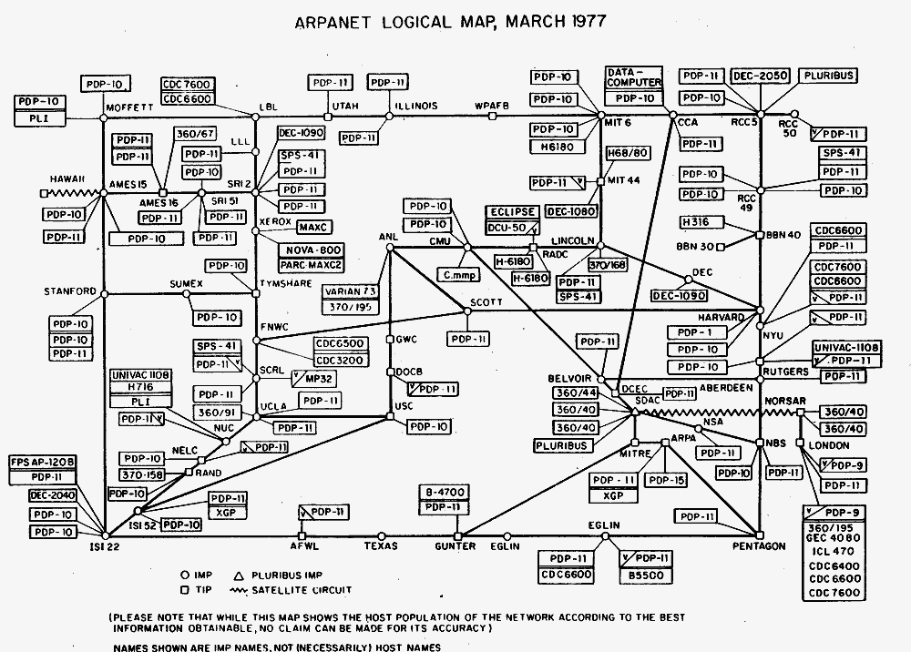

# Histoires

Le contexte des ateliers web ou des cours de cultures numériques ne permet pas le développement d’approches historiques très approfondies. Ci-dessous, quelques liens et documents pour pallier ce manque.

## Ailleurs

On trouve sur le web un grand nombre de publications dédiées à l’histoire…

* Histoire des [réseaux et télécommunications](https://www.youtube.com/watch?v=LKGkmbz57ds) ;
* Histoire du [numérique au sens large](https://interstices.info/domaine/histoire-numerique/) sur interstices.info ;
* Histoire de [l’informatique (en images)](http://synchise.com/diaporamas/humanites_numeriques/Humanites_numeriques_02_histoire.pdf) par Jean-Noël Lafargue
* Chronologie de [la place majeure des femmes dans l’informatique](http://computer-grrrls.gaite-lyrique.net/) ;
* Histoire du design interactif, par [Étienne Mineur](http://www.my-os.net/archives/) – qui s’arrête en 2007 : [partie 1](docs/conf_histoire_du_design_interactif_1.pdf) / [partie 2](docs/conf_histoire_du_design_interactif2.pdf), en ligne sur [my-os.net/blog](http://www.my-os.net/blog/index.php?2007/09/20/857-une-histoire-du-design-interactif-ii) ;
* Une [chronologie du design graphique](http://www.multimedialab.be/doc/projections/doc_design_graphique.pdf) par (le regretté) Marc Wathieu de l’Erg à Bruxelles.
* Histoire (américano-centrée) du design, par l’AIGA (American Institute of Graphic Arts) : [Celebrate design / 100 years of design](http://celebratedesign.org/)
* Histoire des [outils numériques de dessin](https://kristenroos.ca/timeline) et des [machines à dessiner](https://drawingmachines.org/).

## Histoire des machines
Un panorama de [deux siècles d’**évolution des machines**](machines/), réalisé à l’occasion du 17e festival accès)s(, *Machines sensibles*, par Christian Delécluse

## Histoire du web et des internets

Une série de liens vers des documents, des livres ou des vidéos pour en apprendre plus sur l’histoire de l’internet et du Web.

### Web Design Museum

Une timeline des étapes clés de l’histoire du web design de 1990 à nos jours sur l’excellent
[webdesignmuseum.org](https://www.webdesignmuseum.org/web-design-history)

### The history of web design

Le compagnon numérique du livre “_When the World Went Digital – A sweeping reference work of the websites that paved the pixelated way_”, paru  chez Taschen.
[thehistoryofweb.design](https://thehistoryofweb.design/)

### Une contre-histoire de l’Internet

<iframe src="https://player.vimeo.com/video/311894477" width="640" height="480" frameborder="0" allow="autoplay; fullscreen" allowfullscreen></iframe>

Une contre-histoire de l’Internet est un film documentaire français réalisé par Sylvain Bergère et diffusé à la télévision française pour la première fois en mai 2013. C’est également le titre d’une [édition spéciale d’OWNI](internet/ContreHistoire_ebook_FINAL.pdf) avec Jean-Marc Manach, Danah Boyd, EFF, Astrid Girardeau et l’équipe des Big Brother Awards. Et c’est aussi le sous-titre de [*L'utopie déchue*](https://www.fayard.fr/sciences-humaines/lutopie-dechue-9782213710044), un livre de Félix Tréguer, membre de la Quadrature du Net.

### Timeline des technologies de l’édition numérique

Par [Julie Blanc](http://julie-blanc.fr/)

### Histoire de l’internet

<iframe width="650" height="365" src="https://www.youtube.com/embed/sHLauYXS0ME" frameborder="0" allow="accelerometer; autoplay; encrypted-media; gyroscope; picture-in-picture" allowfullscreen></iframe>

Passionante vidéo enregistrée par Valérie Schafer (alors chargée de recherche ISCC/CNRS) en décembre 2016.

### D’Arpanet à Internet

Lire en ligne le dossier *D’Arpanet à Internet : une histoire des réseaux* sur [interstices.io](https://interstices.info/dossier/darpanet-a-internet-une-histoire-des-reseaux/)
