# Machines sensibles

Une histoire des machines compilée sous la direction de Christian Delécluse, à l’occasion du [17e festival accès)s](https://acces-s.org/agenda/archives/festival/2017/1158-machines-sensibles/).

## 1800 — La révolution industrielle et scientifique.

### 1750

Jacques Vaucanson crée son _Canard Automate_.

### 1760

James Watt invente le moteur à vapeur.

### 1804

Jean-Marie Jacquard invente un métier à tisser programmable par cartes perforées.

### 1834

Commercialisation des moteurs électriques par Davenport.

Charles Babbage invente le principe de la première machine à calculer mécanique programmable : la machine analytique.

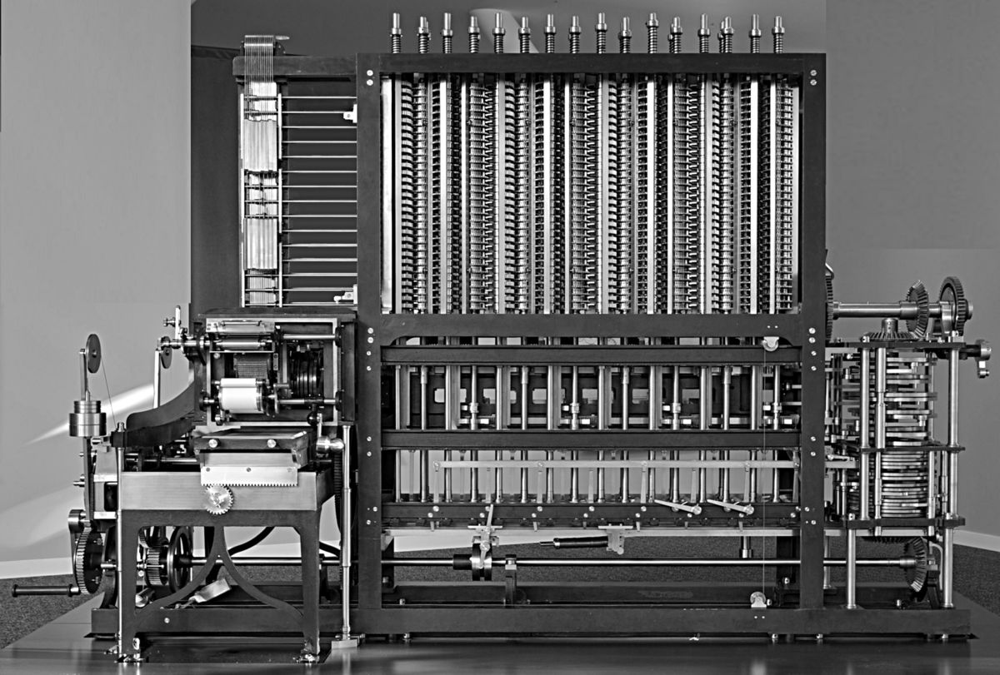

### 1854

L’anglais George Boole invente une algèbre logique à la base des machines « numériques » et du fonctionnement logique des micro-processeurs.

### 1859

Charles Darwin publie _De l’origine des Espèces_.

### 1870

Jules Verne écrit _De la Terre à la Lune_.

### 1875

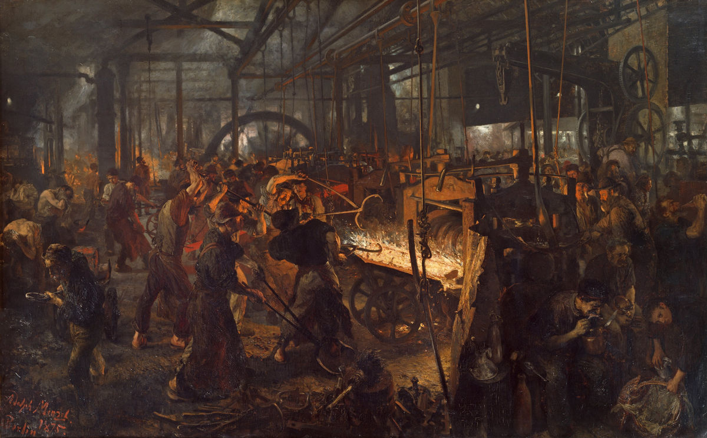

### 1878

Edward Muybridge _The Horse motion_ chronophotographie

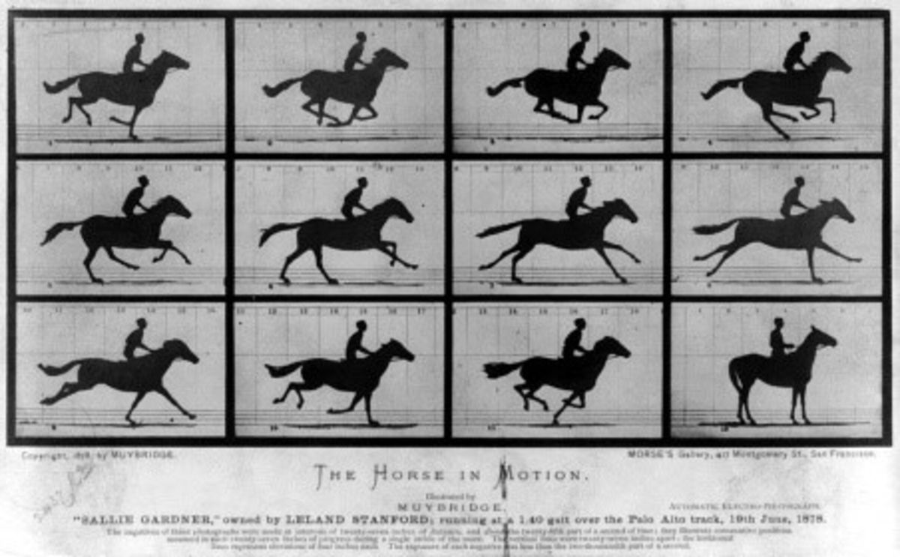

### 1882

Fondation de la _Society for Psychical Research_ de Londres. Les scientifiques étudient les sciences occultes, la télépathie, la clairvoyance ou la médiumnité, et inventent toutes sortes de machines pour « mesurer les esprits ».

### 1886

Invention de l’automobile à essence.

### 1889

Le Palais des machines est la construction métallique la plus importante de l'Exposition Universelle. Il mesure 420m de long sur 115m de large. Il suscite alors plus d’intérêt que la Tour Eiffel.

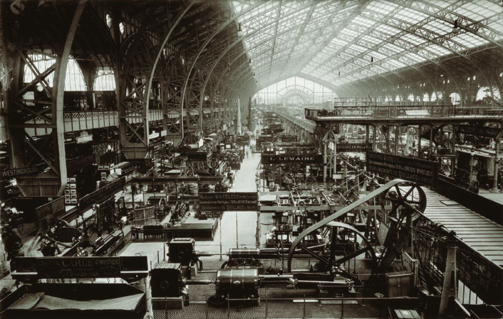

### 1895

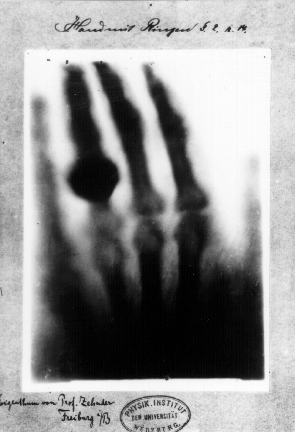

## 1900 — La machine comme esthétique.

### 1902

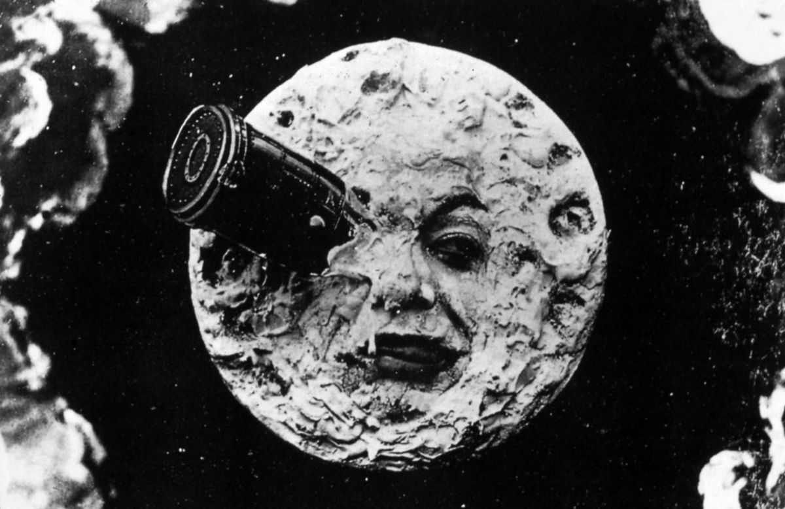

Georges Méliès réalise _Le Voyage dans la Lune_, premier film de science-fiction contenant les premiers effets spéciaux de l’histoire du cinéma.

### 1905

Albert Einstein publie un premier ouvrage sur la théorie de la relativité.

### 1908

Henri Ford met en place des nouveaux principes de rationalisation de la production industrielle dans ses usines de montage d’automobile.

### 1909

_Manifeste du futurisme_ de Marinetti dans lequel il exalte le monde moderne, en particulier la civilisation urbaine, les machines et la vitesse.

### 1915

Marcel Duchamp réalise _La marié mise à nu par ses célibataires, même_, une oeuvre emblématique du XXe siècle décrite par Michel Carouge comme une « machine célibataire ».

 

### 1927

Charles Lindbergh traverse l’Atlantique en avion.

Heisenberg énonce son principe d’incertitude, qui énonce une limite de notre capacité de connaissance du monde à l’échelle des plus petites particules de matière.

### 1936

La crise de 1929 a marqué la fin d’une époque. Charlie Chaplin filme _Les Temps Modernes_, une critique de l’organisation scientifique du travail.

## 1940 — La seconde guerre mondiale est une guerre de machines qui profite au développement des nouvelles technologies.

### 1940

Norbert Wiener participe à l'élaboration de méthodes de défense antiaérienne capables de s’auto-réguler en allant chercher de l’information dans leur environnement (principe de rétro-action).

### 1942

Siemens AG installe le premier système de vidéosurveillance pour observer le lancement des fusées V-2.

### 1943

Alan Turing réussit à décrypter la machine allemande Enigma.

### 1945

Mise au point de la bombe atomique. Explosions de Nagazaki et Hiroshima.

### 1947

Invention du transistor par John Bardeen, William Shockley et Walter Brattain.

William Grey Walter crée deux tortues robotiques. Elles se déplacent de façon autonome et sont attirées ou repoussées par la lumière.

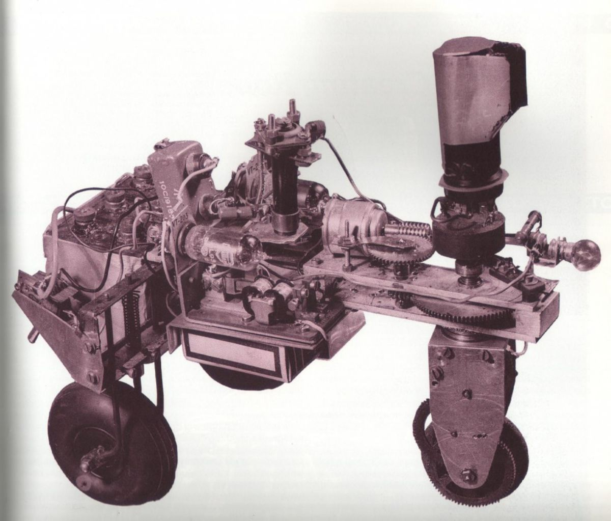

### 1948

Norbert Wiener publie _Cybernectics, control and communication in the animal and the machine_ dans lequel il théorise et généralise le concept de cybernétique.

Premier vol commercial entre Paris et New-York.

Thomas Edison publie ses _Mémoires_ dans lesquels il évoque une machine pour communiquer avec les morts sur laquelle il était en train de travailler.

### 1949

Georges Orwell publie _1984_, roman d’anticipation d’une société totalitaire où « Big Brother » épie faits et gestes des citoyens via un réseau de cameras de surveillance.

## 1950 — La démocratisation des machines du quotidien (électroménager, automobile, télévision, etc.).

### 1950

Alan Turing publie l’article _Computing Machinery and Intelligence_ dans lequel il propose un test pour savoir si une machine peut être « consciente ».

Parution de _I, robot_ de Isacc Asimov, roman de science-fiction dans lequel il introduit les trois lois de la robotique.

### 1953

Watson et Crick décrivent la structure en double hélice de l’ADN (prix Nobel en 1962).  
L’homme devient une machine biologique.

### 1956

Invention de la pilule contraceptive.

John McCarthy invente le terme d’« intelligence artificielle », qui devient un domaine de recherche à part entière.

Première œuvre d’art cybernétique : Nicolas Schöffer réalise _Cysp 1_.

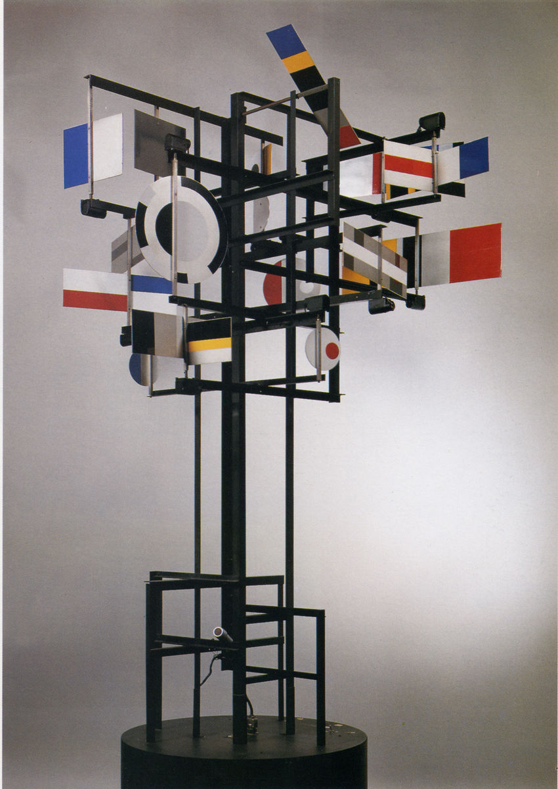

### 1957

Sortie de _Planète interdite_, film post-Hiroschima dans lequel l’inconscient de l’Homme se retourne contre l’humanité et l’entraine à sa perte.

Lancement du premier satellite, nommé _Spoutnik_ (d'un mot russe qui signifie « compagnon de voyage »).

### 1958

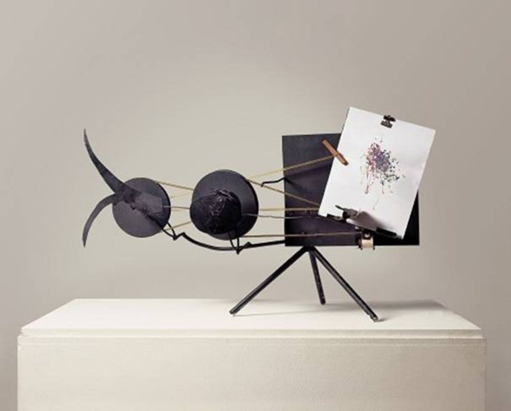

# 1960 — L’essort de la machine industrielle.  
Le progrès technologique soulève l’optimisme.

### 1961

Premier voyage de l’homme dans l’espace : Youri Gagarine effectue une révolution complète autour de la Terre.

Mise en vente du premier robot industriel Unimate. Il est utilisé sur les lignes d’assemblage de General Motors.

Le 30e Salon des arts ménagers s’installe au CNIT (Centre National des Industries et Techniques) à Paris. La fréquentation du salon (plus d’un million de visiteurs pendant toutes les années 50) commence alors à décliner au profit des chaines de magasins qui s’ouvrent partout en France.

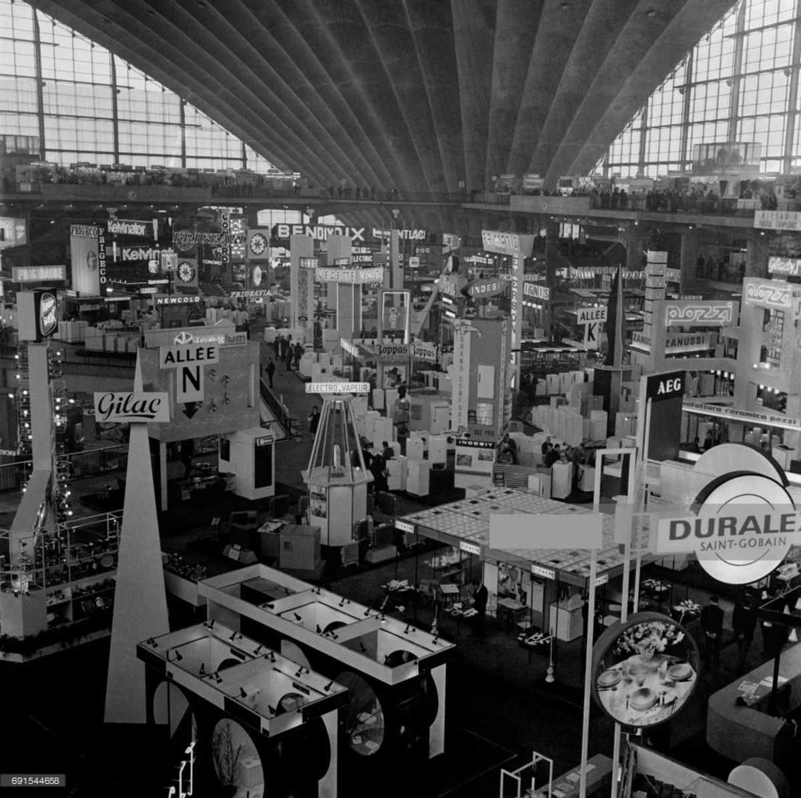

### 1964

Prolifération des radio pirates au large de l’angleterre. Naissance de _Radio Carolina_.

### 1967

### 1968

9 evenings : soirées organisées par EAT (Experimentation in Arts and Technology) qui présentent des œuvres interactives réalisées en collaboration entre des artistes et des ingénieurs.

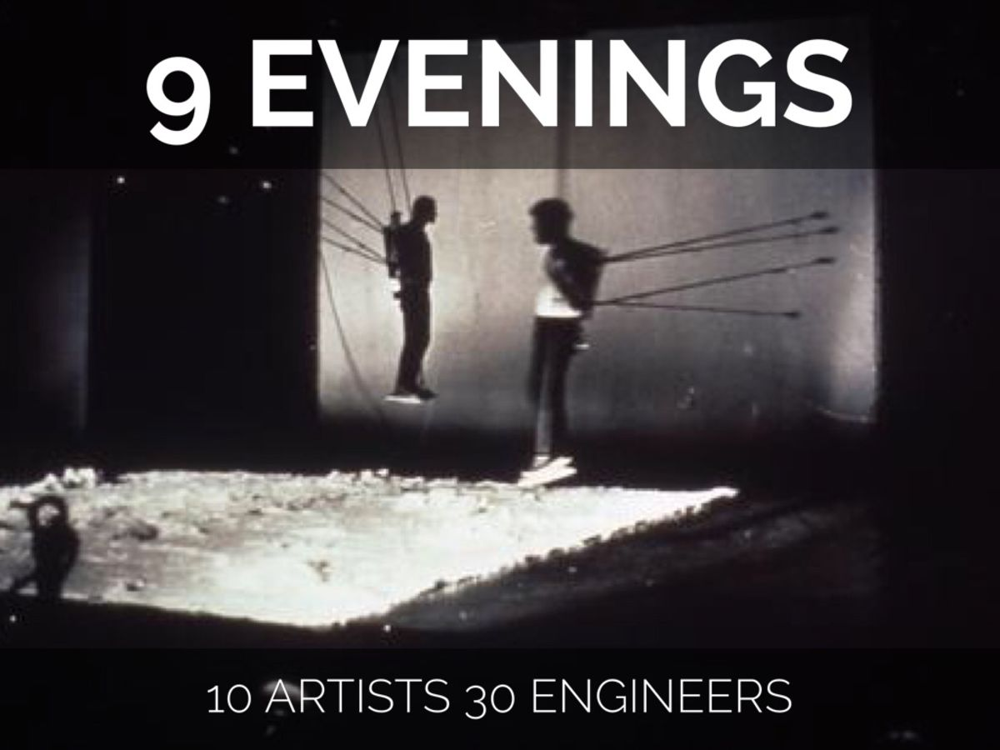

Exposition _The Machine as Seen at the End of the Mechanical Age_ au MoMA à New-York.

### 1969

Premier pas de l'homme sur la Lune le 21 juillet 1969, dans le cadre de la mission Apollo 11.

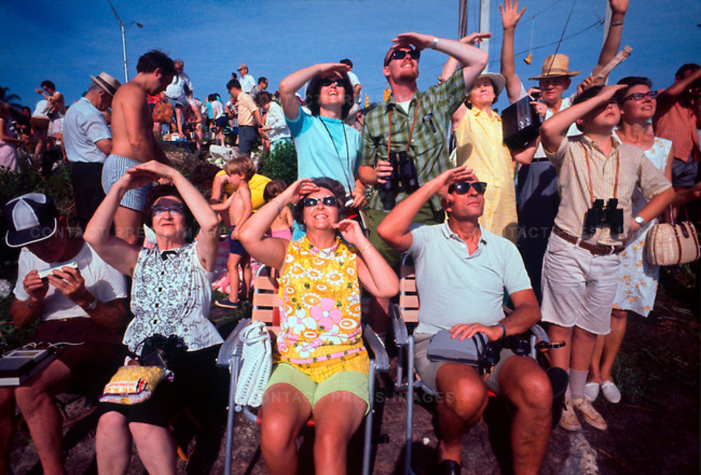

Neil Armstrong aurait eu alors ces mots: « un petit pas pour l’homme mais un grand pas pour l’humanité ».

Parution du premier tome du _Whole Earth Catalog_ qui fait la promotion du mouvement nommé plus tard _Do It Yourself_ et qui a profondément influencé la culture numérique.

Première connexion du réseau ARPANET, l’ancêtre d’Internet.

# 1970 — Les balbutiements de la société « numérique »

### 1970

John Conway imagine _Le jeu de la vie_ automate cellulaire qui tente de simuler les mécanismes d’évolution des populations vivantes.

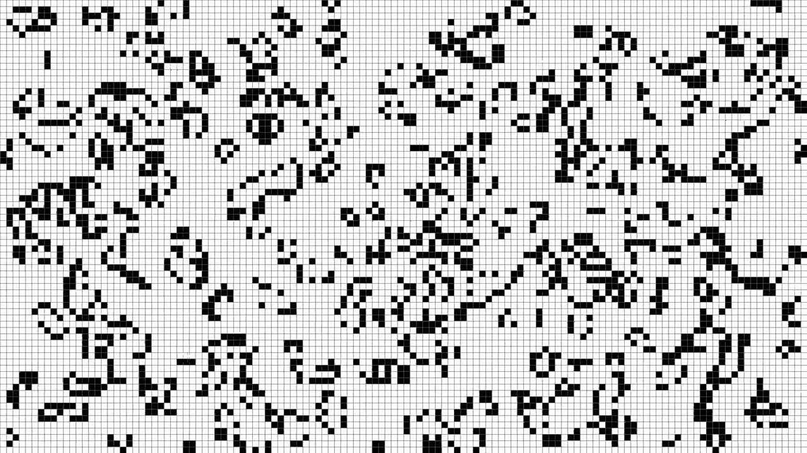

Invention de l’IRM et nouvel essort de l’imagerie médicale.

### 1973

Time Square à New-York s’équipe de caméras de surveillance.

### 1976

Lancement de l’Apple I. Le succès est très limité, mais les conditions de sa création (dans le garage des parents de Steve Wozniak) créeront par la suite le mythe de la start-up.

### 1977

Premier séquençage complet du génome d’un organisme vivant.

La première synthèse de gène a lieu dans le laboratoire de Boyer. Ce travail ouvre la voie à l’essort des biotechnologies.

Commercialisation de la console de jeu Atari 2600. Le succès colossal (près de 30 millions d’exemplaires vendus) popularise les consoles de jeu personnelles auprès du grand public.

### 1978

Naissance du premier « bébé-éprouvette », Louise Brown. On estime à 1 % des naissances le nombre de nouveau-nés conçus par cette technique.

## 1980 — Emergence de la micro-informatique. Premières réflexions critiques sur la société numérique

### 1980

Commercialisation de l’IBM Personal Computer (Processeur Intel 8088 cadencé à 4,77 MHz et une mémoire vive de 16 Ko).

### 1982

Le protocole TCP/IP se généralise sur les réseaux de communication, formant le réseau internet.

### 1984

Donna Haraway écrit _Cyborg manifesto_.

### 1984

William Gibson écrit _Neuromancer_, dans lequel il invente le terme de cyberespace, initialement « une hallucination consensuelle vécue quotidiennement en toute légalité par des dizaines de millions d'opérateurs, dans tous les pays, par des enfants à qui des concepts mathématiques sont ainsi enseignés \[…\] une représentation graphique de données extraites des mémoires de tous les ordinateurs du système humain ».

### 1988

Premier épisode des documentaires éducatifs _The Secret Life of Machines_ sur Channel 4\. Une série qui décrit les machines du quotidien animée par Tim Hunkin.

# 1990 — Démocratisation des machines à information et début de la « révolution numérique »

### 1993

Levallois-Perret est la première ville en France à s’équiper de caméras de vidéosurveillance. 20 ans plus tard, la CNIL (Commission Nationale de l'Informatique et des Libertés) recense plus de 935 000 caméras de surveillance en France, lieux privés et publics confondus.

### 1996

Brebis Dolly : premier mammifère cloné.

Le premier animal de compagnie électronique est japonais ; le tamagotchi fait fureur dans tous les pays occidentaux.

### 1997

Victoire de Deep Blue sur Kasparof.

Hakim Bey publie _Temporary Autonomous Zone_ (TAZ, Zones d’Autonomie Temporaire), et défend notamment l’idée que le web est un espace d’exercice de notre liberté.

### 1999

Naissance d’Aibo, le premier chien robot de compagnie.

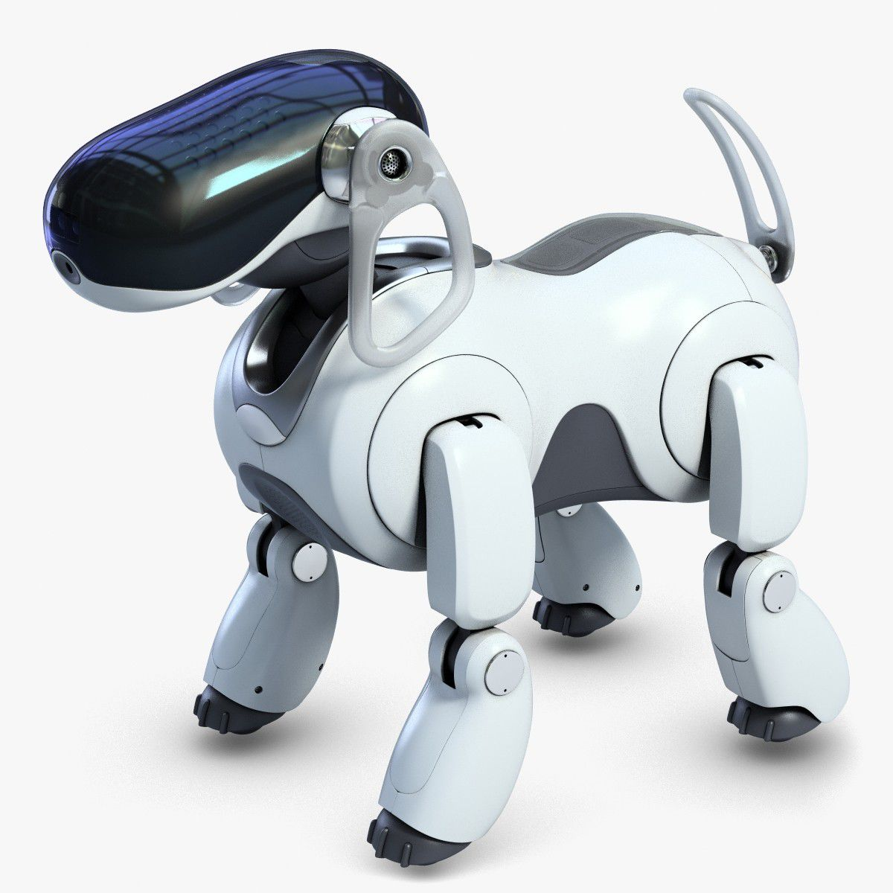

Sortie du film _The Matrix_.

## 2000 — Les machines numériques se diversifient et deviennent omniprésentes.

### 2000

Commercialisation de la PlayStation 2 par Sony. Plus de 150 millions d’exemplaires seront vendus dans le monde.

### 2006

Première présentation publique du robot Nao.

Julian Assange fonde Wikileaks, organisme dont l’objectif est de publier des documents d’intérêt public et de donner une audience aux lanceurs d’alertes.

### 2007

Lancement du premier iphone. Apple a vendu depuis près d’un milliard d’iphone, tous modèles confondus.

### 2008

Lancement de la Kinect par Microsoft. Cet accessoire qui permet de relier le monde physique à celui des jeux vidéo est vendu à 1 million d’exemplaire en 10 jours.

On assiste par ailleurs à une multiplication des applications de réalité augmentée.

# 2010 — Vers de nouveaux types de machines et de nouvelles formes d’intelligences ?

### 2010

Le premier organisme contenant un génome intégralement fabriqué par l'homme est décrit dans la revue _Science_.

Le premier drone volant piloté par iphone est commercialisé par la société Parrot.

### 2011

Premier épisode de la série de science-fiction _Black Mirror_ qui met en scène des distopies technologiques.

### 2013

Premier film d’animation réalisé à partir d’atomes _A boy and his atom_.

À l’occasion des journées de la FrenchTech à l’Elysée, un robot Nao est présenté à François Hollande. Les médias titrent : « François Hollande reçoit un robot Nao à l’Elysée ».

### 2017

Victoire de AlphaGo (Google DeepMind) sur le champion du monde en titre du jeu de Go, Ke Jie.

Ouvertures de nombreux centres de réalité virtuelle.

