# KISS

_Keep it simple, stupid_. De la simplicité et de ses vertus, mais aussi de ses potentielles limites, dans le champ du design graphique et du webdesign.

### Work in progress {.edit}

Cette proposition de réflexion est un travail en cours. Son champ référentiel est encore à peine esquissé et les perspectives d’explorations gagneront à largement se développer.

<figure>
<video src="video/pourquoi-faire-simple-quand-on-peut-faire-complique.mp4" controls></video>
<figcaption>Les Shadoks, Pourquoi faire simple quand on peut faire compliqué ?</figcaption>
</figure>

> Le principe _KISS_, _keep it simple, stupid_ (en français, mot à mot : « garde ça simple, idiot », dans le sens de « ne complique pas les choses ») ou bien _keep it stupid simple_ (en français, « garde ça super simple », avec l’idée que « même un idiot pourrait comprendre »), est une ligne directrice de conception qui préconise invite à éviter toute complexité non indispensable, dans la mesure du possible. Ce principe est déclinable dans un grand nombre de disciplines : le développement logiciel, le design, le journalisme, l’ingénierie, l’aviation, la planification stratégique[^wp].

[^wp]: Cf. [Wikipédia](https://fr.wikipedia.org/wiki/Principe_KISS)

Le mot d’ordre aurait été inventée dans les années 60 par Clarence Johnson, alors ingénieur en chef de Lockheed, entreprise états-unienne du secteur de l’aéronautique et de l’aérospatiale. La version originale ne comportait pas de virgule et s’écrivait "keep it simple stupid".

Il rejoint une longue lignée de mantras dédiés à nous engager vers la simplicité, attribués tant à [Guillaume d’Ockham](https://fr.wikipedia.org/wiki/Rasoir_d%27Ockham) qu’à [Albert Einstein](https://quoteinvestigator.com/2011/05/13/einstein-simple/), Aristote, Ludwig Mies van der Rohe ou Marie Kondō.

## Simplicité ←→ complexité

Pour démarrer, un parcours bref des dialectiques historiques entre simplicité et complexité, dépouillement et ornement, minimalisme et maximalisme (etc.) dans l’histoire de l’architecture, avant d’en venir aux questions du design.

L’art roman résonne souvent avec un à priori de simlicté formelle. L’austérité monastique des XIe et XIIe siècles a produit de merveilleux ouvrages, mais n’était pas en reste de controverses. 

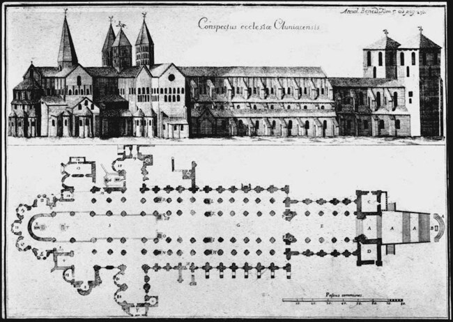
  Plan de l’abbaye de Cluny III — [Source](https://brewminate.com/the-art-and-architecture-of-cluny-abbey-france/)

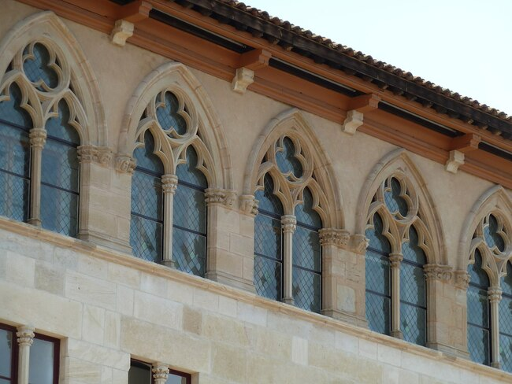
  Abbaye de Cluny, palais du pape Gélase — [Source](https://commons.wikimedia.org/wiki/File:Cluny_abbey_palais_gelase_facade_upper_windows.JPG)

À Citeaux, par exemple, on tenait les Clunisiens pour des fanfarons dévergondés, et l’on considérait la démesure et la grandiloquence de leur abbaye comme outrageuse (j’exagère à peine). 

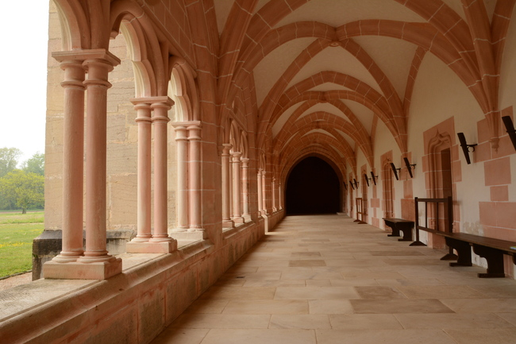
  Abbaye de Cîteaux — [Source](https://aufilduthym.fr/escapade-cote-or-hospice-beaune-citeau/)

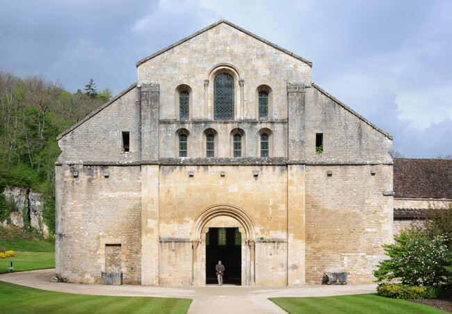
  Abbaye de Fontenay — [Source](https://commons.wikimedia.org/wiki/File:Abbaye_Fontenay_eglise_facade.jpg)

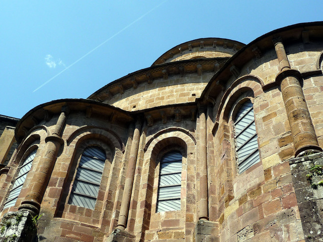
   Abbatiale Sainte-Foy de Conques, vitraux de Pierre Soulages — [Source](https://flic.kr/p/6W1XwM)

S’ensuivent de multiples mutations, et l’avènement de l’architecture gothique de style primitif, puis classique, rayonnant et même flamboyant. 

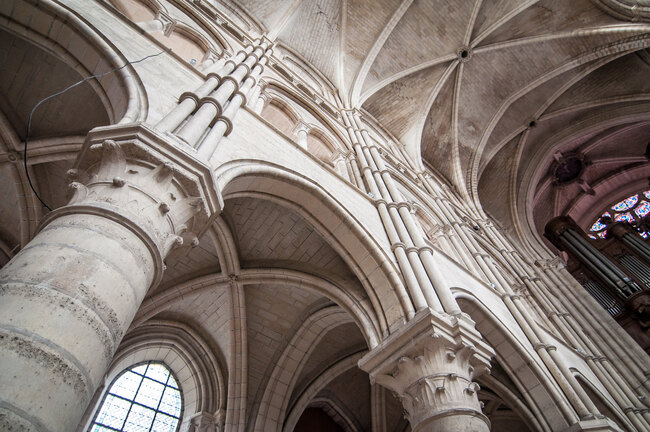
  Cathédrale Notre-Dame de Laon, gothique primitif — [Source](https://flic.kr/p/dt8yr8)

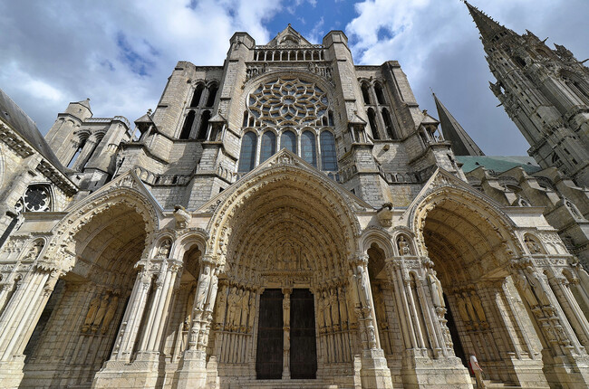
  Cathédrale Notre-Dame de Chartres, gothique classique — [Source](https://flic.kr/p/2g3r5M5)

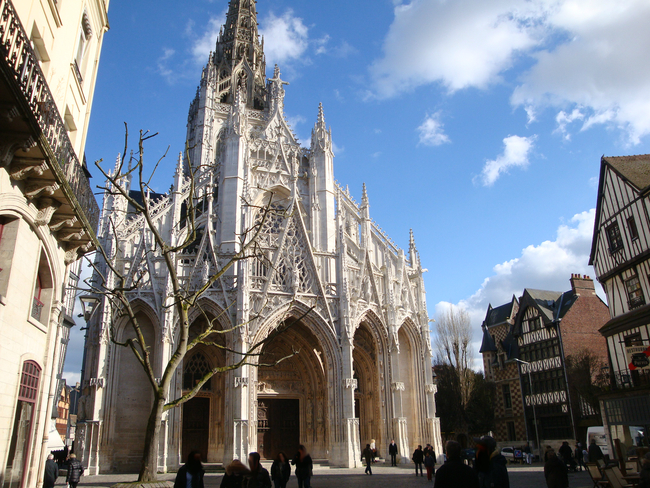
  Église Saint-Maclou de Rouen, gothique flamboyant — [Source](https://commons.wikimedia.org/wiki/File:Eglise_Saint_Maclou.jpg)

Vient la Renaissance et sous l’influence italienne du Quattrocento, l’attrait pour le dépouillement des formes antiques.

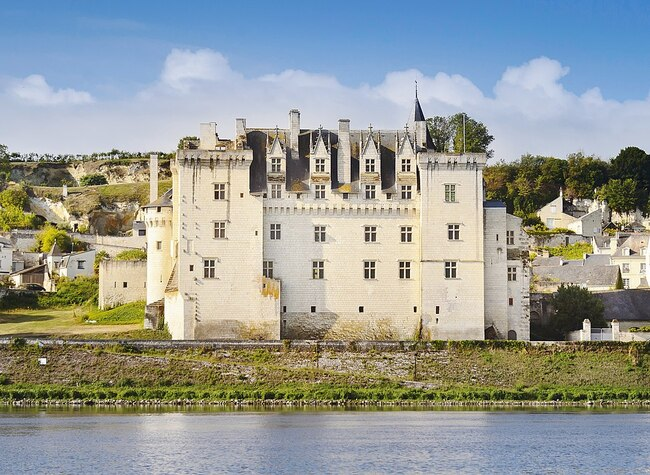
  Château de Montsoreau, Renaissance — [Source](https://commons.wikimedia.org/wiki/File:Chateau-montsoreau-france-unesco.jpg)

Au XVIe siècle, toujorus depuis l’Italie, la Renaissance décadente (?) fait advenir les approches maniéristes, décoratives et exhubérantes du Baroque, avant que dans les arts décoratifs ne se développent les styles Rococo ou rocaille.

  Fontaine de Trevi, Rome, baroque — [Source](https://commons.wikimedia.org/wiki/File:Trevi_Fountain,_Rome,_Italy_2_-_May_2007.jpg?uselang=fr)

Au milieu du XVIIIe siècle, le style néoclassique opère un nouveau retour aux formes antiques. 

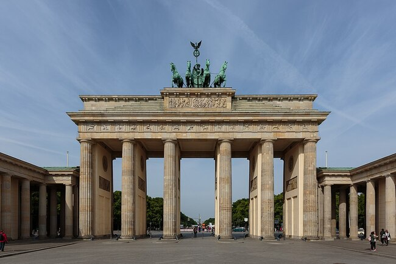
  Porte de Brandebourg à Berlin — [Source](https://commons.wikimedia.org/wiki/File:Berlin_-_0266_-_16052015_-_Brandenburger_Tor.jpg?uselang=fr)

Au milieu du XIXe siècle, l’architecture Victorienne mélange le tout, avant que n’advienne <del>le style nouille</del> l’Art Nouveau et enfin (?), au début du XXe, le mouvement Moderne et le Bauhaus. Bientôt viendront le Brutalisme corbusien, mais aussi le Postmodernisme, le néo-futurisme d’Archigram et l’_art-déco RVB_ dont notre école est sans doute la seule représentante…

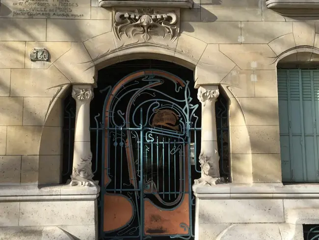
  Castel Béranger, Paris, Art Nouveau — [Source](https://paris-promeneurs.com/le-castel-beranger/)

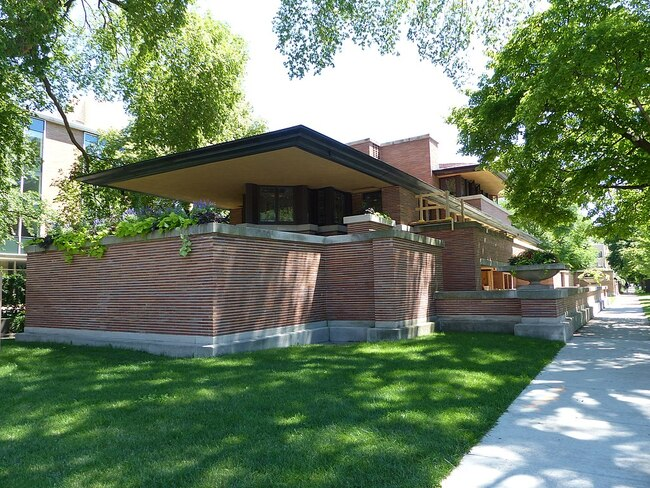
  Robie House, Frank Lloyd Wright, architecture Moderne [Source](https://commons.wikimedia.org/wiki/File:Robie_House_Exterior_28.jpg)

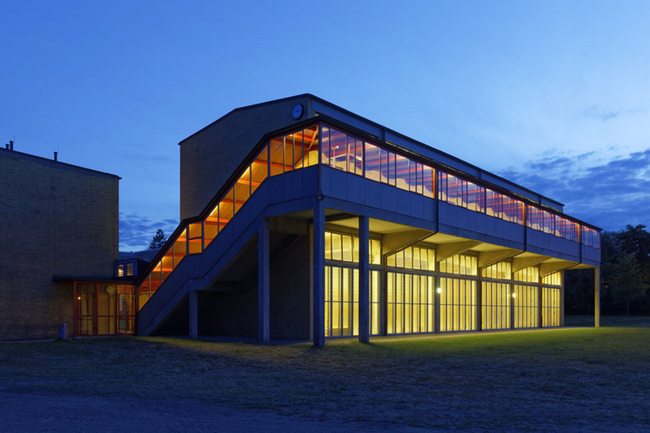
  Bauhaus, école de la confédération syndicale ADGB à Bernau, Hannes Meyer (restaurée en 2017) — [Source](https://bernau-live.de/nachrichten/bauhaus-denkmal-bernau-betonarbeiten-am-unesco-weltkulturerbe)

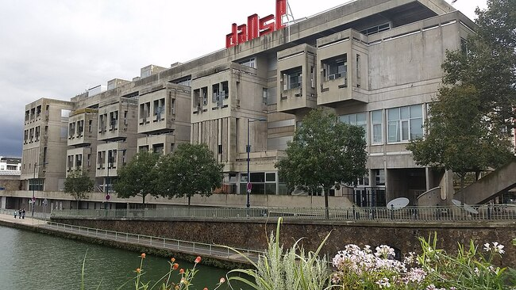
  Centre national de la danse, Pantin, Jacques Kalisz, Brutalisme — [Source](https://commons.wikimedia.org/wiki/File:Centre_national_de_la_danse_1.jpg)

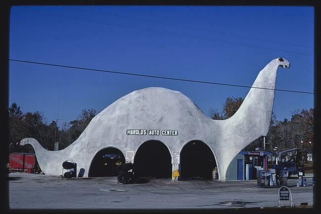
  Harold’s Auto Center, Spring Hill, Florida; 1979. Photo de John Margolies, Postmodernisme :) — [Source](https://publicdomainreview.org/collection/john-margolies-photographs-of-roadside-america)

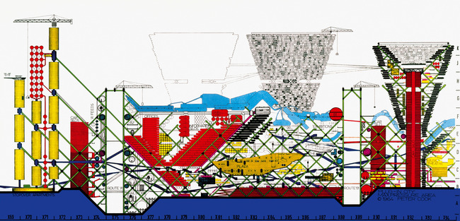
  Plugin City, Peter Cook, Archigram — [Source](https://lepaveblog.wordpress.com/2018/01/22/archigram/)

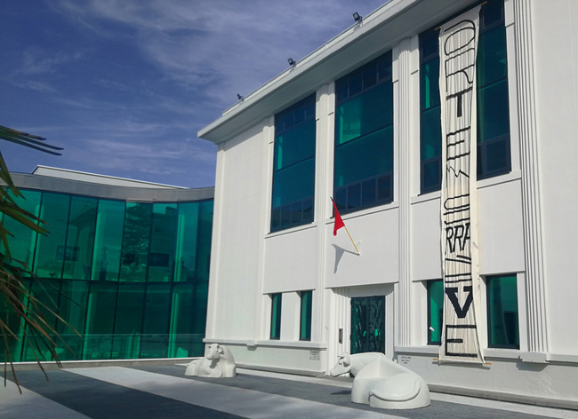
  ESAD Pyrénées, art-déco RVB (en grève), 2020

## Modernimse

Après ce voyage en dilettante dans les révolutions et contre-révolutions architecturales, portons le regard vers le design graphique (_graphische Gestaltung_ en allemand, il n’est pas encore dénommé ainsi en français : on parle au mieux d’arts appliqués, de maquettes, de réclame ; pour désigner la discipline, le terme _graphisme_ apparaît dans les années 20) au tournant du XXe siècle.  

### Ornement et crime

Dès 1908, l’architecte viennois Adolf Loos écrivait _Ornement et crime_ dans lequel il postule que l’ornementation n’est rien de moins qu’un crime économique, moral et culturel. Basé sur une idéologie parfois [problématique](https://www.telerama.fr/scenes/mais-au-fait,-pourquoi-lornement-est-un-crime,n5733166.php), ré-éditée en 1920 par un Le Corbusier viriliste, cette condamnation définitive de l’ornement (de l’_arabesque_) rejoint de manière embarassante un ensemble de discours sur la pureté morale enraciné dans un substrat culturel germanique et protestant, parfois bien rigoriste.

Loos établit néanmoins un cadre de pensée qui va influencer de très nombreux architectes, designers industriels, artistes et graphistes et notamment les acteur⋅ices, artistes et enseignant⋅es du Bauhaus ou le mouvement néerlandais _De Stijl_.

### Bauhaus & friends

Fondée à Weimar en 1919 par l’architecte Walter Gropius, l’école du Bauhaus a été un lieu central et majeur de la convergence des pratiques de création artistiques, architecturales, graphiques ou industrielles dans un ensemble de principes relativement unifiés autour des logiques modernistes, agissant autant dans la formes des productions que dans leurs dimensions sociales, politiques ou économiques. 

  Bauhaus, Dessau, Walter Gropius, 1925–1926 — [Source](https://oliverlins.com/stories/bauhaus-dessau/)

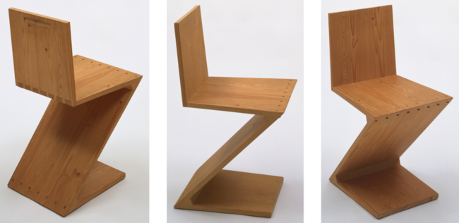
  Chaises ZigZag, Gerrit Rietveld, 1934

Les explorations artistiques et architecturales de la période _De Stijl_ ou du Bauhaus ont abondamment irrigué les productions du champ du design graphique, notamment via les pionniers du style international, Josef Müller-Brockmann, Max Miedinger, Armin Hofmann ou Emil Ruder. 

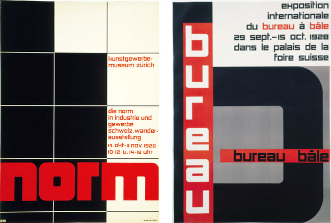
  Theo Ballmer, affiches, 1928.

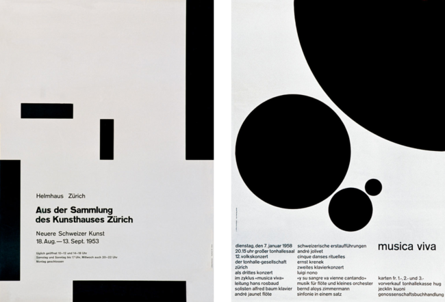
  Josef Müller-Brockmann, 1953 & 1958 — [Source](https://www.flickr.com/photos/blankaposters/sets/72157605199393277/)

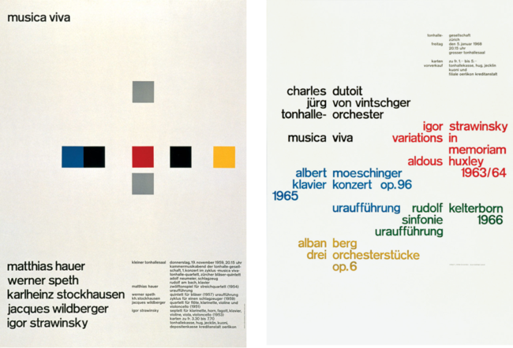
  Josef Müller-Brockmann, 1959 & 1968 — [Source](https://www.flickr.com/photos/blankaposters/sets/72157605199393277/)

Pionnier du Style (typographique) international, Müller-Brockmann est présenté avec enthousiasme par Vincent Perrottet[^vp] à l’occasion d’une exposition à Chaumont, _Fer à gauche toute_ :

<iframe width="560" height="315"  frameborder="0" type="text/html" src="https://www.dailymotion.com/embed/video/x5lxw6"  allowfullscreen title="Dailymotion Video Player" > </iframe> 

[^vp]: Lire également [l’article de Graphéine](https://www.grapheine.com/divers/graphic-designer-muller-brockmann) qui lui est consacré, et parcourir une [galerie sur Flickr](https://www.flickr.com/photos/blankaposters/sets/72157605199393277/with/2522085899/).

> <big>Lorsque le problème d'information est résolu sur un plan pratique, objectif et esthétique, le langage de la forme fera éclater sa compréhension traditionnelle, pour devenir un langage universel.  </big>  
  — Josef Müller-Brockmann

Parallèlement, après et avant la star internationale Müller-Brockmann, de nombreux graphistes affiliés aux approches modernistes gagnent à être connu⋅es : les suisses, allemands et néerlandais, Piet Zwart (né en 1885), Jan Tschichold (1902), Max Bill (1908), Emil Ruder (1914), Wim Crouwel (1928), Adrian Frutiger (1928), Karl Gerstner (1930), Jost Hochuli (1933) ou Wolfgang Weingart (1941), mais aussi des italiens [^archivo], [Franco Grignani](https://www.grapheine.com/histoire-du-graphisme/graphic-designer-franco-grignani) (1908), Carlo Vivarelli (1919), [AG Fronzoni](http://www.designculture.it/profile/ag-fronzoni.html) (1923) ou [Massimo Vignelli](http://www.designculture.it/interview/massimo-vignelli.html) (1931) et même des français[^chaminade] !

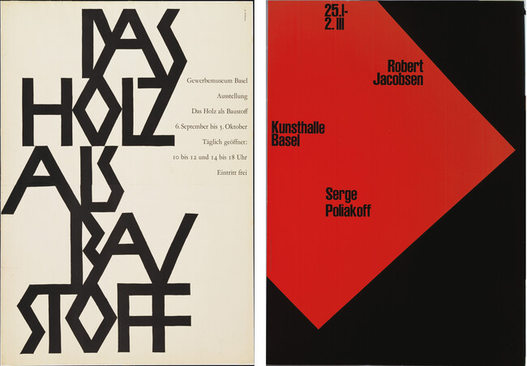
  Armin Hofmann — [Source](https://www.moma.org/artists/2697)

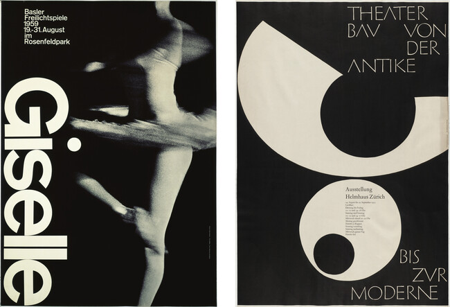
  Armin Hofmann — [Source](https://www.moma.org/artists/2697)

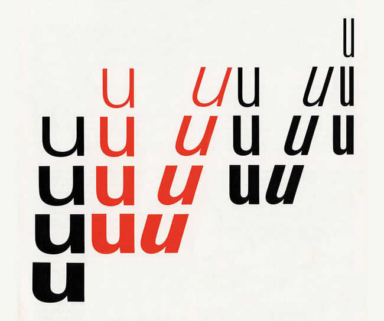
  Adrian Frutiger, Univers — [Source](https://indexgrafik.fr/adrian-frutiger/)

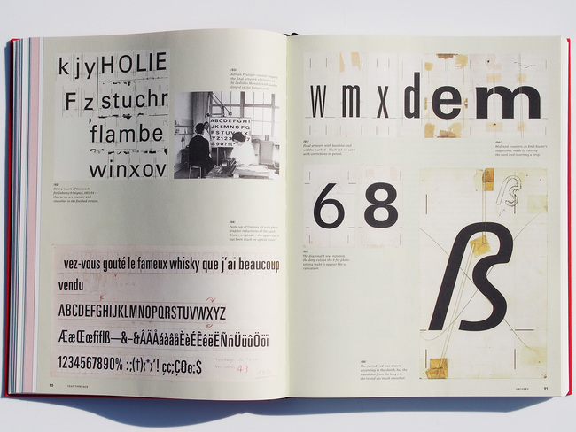
  Adrian Frutiger, Univers — [Source](https://indexgrafik.fr/adrian-frutiger/)

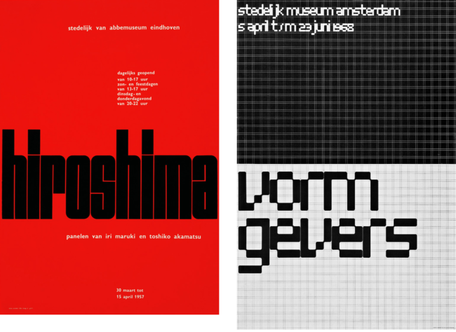
  Wim Crouwel, 1957 & 1967 — [Source](http://www.designculture.it/profile/ag-fronzoni.html)

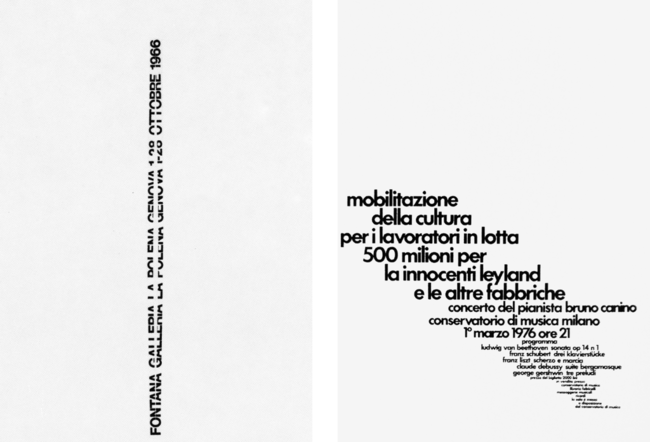
  AG Fronzoni, 1966 & 1979 — [Source](http://www.designculture.it/profile/ag-fronzoni.html)

[^archivo]: Visiter de toute urgence l’[Archivio Grafica Italiana](http://www.archiviograficaitaliana.com/project/31/arteescienza)

[^chaminade]: Patrice (Fabien) Chaminade, ancien enseignant de l’ÉSAD Pyrénées a longuement enquêté sur l’aparition du modernisme en France. En attendant une édition rétrospective, une [interview](https://www.radiocampusparis.org/grphsm-4-design-graphique-dans-lentre-deux-guerres/) est accessible en ligne. 

Outre-Atlantique, notamment du fait des influences liées au déplacement du Bauhaus à Chicago, a émergé un langage graphique spécifique, au service de la société de consommation en pleine expansion. 

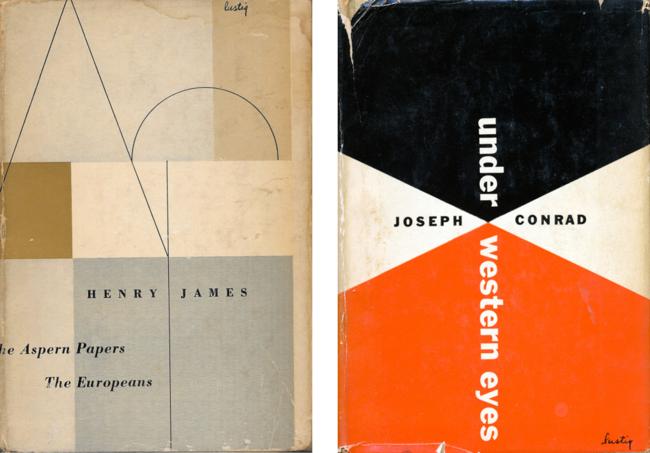
  Alvin Lustig, 1951 & 1950 — [Source](http://indexgrafik.fr/alvin-lustig/)

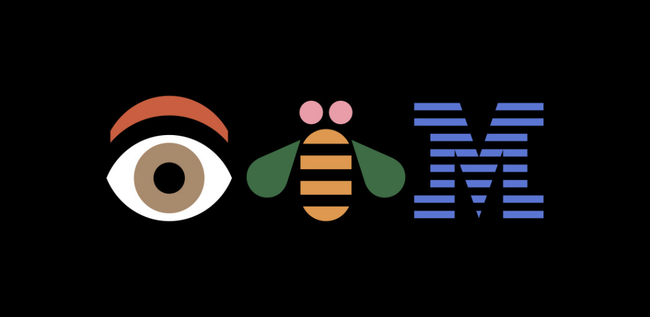
  Paul Rand, logo d’IBM, version Eye–Bee–M — [Source](https://www.logohistories.com/p/ibm)

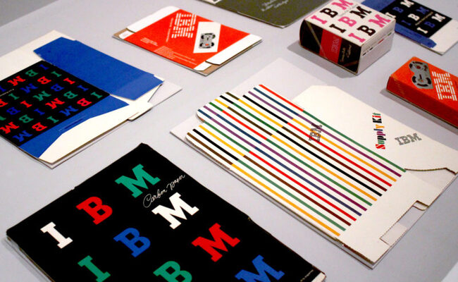
  Paul Rand, 1956–1991, charte graphique d’IBM — [Source](https://www.grapheine.com/histoire-du-graphisme/le-minimalisme-lesthetisme-de-la-sobriete)

  Massimo Vignelli, logotypes de Knoll, 1966 & American Airlines, 1967 — [Source](http://www.archiviograficaitaliana.com/)

## Art minimal

Sans envisager de parcourir dans l’histoire de l’art le même chemin dilettante qui vient de traverser 10 siècles d’architecture, quelques grands noms doivent néanmoins être cités, tant ils ont concourru à façonner notre regard contemporain sur ces questions. Leur influence ou leur extension dans le champ du design contemporain est majeure.

L’art minimal est un courant apparu au début des années 1960 aux États-Unis. Il s’oppose au lyrisme de l’expressionnisme abstrait et à la tendance figurative, narrative et ironique du pop art. Héritier du modernisme et du Bauhaus, il procède par soustraction, par réduction et par la convocation du _moins possible_ de moyens. 

Au delà des enjeux formels, ces artistes (Frank Stella, Carl Andre, Dan Flavin, Donald Judd, Sol LeWitt ou Robert Morris) rejettent l’« illusion » pour déterminer des structures, des lieux. Ils tendent à limiter au maximum leur intervention, usant notamment de matériaux préfabriqués, faisant valoir leur pure matérialité et la présence transcendée de leur fonction. Un langage visuel appuyé sur la forme pure, non siignifiante, non symbolique.

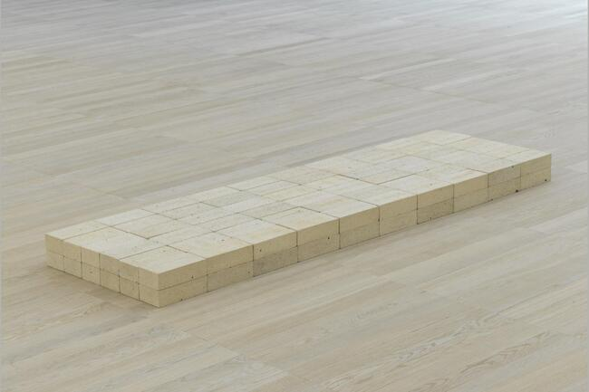
  Equivalent VIII, Carl Andre — [Source](https://www.tate.org.uk/art/artworks/andre-equivalent-viii-t01534)

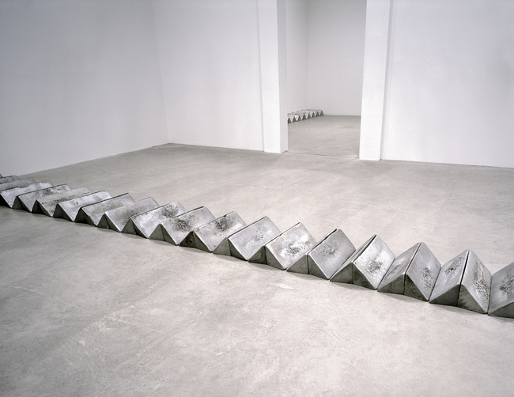
  Al Rectarange, Carl Andre — [Source](https://acegallery.art/artist/carl-andre/)

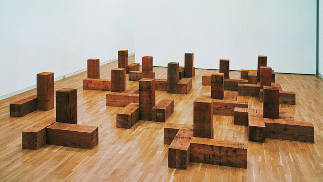
  Uncarved Blocks, Carl Andre, Vancouver, 1975.  — [Source](https://www.meer.com/es/15492-carl-andre-escultura-como-lugar)

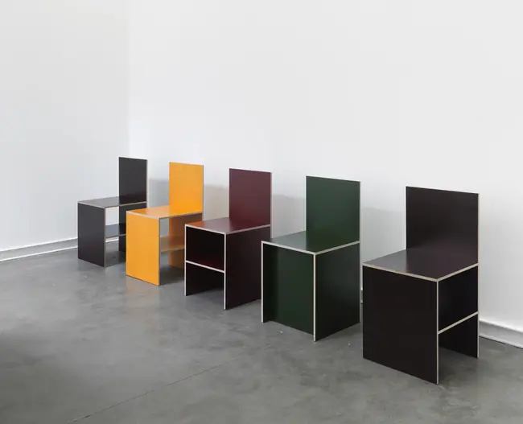
  Chaises, Donald Judd   — [Source](https://galeriemitterrand.com/artists/33-donald-judd-furniture/)

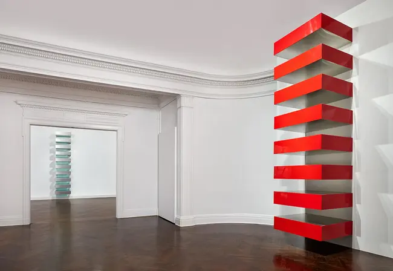
  Untitled (Bernstein 78-69), Donald Judd — [Source](https://www.nytimes.com/2013/10/25/arts/design/donald-judd-stacks.html)

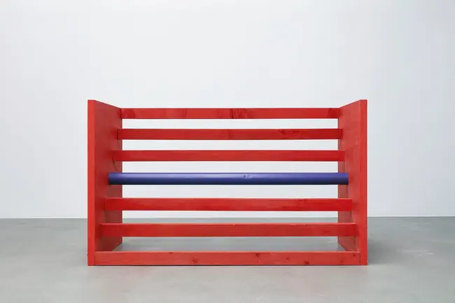
  Untitled, Donald Judd, 1963 — [Source](https://thedesignedit.com/exhibitions/donald-judd/)

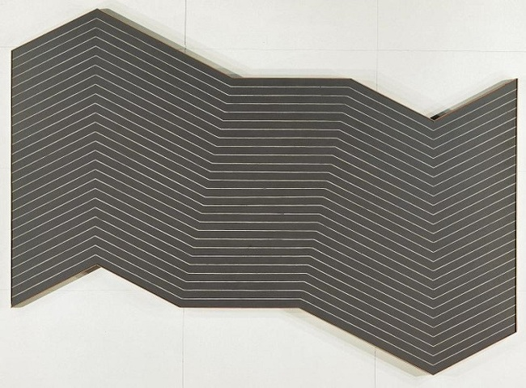
  Frank Stella, Mas o Menos, 1964 — [Source](https://artpla.co/artistes/p-t/stella/)

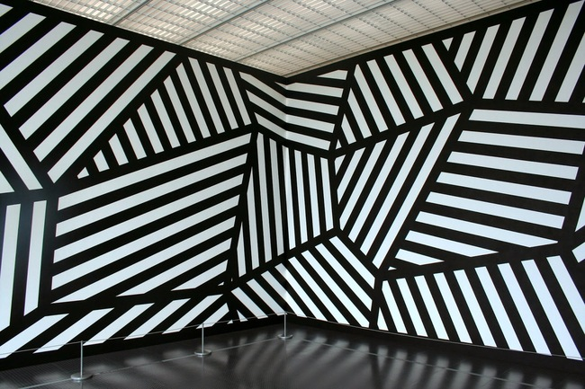
  Sol Lewitt, Wall drawing — [Source](http://kennylingeetak.blogspot.com/2014/06/sol-lewitt.html)

Ces œuvres plastiques minimales trouvent leurs contreparties dans le champ musical et sonore ([Steve Reich](https://www.youtube.com/watch?v=qwtGIBS7m6c), [Philip](https://www.youtube.com/watch?v=6Stu7h7Qup8) [Glass](https://ubu.com/film/wilson_einstein_chatelet.html), Terry Riley, La Monte Young…) mais aussi dans la littérature (Raymond Carver), et bien évidemment dans le design et la conception industrielle.

## – = + ?

Le minimalisme, tout comme sa contestation, sont propices à l’énonciation de grandes tirades sentencieuses, de manifestes définitifs et absolus, de préceptes de coaching _feng shui_ et de punchlines dignes d’être tatouées en caractères gothiques.

> <big>Less is more</big>  
— Ludwig Mies van der Rohe

> <big>Less is a bore</big>  
— Robert Venturi

> <big>Form follows function</big>  
— Louis Sullivan 

> <big>Form follows fun</big>  
— Emigre

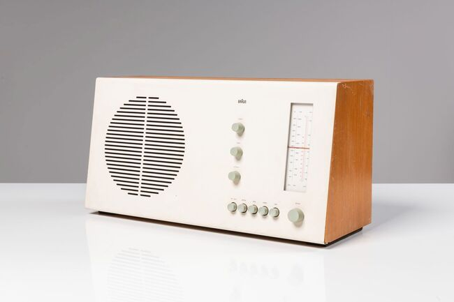
  Radio RT 20, 1961, Dieter Rams

Dieter Rams est un designer allemand associé aux produits hifi et électro-ménagers de la société Braun et à l’approche _fonctionnaliste_ du design. On lui doit sa propre punchline, légère évolution de celle de Mies van der Rohe (_Weniger, aber besser_ – moins mais mieux) ainsi que les fameux _dix principes du « bon design »[^dieter]_

>   Good design is innovative   
    Good design makes a product useful   
    Good design is aesthetic   
    Good design makes a product understandable   
    Good design is unobtrusive   
    Good design is honest   
    Good design is long-lasting   
    Good design is thorough down to the last detail   
    Good design is environmentally friendly   
    Good design is as little design as possible   

[^dieter]: Largement diffusés, ces _Ten principles for good design_ font partie d’une [immense collection](https://principles.adactio.com/) de « principes de design », réunie par Jeremy Keith. 

## Aujourd’hui

L’époque contemporaine puise largement ses inspirations dans les travaux de ces pionniers suisses, allemands ou [néerlandais](https://www.dutchgraphicroots.nl/). De jeunes (ou déjà plus si jeunes) studios ont pris la relève et déploient en les revitalisant les approches sensibles explorées par leurs aînés.

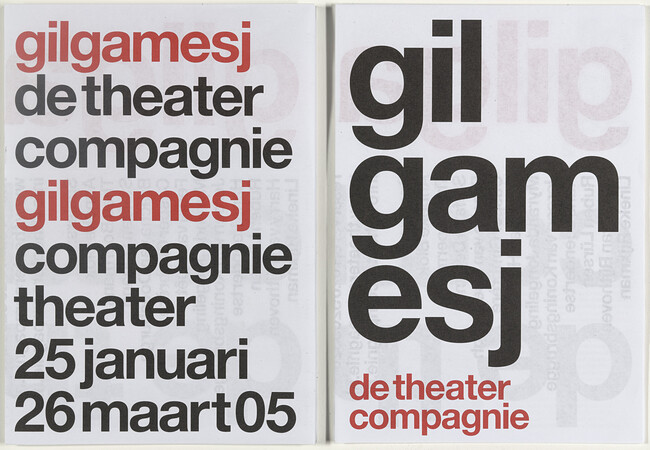
  Experimental Jetset,  De Theatercompagnie Program Brochures   — [Source](https://www.moma.org/collection/works/109200)

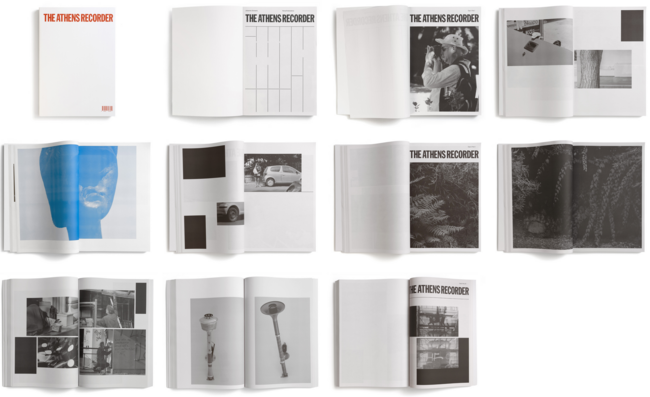
  Experimental Jetset,  The Athens Recorder   — [Source](http://www.jetset.nl/archive/the-athens-recorder)

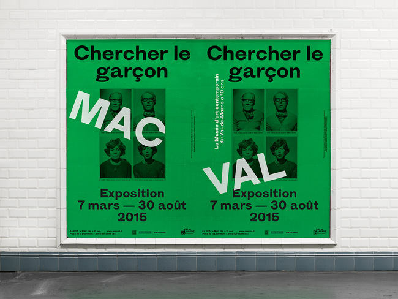
  Spassky Fischer, MAC VAL — [Source](http://spassky-fischer.fr/fr/#/project/mac-val)

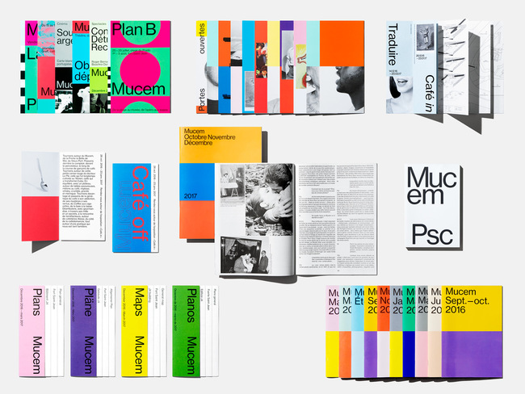
  Spassky Fischer, Mucem — [Source](http://spassky-fischer.fr/fr/#/project/mucem-communication)

### Post-post-modernisme, post-internet, post-apocalypse

La démultiplication de la circulation des images et des signes graphiques qu’à progressivement permis l’avènement d’internet et du web a rendu floues les frontières et multiplié le mélange des influences. Helvetica est partout, mais les couches de réinterprétations et de citations l’ont dissoute.  

  Punk rock swiss modernist gloubiboulga — [Source](https://www.swissted.com/)

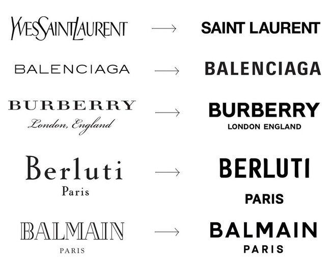
  Évolution des logos des marues de luxe, Sans mania

Dans le champ du web, les débuts balbutiants et les audaces graphiques d’une terre vierge ont laissé la place aux templates[^nolwenn] préfabriqués. Les _design systems_, les _tendances_ (flat design) et les _frameworks_ (Material design, Bootstrap) se sont répandus _ad nauseam_. 

[^nolwenn]: Lire l’article de Nolwenn Maudet, [Une brève histoire des templates, entre autonomisation et contrôle des graphistes amateurs](https://journal.dampress.org/issues/systemes-logiques-graphies-materialites/une-breve-histoire-des-templates-entre-autonomisation-et-controle-des-graphistes-amateurs)

## Perspectives 

Pour conclure (non) et ouvrir le débat, trois pistes à explorer, trois grandes approches contemporaines d’un (web)design minimaliste, sinon dans la forme, potentiellement dans l’attitude. 

###  Brutaminimalisme

[Brutalistwebsites](https://brutalistwebsites.com/) propose une définition formulée ainsi : « Par sa rugosité et l’indifférence aux formes faciles ou confortables, le Brutalisme peut être considéré comme une réaction de la jeune génération à la légèreté, à l’optimisme et à la frivolité du webdesign actuel ».

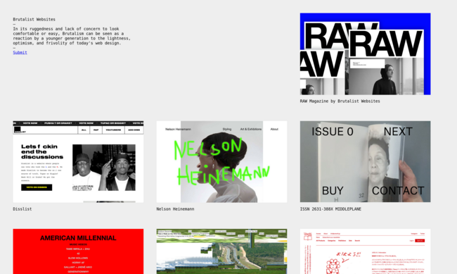
  [Brutalist websites](https://brutalistwebsites.com/)
    
Sous ce terme, le designer Pascal Deville, rassemble sans hiérarchie un ensemble de sites dont l’affiliation stylistique et esthétique avec le brutalisme architectural est plus qu’incertaine, mais dont les attitudes – moindre intervention du designer, visibilité des structures techniques, etc. – explorent une veine singulière d’une attitude « minimaliste ».

### Sobriété, frugalité, éco-conceptions et greenwashing

La crise climatique, la prise de conscience progressive de l’urgence écologique et l’évolution de l’opinion publique comme des marchés ont enfin établi les enjeux écologiques de l’activité des designers comme des questions majeures. 50 ans après _Design pour un monde réel_ de Victor Papanek[^Papanek], le design se verdit, s’allège, se _low-technicise_, s’_éthicise_ et parfois se _greenwashe_. 

Les initiatives se multiplient : [Web 0](https://web0.small-web.org/), [Small web](https://ar.al/2020/08/07/what-is-the-small-web/), [Slow web](https://www.slowweb.io/fr/) ou _low tech web_. Précurseur dans le champ du web, le site du [Low tech magazine](https://solar.lowtechmagazine.com) est hébergé sur un serveur alimenté par un panneau solaire. Son fonctionnement souhaite demander le minimum de ressources au serveur, mais aussi en bande passante et en « modernité » de l’appareil qui visite le site. 

[This is a motherfucking website](http://motherfuckingwebsite.com/), les [1MB Club](https://1mb.club/), [10 KB Club](https://10kbclub.com/), [512KB Club](https://512kb.club/), [250kb Club](https://250kb.club/), et de nombreux autres cherchent galement à réduire le poids de leurs pages, afin de lutter contre le [_bloated mess_](https://1mb.club/about) qu’est devenu Internet.

  Volkswagen, même pas peur – [Source](https://www.vw.ca/carbonneutralnet/en/)

[^Papanek]: Lire [Design éthique, éco-design, low-techs](../ethique/), ici-même.

### HTML Energy, énergies DIY du zine à l’écran 

[HTML energy](http://html.energy/) est un projet initié par [Laurel Schwulst](https://www.laurel.world/), artiste et enseignante new-yorkaise, dans lequel elle interroge des artistes et des designers qui écrivent des pages web en « pur HTML ». Elle y questionne notamment le potentiel poétique du web, mais y éclaire également des logiques esthétiques et philosophiques d’un web « simple ».

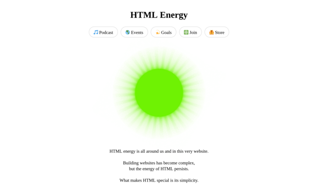
  [html.energy](https://html.energy/)

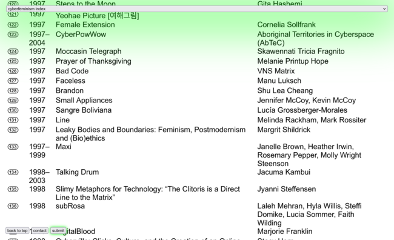
  [Cyberfeminismindex](https://cyberfeminismindex.com/),  collection de textes et de références cyberféministes. 

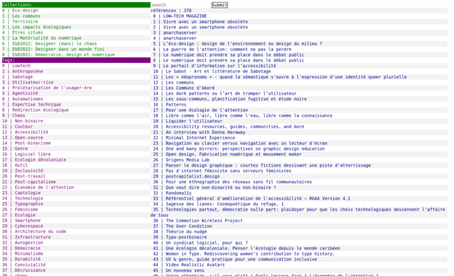
  [numeriques.brussels](https://numeriques.brussels/), collection de références produites par les étudiant⋅es et les enseignant⋅es de l’Erg. 

<!-- 

Facilité d’utilisation / ergonomie
Convivialité
Affordance
Rigidité
Austérité
Ordre
amoindrissement 
repli
réduction
Disparition de l’émotion ou de l’intuition

-->
***

> <big>Everything should be made as simple as possible, but not simpler.</big>    
  – Albert Einstein, ou Winston Churchill ?

***

[→ accéder au pad](https://semestriel.framapad.org/p/esad_cultures_numeriques_kiss?lang=fr){.bigbutton}

***

#### L’Enseignement de Las Vegas

_Learning from Las Vegas_ est un ouvrage majeur de la critique des approches modernistes, ouvrant la voie au post-modernisme. 

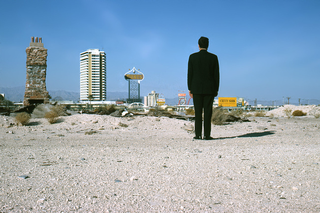
  Robert Venturi à Las Vegas — [Source](http://indexgrafik.fr/learning-from-las-vegas-et-controverse/)

Ses auteur⋅ices, Robert Venturi, Denise Scott Brown et Steven Izenour s’y attachent à mettre en lumière l’intérêt formel et culturel de l’architecture vernaculaire, des signes et des décorations qui illuminent nos villes. Ils y critiquent la stérilisation esthétique que le modernisme, en particulier dans ses acceptions les moins subtiles, produit dans nos imaginaires. Ils proposent aux architectes –mais aussi aux designers– d’observer et d’analyser toutes les formes culturelles, y compris les plus naïves/embarassantes/ridicules, et d’en nourrir leurs productions.

#### Variations sur le thème

> _Keep it simple, stupid_ (laisse-le simple, stupide)   
  _Keep it stupid simple_ (laisse-le stupidement simple)   
  _Keep it simple, silly_ (laisse-le simple, idiot)   
  _Keep it small and simple_ (laisse-le simple et bref)   
  _Keep it sweet and simple_ (laisse-le simple et agréable)   
  _Keep it simple and straightforward_ (laisse-le simple et direct)   
  _Keep it short and simple_ (laisse-le simple et court)   
  _Keep it simple and smart_ (laisse-le simple et intelligent)   
  _Keep it strictly simple_ (laisse-le strictement simple)   
  _Keep it speckless and sane_ (laisse-le sain et impeccable)   
  _Keep it super-simple_ (laisse-le super-simple)   
  _Keep it sober and significant_ (laisse-le sobre et explicite)   
  _Keep it short and sweet_ (laisse-le court et sympa)