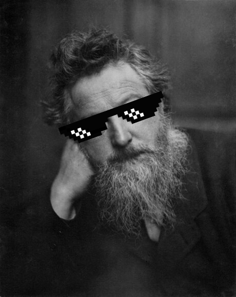
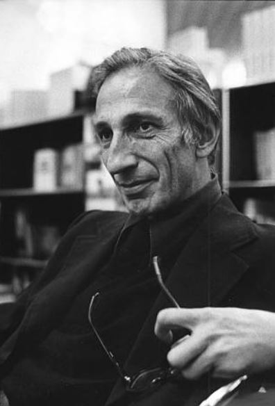
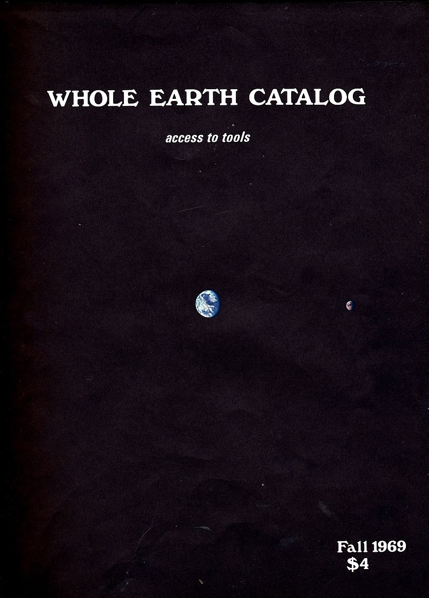

# Graphisme libre, f/l/os design 
> Outils libres et libre production

> <big>Utiliser un smartphone ou une tablette éduque autant à l’informatique que le fait de prendre un taxi éduque à la mécanique et la thermodynamique. […] Pour comprendre ce qu’est un moteur, il faut pouvoir l’ouvrir. L’observer. Le démonter. Il faut apprendre à conduire sur des engins simplifiés. Il faut en étudier les réactions. Il faut pouvoir discuter avec d’autres, comparer un moteur avec un autre. Pour découvrir l’aérodynamique, il faut avoir le droit de faire des avions de papier. Pas d’en observer sur une vidéo YouTube[^ploum].</big>

[^ploum]: _L’histoire du logiciel : entre collaboration et confiscation des libertés_, par [Ploum](https://ploum.net/lhistoire-du-logiciel-entre-collaboration-et-confiscation-des-libertes/).

## Définition

Un logiciel est considéré comme « libre » s’il confère à son utilisateur quatre libertés fondamentales : 

0. la liberté d’utiliser le programme pour n’importe quel usage ;
1. la liberté d’étudier son fonctionnement ;
2. la liberté de l’adapter à ses besoins ;
3. la liberté de modifier le programme et de partager ces modifications.

Cette définition programmatique, si elle s’applique au champ du logiciel, peut être largement ouverte vers les pratiques de l’art et du design, comme cette introduction se propose de le montrer.

## L’importance des outils

Arts & craft, évènement fondateur, n’est pas l’alpha et l’omega de la pensée du design. Néanmoins, revenons-y. William Morris[^1] défendait une vision de ce la production artisanale, qu’on allait bientôt nommer « design », en opposition au processus de standardisation qu’était en train de produire l’industrialisation de la production. Sa vision était fondée sur une valorisation des logiques artisanales et sur le désir de maîtriser ses outils d’un bout à l’autre de la chaîne de production. 

[^1]: [En savoir plus](https://www.grapheine.com/histoire-du-graphisme/william-morris-le-design-dinterieur-nest-pas-un-luxe)

Morris avait une approche qu’on ne pourrait qualifier de [luddite](https://fr.wikipedia.org/wiki/Luddisme), mais la question qu’il posait du rapport du designer à ses outils techniques a été au cœur de toute l’histoire du design.

Les évolutions du design sont intimement liées à celles de ses outils. De Gutenberg aux presses Linotype jusqu’à la photocomposition et à l’impression laser, chaque étape de l’évolution technique a permis à de nouveaux moyens de diffusion de l’information de naître et à de nouvelles formes d’émerger[^print].

[^print]: Pour l’histoire des techniques de l’impression voir, entre autres, [Wikipedia](https://fr.wikipedia.org/wiki/Histoire_de_l%27imprimerie).

Depuis les années 80 et l’avènement des outils numériques dans la pratique du design graphique, cette relation entre l’outil et la production est devenue encore plus “magique”.

Aujourd’hui, à un moment ou à un autre de son processus de création ou de production, l’immense majorité des productions relevant du champ du design graphique est sujette à une médiation des outils numériques. 

Nos outils influencent massivement nos pratiques de designers. Ce qui est possible, atteignable, s’entend dans le cadre défini par les possibilités –vastes, certes, mais limitées– que nous offrent nos outils de production.

Une école d’art et de design a deux missions qui peuvent sembler paradoxales : à la fois permettre de vivre d’une activité, et donc d’en maîtriser les outils spécifiques tels qu’ils seront vraisemblablement demandés par le monde professionnel, mais également permettre d’inventer de nouvelles formes, de nouveaux usages, en portant un regard critique sur les pratiques et en explorant de nouveaux espaces de création.

C’est dans cette deuxième hypothèse que se propose de vous emmener cette introduction, en abordant les espaces ouverts depuis de nombreuses années par de nombreux·ses designers.

## Quelques points de repère

La notion d’*outil convivial* a été pensée par Ivan Illich[^ivan]. Elle s’oppose à l’idée d’outils aliénants. Dans *La convivialité*[^ii], il écrit : 
> <big>« J’appelle société conviviale une société où l’outil moderne est au service de la personne intégrée à la collectivité, et non au service d’un corps de spécialistes. Conviviale est la société où l’homme contrôle l’outil. »</big>

Pour Illich, un outil convivial est <q>« générateur d’efficience sans dégrader l’autonomie personnelle, il ne suscite ni esclave ni maître, il élargit le rayon d’action personnel. L’homme a besoin d’un outil avec lequel travailler, non d’un outillage qui travaille à sa place »</q>.
[^ii]: Ivan Illich, La convivialité, Paris: Seuil, Points Essais, 2003 (1re éd : 1973)
[^ivan]:

Dans les années 70, la côte ouest des États-unis voit naître la contre-culture hippie. Le rapport à la technique des acteurs de cette période fut un évènement fondateur du monde que nous connaissons aujourd’hui. Norbert Wiener (père de la cybernétique), Marshall McLuhan ou Richard Buckminster Fuller, furent des intellectuels importants de cette période, qui mettaient la technologie au cœur de la transformation culturelle et psychologique de la société. 

> <big>I like to think (and    
the sooner the better!)    
of a cybernetic meadow    
where mammals and computers    
live together in mutually    
programming harmony    
like pure water    
touching clear sky.</big>    
> — [Richard Brautigan](https://en.wikipedia.org/wiki/All_Watched_Over_by_Machines_of_Loving_Grace), *All Watched Over by Machines of loving Grace*

C’est dans ce contexte que fut créé le *Whole earth catalog*[^WE], sous-titré *Access to tools*[^Monoskop], merveilleux manuel de l’autosuffisance créative où se croisent dans une joyeuse cacophonie articles théoriques, reportages, astuces techniques, objets divers, bonnes affaires en tous genres… <q>« Des kits pour tisser à domicile côtoient des reportages sur la science du plastique. Les flûtes en bambou partagent leur espace avec des livres sur la musique générée par ordinateur »</q>[^ft]. Pour Stewart Brand, son initiateur, ce catalogue est une « technologie intellectuelle ». Il fut l’un des évènements pionniers de la culture DIY, *Do it yourself*.

En 1985, associé à Larry Brilliant, Stewart Brand développe l’expérience du catalogue dans le WELL (Whole Earth ’Lectronic Link), réseau numérique et première communauté auto-gérée en ligne. Cette initiative contribuera à constituer l’imaginaire du cyberespace et des utopies électroniques en accueillant en son sein hackers, militants et pionniers de l’internet.

[^WE]:
[^Monoskop]: Le 1er numéro est téléchargeable chez [Monoskop](https://monoskop.org/images/0/09/Brand_Stewart_Whole_Earth_Catalog_Fall_1968.pdf)
[^ft]: Fred Turner, *From Counterculture to Cyberculture \[…\]*.

En 1983, Richard M. Stallman, qui travaillait au laboratoire d’intelligence artificielle au MIT, se fâche avec une imprimante[^RMS] et lance le projet du système d’exploitation GNU, auquel viendra plus tard se greffer le noyau Linux, ainsi que la licence GPL qui pose les bases des licences informatiques libres. Il créé également la [*Free Software Foundation*](https://www.fsf.org/), dont le mandat est de défendre la liberté des utilisateurs d’ordinateurs, le logiciel libre contre le « logiciel privateur ».

[^RMS]:L’anecdote est trop récurrente sur le web pour la dupliquer ici. Lire [Richard Stallman et la révolution du logiciel libre](http://framabook.org/richard-stallman-et-la-revolution-du-logiciel-libre/).

Eric Raymond raconte son expérience du logiciel libre dans un livre devenu une référence du mouvement, [La Cathédrale et le Bazar](http://www.linux-france.org/article/these/cathedrale-bazar/) compare et oppose deux modes de pensée et d’organisation ; celui de la cathédrale, pyramidal, hiérarchique et vertical, et celui du bazar, horizontal, « désordonné » (et effrayant à première vue), mais dont l’efficacité s’avère supérieure au premier de par sa capacité d’adaptation et de flexibilité. Linux, le système d’exploitation opensource fut conçu et développé par Linus Torvalds et des milliers de contributeurs sur ce modèle du bazar.

Avec le libre, le <abbr title="Do It Yourself">DIY</abbr> peut devenir <abbr title="Do It With Others">DIWO</abbr>. La collaboration, le partage et l’amélioration par le dialogue, la participation et les retours d’une communauté d’utilisateurs y sont grandement favorisées.

Torvalds et <abbr title="Richard Matthew Stallman">rms</abbr> sont deux personnalités qu’on oppose régulièrement selon leurs deux conceptions de l’ouverture. Stallman, militant du libre comme éthique, Linus pragmatique adepte du code ouvert et interopérable. Les deux notions sont associées dans l’acronyme f/loss[^flos].
[^flos]:*Free/libre Open Source Software* – inclut le mot “libre” pour signaler *"free as in free speech, not free beer"*. 

> <big>« Le succès, c’est l’échec de l’échec. »</big>    
— Winston Churchill (non…)

## Et le design ?

> « Adobe Inc. est la société qui édite les cinq applications standard utilisées universellement par l’industrie graphique pour l’édition d’images et de textes, numériques et imprimés : InDesign, Illustrator, Photoshop, Flash et Dreamweaver. Ces programmes sont exemplaires[^*] et la majorité des designers s’en satisfait très bien, mais ils sont standard et, comme tout outil, ils ont leur empreinte propre. Si l’outil est standard, ce qui est produit a tendance à se standardiser. »[^KD]
[^KD]: Kévin Donnot, [*Code = design*](http://www.cnap.graphismeenfrance.fr/sites/default/files/gef_2012.pdf), <abbr title="Graphisme en France">GeF</abbr> 2012
[^*]: Pas toujours… \[N.D.L.R.\]

Le modèle de développement et le modèle économique d’Adobe, tout comme la situation de quasi-monopole de l’entreprise et de ses outils, posent chaque jour de nouvelles questions aux designers graphiques. Faut-il se satisfaire d’outils fonctionnels standards, ou ouvrir de nouvelles perspectives ? Un document créé dans InDesign propose une taille par défaut, un corps de texte et un interligne par défaut, des marges par défaut, une couleur par défaut, une grille par défaut ; peut-on imaginer que l’ensemble des décisions soient alors prises par l’utilisateur de l’outil, ou de nombreuses ne reviennent-elles pas à son concepteur ? 

Les émergences des philosophies du libre, du *copyleft* ou du partage dans le monde de l’art et du design n’ont pas attendu le numérique[^enzo], mais la démultiplication des possibilités et de la vitesse de circulation des informations ont rendu cette question plus prégnante, amenant un grand nombre de designers et d’artistes à investir ces questions.

[^enzo]:

Dès 1995, le projet [GIMP](https://www.gimp.org/) est lancé. Au début des années 2000, à la suite de l’enseignement de [John Maeda](https://fr.wikipedia.org/wiki/John_Maeda), Casey Reas et Ben Fry publient [Processing](https://processing.org/), outil libre dédié à l’expérience du code comme outil de création. Lawrence Lessig (et al.) fonde l’organisation [Creative Commons](https://creativecommons.org/). En janvier 2002, Antoine Moreau (et al.) initie la [Licence Art libre](https://fr.wikipedia.org/wiki/Licence_Art_Libre#Historique). <small>\[Liste à compléter…\]</small>

À leur suite, dans les années 2000 / 2010, de nombreux studios, designers et dessinateurs de caractères typographiques, notamment en Belgique, vont faire du libre un espace de création, dépassant la question des outils pour aborder celle des productions.

## Ressources

### Collectifs, studios & designers

* [Open Source Publishing](http://osp.kitchen/) ☞ [Ludi Loiseau](http://www.ludi.be/), [Speculoos](https://www.speculoos.com/), [Femke Snelting](http://snelting.domainepublic.net/), [OSP Foundry](http://ospublish.constantvzw.org/foundry/)
* [Raphaël Bastide](https://raphaelbastide.com/) ☜ [PrePostPrint](https://prepostprint.org/)
* [Lafkon](https://lafkon.net/)
* [Figures libres](https://figureslibres.cc/)
* [La Villa Hermosa](http://www.lavillahermosa.com/)
* [Bonjour Monde](http://bonjourmonde.net/) ☞ [Benjamin Dumond](http://www.benjamindumond.fr/) 
* [Luuse](http://www.luuse.io/provisoire/) ☞ [Étienne Ozeray](http://www.etienneozeray.fr/), [Luuse Typotheque](https://typotheque.luuse.fun/)
* [D-E-A-L](http://d-e-a-l.eu/)
* [G.U.I.](http://www.g-u-i.net/)
* [L’Atelier des Chercheurs](https://latelier-des-chercheurs.fr/)
* [Manufactura Independente](https://manufacturaindependente.org/)
* [Hundredrabbits](https://100r.co/)
* [Garage de Recherches Graphiques](http://www.g-r-g.fr/)

Dans le champ typographique, de nombreux projets se sont également approprié cette philosophie. Signalons notamment :

* [Velvetyne Type Foundry](http://velvetyne.fr/)
* [The League of Moveable Type](http://www.theleagueofmoveabletype.com/)
* [Badass Libre Fonts By Womxn](https://www.design-research.be/by-womxn/) (sélection, projet mené par [Loraine Furter](https://www.lorainefurter.net/))

### Évènements

* [Libre Graphics Meeting](https://libregraphicsmeeting.org/), un peu partout
* [Journées du Logiciel Libre](https://jdll.org/), à Lyon
* [Open Source Design](https://opensourcedesign.net/), en lien avec le [FOSDEM](https://fosdem.org/)
* [Open Publishing Fest](https://openpublishingfest.org/)

### Articles, conférences et publications

* [Code<>outils<>design](http://www.cnap.graphismeenfrance.fr/sites/default/files/gef_2012.pdf), édition 2012 de la revue Graphisme en France, consacrée au code –et pour une part aux logiciels libres– comme outils de design.
* [FREEZE+PRESS](http://freeze.sh)
* [Pour un design graphique libre](http://www.etienneozeray.fr/libre-blog/), mémoire d’Étienne Ozeray, portant sur les relations entre design graphique et culture libre.
* [Graphisme technè – Médias, techniques et processus](https://www.designgraphiquedesigncritique.fr/), cycle de conférences initiés par l’université de Strasbourg et la HEAR .
* [Technique & Design Graphique – Outils, médias, savoirs](https://editions-b42.com/produit/technique-design-graphique/), ouvrage  dédié au rôle historique et opératoire de la technique dans le champ du design graphique.
* [« À quoi tient le design »](http://pierredamienhuyghe.fr/publicationsaquoitientledesign.html), ensemble de textes de Pierre-Damien Huyghe abordant notamment, dans une perspective philosophique – parfaitement approchable –, les enjeux des relations entre design et technique.
* [Les outils du design graphique](https://www.cairn.info/revue-sciences-du-design-2018-2-page-18.htm), data-visualisation de Quentin Juhel, qui met en perspective les outils (libres ou non-libres) du design graphique selon leur modularité et leur accessibilité.
* [Bricoles](https://accentgrave.net/bricoles/), excusez l’auto-référence, est un article écrit en 2014. Sous-titré « Bricolage, design, pratiques artistiques et numériques », il aborde nombre des questions évoquées ici, et ouvre vers d’autres références.
* [Concevoir les outils numériques du design](http://www.theses.fr/2017SACLS486), thèse de doctorat (en anglais) de Nolwenn Maudet.
* [Le design des programmes, des façons de faire du numérique](http://www.softphd.com/), thèse de doctorat (en français) d’Anthony Masure.

### Histoire du libre
* [Utopie du logiciel libre](http://lepassagerclandestin.fr/fileadmin/assets/catalog/essais/Utopie_logiciel_libre__Broca__Le_passager_clandestin.pdf) de Sebastien Broca (Le Passager Clandestin, 2013)
* [Richard Stallman et la révolution du logiciel libre](http://framabook.org/richard-stallman-et-la-revolution-du-logiciel-libre/) de Richard M. Stallman, Sam Williams & Christophe Masutti (Eyrolles, 2010), 
* [Libres enfants du savoir numérique, une anthologie du «Libre»](http://www.cairn.info/libres-enfants-du-savoir-numerique--9782841620432.htm) d’Olivier Blondeau (Éditions de l’Éclat, 2000).
* [L’histoire du logiciel : entre collaboration et confiscation des libertés](https://ploum.net/lhistoire-du-logiciel-entre-collaboration-et-confiscation-des-libertes/), par Ploum, 2022.

## Outils 

La liste définitive et consolidée d’outils libres, utilisables dans le champ de l’art et du design, est encore à construire. Raphaël Bastide (encore, 🙏) maintient [Usable](https://gitlab.com/raphaelbastide/usable/), liste d’outils de création F/LOSS. On peut aussi fouiller dans [ilovefreesoftware](https://www.ilovefreesoftware.com/). En attendant on pourra explorer :

### Outils bizarres
* [Alchemy](http://al.chemy.org/)
* [Scri.ch](https://scri.ch/)
* [Lizard Ladder](http://www.tedwiggin.com/LizardLadder/)
* [Make 8 bit art](https://make8bitart.com/)
* [Robot & Human](https://github.com/DynamicMetaFlow/robotandhuman)
* [Triangula](https://github.com/RH12503/triangula)

### Outils standards
* [Krita](https://krita.org/)
* [Gimp](https://www.gimp.org/)
* [Darktable](https://www.darktable.org/)
* [Inkscape](https://inkscape.org/)
* [Audacity](https://www.audacityteam.org/)
* [PenPot](https://penpot.app/)
* [Blender](https://www.blender.org/)

### Outils programmables
* [Processing](https://processing.org/)
* [Drawbot](https://drawbot.com/)
* [Bindery](https://evanbrooks.info/bindery/)
* [Paged.js](https://pagedjs.org/)
* [Pure Data](https://puredata.info/)
* [Scratch](https://scratch.mit.edu/)
* [Pencil code](http://pencilcode.net/)

### Outils indispensables
* [VLC](https://www.videolan.org/vlc/)
* [Firefox](https://firefox.com/)

