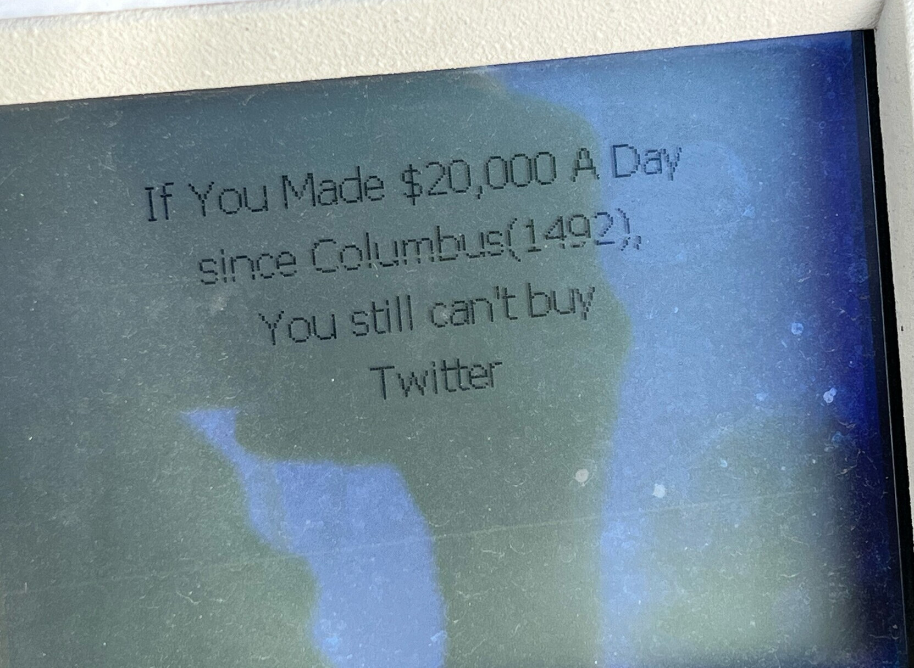
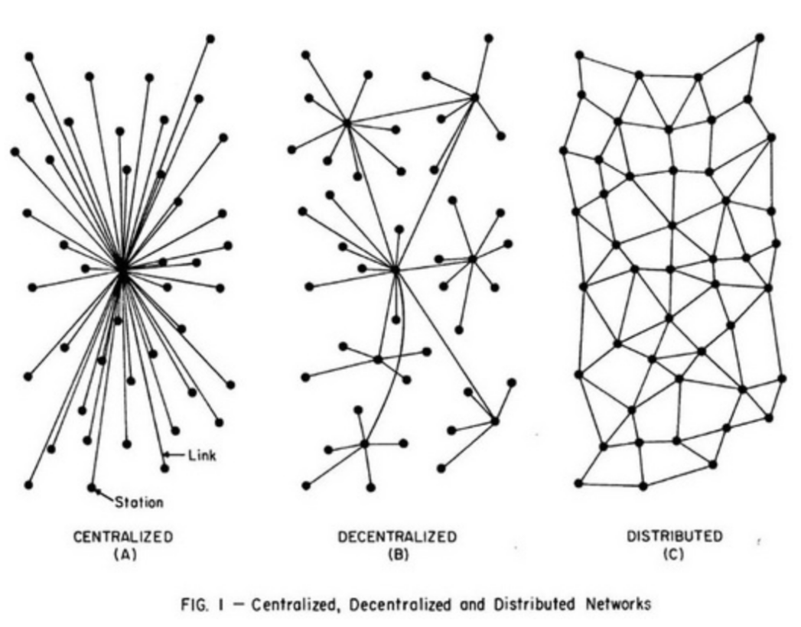

# Media queries

Il sera question de Twitter et de Fédivers, d’Elon Musk et d’Aaron Swartz, de censure et d’algorithmie, de médias (anti)sociaux et de presse indépendante.

Nous tâcherons d’aborder les questions de l’accès à l’information, des modalités de sa diffusion et des enjeux que portent les alternatives — tant du point de vue des _réseaux_ (sociaux) que des _médias_ qu’ils sont presque tous devenus. 

⚠️ Il sera pas mal question de la notion d’attention. Aussi, merci de respecter le cadre attentionnel de ce cours, quitte à vous y ennuyer, et ne pas vous connecter sur vos réseaux sociaux — sauf quand je vous y inviterai…

[→ accéder au pad](https://semestriel.framapad.org/p/esad_cultures_numeriques_mediaqueries?lang=fr){.bigbutton}

## Twitter

Fondé en 2006 par Jack Dorsey. Basé sur l’hypothèse de messages courts (140, puis 280 caractères), dédiés à la _documentation du réel_, en temps réel. 

En chiffres : 396 millions d’utilisateurs en 2022, dont 206 accèdent à la plateforme quotidiennement, 330 mensuellement[^users]. Son importance dans l’espace public vient moins du nombre de ses utilisateurs que de la sur-représentation des journalistes et politiques. S’y déterminent des tendances, des sujets et thématiques dont l’amplification médiatique et politique va bien au delà des utilisateur⋅ices de la plateforme.

[^users]: À comparer à Facebook (2,5 milliards d’utilisateurs actifs mensuels), TikTok (plus d’un milliard), Instagram (1 milliard), mais aussi Whatsapp (2 milliards), ou Messenger (980 millions) ou Snapchat (332 millions).

## Elon Musk

<figure>

<figcaption>
“Why is a gas pump telling me this. there is no escape” — <a href="https://yiff.life/@sky/109411475140930442">@sky@yiff.life</a>.
</figcaption>
</figure>

« Le 14 avril, Elon Musk  propose de racheter l’entièreté de Twitter pour 44 milliards de dollars. Il déclare vouloir racheter l’entreprise au nom du principe de liberté d’expression. Il déclare également vouloir davantage de transparence au niveau de l’algorithme en rendant public le code source et “vaincre les robots de spam et authentifier tous les humains”. »[^wp]
L’ouverture du code source de l’algorithme n’est évidemment pas au programme…

Ce rachat s’inscrit dans la bruyante histoire des rachats d’entreprises technologiques, opérés soit pour s’approprier une technologie ou une audience ou pour détruire ou absorber un concurrent. « Google fit l’acquisition de Youtube pour 1,65 milliards de dollars en 2005. En 2021 et pour 20 milliards Microsoft rachetait la société “Nuance”, spécialisée dans l’intelligence artificielle conversationnelle. En 2016, Microsoft encore, sortait 26 milliards de dollars pour racheter LinkedIn. En 2014 Facebook rachetait WhatsApp pour 22 milliards de dollars,  […] et en 2012 le même Facebook rachetait Instagram pour 1 milliard de dollars[^aff]. » Plus proches de nous, en septembre 2022, Adobe annonçait l’acquisition de Figma – un éditeur d’images vectorielles et un outil de prototypage d’interface – pour la somme de 20 milliards de dollars.

Depuis le rachat par Musk : licenciements massif (la moitié du personnel, la majorité des sous-traitants, toute la branche “modération”), exode (puis retour partiel ces derniers jours) des annonceurs, problèmes techniques, cafouillages sur la certification (8$/mois), #TwitterFiles, augmentation de 200 % des tweets racistes, de 60 % des posts antisémites ou homophobes, réouvertures de comptes notoirement fascistes. Et exode partiel vers d’autres lieux (le Fédivers, Tumblr, Linkedin…).

[^wp]: -> [Wikipédia](https://fr.wikipedia.org/wiki/Twitter#Rachat_en_2022)
[^aff]: Olivier Ertzscheid, [_L’oiseau, le milliardaire et le précipice_](https://affordance.framasoft.org/2022/08/cest-pas-elon-qui-prend-twitter/)

## Des médias  aux réseaux

> « Un réseau social est un ensemble d’identités sociales, telles que des individus ou encore des organisations, reliées entre elles par des liens créés lors d’interactions sociales[^rs]. »
[^rs]: -> [Wiktionnaire](https://fr.wiktionary.org/wiki/r%C3%A9seau_social)

Depuis SixDegrees.com, considéré comme le premier réseau social, en 1997 et MSN (1999), les réseaux sociaux numériques atteignent le grand public entre 2002 (Friendster et MySpace) et 2004 (Facebook). Leurs succèdent ou s’y ajoutent Twitter, YouTube, Soundcloud, Bandcamp, Tumblr, Twitch,  Flickr, Instagram, Pinterest, Linkedin, SnapChat, TikTok, mais aussi forums, blogs, wikis ou simples sites de médias ouverts aux commentaires. World of Warcraft, Fortnite ou SecondLife peuvent aussi être considérés comme des réseaux sociaux.

Des relations sociales entre les utilisateurs de ces services s’y nouent, des communautés s’y tissent, des échanges interpersonnels ou collectifs s’y produisent. La période s’est retrouvée nommée web 2.0, âge de l’avènement de la dimension massivement sociale de nos échanges numériques, de la transformation d’un univers de documents en un univers de personnes.

### Médias <- -> réseaux ?

Pourquoi parler de médias (sociaux) plutôt que de réseaux (sociaux) ? 

Dans leur immense majorité, ces services nous montrent des contenus soumis à et filtrés par des logiques algorithmiques. Cette éditorialisation de l’accès à l’information, rendue nécessaire (?) par l’immensité du flux informationnel, est surtout et primordialement motivée par l’enjeu majeur des éditeurs de ces services : monétiser la présence et l’activité des utilisateurs.

Le marché, la capacité de transformer en valeur financière les utilisateurs et leurs interactions, est le seul guide de conduite de ces services. Ils ne deviendraient “moraux” que si l’immoralité devait réduire leurs parts de marché à court ou moyen terme. Leurs déclarations de bonne volonté, leurs serments de vertu, sont systématiquement mis à mal et battus en brèche par l’exposé des innombrables [scandales](https://dayssincelastfacebookscandal.com/) dont elles ont fait l’objet.

On connait les enjeux du ciblage comportemental, du capitalisme de surveillance[^capitalisme]. Les enjeux de l’éditorialisation algorithmique de nos flux sociaux se multiplient de cette intime connaissance que les plateformes ont de nos intérêts, de nos activités, de nos liens sociaux et jusqu’à nos secrets les mieux gardés[^secrets].

Cette individualisation formidable des contenus affichés s’allie à l’immense capacité de croisement des données que procurent aux plateformes leur gigantesque quantité d’utilisateur⋅ices. Soumises aux logiques publicitaires (qu’il s’agisse d’affichage direct ou de revente de données), les plateformes ont progressivement mis en place des logiques algorithmiques pour capter l’attention de leurs utilisateurs et favoriser leur “engagement”.

Pour atteindre leurs objectifs, sur certaines plateformes, les contenus les plus clivants sont favorisés, générant des clashs à l’infini. Sur d’autres, on met tout en œuvre pour un _dumb scrolling_ infini. Ailleurs, les contenus viraux s’enchaînent.

> <big>« Il n’y a pas d’algorithmes, seulement la décision de quelqu’un d’autre[^geants] »</big>

[^geants]: Olivier Ertzscheid, _L’appétit des géants. Pouvoir des algorithmes, ambitions des plateformes_, [C&F éditions](https://cfeditions.com/geants/)

[^capitalisme]: Lire _[Affaires privées, Aux sources du capitalisme de surveillance](https://cfeditions.com/masutti/)_ de Christophe Masutti, les ouvrages de [Shoshana Zuboff ](https://www.monde-diplomatique.fr/2019/01/ZUBOFF/59443), écouter [Ce que les pouvoirs gagnent à tout savoir de nos vies](https://www.radiofrance.fr/franceinter/podcasts/le-code-a-change/ce-que-les-pouvoirs-gagnent-a-tout-savoir-de-nos-vies-3892270) dans _Le code a changé_.

[^secrets]:[Google te connaît mieux que ta mère ?](https://video.lqdn.fr/w/82578d5d-ec42-43ef-aa3e-0aadc8b1c971)

## Fédivers

Ré-éclairé par la fuite de nombreux utilisateurs ([#TwitterMigration](https://twitter.com/hashtag/TwitterMigration)), Mastodon est un réseau social décentralisé, logiciel libre, partie prenante de ce qu’on nomme le Fédivers (pour _Federated Universe_). Il s’oppose aux réseaux/médias centralisés au fonctionnement opaque, soumis au contrôle arbitraire et à la surveillance.

Le _Fediverse_ forme un réseau décentralisé de serveurs, qui hébergent des services libres de médias sociaux et qui utilisent des protocoles communs pour communiquer entre eux.

Outre Mastodon, on y trouve d’autres outils :
* [PeerTube](https://joinpeertube.org/) : partage de vidéos, alternative à Youtube ;
* [Pixelfed](https://pixelfed.org/) : partage de photos, alternative à Instagram ;
* [Mobilizon](https://mobilizon.fr/) : organisation d’événements, alternative aux groupes et événements Facebook ;
* [Castopod](https://castopod.org/) : podcasts…

Ces services sont installés sur différents serveurs, gérés par des personnes différentes, nommés _instances_. Par exemple mastodon.art, mastodon.design, typo.social, piaille.fr… On peut choisir une instance sur le critère de sa langue, des affinités ou des proximités qui y sont partagées.

L’objectif de ces outils est de permettre à des communautés autonomes (les membres des instances) de se fédérer et partager leurs contenus via le protocole commun qu’est ActivityPub. L’ensemble des services partageant le même protocole, il est par exemple possible de partager une vidéo créée avec PeerTube, un enregistrement sonore sur [Funkwhale](https://funkwhale.audio/), une image sur Pixelfed, etc. dans un fil de discussion de Mastodon (et réciproquement). Les commentaires et réactions qui y seront apportés seront également visibles sur PeerTube, Funkwhale ou Pixelfed.

Sut Mastodon, outre le fil personnel de l’utilisateur⋅ice (issu de ses propres abonnements), les membres de l’instance génèrent un fil _local_ (les messages de tous les membres de l’instance) et un fil _global_ (les messages des abonnements des membres de l’instance <- là, c’est souvent la jungle, mais c’est rigolo). 

La décentralisation du réseau, son adossement à un logiciel libre et son protocole standard garantissent qu’un seul homme (ou un seul conseil d’administration) ne puisse prendre le contrôle, ou fermer le service. On peut migrer d’une instance à une autre. On peut même installer ou gérer sa propre instance, personnelle ou communautaire.

Sans algorithme, sans publicité, de nombreuses fonctionnalités sont conçues pour favoriser l’inclusivité (description textuelle des images, avertissements pour contenus sensibles) ou la _privacy_. De nombreux usages présents aujourd’hui (présentation personnelle, logiques de recommandations publiques, messages de bienvenue) en font un espace social à la fois plus hétérogène que celui de Twitter et des grands réseaux, mais également plus cohérent et bienveillant. 

De nombreuses questions se posent quand au futur du fonctionnement du service. La modération, notamment, est une tâche parfois complexe dédiée  aux administrateurs de l’instance. La notoriété grandissante de l’outil pose également des problèmes liés aux “grosses instances”. Mais la mise en œuvre de systèmes d’échanges humains décentralisés appuyés sur les logiques du libre, constitue enfin une alternative désirable aux architectures toxiques des grands réseaux dont Aaron Swartz rêvait [^rss].

[^rss]: Il était prévu que le sujet des flux RSS soit abordé ici, mais le temps manque.

## BFM, CNEWS, C8, Boloré…

Le projet [Micromédia](../../projets/micromedia/) est introduit chaque année sur des évènements récents survenus dans l’actualité médiatique. 

En 2022, en France, quelques grands patrons détiennent l’essentiel des titres de presse et des médias télévisuels, et sont en situation de quasi-monopole dans le secteur de l’édition. L’importance majeure (en audience) des chaînes d’info en continu, des émissions de télé-poubelle et leur assujettissement aux logiques (à la fois économiques et politiques) de leurs patrons impose un “agenda” médiatique qui définit largement les normes du traitement de l’information.

Les [procès-baillons](https://www.okpal.com/reflets/#/) et les [attaques](https://www.arretsurimages.net/chroniques/initiales-ds/fogiel-et-bfmtv-attaquent-samuel-gontier-acte-1-et-2) que [subissent les médias indépendants](https://www.mediapart.fr/journal/france/011222/affaire-perdriau-les-coulisses-d-une-censure) des médias traditionnels se juxtaposent avec les logiques algorithmiques toxiques dans le champ numérique pour dessiner un environnement médiatique pour le moins problématique.

Chaque jour se font plus impérieux les enjeux de la réappropriation des espaces médiatiques, plus nécessaire la circulation libre d’une information indépendante, plus critique la question du contrôle des données personnelles par les individus. 

La conjonction de la crise de Twitter et de l’émergence de Mastodon offre la possibilité d’une faille dans l’écosystème médiatique et social numérique qu’il serait dommage de négliger ou de s’abstenir d’expérimenter.  

## Bibliographie

Tout ou presque : ) chez [Olivier Ertzscheid](https://affordance.framasoft.org), et notamment ses deux ouvrages aux éditions C&F : [_L’appétit des géants. Pouvoir des algorithmes, ambitions des plateformes_](https://cfeditions.com/geants/) et _[Le monde selon Zuckerberg. Portraits et préjudices](https://cfeditions.com/lmsz/)_.

Yves Citton, _L’économie de l’attention. Nouvel horizon du capitalisme ?_ La Découverte, 2014 
 	
Alexandre Coutant et Thomas Stenger, _« Les médias sociaux : une histoire de participation »_, Le Temps des médias, vol. 18, no. 1, 2012, pp. 76-86.  [Lire en ligne](https://www.cairn.info/revue-le-temps-des-medias-2012-1-page-76.htm)

Dominique Cardon, _[Culture numérique](http://www.pressesdesciencespo.fr/fr/book/?GCOI=27246100540390)_, Les Presses de Sciences Po, 2019. 

[Social Quitting](https://doctorow.medium.com/social-quitting-1ce85b67b456), un court texte de Cory Doctorow, sur une hypothétique fin de Twitter ou Facebook. 
 
En podcast, de nombreux épisodes de _[Le code a changé](https://www.franceinter.fr/emissions/le-code-a-change)_ de Xavier de la Porte, la série _[Crise de la Tech : la fuite en avant](https://www.radiofrance.fr/franceculture/podcasts/serie-crise-de-la-tech-la-fuite-en-avant)_ sur France Culture.

En vidéo, à propos des réseaux sociaux, la série [Dopamine](https://www.arte.tv/fr/videos/RC-017841/dopamine/) sur arte.tv.

En vidéo, _[Propagande, les nouveaux manipulateurs](https://www.youtube.com/watch?v=ByWFrWW_kQk)_, enquête d’Alexandra Jousset et Philippe Lagnier pour [arte.tv](https://boutique.arte.tv/detail/propagande-les-nouveaux-manipulateurs).

### Espaces critiques des médias
[Acrimed](https://www.acrimed.org/) (Action-Critique-Médias) « cherche à mettre en commun savoirs professionnels, théoriques et militants au service d’une critique indépendante, radicale et intransigeante des médias, des journalismes et des journalistes ».

Également : [Arrêt sur images](https://www.arretsurimages.net/), [Les mots sont importants](https://lmsi.net/), [Fonds pour une presse libre](https://fondspresselibre.org/), [Reporters sans frontières](https://rsf.org/)…

Consulter la carte [Médias français, qui possède quoi](https://www.monde-diplomatique.fr/cartes/PPA), produite à partir de données ouvertes par le Monde diplomatique.

Voir [Media Crash - Qui a tué le débat public ](https://www.mediapart.fr/studio/documentaires/france/le-documentaire-media-crash-sur-mediapart), le documentaire produit par Médiapart dans les coulisses des grands médias. 

### Médias indépendants, d’enquête, d’analyse ou de reportage 
[Mediapart](http://mediapart.fr/), [LeMédia](https://www.lemediatv.fr/), [Blast](https://www.blast-info.fr/), [AOC](https://aoc.media/), [Brief.me](https://www.brief.me/), [Basta](https://www.bastamag.net/), [StreetPress](https://www.streetpress.com/), [Disclose](https://disclose.ngo), [Médor](https://medor.coop/)…

## Pad

Cliquez sur le lien ci-dessous pour contribuer au pad, poser des questions, mettre en liens textes, ressources et références pour partager la parole et nourrir le débat ↓

[→ accéder au pad](https://semestriel.framapad.org/p/esad_cultures_numeriques_mediaqueries?lang=fr){.bigbutton}
