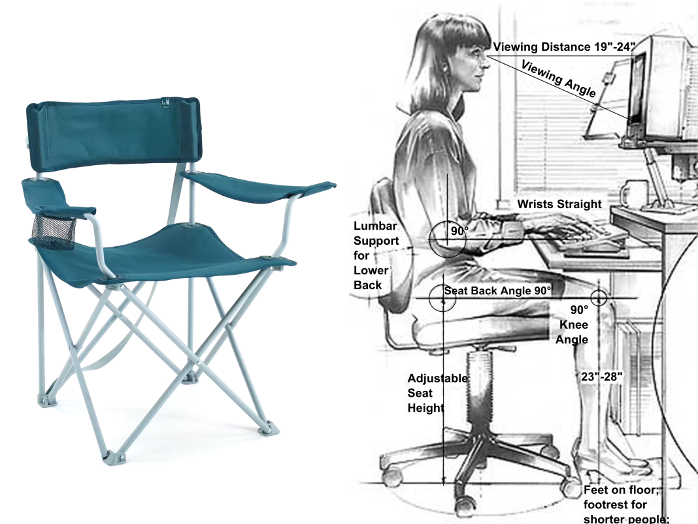

# L’expérience et l’utilisateur

<figure><iframe width="560" height="315" src="https://invidious.fdn.fr/embed/nGHbOckpifw?" title="" frameborder="0" allow="accelerometer; autoplay; clipboard-write; encrypted-media; gyroscope; picture-in-picture" allowfullscreen></iframe><figcaption><i>The meta experience</i>, une vidéo de <a href="https://lav.io/">Sam Lavigne</a></figcaption><figure>

Les notions d’_expérience_ et d’_utilisateur_ sont centrales dans les processus de design. Elles permettent d’inscire un projet dans un ensemble de relations entre un “objet de design” (objets, lieux ou messages[^potter]: une affiche, une cafetière, une salle d’attente, une interface numérique) et ses destinataires (le public, les utilisateur⋅ices, les humains qui le recevront) à travers l’_expérience_ qu’iels en feront.

[^potter]: Norman Potter, [Qu’est-ce qu’un designer ?](http://www.strabic.fr/Norman-Potter-Qu-est-ce-qu-un-designer).

Ce terme, communément abbrégé UX, souffre cependant de nombreux biais, tout autant intrinsèques que progressivement acquis au fur et à mesure de ses usages. 

On se propose ici d’explorer les enjeux de ces termes en les liant à deux notions particulièrement symptomatiques de leur dévoiement : les _Dark patterns_ et l’_enshitification_ au regarde de deux textes importants, _Turing Complete User_ d’Olia Lialina et _The User Condition: Computer Agency and Behavior_ de Silvio Lorusso, accompagnés par Anthony Masure et son _Manifeste pour un design acentré_[^biblio].

[^biblio]: Voir [la bibliographie](#bibliographie).

L’ancrage « numérique » de cette approche n’est pas exclusif ; on pourra facilement étendre la réflexion menée ici aux enjeux du design global.

## Feng shui

C’est au début des années 90 que Donald Norman, alors chez Apple Computer, a formulé le terme d’_expérience utilisateur_, concrétisant dans le champ du numérique les enseignements issus de domaines bien plus anciens que le terme.

Fondé sur les principes de la philosophie taoïste, le _Feng Chui_ cherche à « harmoniser l'énergie environnementale », le _qi_, 氣. Appliqué principalement à l’architecture intérieure, cet art/pratique/pseudo-science/philosophie, au delà de ses dimensions ésotériques ou des best-sellers de Marie Kondo, a pour objectif de proposer aux habitant⋅es d’un espace (ses _utilisateur⋅ices_) le meilleur agencement spatial possible du point de vue des énergies qui y circulent (l’_expérience_).

Dans le monde occidental, dès l’Antiquité[^wp], puis à l’époque médiévale et à la Renaissance, émergent des préoccupations liées à ce qui sera nommé l’_ergonomie_. Cette discipline se préoccupe d’analyser les caractéristiques des situations de travail, des postures[^fauteuil], des outils, et se propose d’établir des bonnes pratiques visant à la fois à améliorer la _santé_ des travailleur⋅euses et leur _productivité_.

[^wp]: [L’ergonomie avant l’ergonomie](https://fr.wikipedia.org/wiki/Histoire_de_l'ergonomie#L'ergonomie_avant_l'ergonomie) sur Wikipédia.

[^fauteuil]: 
  Deux pensées divergentes de l’ergonomie d’un poste de travail.

Rapidement, les enjeux de l’ergonomie se déplacent des enjeux de santé, pour se mettre au service des entreprises afin d’améliorer la productivité des travailleurs. L’ergonomie des postes de travail, permettant accélérer les processus de production, a accompagné l’évolution du travail à la chaîne et l’avènement du _taylorisme_, du _fordisme_ ou du _toyotisme_.

Henry Dreyfuss fut un designer industriel pionnier dans le domaine du design au service de l’expérience utilisateur, agissant transversalement dans les domaines de l'ergonomie, de l'anthropométrie et des facteurs humains. Son approche du design l’amena notamment, à la suite de nombreux designers, architectes ou ingénieurs (de [Léonard de Vinci](images/leonardo-da-vinci-vitruvian-man.jpg) à [Le Corbusier](images/modulor.jpg)) à postuler dans un livre aux illustrations fascinantes[^TheMeasureofManHumanFactorsinDesign] une anthropométrie standard, une [mesure idéale des corps](images/joe_josephine.webp) qui illustre certains biais des approches modernistes, en ce qu’elles tendent à établir des moyennes, à synthétiser des absolus, éliminant de ce fait les corps ou les usages marginaux, divergents ou simplement minoritaires.

[^TheMeasureofManHumanFactorsinDesign]: [_The Measure of Man: Human Factors in Design_](images/TheMeasureofManHumanFactorsinDesign.pdf), illustrations d’Alvin R. Tilley. L’ouvrage est loin d’être caricatural, mais a pu concourir à établir des pensées de la majorité qui écartent les minorités.

## Usages et usagers  

> <big>« les usagers ‹ bricolent › avec et dans l’économie culturelle dominante, les innombrables et infinitésimales métamorphoses de sa loi en celle de leurs intérêts et de leurs règles propres »</big>[^dc]

[^dc]: Michel de Certeau, _L’invention du quotidien, tome 1 : Arts de faire,_ Gallimard, 1990.

Qu’il s’agisse d’une chaise, du hall d’accueil d’un bâtiment, d’un annuaire téléphonique ou d’une application pour smartphone, les objets de design sont censés intégrer au cœur de leur élaboration les perspectives des “utilisateur⋅ices” de ces objets, lieux ou messages. Pour une chaise : comment s’y assied-on, quel confort et quelle stabilité sont proposées, mais aussi quelle capacité à s’empiler, ou à se plier, quelle durabilité, dans quel contexte est-elle positionnée… sont des questions préalables à son design qui sont intimement liées aux utilisateur⋅ices de cette chaise (à la fois celleux qui s’asseyent ou qui la possèdent).

Les mêmes types de questions se posent pour tous les objets de design, impliquant pour le designer une connaissance fine du contexte d‘apparition d’un objet, de son public, de son adresse, de ses usages souhaitables et possibles…

L’apport de l’anthropologie, de l’ethnographie et plus largement des sciences sociales dans le champ du design est à ce titre un éclairage dont les designers auraient bien tort de se priver[^anthropo]. Les pratiques de l’enquête, du _terrain_, qui y sont souvent centrales, permettent au designer de se projeter au cœur des contextes de réception d’un message, d’utilisation d’un objet physique ou d’un outil numérique, à la fois de manière préalable, mais également au cours de son existence, afin de pouvoir en comprendre les échecs et les réussites –et éventuellement pouvoir le faire évoluer– voire même après son existence, dans sa réparation, son ré-usage, son détournement…

[^anthropo]: Parcourir “[Qu’est-ce que l’anthropologie, l’ethnologie et, plus largement, les Sciences humaines et sociales apportent au design](https://journal.dampress.org/words/cycle-de-conf/qu%27est-ce-que-l%27anthropologie-l%27ethnologie-et-plus-largement-les-sciences-humaines-et-sociales-apportent-au-design) et plus globalement, s’intéresser notamment aux publications de [Design Arts Médias](https://journal.dampress.org/).

# UCD, HCD, PCD, AC⚡DC

_User Centered Design_, _Human Centered Design_, _People Centered design_, [Highway to Hell](https://invidious.fdn.fr/watch?v=l482T0yNkeo)[^am].

Le terme d’_expérience utilisateur_ apparaît en 1986 dans un livre de Don Norman (chercheur en sciences cognitives, auteur de _The Design of Everyday Things_) intitulé _User Centered Design: New Perspectives on Human-Computer Interaction_ (Design des systèmes centrés utilisateur).

[^am]: Les extraits suivants, et nombre des réflexions qui fondent cette proposition, sont issues d’un article d’Anthony Masure, _Manifeste pour un design acentré_, publié par B42 dans _Design et humanités numériques_ et [accessible en ligne](https://www.anthonymasure.com/articles/2019-12-manifesto-acentric-design).

Cet ouvrage fait suite à l’émergence de nouveaux paradigmes d’_interfaces utilisateurs_ dans la micro-informatique en voie de démocratisation. Les principes d’interactions envisagés par Douglas Engelbart en 1968 dans sa _Mother of all demos_ (la souris, le WYSIWYG, la visioconférence, le courrier électronique, la navigation hypertexte, la métaphore du bureau, les « fenêtres »…) ont alors été mis en place dans deux ordinateurs de la firme [Xerox](images/IE-Star-3.jpg), puis « copiés » dans l’[interface](images/apple_lisa_screenshot.gif) de l’[Apple Lisa](images/lisa.jpg) de Steve Jobs et dans le premier système [_Windows_](images/Windows1.0.webp) de Bill Gates.

Dans cet ouvrage, on lit :

> Un engagement direct se produit lorsqu’un utilisateur fait l’expérience d’une interaction directe avec des objets dans un milieu \[…\] plutôt qu’une communication avec un intermédiaire. Ces interactions s’apparentent à interagir avec des objets du monde physique. \[…\] L’interface et l’ordinateur deviennent invisibles. Bien que nous croyons que ce sentiment d’engagement direct soit d’une importance capitale, nous ne savons \[…\] que peu de choses sur les besoins réels nécessaires à sa production »

> J’ai inventé l’expression [d’expérience utilisateur] parce que je pensais que celles d’interface humaine et d’utilisabilité étaient trop restreintes : je voulais couvrir tous les aspects de l’expérience d’une personne avec un système, incluant le design industriel, le design graphique, l’interface, l’interaction physique et le mode d’emploi »

Cet aspect plus large de l’« expérience utilisateur » fut ensuite précisé :

> L’« expérience utilisateur » englobe tous les aspects de l’interaction de l’utilisateur final avec l’entreprise, ses services et ses produits. La première exigence pour une expérience utilisateur exemplaire est de répondre aux besoins exacts du client. \[…\] Nous devons distinguer l’UX et l’utilisabilité. La définition de l’utilisabilité indique que c’est une qualité de l’UI couvrant le fait qu’un système soit simple à comprendre, efficace à utiliser, plaisant, etc. L’UX est un concept bien plus large. »

<!-- Dans le champ des interactions homme-machine, le _Human Centered Design_ fait aujourd’hui l’objet d’une normalisation ISO, émettant plusieurs recommandations : Le design s’appuie sur la compréhension de l’utilisateur, de ses tâches et de son environnement. Les utilisateurs sont intégrés à l’ensemble du processus de design et de développement. Le design évolue en fonction des retours des utilisateurs. Le processus est itératif. L’ensemble de l’expérience des utilisateurs est pris en compte. L’équipe de projet est pluridisciplinaire. -->

### Malboufffe

Cet ensemble de perspectives sur le design d’interfaces, d’environnements, de produits ou de services a connu un grand succès, fondant une discipline avec des formations supérieures dédiées, un nombre phénoménal de publications, de livres, podcasts, newsletters ou blogs. À bien des égards, ces pensées sont utiles à la conception d’objets de design qui tiennent compte des réalités des utilisateur⋅ices, et tout⋅e étudiant⋅e en design qui se respecte devrait prendre le temps d’en comprendre les grands principes. 

Il convient cependant de conserver un regard critique sur certaines « recettes » qui ont pu en émerger, et souffrent de nombreux écueils :
- Trop souvent, elles ont tendance à réduire l’utilisateur⋅ice à des rapports centrés sur ses besoins exacts, à des rôles et usages prédéterminés.
- Dans le champ du design d’interface numériques, des « interactions homme-machine », ont été produites des _guidelines_ (celles d’[Apple](https://developer.apple.com/design/human-interface-guidelines/), ou de [Google](https://m3.material.io/)) qui, pour intéressantes qu’elles soient, nivellent les imaginaires des designers.
- Tout comme l’anthropométrie établissait des utilisateur⋅ices moyen⋅nes, standards, les approches UX design ont convoqué des _persona_[^persona] censés permettre de dépasser des archétypes pour imaginer des utilisateur⋅ices « réels » mais qui finissent trop souvent par reproduire de pauvres stéréotypes, visant à &lt;bullshit&gt;impacter sa culture client, déterminer des facteurs d'engagement, comprendre les insights clefs&lt;/bullshit&gt;

[^persona]: Le terme est utilisé en [design numérique](https://fr.wikipedia.org/wiki/Persona_(ergonomie)) comme en [marketing](https://fr.wikipedia.org/wiki/Persona_(marketing)).

### User = 💩, Human = 🤑
Dans son article, Anthony Masure signale également un changement d’approche et de vocabulaire notable, lisible en 2008 : 

> Parmi les horribles mots que nous employons, il y a le mot « utilisateurs ». Je pars en croisade pour nous débarrasser de ce terme. Je préfère parler de « personnes ». […] Nous concevons des produits pour des personnes, pas pour des utilisateurs  »

Ce revirement coïncide avec l’émergence d’une pensée de l’informatique invisible que Don Norman appelait de ses vœux dès 1990 dans un texte célèbre, [_Why Interfaces Don’t Work_](https://www.academia.edu/2849717/Why_interfaces_don_t_work). En 2012, ce vieux rêve semblait devenir réalité dans un clip dans un [clip promotionnel pour Apple](https://www.youtube.com/watch?v=Im32w9_Okws) :

> iPad is the perfect expression of that idea, it’s just this magical pane of glass that can become anything you want it to be. It’s a more personal experience with technology than people have ever had.

Olia Lialina[^olia], net-artiste et formidable observatrice de nos environnements numériques a produit deux textes relatifs à cette évolution de l’informatique, des interfaces et de la position des utilisateur⋅ices, _Turing complete user_[^tcu] et _Rich User Experience, UX and Desktopization of War_.

[^tcu]: Traduit par Jean-François Caro, _L'utilisateur Turing-complet_ est accessible en français sur [reader.lgru.net](http://reader.lgru.net/texts/lutilisateur-turing-complet/).
[^olia]: 

Ces deux articles sont des critiques redoutables des logiques promues par Don Norman, Jakob Nielsen et autres gourous de l’UX, fut-elle rebaptisée.

> C’est pour cela que le design d’interfaces a progressivement été rebaptisé design d’expériences – expression dont l’objectif premier est de faire oublier l’existence des ordinateurs et des interfaces auprès des utilisateurs. Le design d’expériences vous laisse seul avec vos émotions à ressentir, vos objectifs à atteindre et vos tâches à effectuer.»[^tcu2]

[^tcu2]: [_Turing complete user_](http://reader.lgru.net/texts/lutilisateur-turing-complet/).

Dans son texte, Olia Lialina appelle de ses vœux le retour en grâce d’un utilisateur généraliste d’un ordinateur généraliste. Elle le qualifie de « Turing-complet » au sens des premiers ordinateurs, conceptualisés par Alan Turing ou John von Neuman : des outils reprogrammables à l’infini qui ne soient pas affectés à une seule tâche spécifique, mais qui puissent nous « encapaciter » et ne nous aliènent pas dans des usages et des parcours prédéterminés.

> Le design d’expérience empêche de penser et de valoriser les ordinateurs en tant qu’ordinateurs, et les interfaces en tant qu’interfaces.[^udp].

[^udp]:  — [_Rich User Experience, UX and Desktopization of War_](http://contemporary-home-computing.org/RUE/#fn-kay)

Dans _Liquider l’utilisateur_[^liquider], Silvio Lorusso poursuit et actualise la critique formulée par Olia Lialina. Il convoque la métaphore d’un grille-pain connecté, qui sait détecter le type de pain et ajuste la température ou la durée (ça existe ~~sans doute~~ vraiment). Un jour sans prévenir, son micrologiciel / sa puce exige une mise à jour et vous empêche de griller votre pain du petit-déjeuner. Le confort gagné par la simplification de l’usage, par la disparition de la « friction » finit par produire une réduction de l’action possible, une perte d’autonomie, ou –selon le mot de Bernard Stiegler– une « prolétarisation ».

[^liquider]: Liquider l’utilisateur, Silvio Lorusso, [revue Tèque](https://revue-teque.fr/catalogue/teque-1) ou en  VO : [theusercondition.computer](https://theusercondition.computer/)

Dans le monde de l’informatique invisible, dominé par Apple, Google ou Adobe, chaque gain de confort initialement perçu finit par devenir une aliénation. Les hypothèses formulées par de Certeau (le braconnage que nous opérons dans « l’obscur entrelacs des conduites journalières ») sont empêchées de façon toujours plus forte par nos outils numériques, devenus espions, nourris d’intelligence artificielle et contraints dans des usages prédéterminés.

Cette aliénation, de bridage des usages, cette ultra-spécialisation des outils logiciels et matériels est au cœur d’une communication de Cory Doctorow, autre penseur majeur de notre relation au numérique : [The coming war on general computation](https://www.youtube.com/watch?v=HUEvRyemKSg).

Mais avant de poursuivre vers une autre notion phare élaborée par Doctorow – la magnifiquement nommée _enshitification_ –, autorisons-nous un détour par un climax diabolique du design d’expérience utilisateur, les…

## Dark patterns

Wikipédia nous dit « Un _dark pattern_ ou _dark UX_ (en français : interface truquée) est une interface utilisateur qui a été volontairement conçue pour tromper ou manipuler un utilisateur ». 

Devenues si nombreuses que nous finissons par ne presque plus y prendre garde, ces pratiques se sont approprié les enseignements du design d’interface, des sciences cognitives ou de la sociologie des usages pour nous amener à des comportements contraires à nos besoins.

Coûts cachés, conditions générales d’utilisation illisibles, options présélectionnées, impossibilité de suppression de compte, lien de désinscription non-fonctionnel, culpabilisation, les exemples sont légion.

Sur [deceptive.design](https://www.deceptive.design/), Harry Brignull, fondateur du site, dresse une liste des différents types de _dark patterns_ et maintient un [_Hall of shame_](https://www.deceptive.design/hall-of-shame) de ces pratiques trompeuses.

Depuis l’adoption du [RGPD](https://fr.wikipedia.org/wiki/R%C3%A8glement_g%C3%A9n%C3%A9ral_sur_la_protection_des_donn%C3%A9es) (Règlement général sur la protection des données) par le Parlement européen, adoptant certains principes protecteurs des utilisateur⋅ices (notamment les logiques de p_rivacy by design_ et _privacy by default_) certains _dark patterns_ sont devenus illégaux, mais des stratégies toujours plus retorses ont été adoptées par les éditeurs de sites et d’applications aux objectifs douteux. 

Les GAFAM, notamment, à l’aide d’armées d’avocats et de designers machiavéliques s’en sont donné à cœur-joie[^gafam]. Le récent _Manifest V3_ de Google Chrome, qui sera déployé à partir de juin 2024 (et impactera tous les navigateurs basés sur ce moteur ; Edge, Brave, Opera…) rendra presque inopérants les extensions dédiées au blocage des publicités. Ce qui nous conduit tout droit au diagnostic suivant :

[^gafam]: Lire [RGPD : Les "dark patterns", ou comment s'asseoir sur le Règlement](https://open-freax.fr/rgpd-dark-patterns/)

## L’emmerdification

À son paroxysme, et bien au delà des seuls enjeux d’interfaces ou de design stéréotypé, aliénant ou trompeur, le dévoiement des possibilités offertes par le numérique est théorisé par Cory Doctorow sous le terme d’_enshitification_ ; en français, _merdification_, ou _emmerdification_ :

Dans un premier temps, les plateformes ou services numériques séduisent leurs utilisateurs, qui en deviennent dépendants ; ensuite, elles les exploitent au profit de leurs clients-partenaires (le plus souvent, des annonceurs publicitaires) ; elles exploitent les utilisateurs et les clients-partenaires pour récupérer toute la valeur produite à leur propre profit. Enfin, elles meurent.

Dans [_Aux apatrides du web merdique_](https://www.arretsurimages.net/chroniques/clic-gauche/aux-apatrides-du-web-merdique), Thibault Prévost synthétise en français les hypothèses de Doctorow, signalant combien :

> La détérioration des services offerts par le capitalisme de plateforme n'est pas circonstancielle mais structurelle, inhérente au modèle lui-même, qui n'a jamais été conçu pour durer mais pour capter un maximum de valeur en un minimum de temps quitte à tout détruire sur son passage _– "Move fast and break things"_.

Cette expérience utilisateur toxique qui nous est proposée (imposée ?) par le numérique des plateformes et des _Big Tech_ n’est sans doute pas une fatalité, même si elle est massive et que les effets de réseau nous limitent dans nos capacités à nous en extraire.

Sans verser dans un _netstalgisme_ (une nostalgie d’un web pionnier idéal, sans frontières ni publicité – qui n’a jamais vraiment existé), l’invitation que nous font ces penseurs technocritiques, ces designers acentrés, est de ré-envisager nos positions vis à vis de ces outils et médias afin de reconquérir les potentialités qu’ils nous offrent.

## Bibliographie

[_The User Condition: Computer Agency and Behavior_](https://theusercondition.computer/), Silvio Lorusso, 02/2021, traduit par Sophie Garnier (_Liquider l’utilisateur_) pour la [revue Tèque](https://revue-teque.fr/catalogue/teque-1), 2022.

[_Turing Complete User_](http://contemporary-home-computing.org/turing-complete-user/), Olia Lialina, 10/2021, traduit par  Jean-François Caro pour [_Considering our tools_](http://reader.lgru.net/texts/lutilisateur-turing-complet/), 2013.

[_Aux apatrides du web merdique_](https://www.arretsurimages.net/chroniques/clic-gauche/aux-apatrides-du-web-merdique), Thibault Prévost, _Arrêt sur image_, 01/2024.

[Rich User Experience, UX and Desktopization of War. The morning after experience design.](http://contemporary-home-computing.org/RUE/), Olia Lialina, 01/2015.

[The ‘Enshittification’ of TikTok. Or how, exactly, platforms die.](https://www.wired.com/story/tiktok-platforms-cory-doctorow/), Cory Doctorow, 01/2023.

[Manifesto for an Acentric Design](https://www.anthonymasure.com/articles/2019-12-manifesto-acentric-design), Anthony Masure, 12/2019.

[Sur la trace de l'humain dans les “objets” de design](https://www.nonfiction.fr/article-9264-sur-la-trace-de-lhumain-dans-les-objets-de-design.htm), Alexandre Saint-Jevin, 03/2018.

*[UX]: User eXperience
*[UI]: User interface
*[UCD]: User-Centered Design
*[PCD]: People-Centered Design
*[HCD]: Human-Centered Design
