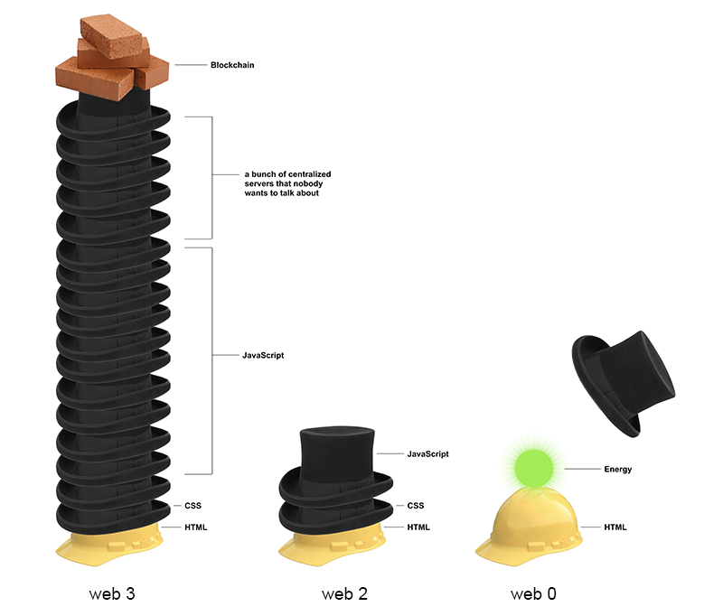

# Web3

Disclaimer !

Tout discours est _situé_, énoncé depuis une position et un point de vue qu’il est préférable de connaître (ou d’examiner) quand une information est reçue. Les éléments recueillis ci-dessous ne manquent pas à cette règle et ne prétendent à nulle objectivité. Ils sont en outre émis depuis une position de non-spécialiste, dont l’intérêt pour ces sujets est soumis à une exposition médiatique elle aussi orientée idéologiquement.

Au delà d’une introduction aux questions des blockchains, des NFTs ou du Web3, l’actualité nous propose de nous attacher à deux autres thématiques à l‘actualité brûlante, le traitement de la [guerre en Ukraine](#ukraine) par les écosystèmes numériques et les questions de [médiatisations numériques](#campagne) en campagne présidentielle.

### La blockchain

> <big>Une solution qui n’a pas (encore vraiment) trouvé de problème</big>

Une blockchain, ou chaîne de blocs, est une base de données distribuée et infalsifiable. Elle permet le stockage et la transmission d'informations vérifiées sans organe central de contrôle.

C’est un registre public et ([presque](https://www.zdnet.fr/actualites/le-piratage-de-la-blockchain-a-rapporte-environ-trois-milliards-de-dollars-l-an-dernier-39916071.htm)) inaltérable[^sebsauvage], sécurisé par la cryptographie[^crypto] :

* registre : tout comme pour un registre papier, on y inscrit des informations.
* public : Tout le monde peut inscrire quelque chose dans ce registre, et le contenu de ce registre est intégralement consultable par n'importe qui. Il n'y a aucun secret.
* inaltérable : une fois une donnée inscrite dans ce registre, il est impossible de la modifier ou la supprimer.

Les chaînes de blocs furent longtemps principalement connues comme étant la base des systèmes de cryptomonnaies, et notamment le Bitcoin. Décrites (sans doute à raison) comme une avancée technologique profondément ~~disruptive~~ radicale, et promettant des avenirs radieux dans de nombreux champs, les chaînes de blocs peinent encore à prouver leur intérêt dans le “monde réel”.

[^sebsauvage]: Extrait de _[Le(s) problème(s) avec les NFT](https://sebsauvage.net/wiki/doku.php?id=nft)_, article sur lequel se base une large part de la critique des NFT formulée ici.
[^crypto]: La cryptographie (qui permet de _chiffrer_ une information, est ici utilisée pour assurer l’authenticité et l’intégrité des informations.

  Une analogie physique des principes de la blockchain a été conçue par le collectif BAM : la [Blockchain vaisselle](https://collectifbam.fr/projets/realisations/blockchain-vaisselle/resume).

### Les NFT

Depuis le début de l’année 2021, les NFT – _Non fungible token_, ou jeton non fongible – ont acquis une popularité grandissante, notamment au travers de la médiatisation de ventes d’œuvres d’art numérique, atteignant des prix considérables. Leur émergence populaire date de 2017 et du jeu en ligne [CryptoKitties](https://fr.wikipedia.org/wiki/CryptoKitties) permettant d’échanger (vendre et acheter) des chats virtuels.

> UN NFT est un certificat numérique, le plus souvent un acte de propriété, consigné dans un registre numérique public et décentralisé, attaché à une entité numérique ou tangible.
> Un NFT est réputé infalsifiable, du fait de son inscription dans une chaîne de blocs.

Par essence, un “objet” numérique peut être copié à l’infini, sans qu’il existe de possibilité de distinguer l’original d’une copie. On qualifie la “propriété” numérique du terme “[non rival](https://fr.wikipedia.org/wiki/Rivalit%C3%A9_(%C3%A9conomie))”. Les NFT sont une manière de créer “artificiellement” de la rareté numérique. 

> <big>Dans notre monde, tout ce que l’esprit humain est capable de créer peut être reproduit et diffusé à l’infini sans que cela ne coûte rien.</big>

— John Perry Barlow[^barlow]

[^barlow]:[Déclaration d'indépendance du cyberespace](http://editions-hache.com/essais/barlow/barlow2.html), 8 fév 1996

La “non-fongibilité” d’un NFT traduit le caractère non interchangeable du certificat. Là ou un euro est équivalent à n’importe quel autre euro –ils ont la même valeur–, un NFT est unique et identifiable.

Les NFT promettent plusieurs choses :
* Ils permettent de déclarer et de certifier la propriété d’une œuvre numérique.
* Aucune “autorité centrale” n’est nécessaire (le système est public et décentralisé)
* Les échanges de NFT ne requièrent pas d’intermédiaires

  Le NFT de cette image ("CryptoPunk #5822" : ) s'est [vendu](https://journalducoin.com/nft/cryptopunks-23-millions-dollars-nft-punk-peau-bleue/) à 8000 Ξ (23.7 millions d'euros) en février 2022. 

L’avènement des NFT a produit des clivages et des clash assez formidables parmi la communauté des “artistes numériques”.
[Memo Akten](https://memo.tv), [estimait](https://memoakten.medium.com/the-unreasonable-ecological-cost-of-cryptoart-2221d3eb2053) que la création d'un NFT sur la chaîne Ethereum nécessite plus de 340 kWh d'énergie, soit 211 eqCO2. [Kyle McDonald](https://twitter.com/kcimc) publie une estimation en temp-réel des émissions de la chaîne Ethereum. Cette problématique écologique fut la première raison des clivages entre artistes, et du refus de certaines de participer à cet univers, avant que de nombreuses autres problématiques soient également soulevées, notamment la centralité de la dimension monétaire ; le caractère principalement marchand des NFTs.

#### Défauts

 De très nombreux acteurs des mondes numériques questionnent et critiquent la logique à l’œuvre derrière les NFTs (ou à minima, derrière certaines blockchains). 

Des problèmes écologiques[^fly]. Les chaînes de blocs sont réputées extrêmement voraces en énergie. La « preuve de travail » (_proof of work_, *PoW*), à la base de nombreuses technologies blockchain, est un système dans lequel s’affrontent des “mineurs” qui ont pour charge de calculer l’intégrité des blocs. Ce calcul est extrêmement coûteux en énergie et en matériel. Les communautés autour des blockchains ont tâché de trouver des solutions plus vertueuses ([preuve de sécurité](https://fr.wikipedia.org/wiki/Preuve_de_s%C3%A9curit%C3%A9), [preuve d’histoire](https://cryptoweek.fr/preuve-dhistoire-poh-un-guide-pour-les-debutants), preuve d'enjeu – notamment dans le cas de la chaîne [Tezos](https://fr.wikipedia.org/wiki/Tezos)), sans toutefois réussir à complètement solutionner le problème énergétique.

[^fly]: Le [Bitcoin](https://www.theguardian.com/technology/2018/jan/17/bitcoin-electricity-usage-huge-climate-cryptocurrency) consomme autant d’énergie qu’un million de vols transatlantiques par an (en 2019…).

Des problèmes philosophiques, techniques et conceptuels[^sebsauvage2] : 
* Un NFT n’est pas l’œuvre mais un “pointeur” vers l’œuvre. En achetant un NFT, on n’achète pas l’œuvre ; on paye l’enregistrement dans un registre de l'information: « L'URL https://example.com/image5.jpg est associée à l'utilisateur TOTO. ». Ce “pointeur” est réputé stable, immuable, mais l’URL ne l’est pas. Le fichier référencé peut changer au bon vouloir du gestionnaire du domaine (la majorité des NFT sont des URLs).
* (Tout comme la notion de [monnaie](https://www.youtube.com/watch?v=CMos6Yj1-ZI)) La “propriété” garantie par le NFT est une affaire de consensus, de contrat social. Le consensus sur la réalité de la propriété n’existe qu’au sein de la chaîne – et pas ailleurs. Contrairement à la plupart des monnaies importantes, gérées par des états ou des banques centrales, les cryptomonnaies et les NFTs sont très éclatées (il existe ± 8000 blockchains). Comme l'argent, le NFT est « une [illusion partagée](https://www.bortzmeyer.org/nft.html) ».
* Si les NFTs produisent des mécanismes d’échanges et de financement de productions artistiques valables, ils sont surtout le marqueur d’une transformation artificielle d’une ressource illimitée (un fichier numérique, copiable à l’infini) en un object rare et spéculatif. Les NFT signalent un nouvel avènement d’un _internet de la transaction_, principalement monétaire.
* La décentralisation que revendiquent les blockchains et les NFTs n’est que de façade. En effet, s’il est techniquement possible de vendre et d’acheter soi-même des NFTs, l’immense majorité des transactions a lieu sur des plateformes centralisées ([Opensea](https://opensea.io/), [Rarible](https://rarible.com/), [SuperRare](https://superrare.com/), etc.) dont la pérennité est très relative. 

[^sebsauvage2]: À nouveau basé sur _[Le(s) problème(s) avec les NFT](https://sebsauvage.net/wiki/doku.php?id=nft)_ de sebsauvage.net. Lire aussi une [approche plus technique](https://www.bortzmeyer.org/nft.html) de Stéphane Bortzmeyer.

#### Qualités

De nombreux artistes parfaitement respectables ont embrassé le phénomène NFT, notamment parmi celles et ceux ayant centré leurs pratiques dans le champ numérique. Soudainement s’ouvrait une extension du marché de l’art à des artistes qui avait jusqu’alors difficilement accès à la vente d’œuvres. 

Quelques exemples aléatoires[^artistes] : [Albertine Meunier](https://albertinemeunier.net/nft-collection), [Leander Herzog](https://teia.art/Leander_Herzog), [Mario Klingemann](https://showtime.io/Quasimondo). En France, [Mark Webster](https://teia.art/markwebster), [Julien Gachadoat](https://twitter.com/v3ga).

[^artistes]: À compléter dans [le pad](https://semestriel.framapad.org/p/esad_cultures_numeriques_web3?lang=fr) ?

[Laurence Allard](https://twitter.com/laurenceallard), sémiologue et maître de conférences en sciences de la communication, signale la dimension expérimentale et réflexive que peut permettre d’explorer l’usage des NFT. Écouter _[NFT, cryptoart, et Samouraï virtuel](https://www.youtube.com/watch?v=fpdr8QNVtNE)_.

#### Petit lexique
* Les _smart contracts_ : des programmes, enregistrés dans une chaîne de blocs, répandus notamment dans la chaîne Ethereum, qui peuvent déclencher des actions (transferts d’actifs, notamment) de manière automatisée lorsque certaines conditions sont atteintes.
* Les _DAO_ : des organisations autonomes décentralisées, qui peuvent décider collectivement de la “gouvernance” des œuvres ou objets numériques et dont les règles de fonctionnement sont transparentes et immuables, car inscrites dans une blockchain. On qualifie leur fonctionnement de “démocratique” (plus souvent : majoritaire).
* _Cryptoart_ : L’ensemble divers des productions artistiques ayant recours aux logiques de blockchain ou de NFTs.
* _Wallet_ : Un “portefeuille” électronique, dédié au stockage sécurisé des NFTs, ou plus précisément, au stockage  des informations sur l’emplacement d’un NFT dans la blockchain.

### Le Web3

Le ~~buzzword~~ terme _Web3_ est advenu en tant que suite à celui de _Web 2.0_, cette période du web ayant émergé dans les années 2000, qui consacrait l’un des espoirs clés de la fondation du web : sa démocratisation. La période était née dans la liberté de l’expression individuelle des blogs, mais allait progressivement consacrer le règne des plateformes hypercentralisées que nous connaissons aujourd’hui ; réseaux sociaux, devenus médias sociaux.

> <big> Web3 is Bullshit </big>[^bullshit]
[^bullshit]: Lire l’[article](https://www.stephendiehl.com/blog/web3-bullshit.html) de Stephen Diehl.

La “notion” de Web3 se signale par un haut niveau de ~~bullshit~~ désinvolture. Si l’on peut trouver une quantité phénoménale d’articles, de communiqués de presse, de threads de cryptobros sur Twitter ou de capital-risqueurs qui vantent les vertus du Web3, il est bien plus complexe d’en trouver une définition qui ne soit pas si pleine de _buzzwords_ qu'elle n’en devienne vide de sens[^web3isgoinggreat].

[^web3isgoinggreat]: Source : [web3isgoinggreat.com](https://web3isgoinggreat.com/what)

Selon ses partisans, le Web3 est le “futur de l’internet”. Il sera décentralisé et basé sur la blockchain. Les données ne seront pas contrôlées par les “Big Tech”, elles seront incensurables et égalitaires. Ce qui s’avère déjà partiellement, et donc totalement, faux. La décentralisation est un principe fondateur d’Internet et n'est pas quelque chose qui est seulement (ou mieux) atteint via les blockchains. 

Le(s) “Metavers”, ~~vendus~~ promis par ~~Facebook~~ Meta, mériteraient une réflexion spécifique, qui dépasse le cadre de cette introduction.

L’appropriation du terme “Web” par le “Web3” est également critiquable. Le Web, système de publication d’informations ouvert et libre fondé sur l’hypertextualité, bien que déjà largement mis à mal par le “Web 2.0” n’a que peu à voir avec l’univers de transactions financières que promeuvent les partisans de l’écosystème Web3 / NFT. 

Des réactions salutaires ont donc éclos. [Make Free Stuff](https://mxb.dev/blog/make-free-stuff/), par Max Böck ou [From the Philosophy of the Open to the Ideology of the User-Friendly](https://loriemerson.net/2013/02/02/from-the-philosophy-of-the-open-to-the-ideology-of-the-user-friendly-2/) de Lori Emerson ne sont que deux exemples choisis parmi cent autres [^TBL]. 

[^TBL]: Tim Berners-Lee, _très_ paradoxalement, a [défendu sa décision](https://www.theguardian.com/technology/2021/jun/23/tim-berners-lee-defends-auction-nft-web-source-code) de mettre aux enchères un NFT représentant le code source du web, comparant cette vente à une dédicace de livre ou à une tournée de conférences… ☹

 Heureusement, il nous reste [HTML Energy](https://twitter.com/htmlenergy)

### Capitalisme tardif

Le capitalisme tardif, _late-stage capitalism_, désigne, dans certaines théories marxistes, la période actuelle du capitalisme. Le terme implique (espère ?) la fin prochaine de ce régime économique et social[^latestage]. 
Ce terme et cette période, au delà du débat qu’elle ouvre en économie ou en philosophie [^sennet], est également explorée par [Humans of late capitalism](https://humansoflatecapitalism.tumblr.com/), un ensemble de comptes présents sur de nombreux réseaux sociaux [^knowyourmeme] ([facebook](https://www.facebook.com/Humans-Of-Late-Capitalism-686984161471404/), [twitter](https://twitter.com/neighbours_wifi), [instagram](https://www.instagram.com/HumansOfLate/), [reddit](https://www.reddit.com/r/LateStageCapitalism/)…), qui publie des images, généralement non légendées, témoignant du caractère fondamentalement dystopique de l’époque que nous vivons. Images incongrues, effrayantes, ironiques ou cinglantes, elles mettent en lumière les failles d’un monde où le consumérisme, la financiarisation, la technologie ou encore les travers des pouvoirs politiques et économiques confinent à l’absurde. Elles dessinent les marges, les aberrations et les fissures du capitalisme tardif. Voir l’article de Jay Hathaway sur [The Daily Dot](https://www.dailydot.com/unclick/humans-of-late-capitalism-twitter/)

[^knowyourmeme]: Voir [knowyourmeme](https://knowyourmeme.com/memes/cultures/late-capitalism) ou [urbandictionary](https://www.urbandictionary.com/define.php?term=late%20capitalism).

Les NFT sont l’un des derniers développements d’une dimension fondamentale de la construction du cyberespace: sa fondation par l’étonnante idéologie libertaire/libertarienne née dans la contre-culture californienne[^counterculture] des années 60/70. Ils poursuivent et consacrent le paradoxe inhérent à cette culture, tentant – vainement ? – d’allier utopie libertaire et ultralibéralisme forcené. Ils s’inscrivent pleinement dans l’aberration sociale et écologique que produit l’idéologie ultra-libérale de notre temps.

[^counterculture]: Lire [Aux sources de l'utopie numérique](https://cfeditions.com/utopie-numerique/) et écouter [De la contre-culture à la cyberculture](https://www.franceculture.fr/emissions/place-de-la-toile/de-la-contre-culture-la-cyberculture) par Xavier de La Porte.

> <big>Le capitalisme tardif est un racket pyramidal à une échelle globale, le genre de pyramide au sommet de laquelle on fait des sacrifices humains, en faisant croire pendant ce temps aux gogos que tout continuera éternellement. </big>

— Thomas Pynchon, Fonds perdus.

[^latestage]: Capitalisme tardif sur  [wikipedia.fr](https://fr.wikipedia.org/wiki/Capitalisme_tardif). 
[^sennet]: Découvrir la figure de [Richard Sennet](https://fr.wikipedia.org/wiki/Richard_Sennett), notamment pour son travail autour de la culture de l'artisanat.

***

## Ukraine, une guerre médiatisée {#ukraine}

Ce temps de réflexion s’appuie largement sur les articles publiés ces derniers jours par Olivier Ertzscheid dans son blog, [affordance.info](https://www.affordance.info/) : le 28 février 2022, "[Ukraine. Para Bellum Numericum. Chronique du versant numérique d'une guerre au 21ème siècle](https://www.affordance.info/mon_weblog/2022/02/guerre-ukraine-numerique.html)", le 3 mars 2022, "[Ukraine. Para Bellum Numericum](https://www.affordance.info/mon_weblog/2022/03/ukraine-guerre-numerique-suite.html)", le 8 Mars 2022, "[La guerre sur TikTok : une tragédie musicale](https://www.affordance.info/mon_weblog/2022/03/tiktok-war-tragedie-musicale.html)", le 11 Mars 2022 "[Il faut tuer Vladimir Poutine](https://www.affordance.info/mon_weblog/2022/03/il-faut-tuer-vladimir-poutine.html)", et le 13 Mars 2022 "[Les consoles de nos consolations](https://www.affordance.info/mon_weblog/2022/03/console-ukraine-numerique-episode-5.html)". O. Ertzscheid s’y explore « les enjeux et déclinaisons numériques, parfois poignantes, parfois anecdotiques, parfois vitales, du conflit en cours en Ukraine suite à l'invasion Russe ».

Ce panorama des « manières dont les écosystèmes numériques mobilisent les espaces médiatiques et les terrains opérationnels depuis l’invasion russe en Ukraine » est une lecture longue mais éclairante pour saisir ce qui se joue dans nos écrans, se superpose à la tragédie des morts violentes, des bombardements, des viols, des exils et de toutes les détresses qui naissent toujours des guerres.

Quelques moments-clés de lecture :

* La première [déclaration de guerre](https://gigaom.com/2012/11/14/when-armies-become-media-israel-live-blogs-and-tweets-an-attack-on-hamas/) sur Twitter (_Israel live-blogs and tweets an attack on Hamas_, 2012) ; 
* La guerre des images, Zelinsky et [son discours](https://www.youtube.com/watch?v=p-zilnPtZ2M) de 9 minutes au lendemain de l'annonce de l'entrée des troupes russes, ses selfies, tweets et vidéos ; 
* [Wikipédia](https://twitter.com/bibliofab66/status/1496785203502600192), guerre d’édition et documentation encyclopédique en temps réel
* Babélisation des expertises ([@versac](https://twitter.com/versac/status/1497150905115947031))
* Décor des affiliations (drapeaux sur FB, Twitter)
* [Anonymous](https://twitter.com/bluetouff/status/1497166030736666645) vs [Telecomix](http://web.archive.org/web/20160308010311/http://datalove.me/). Lisez [reflets.info](https://reflets.info/).
* Algorithmes et recommandations
* Tutos Molotov et [conduite de tank](https://twitter.com/UkrainiaUpdates/status/1498448553525616640) (vidéo de 2020)
* Interdiction des médias – et réciproquement
* Étiquettage des journalistes (Twitter)
* Avis-clients (TripAdvisor, Google Maps…)
* Low tech : radiodiffusion à haute fréquence / ondes courtes
* Les câbles, l'infrastructure
* Telegram et les espaces inter-individuels
* La première victime d'une guerre, c'est la vérité (Rudyard Kipling).
* TikTok, remédiations et musicalités
* Guerre des signes ([La Haye](https://www.affordance.info/.a/6a00d8341c622e53ef0282e148dff7200b-pi)) 
* Tuer Vladimir Poutine ? + réaction russe aux annonces de FB/Meta
* Facebook tue des gens (Rohingyas, Ouïghours…)

Ailleurs :
* Volodimir _[Fake](https://twitter.com/MikaelThalen/status/1504123674516885507)_ Zelinksy. Voir [reface.ai](https://hey.reface.ai/).
* _[In the future, everyone will post their 15 seconds of war footage](https://twitter.com/Klingebeil/status/1504124221861027845)_, influenceur·ses guerrièr·es.
* Sur Twitter, suivre [Olivier Tesquet](https://twitter.com/oliviertesquet), [Samuel Gontier](https://twitter.com/SamGontier) ou [Nassira El Moaddem](https://twitter.com/NassiraELM).

***

## Médiatisation en campagne {#campagne}

En ces temps de campagne électorale, et sans nécessairement militer pour un·e candidat·e ou un·e autre, il est souhaitable qu’un regard analytique, critique et distancié soit porté sur les modalités de médiatisation des paroles publiques dans les écosystèmes numériques.

#### Contexte règlementaire

L’Arcom (ex-CSA) a pour mission de faire respecter un équilibre du temps de parole (principe d'équité puis s’égalité) des candidat·es et de leurs représentant·es dans l’espace audiovisuel. La démultiplication des supports, au delà des chaînes de radio et de télévision et le relai variable de leurs contenus tel qu’opéré par les médias numériques rend le décompte produit par le CSA/Arcom particulièrement complexe (et largement inopérant). D’autre part, on constate que le décompte des expositions médiatiques ne tient pas compte de nombreux acteurs complémentaires (éditorialistes, journalistes), aux positions politiques très situées. L’accès à une diversité des points de vue et un pluralisme de l’expression politique ne peuvent donc plus être garantis que par un effort des auditeurs et spectateurs ; effort parfois bien difficile à produire.

#### Iconographie
La représentation photographique des hommes et femmes politiques ou militant·es signale avec force les différences de traitement dont ils et elles font l’objet.

[Soazig de la Moissonnière](https://www.instagram.com/soazigdelamoissonniere/) est la photographe officielle de l’Élysée. Une récente série d’images, s’inscrivant dans la pure continuité des [représentations](https://imagesociale.fr/4724) protocolaires du spectacle présidentiel, fait rigoler [François Ruffin](https://twitter.com/Francois_Ruffin/status/1504143843981148160) et les [médias étrangers](https://www.courrierinternational.com/article/vu-de-letranger-avec-son-sweat-capuche-macron-le-communicant-pousse-le-bouchon-un-peu-loin).

Voir sur le site d’_Arrêt sur images_ la chronique d’[André Gunthert](https://imagesociale.fr) sur « [Ruffin dans Libé : la caricature photo, mode d'emploi](https://www.arretsurimages.net/chroniques/le-regard-oblique/ruffin-dans-libe-la-caricature-photo-mode-demploi) » dans laquelle il nous invite à regarder les effets de la caricature photographique, à travers les sourires, grimaces, etc. et dans quelle mesure la photographie perd souvent sa dimension documentaire au profit d’une éditorialisation masquée.

#### Propriétés des écosystèmes médiatiques
En novembre 2021, le Sénat a créé la commission d'enquête « [Concentration des médias en France](https://www.senat.fr/commission/enquete/2021_concentration_des_medias_en_france.html) » « afin de mettre en lumière les processus ayant permis ou pouvant aboutir à une concentration dans les médias en France, et d’évaluer l’impact de cette concentration sur la démocratie », à la demande du groupe Socialiste, Écologiste et Républicain.

Consulter la carte [Médias français, qui possède quoi](https://www.monde-diplomatique.fr/cartes/PPA), produite à partir de données ouvertes par le Monde diplomatique.

#### Espaces critiques des médias
[Acrimed](https://www.acrimed.org/) (Action-Critique-Médias) « cherche à mettre en commun savoirs professionnels, théoriques et militants au service d’une critique indépendante, radicale et intransigeante des médias, des journalismes et des journalistes ».

Également : [Arrêt sur images](https://www.arretsurimages.net/), [Les mots sont importants](https://lmsi.net/), [Fonds pour une presse libre](https://fondspresselibre.org/), [Reporters sans frontières](https://rsf.org/)…

#### Médias indépendants, d’enquête, d’analyse ou de reportage 
[Mediapart](http://mediapart.fr/), [LeMédia](https://www.lemediatv.fr/), [Blast](https://www.blast-info.fr/), [AOC](https://aoc.media/), [Brief.me](https://www.brief.me/), [Basta](https://www.bastamag.net/), [StreetPress](https://www.streetpress.com/), [Disclose](https://disclose.ngo)…

## Ressources en ligne

### Contenu du pad (notes et références connexes et complémentaires)

#### NFT WTF ? 

[Les blockchains peuvent-elles être vertes ?](https://fr.beincrypto.com/marches/67162/nft-blockchains-vertes-nft-ecologiques-prochaine-grande-tendance/)

[Beeple](https://www.bewaremag.com/beeple/)
    
[Pourquoi il faut (sérieusement) s’intéresser à Fortnite](https://signauxfaibles.co/2018/12/26/pourquoi-il-faut-serieusement-sinteresser-a-fortnite/)

Audio : [Sommes-nous vraiment en train de fabriquer des “crétins digitaux" ?](https://www.franceinter.fr/emissions/le-code-a-change/sommes-nous-vraiment-en-train-de-fabriquer-des-cretins-digitaux), (Le code a changé)

Film : [Her](https://en.wikipedia.org/wiki/Her_(film))
    
Film : [Pierre Carles - Pas vu, pas pris ](https://archive.org/details/PierreCarles-PasVuPasPris)
    
Film : [Les nouveaux chiens de garde](https://www.dailymotion.com/video/xpj5bo)

[Singulariser le multiple : les NFT artistiques entre spéculation et redistribution](https://www.anthonymasure.com/articles/2021-11-singulariser-multiple-nft-artistiques)

[C’est quoi, les NFT? Une spécialiste explique (Laurence Allard)](https://www.lavoixdunord.fr/1139643/article/2022-02-10/c-est-quoi-les-nft-une-specialiste-explique)

Audio : [NFT, cryptoart, et Samouraï virtuel avec Laurence Allard](https://www.youtube.com/watch?v=fpdr8QNVtNE)

[NFT : encore plus stupide](https://p4bl0.net/post/2022/01/NFT-%3A-encore-plus-d%C3%A9bile)

[NFT : l'original et l'acopie](https://www.affordance.info/mon_weblog/2021/03/nft-loriginal-et-lacopie.html)
 
[B.I.M. / Blockchain In Media](https://bim.esadorleans.fr/) est un programme de recherche, issu de l’unité de recherche ECOLAB de l’ESAD Orléans, dont le champ d’investigation consiste à penser le design du temps à partir du design de la blockchain.

[The Unreasonable Ecological Cost of #CryptoArt (Part 1)](https://memoakten.medium.com/the-unreasonable-ecological-cost-of-cryptoart-2221d3eb2053)

[Le(s) problème(s) avec les NFT](https://sebsauvage.net/wiki/doku.php?id=nft)

[“Web3” — A Reading List](https://seanvoisen.notion.site/seanvoisen/Web3-A-Reading-List-a338692c36b54b28975e07916c502a77)

Video (en) : [Line Goes Up – The Problem With NFTs](https://www.youtube.com/watch?v=YQ_xWvX1n9g)

[The NFT Ecosystem Is a Complete Disaster](https://www.vice.com/en/article/xgdvnd/the-nft-ecosystem-is-a-complete-disaster)

[Web 1.0, Web 2.0 and Web 3.0 with their difference](https://www.geeksforgeeks.org/web-1-0-web-2-0-and-web-3-0-with-their-difference/)

[Web 3.0 vs. the metaverse: What’s the difference? ](https://www.freethink.com/technology/web-3-vs-metaverse)

[Que reste-t-il de la propriété dans l’environnement numérique? ](https://blogs.mediapart.fr/revue-deliberee/blog/070920/que-reste-t-il-de-la-propriete-dans-l-environnement-numerique)

Vidéo : [A quoi ça ressemble l’Internet russe ?](https://www.instagram.com/reel/CbJ-cFxDFFt/?utm_medium=share_sheet)

[Guerre en Ukraine : les Anonymous attaquent la Russie](https://www.futura-sciences.com/alternative/amp/actualite/97012/)

[Guerre en Ukraine : pourquoi Volodymyr Zelensky gagne la bataille de la communication](https://www.lejdd.fr/International/guerre-en-ukraine-pourquoi-volodymyr-zelensky-gagne-pour-linstant-la-bataille-de-la-communication-4098783.amp)

Vidéo : [Concentration des médias : un danger pour la démocratie ?](https://www.arte.tv/fr/videos/107824-000-A/concentration-des-medias-un-danger-pour-la-democratie/)

[Quand les propriétaires de médias pèsent sur les élections](https://www.acrimed.org/Quand-les-proprietaires-de-medias-pesent-sur-les)

[→ accéder au pad](https://semestriel.framapad.org/p/esad_cultures_numeriques_web3?lang=fr){.bigbutton}