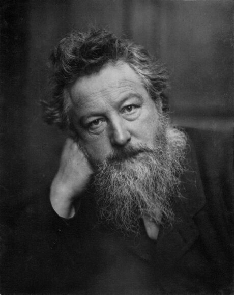
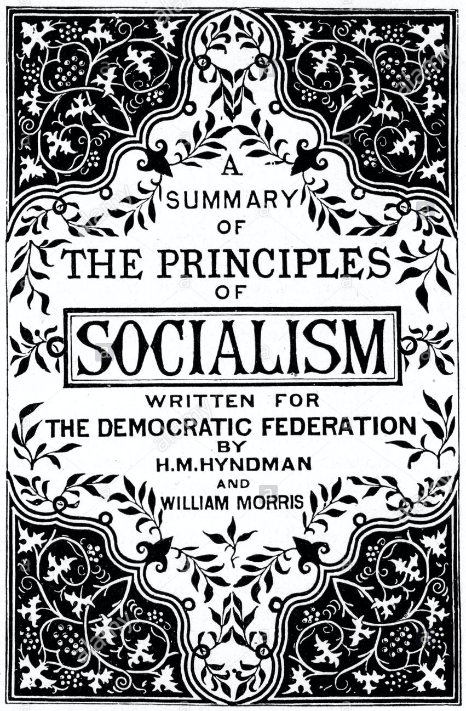
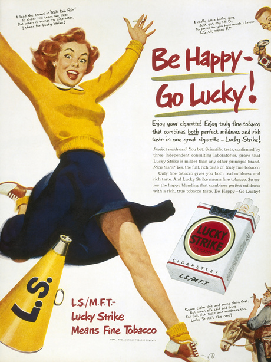
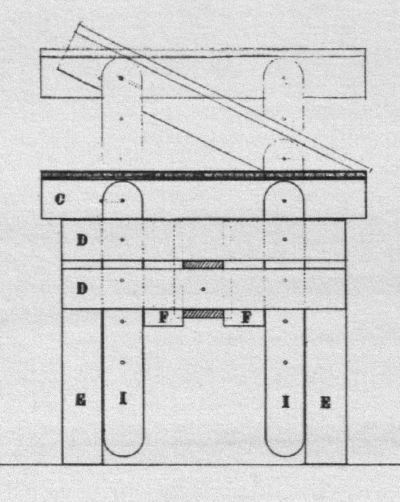
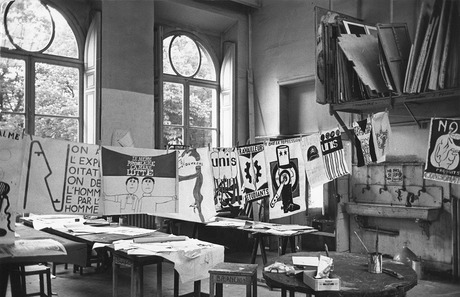
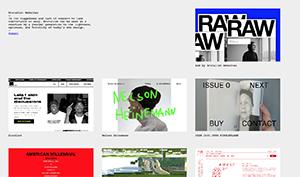

# Design éthique, éco-design, low-techs
> Real world, bullshit ? or die();

Il y a un Zeitgeist, un « esprit du temps », qui traverse les étudiant·es dans les écoles d’art. Chaque année, des mémoires, projets de recherche ou de diplômes arpentent irrégulièrement les questions de la responsabilité sociale, politique ou écologique du design. 

Que serait une approche éco-consciente du design ? Une approche inclusive, ouverte ? Quel peut être son impact social ou politique ? Comment –en tant que designer– agir en vue d’un « monde meilleur » ? 
Évidemment, nous voulons tous·tes un monde meilleur. Personne[^1] n’est contre l’égalité des sexes, la liberté de conscience, la fin des guerres, la liberté de circulation, l’auto-détermination des individus, la richesse qu’engendre la rencontre des cultures… 
[^1]: Presque…

Ce que cette introduction se propose de rapidement parcourir, c’est « en quoi avoir des bonnes intentions n’est pas suffisant » ; ou, formulé autrement : quel est le niveau de  cohérence auquel on peut prétendre en tant que designer.

### Miseà jour {.edit}

Deux raisons ont amené la proposition de cette introduction : la publication par Designers éthiques d’un [guide d’éco-conception de services numériques](https://eco-conception.designersethiques.org/guide/) et l’activité sur Twitter de [Design non éthique](https://twitter.com/designonethique). Deux positions qui s’opposent et qui ouvrent l’espace d’une dialectique féconde. 

Les réactions des étudiant·es aux tweets et aux textes de Design non éthique leur ont offert la possibilité d’une réponse qui éclaire la nature de leur critique et la radicalité de leur position. [Elle est à lire sur Medium](https://designonethic.medium.com/conversations-1-ae02afb6dbf9).

## Petits détours historiques

Quelques points saillants de l’histoire du design (<small>par un non historien… en cas d’erreur, [prévenez-moi](mailto:julien.bidoret@esad-pyrenees.fr)</small>) nécessaires pour mettre en perspective quelques unes des tensions idéologiques ou politiques qui ont animé cette histoire.

Le design apparaît avec l’avènement de la société industrielle et de la production en série, mais il n’est pas initialement une expertise aliénée à cette construction capitaliste du monde. [William Morris](https://fr.wikipedia.org/wiki/William_Morris)[^2], précurseur de la pratique et de la pensée du design pense le design comme un « art socialiste »[^3], et s’inquiète de la perte de repères face au « progrès » et aux évolutions des rapports de pouvoir économique dans la société. Il cherche à préserver les savoir-faire, le « fait-main » (l’_aura_, dirait Benjamin) dans la production d’objets et s’inscrit donc dans une critique frontale du développement du capitalisme.
[^2]:
[^3]:

> « (…) c'est perdre son temps que de vouloir exprimer l'étendue du mépris que peuvent inspirer les productions de cet âge bon marché dont on vante tellement les mérites. Il suffira de dire que le style bon marché est inhérent au système d'exploitation sur lequel est fondée l'industrie moderne. Autrement dit, notre société comprend une masse énorme d'esclaves, qui doivent être nourris, vêtus, logés et divertis en tant qu'esclaves, et que leurs besoins quotidiens obligent à produire les denrées serviles dont l'usage garantit la perpétuation de leur asservissement. »     
— « Useful work versus useless toil » (Travail utile contre labeur inutile), William Morris

Dans les année 20, le Bauhaus trouve dans l’art appliqué aux pratiques du design industriel une manière d’échapper à la pauvreté esthétique et au formatage prétendument imposé par la production en série, cherchant à faire se rejoindre art, artisanat, fonctionnalisme et production de masse. Malgré son progressisme affirmé, il n’échappe pas à un fort conservatisme sur certains aspects, notamment dans la place que peuvent y occuper les femmes. 

<figure>

<figcaption>
Digression : l’actrice Hedy Lamarr, désignée en son temps comme la « plus belle femme du monde », passionnée de design, a déposé en 1941 un brevet aujourd’hui utilisé dans la plupart des téléphones mobiles et à la base du WiFi. Suivez <a href="https://twitter.com/GHerstory">@GHerstory</a>, lisez <a href="https://www.lespressesdureel.com/ouvrage.php?id=7402&menu=0">Alexandra Midal</a> et <a href="http://regarderparlafenetre.fr/node/83">Vanina Pinter</a>.
</figcaption>
</figure>

Les années 30/40 voient l’avènement de la société de consommation. Le design graphique se met pleinement au service de l’industrie et du marché : Raymond Loewy dessine les logos de Shell, d’Exxon, de Lucky strike[^lucky], des biscuits LU, mais aussi des frigos, des trains, des voitures… C’est le début des études de marché. Le design devient « consumériste », inclus dans une logique liée à la problématique de distinction, au marketing, à la publicité – ainsi qu’aux relations publiques (lire [Propaganda](https://www.editions-zones.fr/livres/propaganda/), d’Edward Bernays). → Voir [Raymond Loewy, le designer du rêve américain](https://www.youtube.com/watch?v=zHGDe64HV_k) et allez plus loin sur [IndexGrafik](http://indexgrafik.fr/raymond-loewy/).

[^lucky]: 

> <big>« Pour un designer, la plus belle courbe, c’est celle des ventes. »</big>    
— Raymond Loewy

Dans les années 60 en Italie, Enzo Mari[^mari], Alessandro Mendini, Ettore Sottsass ouvrent les perspectives du _Radical design_. Leur idée est de rompre avec le modernisme, ennuyeux et déshumanisant. C’est l’émergence du _Controdesign_ (Antidesign), d’une démarche décorative et critique, des groupes [Memphis](https://fr.wikipedia.org/wiki/Groupe_de_Memphis) ou [Archizoom](https://fr.wikipedia.org/wiki/Archizoom_Associati)…
→ Toujours sur indexGrafik, [Ettore Sottsass](http://indexgrafik.fr/ettore-sottsass/)
[^mari]:  Extrait des _Autoprogettazione_ d’Enzo Mari, précurseurs de l’_open hardware_ ([télécharger](enzo-mari-autoprogettazione.pdf))

En 1964, [Ken Garland](http://indexgrafik.fr/ken-garland/) un groupe de 21 designers publient un manifeste intitulé « _First Things First_ ». Adressé aux designers graphiques, c’est un puissant appel à résister aux attraits de l’industrie publicitaire en faveur d’un travail socialement utile. Il sera repris et [augmenté en 2000](http://www.formes-vives.org/first-things-first), et à nouveau en 2014 puis en [2020](https://www.firstthingsfirst2020.org/).

1968, les étudiant·es  de l’Atelier populaire[^mai] de l’école des Beaux-Arts de Paris produisent les images que l’on connaît. S’ensuit une longue et vivante tradition du graphisme engagé en France, qui va de [Grapus](http://www.cnap.graphismeenfrance.fr/article/focus-comment-tu-ne-connais-pas-grapus),  à [Gérard Paris-Clavel](https://www.nepasplier.fr/), [Vincent Perrottet](https://vincentperrottet.com/), [Sébastien Marchal](https://sebastienmarchal.fr/sebastien-marchal/), [Formes vives](http://www.formes-vives.org/histoire/) ou [Groupe CCC](http://groupeccc.com/) et [Formes des luttes](http://www.formesdesluttes.org).

[^mai]:  

En 1971, Victor Papanek, designer austro-américain publie _Design for the real world, Human Ecology and Social Change_, manifeste d'une reconfiguration radicale, sociale et écologique du design, du point de vue de ses formes comme de ses objectifs.

> <big>« Dans un environnement visuellement, physiquement et chimiquement saccagé, le mieux que puissent faire les architectes, designers industriels, planificateurs etc. qui souhaitent aider l’humanité serait d’arrêter de travailler totalement. Dans toute pollution, ils sont au moins partiellement responsables. »</big>    
– Dans la préface, cité et traduit par [Design non éthique](https://medium.com/@designonethic/design-%C3%A9thique-mort-du-design-e488650ebc58)

Saut dans le temps pour clôre ce trop long détour. En 2015, signalant l’émergence de postures et d’esthétiques en rupture avec « la légèreté, l’optimisme et la frivolité du webdesign contemporain », [le site brutalistwebsites](https://brutalistwebsites.com/)[^brut] créé par le designer Pascal Deville dresse un panorama d’approches « rugueuses » du webdesign.
[^brut]: 

## Design aporéthique

L’histoire du design est faite de flux et de reflux, de réactions et de transgressions, de luttes et d’obéissances. Dans la préface de _Design pour un monde réel_, Papanek résumait « _l'indépassable contradiction[^aporie] du design, une discipline simultanément consciente d’être une part du problème sans pouvoir se résoudre à ne pas être une part de la solution_ »[^dd]. 
[^aporie]: Aporie : difficulté logique insoluble, paradoxe irrésolvable.
[^dd]: [_Sus à l’imposture, sus au design éthique, sus au design_](https://medium.com/@designonethic/design-%C3%A9thique-mort-du-design-e488650ebc58) – Design non éthique

Les designers graphiques sont des instruments au cœur des processus de médiation des savoirs, de transmissions d’information. Le design a pour rôle de rendre intelligibles et sensibles ces savoirs et informations. Leur puissance d’impact est néanmoins limitée. Comment, depuis leur situation, peuvent-ils agir sur le monde, sur la teneur, l’impact, l’usage des messages qu’ils font circuler ou des objets qu’ils contribuent à créer ? 

> <big>Graphic design will save the world
— right after rock and roll does.</big>    
— David Carson
    
## Designers éthiques

En mars 2021, un collectif de designers, Designers éthiques (« _\[…\] s’intéresse depuis 2016 aux enjeux du design numérique. Plus particulièrement, le collectif traite la manière dont les systèmes numériques peuvent amener à des dérives dans la relation aux usagers (externes ou internes) d’un service numérique._ »[^de]) publiait son [guide d’éco-conception de services numériques](https://eco-conception.designersethiques.org/guide/).
[^de]: [designers ethiques / le collectif](https://designersethiques.org/le-collectif/)

Depuis la naissance du design, on assiste de la part des designers à une prise de conscience des enjeux que porte leur champ vis à vis de ces questions ; sociales, politiques, écologiques. Aujourd’hui, dans le champ du numérique notamment (mais quel design n’est pas numérique ?), on assiste à de profondes remises en question des logiques économiques du design, de sa vassalisation au service des grandes industries de l’économie de l’attention, de sa soumission aux logiques du marché dont il est un des acteurs essentiels. Le métier de designer est soit impossible, soit complice d’une situation problématique (politiquement, écologiquement, etc.). Comment dépasser ce paradoxe ?

Cet intérêt de designers pour les questions écologiques ne masque-t-il pas un désir de se donner « bonne conscience » ? Est-il sincère, suffisant, efficient ?

L’appétit de certain·es designers pour ces thématiques ressemble parfois à une logique de niche, dans laquelle l’affichage importe plus que la réalité. Fruits bio importés par avion, [sites web non polluants](https://www.vw.ca/carbonneutralnet/en/) pour vendre des voitures…

Si le [Pôle design des services numériques](https://design.numerique.gouv.fr/) du gouvernement affirme s’attacher à concevoir « _des services publics numériques accessibles, inclusifs et humains_ » (qui est contre ?), leurs équipes s’organisent en « commandos », se lancent des « défis » et cherchent à proposer des services plus « désirables ». Ce langage, baigné dans les logiques néo-managériales du moment, semble parfaitement à même de transformer les citoyens en usagers et les services publics en _user experience_ finement marketée. On peut se demander si la remarquable et nécessaire intention initialement affirmée ne risque pas de produire un déplorable _branding_ politique[^polo].
[^polo]: Écrivant ces mots, je n’ai qu’un souhait : que ce projet de designers intégrés à l’action publique se perpétue, se développe et réussisse effectivement à améliorer la vie des citoyens et leurs usages des services numériques de l’État. 

La finesse et l’acuité du regard critique des designers, la justesse de leur positionnement dans cet écart aporétique consubstantiel à leur activité, la cohérence de leurs pratiques au regard de leurs idées sont à développer et à encourager. Les documents suivants sont donc proposées comme pistes de réflexion pour approfondir ces questions, en tâchant d’y analyser la sincérité des engagements comme la cohérence des propositions.

## Pistes de recherche

[Situer le numérique](https://designcommun.fr/cahiers/situer-le-numerique/)    
Un projet mené par [Gauthier Roussilhe](http://gauthierroussilhe.com/). _Situer le numérique_ cherche à permettre d’introduire et de comprendre les enjeux environnementaux du numérique. Design de [Timothée Goguely](https://timothee.goguely.com/). 

[Ethics for design](http://www.ethicsfordesign.com/)    
Un webdocumentaire réalisé par [Sylvain Julé](https://sylvain-jule.fr/), [Clément Le Tulle-Neyret](http://www.clement-ltn.com/) et Gauthier Roussilhe : parler de sa forme, de son fond, des thématiques abordées, de la manière dont elles sont abordées.  

[Designers éthiques](https://designersethiques.org/)    
Qui sont-ils ? Que veulent-ils ? Sincères ou opportunistes ? Idiots utiles ou acteurs influents ? Porteurs d’une pensée émergente et nécessaire ? Leur site réunit de nombreux articles, liens ou conférences sur les questions évoquées plus haut – et bien d’autres.

[There’s no such thing as ethical design](https://pbs.twimg.com/media/DMbFFjaWAAAHEae?format=jpg&name=900x900)     
Design non éthique est un groupe anonyme constitué en réaction aux ~~postures~~ propositions produites par Designers éthiques lors de leur premier évènement. Ils sont critiques, méchants, acerbes, mais parfaitement percutants. Remonter le [fil twitter](https://twitter.com/designonethique/), essayer de comprendre ce que sont leurs réserves vis à vis des approches « éthiques » du design. Lire aussi sur Medium, l’article déjà cité « [_Sus à l’imposture, sus au design éthique, sus au design_](https://medium.com/@designonethic/design-%C3%A9thique-mort-du-design-e488650ebc58) ».

[Low Tech Magazine](https://solar.lowtechmagazine.com) + [Low tech lab](https://lowtechlab.org) + [Une erreur de tech](http://www.gauthierroussilhe.com/fr/posts/une-erreur-de-tech)    
Que sont les « low-tech », permettent-elles d’envisager un autre rapport à la technologie ? Comment bien les qualifier et ne pas se tromper sur leur nature.

[Fin du monde, fin du design](http://findumonde-design.com/)     
Joyeux mémoire de fin d’étude de Paul Morin, sous la direction de Frank Burbage.

[A Designer’s Code of Ethics](https://deardesignstudent.com/a-designers-code-of-ethics-f4a88aca9e95)    
Un article / manifeste du designer Mike Monteiro, adressé aux étudiant·es en design.

