## Studios, fonderies, artistes & designers  

* <figure>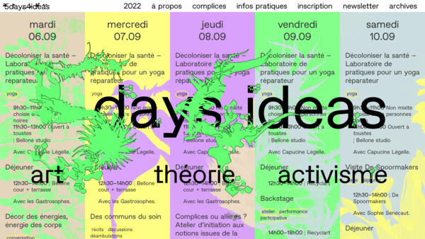</figure>
  [Loraine Furter](https://www.lorainefurter.net/en)
* <figure>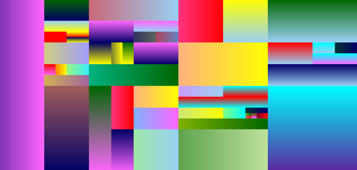</figure>
  [Rafael Rozendaal](https://www.newrafael.com/)
* <figure>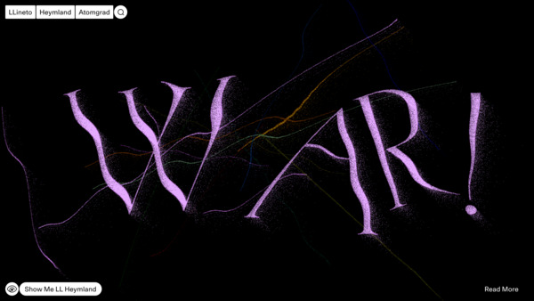</figure>
  [Lineto](https://lineto.com)
* <figure>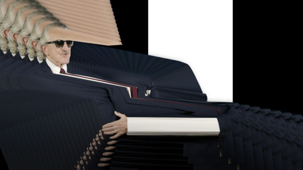</figure>
  [Dirk Koy](https://dirkkoy.com/)
* <figure>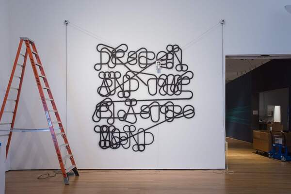</figure>
  [Jürg Lehni](https://juerglehni.com/)
* <figure>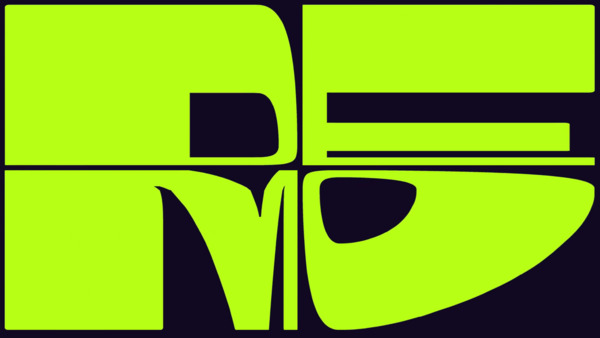</figure>
  [Studio Dumbar](https://studiodumbar.com/)
* <figure>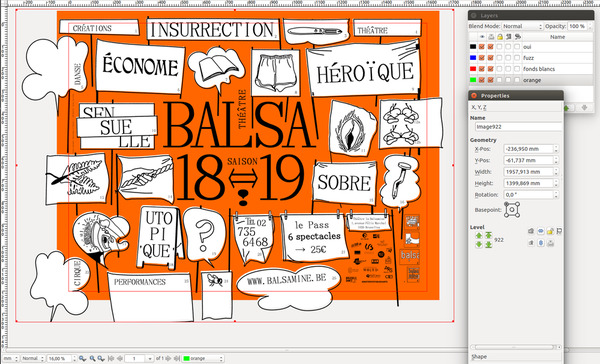</figure>
  [Open Source Publishing](http://osp.kitchen/)
* <figure>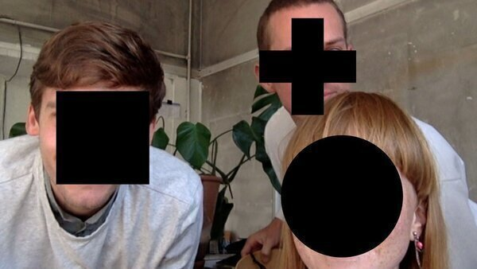</figure>
  [Moniker](https://studiomoniker.com/)
* <figure></figure>
  [Constant Dullaart](https://www.constantdullaart.com/) 
* <figure>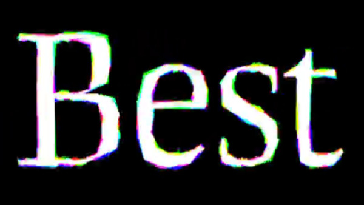</figure>
  [Letterror](https://letterror.com/)  
* <figure>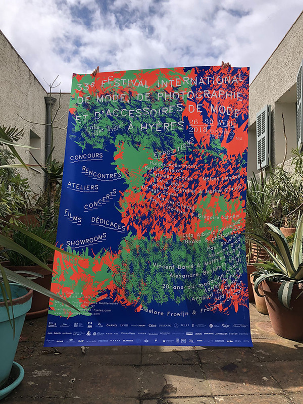</figure>
  [Luuse](https://www.luuse.io/)
* <figure>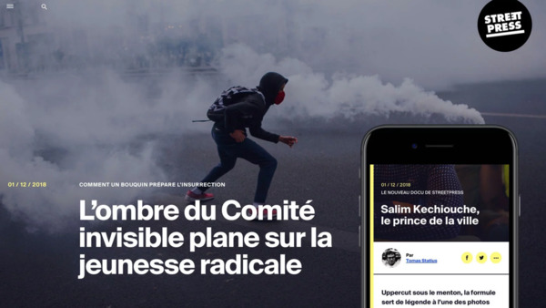</figure>
  [Upian](https://www.upian.com/)
* <figure>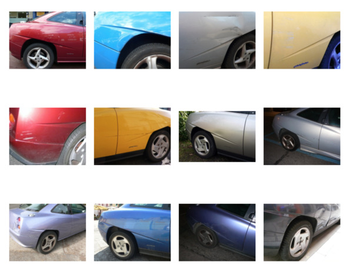</figure>
  [Daniel Eatock](https://eatock.com/)
* <figure>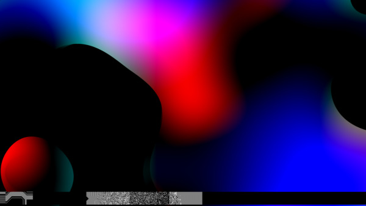</figure>
  [Leander Herzog](https://leanderherzog.ch/)
* <figure>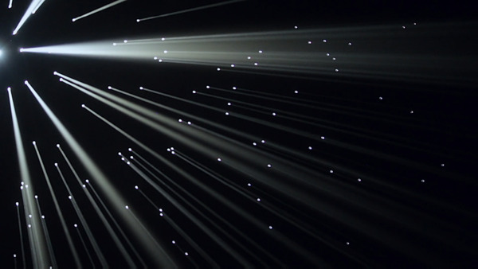</figure>
  [Béatrice Lartigue](https://www.beatricelartigue.com/) 
* <figure>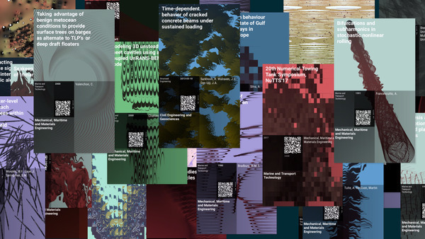</figure>
  [Jeroen Barendse](https://rndr.studio/)
* <figure>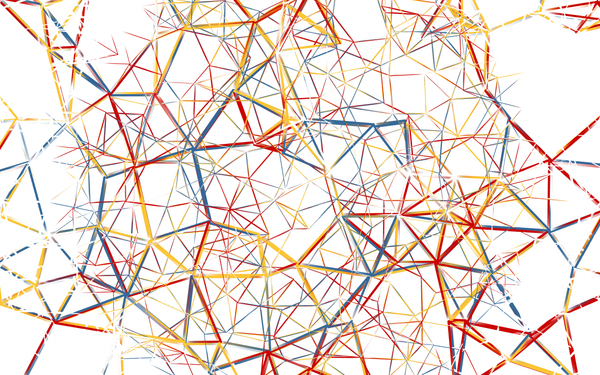</figure>
  [Casey Reas](https://reas.com/)
* <figure></figure>
  [Jodi](http://wwww.jodi.org/)
* <figure>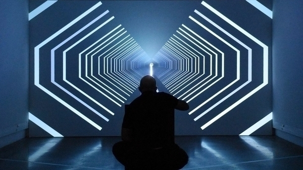</figure>
  [Chevalvert](https://chevalvert.fr/)
* <figure>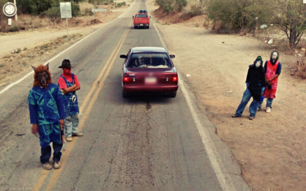</figure>
  [Jon Rafman](https://jonrafman.com/)
* <figure>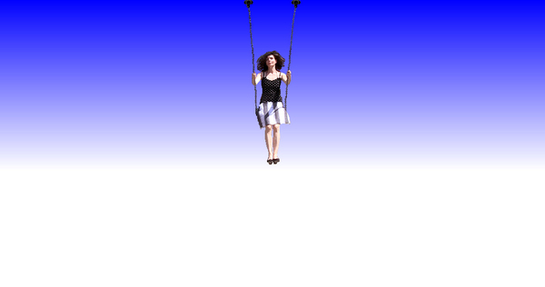</figure>
  [Olia Lialina](https://art.teleportacia.org/)
* <figure>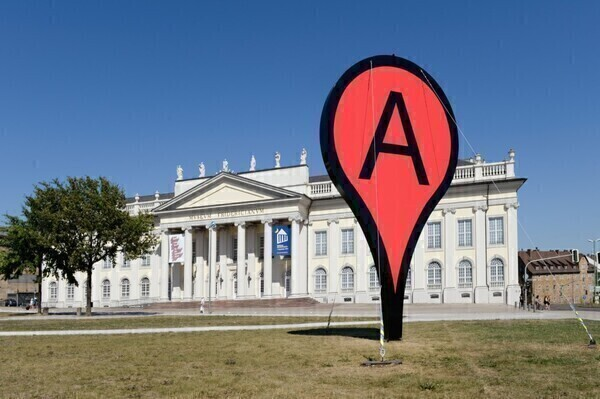</figure>
  [Aram Barthol](https://arambartholl.com/)
* <figure></figure>
  [Pinaffo – Pluvinage](https://pinaffo-pluvinage.com/)
* <figure>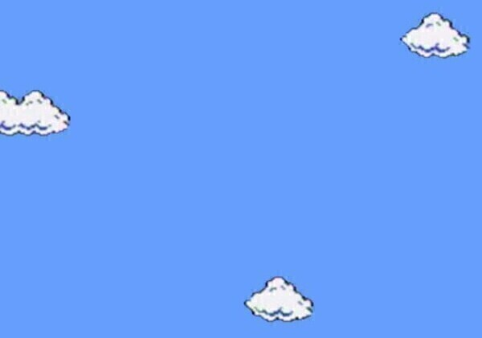</figure>
  [Cory Arcangel](https://coryarcangel.com/)
* <figure>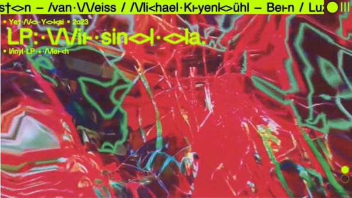</figure>
  [Johnson / Kingston](https://www.johnsonkingston.ch/)
* <figure>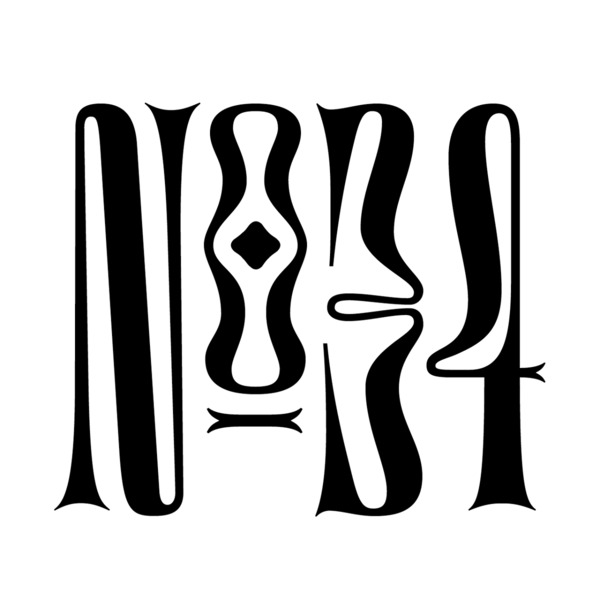</figure>
  [Future Fonts](https://www.futurefonts.xyz/)
* <figure>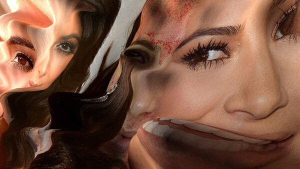</figure>
  [Gregory Chatonsky](http://chatonsky.net/)
* <figure>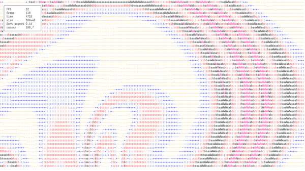</figure>
  [Andreas Gysin](https://ertdfgcvb.xyz/)
* <figure>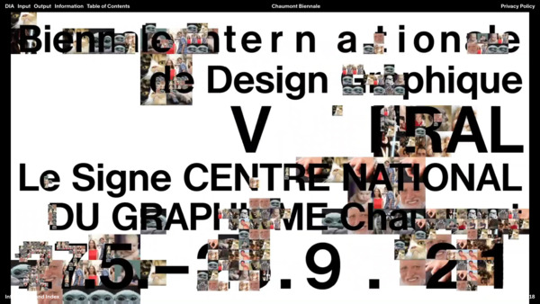</figure>
  [DIA Studio](https://dia.tv/)
* <figure>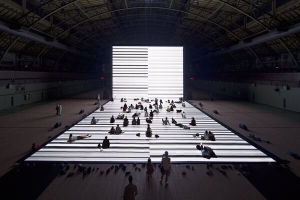</figure>
  [Rioji Ikeda](https://www.ryojiikeda.com/)
* <figure>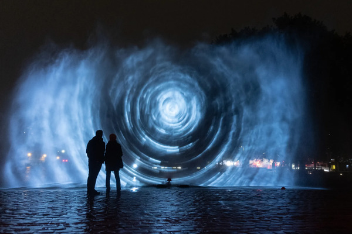</figure>
  [Joanie Lemercier](https://joanielemercier.com/)
* <figure>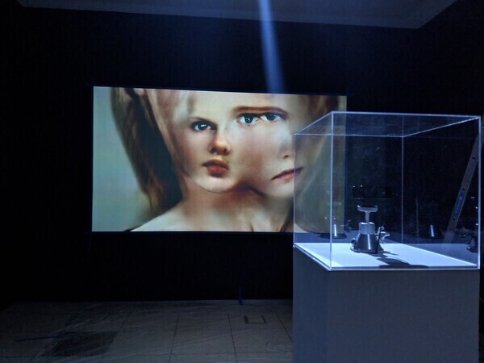</figure>
  [Mario Klingemann](http://www.quasimondo.com/)
* <figure>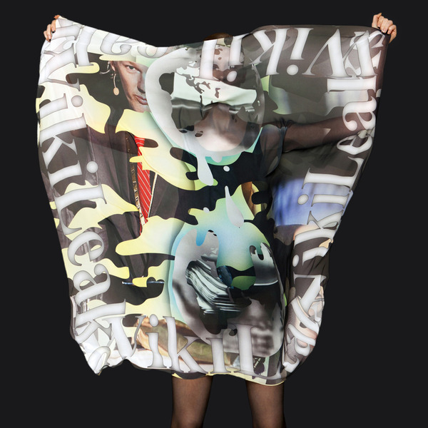</figure>
  [Metahaven](https://mthvn.tumblr.com/)
* <figure>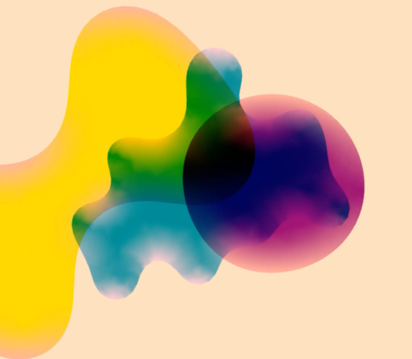</figure>
  [Zach Liebermann](http://zach.li/)
* <figure>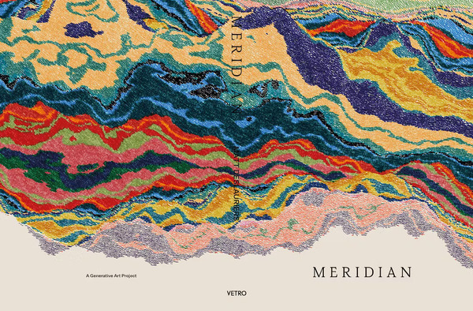</figure>
  [Matt DesLauriers](https://www.mattdesl.com/)
* <figure>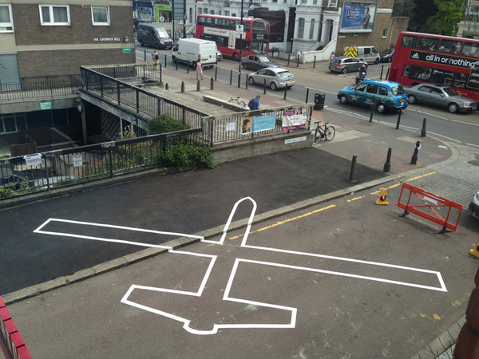</figure>
  [James Bridle](https://jamesbridle.com/)

## Espace collaboratif

Un « pad » (de l'anglais _paper pad_, bloc de papier) est un éditeur de texte collaboratif en temps réel, en ligne. Dans cet espace, chacun⋅e est invité⋅e à associer son nom à _une_ des figures évoquées ci-dessus.

[→ accéder au pad](https://pad.esad-pyrenees.club/p/culturesnum-2024){.bigbutton}

