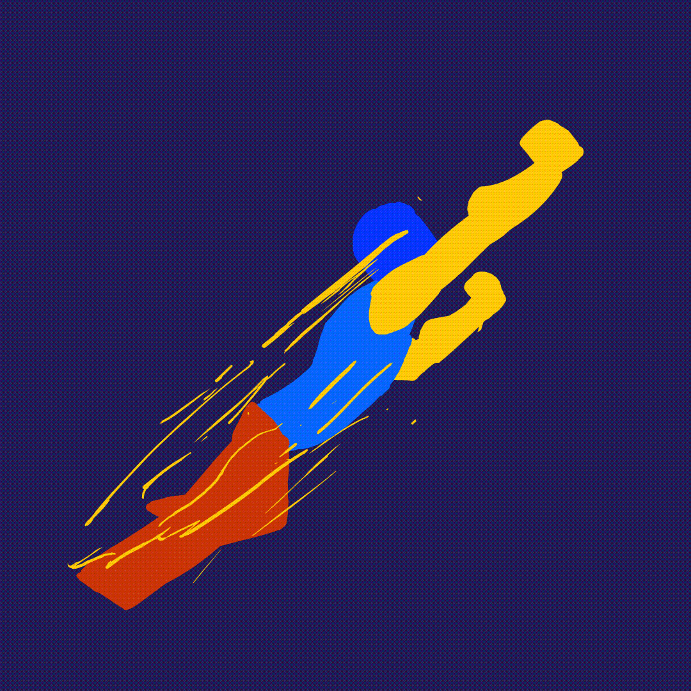

## Séquence non linéaire interactive
### Un site Web dont vous êtes le super héros
 
 

> La bibliothèque est illimitée et périodique. Si il y avait un voyageur éternel pour la traverser dans un sens quelconque, les siècles finiraient par lui apprendre que les mêmes volumes se répètent toujours, dans le même désordre qui répété deviendrait un ordre : l’Ordre. Ma solitude de se console à cette élégant espoir.

— Jorge-Luis Borges, La Bibliothèque de Babel, 1941

> Le jardin aux sentiers qui bifurquent est une image incomplete, mais non fausse, de l'univers tel que le concevait Ts'ui Pên. A la différence de Newton et de Schopenhauer, votre ancêtre ne croyait pas à un temps uniforme, absolu. Il croyait à des séries infinies de temps, à un réseau croissant et vertigineux de temps divergents, convergents et parallèles. Cette trame de temps qui s'approchent, bifurquent, se coupent ou s'ignorent pendant des siècles, embrasse toutes les possibilités. Nous n’existons pas dans la majorité de ces temps ; dans quelques-uns vous existez et moi pas ; dans d'autres, moi, et pas vous ; dans d'autres, tous les deux. Dans celui-ci, que m'accorde un hasard favorable, vous êtes arrivé chez moi; dans un autre, en traversant le jardin, vous m'avez trouvé mort ; dans un autre, je dis ces mêmes paroles, mais je suis une erreur, un fantôme.

— Jorge-Luis Borges, Le jardin aux sentiers qui bifurquent, 1941

> Imaginons un appareil de l’avenir à usage individuel, une sorte de classeur et de bibliothèque personnels et mécaniques. […] Un memex, c’est un appareil dans lequel une personne stocke tous ses livres, ses archives et sa correspondance, et qui est mécanisé de façon à permettre la consultation à une vitesse énorme et avec une grande souplesse. Il s’agit d’un supplément agrandi et intime de sa mémoire.

— Vannevar Bush, « [As we may think](https://www.theatlantic.com/magazine/archive/1945/07/as-we-may-think/303881/) », 1945

Le memex est un ordinateur analogique fictif décrit par le scientifique Vannevar Bush dans l'article As We May Think publié en 1945 dans la revue The Atlantic Monthly. Le nom est la contraction de memory extender (« gonfleur de mémoire »). 
Dans son article, Bush décrit un appareil électronique relié à une bibliothèque capable d'afficher des livres et de projeter des films. Cet outil est aussi capable de créer automatiquement des références entre les différents médias. Cette vision a directement influencé des pionniers de l'informatique moderne tels que Douglas Engelbart et a posé les fondations de l'hypertexte créé par Ted Nelson, à l'origine du World Wide Web. 

— https://fr.wikipedia.org/wiki/Memex

