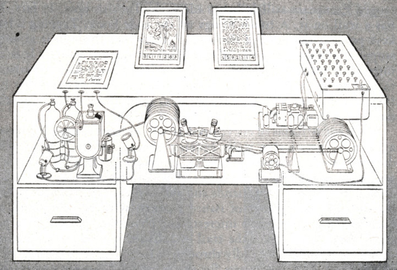
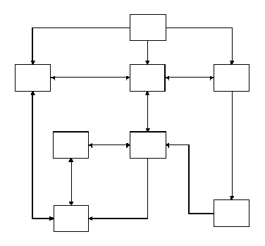
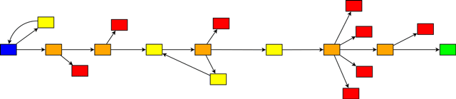
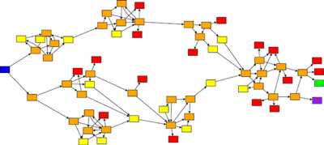
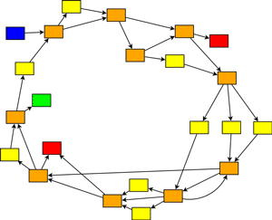

_Hypertext superhéro_ vous propose de concevoir, d’écrire, de réaliser et de mettre en ligne une “séquence non linéaire interactive” ; ou en d’autres termes:

## Un site Web dont vous êtes le (super) héros {#introduction}
 
 

## Bifurcations contextuelles

> La bibliothèque est illimitée et périodique. Si il y avait un voyageur éternel pour la traverser dans un sens quelconque, les siècles finiraient par lui apprendre que les mêmes volumes se répètent toujours, dans le même désordre qui répété deviendrait un ordre : l’Ordre. Ma solitude de se console à cette élégant espoir.

— Jorge-Luis Borges, La Bibliothèque de Babel, 1941

> Le jardin aux sentiers qui bifurquent est une image incomplete, mais non fausse, de l'univers tel que le concevait Ts'ui Pên. A la différence de Newton et de Schopenhauer, votre ancêtre ne croyait pas à un temps uniforme, absolu. Il croyait à des séries infinies de temps, à un réseau croissant et vertigineux de temps divergents, convergents et parallèles[^cat]. Cette trame de temps qui s'approchent, bifurquent, se coupent ou s'ignorent pendant des siècles, embrasse toutes les possibilités. Nous n’existons pas dans la majorité de ces temps ; dans quelques-uns vous existez et moi pas ; dans d'autres, moi, et pas vous ; dans d'autres, tous les deux. Dans celui-ci, que m'accorde un hasard favorable, vous êtes arrivé chez moi; dans un autre, en traversant le jardin, vous m'avez trouvé mort ; dans un autre, je dis ces mêmes paroles, mais je suis une erreur, un fantôme.

— Jorge-Luis Borges, Le jardin aux sentiers qui bifurquent, 1941

[^cat]:

## Hypertextualités, interactivité

> Imaginons un appareil de l’avenir à usage individuel, une sorte de classeur et de bibliothèque personnels et mécaniques. \[…\] Un memex, c’est un appareil dans lequel une personne stocke tous ses livres, ses archives et sa correspondance, et qui est mécanisé de façon à permettre la consultation à une vitesse énorme et avec une grande souplesse. Il s’agit d’un supplément agrandi et intime de sa mémoire.

— Vannevar Bush, « [As we may think](https://www.theatlantic.com/magazine/archive/1945/07/as-we-may-think/303881/) », 1945

Le memex est un ordinateur analogique fictif décrit par le scientifique Vannevar Bush dans l'article As We May Think publié en 1945 dans la revue The Atlantic Monthly. Le nom est la contraction de memory extender (« gonfleur de mémoire »). 
Dans son article[^anthony], Bush décrit un appareil électronique relié à une bibliothèque capable d'afficher des livres et de projeter des films. Cet outil est aussi capable de créer automatiquement des références entre les différents médias. Cette vision a directement influencé des pionniers de l'informatique moderne tels que Douglas Engelbart et a posé les fondations de l'hypertexte créé par Ted Nelson, à l'origine du World Wide Web. 

[^anthony]: [Traduit en français](http://www.softphd.com/these/traduction/vannevar-bush-as-we-may-think) par Anthony Masure 🙏

— https://fr.wikipedia.org/wiki/Memex

Ingénieur états-unien, inventeur et pionnier de l'informatique, Douglas Engelbart est célèbre pour avoir inventé la souris, pour ses travaux sur le développement de l'interface homme-machine et pour avoir développé l’hypertexte, les réseaux informatiques et les premières interfaces graphiques (GUI). Dans sa [Mother of All Demos](https://www.youtube.com/watch?v=B6rKUf9DWRI), en 1968, il donne une visio-conférence dans laquelle il annonce et montre pour la première fois ce qui allait devenir le paradigme de nos ordinateurs contemporains : un système multimédia doté d’un clavier, d’une souris et d’une interface graphique à fenêtres, accessible et contrôlable à distance.

Theodor Nelson est un sociologue américain, pionnier de l'histoire des technologies de l'information. Il est considéré comme l'inventeur du terme _hypertexte_ en 1965. Développant les hypothèses élaborées par Vanevar Bush ou [Paul Otlet](https://fr.wikipedia.org/wiki/Paul_Otlet)[^otlet], il imagina le projet Xanadu, système d'information permettant le partage instantané et universel de données informatiques. Ce système, jamais complètement développé, fut rattrapé et dépassé par le Web, mais en fut un précurseur et un inspirateur.

[^otlet]: Aller beaucoup plus loin avec [HyperOtlet](https://hyperotlet.hypotheses.org/), un projet de recherche mené notamment par [Arthur Perret](https://twitter.com/arthurperret) et [Olivier Le Deuff](https://twitter.com/neuromancien/)

## Écritures hypertextuelles 
Les écritures hypertextuelles visent un dépassement des contraintes de la linéarité du texte écrit. Notions clés : non-linéarité, serendipité, bifurcations, fragments, liens, associations…

> Nous désignerons par littérature numérique toute forme narrative poétique qui utilise le dispositif informatique comme médium et met en œuvre une ou plusieurs propriétés spécifiques à ce médium.
— Philippe Bootz, [Leonardo/Olats](http://www.olats.org/livresetudes/basiques/litteraturenumerique/1_basiquesLN.php)

[Désordre](http://desordre.net), site écrit, conçu et réalisé par Philippe De Jonckheere[^pdj], « dans lequel la question des grandes théories de l'information ne sera pas abordée, pas davantage celle de savoir si la photographie est un art à part entière au même titre que la peinture. Il y est parfois question de sexe, de sodomie, de fellation, de gros seins, de pubis et autres joyeusetés, qui font beaucoup de bien aux statistiques du site que nous ne consultons jamais. En revanche nous sommes au regret de vous dire que pas plus que vous nous ne connaissons la recette de l'omelette norvégienne. Le moteur de recherche a un fonctionnement parfaitement erratique et ne vous aidera en rien, au contraire. »

[^pdj]: Aller plus loin avec Marie Richeux dans l’épisode [_Un net désordre_](https://www.franceculture.fr/emissions/pas-la-peine-de-crier/un-net-desordre) de _Pas la peine de crier_ ou _Tentatives d’autoportrait en html_, un [entretien avec Christèle Couleau et Pascale Hellégouarc’h](https://journals.openedition.org/genesis/518).

L’attracteur de Lorenz est une structure fractale correspondant au comportement à long terme de l'oscillateur de Lorenz. L'attracteur montre comment les différentes variables du système dynamique évoluent dans le temps en une trajectoire non périodique. 
— [fr.wikipedia.org](https://fr.wikipedia.org/wiki/Attracteur_de_Lorenz)

L' « effet papillon » est une expression qui résume une métaphore concernant le phénomène fondamental de sensibilité aux conditions initiales de la théorie du chaos. La formulation exacte qui en est à l'origine fut exprimée par Edward Lorenz lors d'une conférence scientifique en 1972, dont le titre était : « Le battement d'ailes d'un papillon au Brésil peut-il provoquer une tornade au Texas ? »
— [fr.wikipedia.org](https://fr.wikipedia.org/wiki/Effet_papillon)

> À sa façon, ce livre est plusieurs livres mais en particulier deux livres. Le lecteur est invité à choisir entre les deux possibilités suivantes : 
Le premier livre se lit comme se lisent les livres d'habitude et il finit au chapitre 56, là où trois jolies petites étoiles équivalent au mot fin. Après quoi, le lecteur peut laisser tomber sans remords ce qui suit.
Le deuxième livre se lit en commençant au chapitre 73 et en continuant la lecture dans l'ordre indiqué à la fin de chaque chapitre. En cas d'incertitude ou d’oubli il suffira de consulter la liste ci-dessous.
— Julio Cortazar, Marelle

> Désirez-vous connaître l’histoire des trois alertes petits pois ?   
– Raymond Queneau, [Conte à votre façon](https://oulipo.net/fr/contraintes/conte-a-votre-facon)

## Écritures numériques

Fondateur d’[UbuWeb](https://ubuweb.com/), Kenneth Goldsmith expérimente, à la fois en tant qu’écrivain, enseignant, poète et artiste, les mutations imposées au texte par le numérique. [^kg]

[^kg]: Pour aller plus loin, lire à propos de Kennth Goldsmith sur [ArtPress](https://www.artpress.com/2018/05/07/kenneth-goldsmith-lecriture-sans-ecriture-du-langage-a-lere-numerique/) et de son ouvrage _Théorie_ sur [jbe-books](https://www.jbe-books.com/products/lecriture-sans-ecriture-by-kenneth-goldsmith)

« Recopiez-moi cinq pages »    
« Theorize your digital existence. »    
« Where technology leads, literature follows. »     
« I used to be an artist ; then I became a poet ; then a writer. Now when asked, I simply refer to myself as a word processor. »    
« A contemporary poet is someone who doesn’t write poems. »    
— Kenneth Goldsmith, suite de statuts Facebook.

À propos de *Théorie* de Kenneth Goldsmith, écouter [François Bon](https://www.tierslivre.net/spip/spip.php?article4016)

## Objectif

Le projet sera réalisé sous la forme d’un site web : ensemble de pages / d’écrans, consultables dans un navigateur web et mis en ligne sur un serveur.

> <big>In today’s highly commercialized web of multinational corporations, proprietary applications, read-only devices, search algorithms, Content Management Systems, WYSIWYG editors, and digital publishers, it becomes an increasingly radical act to hand-code and self-publish experimental web art and writing projects. — J.R. Carpenter </big>

Les contraintes et difficultés techniques doivent être envisagées comme un espace de potentialité (immense) plutôt qu’une limitation. Si l’approche favorisée au sein de l’atelier est celle de la production “manuelle” de pages web (HTML, CSS, javascript), toute stratégie oblique visant à exploiter la diversité des espaces de publication en ligne (pads, réseaux sociaux, documents Google, services de publication divers) de manière pertinente par rapport au projet est bienvenue.

### Livrables 

* Note d’intention textuelle
* Storyboard sommaire 
* Représentation arborescente (diagramme permettant de visualiser les liens entre chaque page et les processus de navigation – [voir ici](#arborescences-hypertextuelles))
* *Wireframes* (ensemble de maquettes du squelette des pages, hiérarchiquement structuré)
* Site web (URL)

### Évaluation

Seront appréciés : l’inventivité et l’audace dans la construction hypertextuelle ;
la pertinence des choix graphiques en regard du projet ;
la cohérence de l’univers graphique produit ;
ni la “qualité” ni la quantité de code ne sont des critères d’évaluation.

### Contraintes 
* Séquence : construire et articuler un propos par la succession d’écrans ou de pages.  
* Non linéaire : permettre différentes expériences.   
* Interactive : laisser l'utilisateur déterminer son propre parcours.

### Méthode
* Narration / ou pas.
* Avoir un parti pris graphique : choisir un médium, ou un ensemble de médiums.
* Créer un univers graphique cohérent : maximalisme, minimalisme, ornemental, brutaliste, corporate…
* Déterminer un corpus ; un ensemble structuré (pas forcément homogène) de contenus à associer

### Médiums
* Texte : phrases, dialogues, lettres, cut-up, copier/coller…
* Image : photo, gifs, dessins, documents, traces…
* Vidéo : vidéo, gif, _found-footage_, YouTube…
* Son: voix, musique, field-recording, vocodeur…

## Références {#references}

### Webdocs, vidéo
* [Do Not Track](https://donottrack-doc.com/fr/), webdocumentaire de Brett Gaylor, upian + arte + ONF/NFB
* [République](https://republique-le-film.fr/fr/), un film interactif sur mobile de [Simon Bouisson](http://www.simonbouisson.com/)
* [Wei or die](http://weiordie.simonbouisson.com/moduleFR/public/), un autre film interactif de Simon Bouisson
* Pour d’autres références, lire une [histoire approximative](../../references/webdocumentaire/) et bien très brève de la forme du webdocumentaire, et parcourir le [panthéon personnel](http://www.benhoguet.com/hall-of-fame/) de Benjamin Hoguet.

### Narration hypertextuelle
* [My Boyfriend Came Back from the War](http://www.teleportacia.org/war), un projet de Net art d’Olia Lialina (1996)
* [Karrik – the Game](http://karrik-game.velvetyne.fr/), une narration non-linéaire éditée par Velvetyne Type Foundry
* [Phallaina](http://phallaina.nouvelles-ecritures.francetv.fr/), une bande defilée (linéaire…)
* [Jusqu’ici](http://jusqu-ici.com/), une déambulation interactive et poétique de Vincent Morrisset
* [L’infiltré](http://www.phonestories.me/fr/infiltre), un jeu/enquête de docu/fiction politique en temps réel
* [The Wilderness downtown](http://www.thewildernessdowntown.com/), un film interatif basé sur "We Used To Wait" du groupe Arcade Fire
* [Un thread Twitter](https://twitter.com/FibreTigre/status/1089457924030767104) de @FibreTigre sur le “narrative design”, l’écriture à non linéaire et à choix multiples dans le champ du jeu (vidéo, de rôle, etc.)

### Expérimentations hypertextuelles graphiques, artistiques et conceptuelles
* [La librairie de Babel](https://libraryofbabel.info/) en vrai (ou presque)
* [wwwwwwwww.jodi.org](http://wwwwwwwww.jodi.org/), le site de Jodi, pour une plongée en apnée visuelle et hypertextuelle
* [Déprise](http://deprise.fr), un récit interactif de Serge Bouchardon et Vincent Volckaert, 2010 

### Miscellanées, écritures numériques singulières
* Le [Désordre](http://desordre.net/) ! Un projet d’écriture, de photographie, d’images et de sens mené par Philippe de Jonckherre.
* [Magasin général](http://magasin-general.fr/), compagnon webdocumentaire du livre de David Dufresne, avec Antonin Lhôte + upian
* Les [antilivres](https://www.antilivre.org/#manifeste) d’abrüpt

### Jeux scène alternative itch.io
* [A Desktop Love Story](https://alienmelon.itch.io/lovestory), jeu basé sur le système de fichiers de votre ordinateur, une histoire d’amour entre deux fichiers. Voir aussi [Foldscape](https://porpentine.itch.io/foldscape).
* [A fine night](https://twitter.com/AFineNight), une fiction interactive racontée à l’intérieur de Twitter. Voir aussi [@wnd_go](https://twitter.com/wnd_go), sur Twitter toujours, construit grâce à de multiples comptes.
* [TimeTossed](http://slimedaughter.com/games/twine/timetossed/), un des nombreux jeux/fictions interactives de [Popertine](http://slimedaughter.com/), construit à partir de formulaires Google
* Toujours de Popertine, [*Howling dogs*](http://slimedaughter.com/games/twine/howlingdogs/) à la structure narrative fractale (en anglais)
* [Anxiety](https://ncase.itch.io/anxiety), un des nombreux jeux interactifs qu’on peut trouver sur [itch.io](https://itch.io/)

### Écritures sociales
* [Otherly](https://www.instagram.com/otherlyseries/), un compte Instagram qui présente 7 documentaires courts sur des parcours de femme, personnes non-binaires et queer. 
* Sur Twitter, [une histoire dont tu es le héros/l'héroïne](https://twitter.com/Super_Marabout/status/1238805359558623232) par [Mårābøüt](https://twitter.com/Super_Marabout).
* [3ème droite](https://twitter.com/3emeDroite/status/910050115989229568), un thriller sur Twitter, par @F_descraques.
* [60 secondes](https://www.facebook.com/60secondes/), une série produite par Arte. 73 vidéos d’une minute diffusées sur Facebook en 2011, racontant la vie mouvementée de Fantille.

## Exemples

La [section exemples](../../exemples/) du site propose de nombreux éléments liés aux logiques hypertextuelles et interactives. Si la plupart des propositions impliquent du code JavaScript, cela n’est pas du tout indispensable à la réalisation de ce projet.

* [Un conte à votre façon](../../exemples/conte-a-votre-facon/) réinterprète le texte à choix multiples de Raymond Queneau.
* [Dialogue interactif à choix multiples](../../exemples/dialogue/) est un exemple minimal basé sur une logique de choix multiples pour l’utilisateurs qui induisent le développement d’une branche (ou l’autre) d’un récit.
* [Navigation javascript asynchrone](../../exemples/ajaxpanels/) offre la possibilité de changer d’écran sans changer de page, permettant notamment de ne pas couper un son, ou d’exécuter du javascript au chargement de la nouvelle page/écran.
* [Navigation javascript](../../exemples/panels/) est une version plus simple de l’hypothèse ci-dessus.
* [Accumulation d’arrière-plans](../../background-accumulation/) permet à une page de réagir aux choix successifs du visiteur en superposant des images d’arrière-plan.
* [Image suivante au click](../../exemples/image-suivante-au-clic/), permet d’afficher un élément (présent dans la page mais masqué) quand l’utilisateur clique.
* Deux exemples de dialogue : un [interactif](../../exemples/en-attendant-godot/) (au clic) et l’autre [automatique](../../exemples/en-attendant-godot/-sms) (sans clic) ; tous deux linéaires.
* [Navigation aléatoire contrôlée par cookie](http://localhost/web/pages/exemples/cookie-nav/) permet de parcourir aléatoirement un ensemble de pages HTML sans jamais revisiter la même.

## Outils {#outils}
* **[Twine](https://twinery.org/)** est un outil open-source pour raconter des histoires interactives et non linéaires. Voir les [tutos vidéos](https://www.youtube.com/playlist?list=PLFGDV4C3TmMGzuRN9In6MQducHbxqwTWI) produits par le studio Tourmaline.  
* [txti.es](http://txti.es/) ou [telegra.ph](http://telegra.ph/) sont des espaces de publication anonyme en ligne sans inscription
* [Tumblr](https://www.tumblr.com/), un des nombreux services qui permettent de publier textes, images, sons, vidéos “gratuitement” tout en maîtrisant complètement l’aspect visuel du site
* [Ink](https://www.inklestudios.com/ink/), un langage de balisage pour créer des histoires interactives ou des jeux (principalement) textuels (un peu complexe…)

## Arborescences hypertextuelles

Extraits de [Standard Patterns in Choice-Based Games](https://heterogenoustasks.wordpress.com/2015/01/26/standard-patterns-in-choice-based-games/)

