#  Index

  Capture d'écran d'une fenêtre de l'invite de commande de Microsoft Windows montrant une liste de répertoires.

> <big>Large companies find HTML & CSS frustrating “at scale” because the web is a fundamentally anti-capitalist mashup art experiment, designed to give consumers all the power.\[…\] More accurately a Library Science driven experiment, I suppose…</big>[^fr]   
— Miriam Suzanne

[^fr]: Les grandes entreprises trouvent HTML & CSS frustrant dans son industrialisation parce que le web est fondamentalement une expérience artistique hybride et anticapitaliste, conçue pour donner tout le pouvoir aux consommateurs.  Ou plus exactement, une expérience menée par la science documentaliste, je suppose… 

Ce [tweet](https://web.archive.org/web/20220130195520/https://twitter.com/TerribleMia/status/1198706002419310592) de [Miriam Suzanne](https://www.miriamsuzanne.com/) signale deux notions fondamentales du web. Dans sa plus simple expression (le HTML et CSS), le web est un projet aux ambitions “[communalistes](https://fr.wikipedia.org/wiki/Communalisme)” mené par des bibliothécaires.

Le Web est né comme un projet _vague mais excitant_, de [système de gestion de l’information](https://www.w3.org/History/1989/proposal.html). Le partage[^letsshare] et la mise en accessibilité de la connaissance y sont des principes fondamentaux.

[^letsshare]: 

Pour [Wikipédia](https://fr.wikipedia.org/wiki/Sciences_de_l%27information_et_des_biblioth%C3%A8ques), les « Sciences de l'information et des bibliothèques » ont pour objet de permettre « de retrouver l'information pertinente et éviter le chaos documentaire ». Les notions de classification et d’indexation en sont des moteurs centraux.

Dans le contexte du web, la notion d’indexation est également centrale. L’index est à la fois la page par défaut d’un site (`index.html`) et le cœur des moteurs de recherche qui nous _indexent_ le web afin de nous permettre d’accéder à son contenu. 

En 2024, l’efficacité de ces moteurs de recherche (et Google au premier plan, qui concentre 84% des recherches en France) est en train de diminuer. Depuis longtemps, de nombreux sites ne sont construits que pour optimiser leur positionnement dans les listes de résultats des moteurs (on qualifie ces approches de SEO, _Search engine optimization_). Mais l’avènement de l’« IA » générative démultiplie le nombre de ces contenus, qui deviendront rapidement indécelables pour les quelques mécanismes de contrôle encore à l’œuvre. L’usage de l’IA générative par les moteurs, au delà des moments où il [prête à sourire](https://www.theguardian.com/technology/2023/nov/23/does-australia-exist-bing-search-no-bluesky-mastodon), promet également un pourrissement de nos capacités à rechercher de l’information via les grands moteurs[^synth].

Il semble donc être à la fois temps d’explorer l’usage de nouveaux moteurs (DuckDuckGo, Startpage, SearX ; tous trois plus orientés sur la confidentialité des recherches que sur de nouvelles manières d’indexer l’information) et de dresser nos propres index. Le web nous invite à la fois à publier notre propre contenu, mais aussi à créer des liens vers d’autres contenus. À partager à la fois notre propre production et à organiser notre propre curation.

[^synth]: Lire [Du Web sémantique au Web synthétique](https://affordance.framasoft.org/2023/10/du-web-semantique-au-web-synthetique/) par Olivier Ertschzeid.

## Le projet
Dans le contexte de ce projet, la notion d’_index_ résonne avec celle de _homepage_, ou _page perso_. Soit un lieu qui classifie, organise, structure, hiérarchise et partage vos connaissances et vos références.

Sans même devoir créer plusieurs pages[^wp], de la simple liste non ordonnée à la grille ou même au tableau, les possibilités qu’offrent HTML et CSS pour structurer un ensemble d’éléments sont nombreuses.

[^wp]: Wikipédia, haut de lieu de la classification et de l’indexation contient [une page de liste de listes de listes](https://en.wikipedia.org/wiki/List_of_lists_of_lists).

L’objectif est de créer sa propre page d’index sur le site des Ateliers web. Elle sera accessible depuis les [archives de l’atelier](../../../archives/2024-2025/archives/2dgm/), dans un sous-dossier à votre nom.

Son premier enjeu est de partager votre univers culturel. Elle consistera donc en une liste de références classées par thématique : design, littérature, cinéma, musique…

## Quelques exemples

Une grille responsive

Une liste scrollable

Un grand désordre

Un tableau bien organisé

## Quelques références

<ul>
<li><figure><a href="https://www.webdesignmuseum.org/web-design-history/world-wide-web-virtual-library-1991">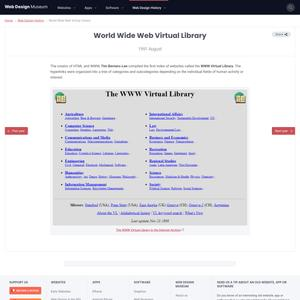</a><figcaption>World Wide Web Virtual Library </figcaption></figure></li>
<li><figure><a href="https://www.webdesignmuseum.org/web-design-history/yahoo-1994">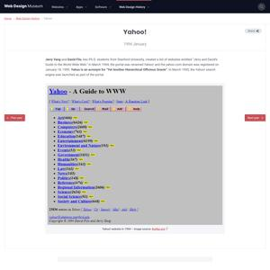</a><figcaption>Yet Another Hierarchical Officious Oracle</figcaption></figure></li>
<li><figure><a href="https://www.dmoz.co.uk/">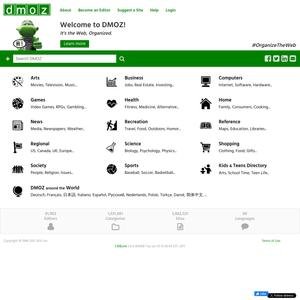</a><figcaption>DMOZ </figcaption></figure></li>
<li><figure><a href="https://craigslist.org/">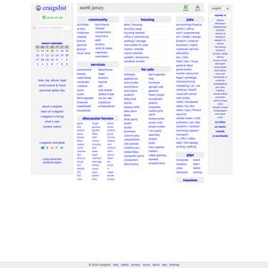</a><figcaption>craigslist</figcaption></figure></li>

<li><figure><a href="https://eatock.com/">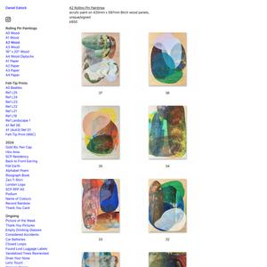</a><figcaption>Daniel Eatock </figcaption></figure></li>
<li><figure><a href="https://www.indexhibit.org/">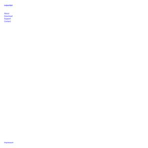</a><figcaption>Indexhibit </figcaption></figure></li>

<li><figure><figcaption>Cyberfeminism Index </figcaption></figure></li>
<li><figure><a href="https://typical-organization.com/chapter-01/">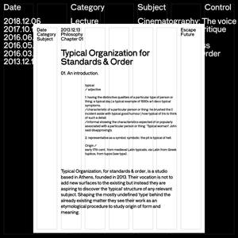</a><figcaption>Typical Organization for Standards & Order </figcaption></figure></li>
<li><figure><a href="http://lastbutnotliste.com/">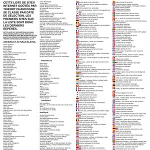</a><figcaption>Last but not Liste  </figcaption></figure></li>
<li><figure><figcaption>Catalogtree</figcaption></figure></li>
<li><figure><a href="https://desordre.net/">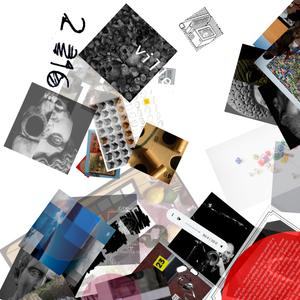</a><figcaption>Le Désordre</figcaption></figure></li>
<li><figure><a href="https://simplifier.neocities.org/">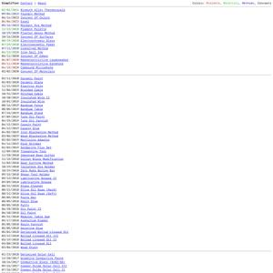</a><figcaption>Simplifier </figcaption></figure></li>
<li><figure><a href="https://paolaristoldo.com/">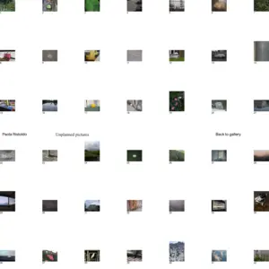</a><figcaption>paolaristoldo </figcaption></figure></li>
<li><figure><a href="http://leeraewalsh.com/">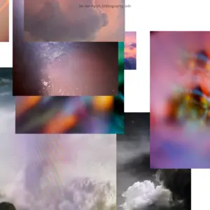</a><figcaption>lee rae walsh </figcaption></figure></li>
</ul>

