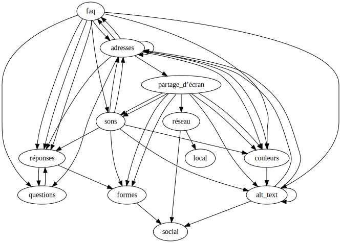

#  Local Area Social Network

Ce temps-fort sera mené avec Claire D., Thelma D., Lisa H., Justine I., Lucie G-M., Lalie H., Marlyne C., Alix B-J., Talitha P., et Paulin S. Il utilisera les services de [neocities.org](https://neocities.org). Les 
résultats du temps-fort seront visibles en ligne depuis [localarea.neocities.org](https://localarea.neocities.org/).

Un temps fort similaire a été mené sur [trois jours en 2022](2022).

## Introduction

Deux jours de temps-fort qui s’attachent à expérimenter la possibilité d’une ré-appropriation des espaces de publication en ligne, hors des plateformes, en circuit court, adressé à celles et ceux que l’omniprésence des médias sociaux numériques enthousiasme, intrigue ou effraie et qui souhaitent explorer d’autres logiques de publication, tant du point de vue de leur forme que de leur contexte d’apparition ou de leur mode de création.

<details>
<summary>
/ Julien Bidoret
</summary>
<p markdown=1>[Designer et développeur web](https://accentgrave.net), enseignant en [webdesign et en Écritures numériques](https://ateliers.esad-pyrenees.fr) dans le [pôle Nouveaux médias de l’ÉSAD Pyrénées](https://nm.esad-pyrenees.fr). [Bel Ordinaire](https://belordinaire.agglo-pau.fr/), [accès)s(](https://acces-s.org/), [Ypsilon](http://www.ypsilonediteur.com/), [Wildproject](https://wildproject.org/), [TimeLure](https://chronologie.delure.org/), [PrePostPrint](https://prepostprint.org/), [Radical webdesign](https://radicalweb.design/). [accentgrave.net](https://accentgrave.net), [maisondeseditions.fr](https://maisondeseditions.fr), [@julienbidoret](https://twitter.com/julienbidoret), [@julienbidoret@post.lurk.org](https://post.lurk.org/julienbidoret).</p>
</details>

## Web zéro
> <big>In today’s highly commercialized web of multinational corporations, proprietary applications, read-only devices, search algorithms, Content Management Systems, WYSIWYG editors, and digital publishers, it becomes an increasingly radical act to hand-code and self-publish experimental web art and writing projects. </big>

— J.R. Carpenter 

Ce workshop se propose de penser et d’expérimenter ce que pourrait être un réseau social numérique local. 
Quels liens entre quelles identités, quelles expériences numériques partagées ?

Le web est un ensemble d’espaces de publications de médias reliés. Textes, images, sons, vidéos s’y déploient. Ces médias sont *liées* entre eux.

Le projet de ces deux jours est de créer des liens, d’explorer des espaces d’échange et de partage de connaissances, d’expériences et d’informations sans les assujettir aux modalités de contrôle de l’expression que produisent les plateformes algorithmiques.

Il propose de découvrir le code comme outil de création, le web comme espace de partage ouvert et possible, l’écran comme une surface sous laquelle on peut creuser.

[→ accéder au pad](https://mypads.framapad.org/p/local-area-social-network-h2l3n7vz?lang=fr){.bigbutton}

<figure markdown="1">

[](lasn.svg)

</figure>


## Onglets à ouvrir

- http://www.desordre.net/
- https://otherti.me/
- https://www.newrafael.com/
- https://indieweb.org/
- https://girl-moss.neocities.org/
- http://art.teleportacia.org/#CenterOfTheUniverse
- https://chias.website/manifesto/
- https://fr.wikipedia.org/wiki/Webring
- [D’autres onglets](/web/pages/culturenum/visite/)
- [Encore plus d’onglets](https://mypads.framapad.org/p/local-area-social-network-tabs-uum5n7ex)

## Au programmme

### Recopiez quelque chose

Quoi ? Comment ?

### Écrivez quelque chose

Quoi ? À qui ?

### Dans votre téléphone

Comment en sortir ?

### Questions fréquentes (FAQ)

Posez(-vous?) une question. Formulez une réponse.

### Details

Cacher / réveler

### Partage d’écran

Partager la scène

### Couleurs

What’s in a name?

### Sons

Enregistrer / émettre

### Alt text

La trahison des images.

```
<head>
    […]
    <script src="https://ateliers.esad-pyrenees.fr/web/pages/projets/lasn/alt.js"></script>
</head>
```
