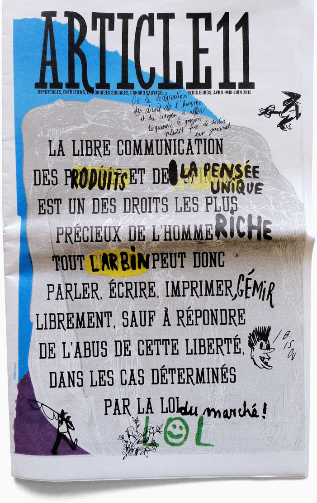

# Micromedia

<svg class="svg">
  <defs>
    <filter id="svgfilter">
      <feTurbulence type="fractalNoise" baseFrequency="0.001 0.001" numOctaves="5" result="turbulence" seed="12345"></feTurbulence>
      <feGaussianBlur in="SourceGraphic" result="blur" stdDeviation="0"></feGaussianBlur>
      <feDisplacementMap id="displacer" in2="turbulence" in="blur" scale="50" xChannelSelector="R" yChannelSelector="R" result="displaced"></feDisplacementMap>
    </filter>
  </defs>
</svg>

самиздат

Le mot russe _**samizdat**_ peut se traduire par auto-édition ; il est formé de **сам**—_sam_, le pronom réfléchi, et **издательство**—_izdatiélstvo_, édition. Ce mot est utilisé par dérision envers le _Gosizdat_ : les « éditions d'État » officielles du régime soviétique.[^wp]

[^wp]: [Wikipédia](https://fr.wikipedia.org/wiki/Samizdat)

Manuscrits dactylographiés, polycopiés, ronéotypés qui circulaient en marge de la littérature officielle, les _samizdat_ faisaient l’objet d’une diffusion collective activée par l’implication des lecteurs. Leur lecture, leur distribution ou leur reproduction était fermement réprimée par le régime soviétique. Pour faciliter leur diffusion ou leur reproduction, ils prenaient parfois des formes extrêmement contraintes : sans interligne ou sans marges pour économiser le papier, réduits aux dimensions d’une boite d’allumettes ou d’un paquet de loukoums pour éviter les regards indiscrets… Ces formes contraintes, nées des conditions économiques et de la nécessité de passer inaperçu ont fini par être appréciées en elles-mêmes, témoignant d’un esprit de rébellion, de débrouillardise et de malice très présent dans la Russie soviétique[^anekdot].

[^anekdot]: Voir aussi les [_anekdot_](https://fr.wikipedia.org/wiki/Anekdot), blagues à caractère socio-politique, critique, transmises de bouche à oreille pour contourner la censure. 

L’un des plus célèbres et durables fut la _La Chronique des événements en cours_[^coce], publiée entre 1968 et 1982 à Moscou par un groupe anonyme et mouvant d’activistes des droits de l’Homme, qui récoltait et diffusait les témoignages de violations des droits civiques et des comptes-rendus des procès intentés par le gouvernement soviétique, ainsi que les réponses à ces violations par les citoyens de toute l'Union soviétique. Le _Docteur Jivago_, roman majeur de Boris Pasternak, ou _Une journée d'Ivan Denissovitch_ de Soljenitsyne furent également diffusé sous cette forme.

[^coce]: [chronicle-of-current-events.com](https://chronicle-of-current-events.com/)

## Faire un journal ?… Mince de tintouin ! Je ne refoulai pas, mille dieux. 

L’histoire des médias autonomes, indépendants, alternatifs, ou parfois « auto-médias » est aussi ancienne que celle des médias « officiels », toute parole centralisée et contrôlée par les pouvoirs dominants (ecclésiastiques, politiques, financiers, publicitaires…) ayant fait émerger des paroles alternatives et divergentes. La presse et les médias, parfois dénommés le « quatrième pouvoir[^pouvoir] » ont au cours du temps assumé (ou pas, ou plus ou moins bien) ce rôle de contre-pouvoir.

[^pouvoir]: Suite aux pouvoirs législatif, exécutif et judiciaire.

_La Gazette_ de Théophraste Renaudot (1631), en même temps qu’elle fut l’un des premiers journaux périodiques français, initiait les relations d’allégeance d’un média avec le pouvoir politique, passant presque sous silence les évènements de 1789 (_aka_ la Révolution). Cette époque fut cependant celle d’une démultiplication sans précédant des parutions, appuyée sur l’évolution des techniques d’imprimerie et rendue nécessaire par l’accélération des problématiques politiques et l’implication d’une part grandissante de la population dans ses enjeux.

En 1789, l’Assemblée constituante établit, en préambule de la nouvelle Constitution de la République française, la Déclaration des droits de l'homme et du citoyen, qui institue dans son Article 11[^a11] la liberté de la presse dans les droits fondamentaux :

> La libre communication des pensées et des opinions est un des droits les plus précieux de l'homme ; tout citoyen peut donc parler, écrire, imprimer librement, sauf à répondre de l'abus de cette liberté dans les cas déterminés par la loi.

[^a11]: 
  Couverture du dernier numéro d’[Article 11](http://www.article11.info/), Formes Vives.

Mais cette déclaration de principe n’empêche pas la mise sous haute surveillance des journaux et des journalistes. Les régimes politiques et les modes de gouvernements qui se succéderont alors (Directoire, Empire, Restauration…) veilleront à museler la libre expression, instaurant des taxes, établissant des logiques de censure, interdisant des parutions, allant jusqu’à l’emprisonnement ou la condamnation à mort de journalistes.

Dès l’invention de la presse, les formats et les formes graphiques mises en œuvre furent nombreuses et variées. Elles vont des _placards_ (feuilles imprimées sur une seule face – _in-plano_ –, affichées aux carrefours des rues, qui deviendront plus tard des _affiches_) aux _plaquettes_, aux _factums_ (éditions juridiques), et jusqu’aux différents formats de périodiques, gazettes, almanachs ou calendriers, imprimés sur des formats in-folio, in-4°, in-8°, in-16…

<strong class="alt">HOP !</strong> Premier saut dans le temps pour rencontrer Émile Pouget, militant anarchiste et cordonnier (_bouiff_) qui crée en 1889 l’hebdomadaire _Le Père Peinard_.  Émile Pouget s’inscrit dans la longue et riche histoire de l’anarchisme et du syndicalisme dans le monde de l’imprimerie, de la typographie et de l’édition.

Devenu l’_Almanach du Père Peinard_, la publication « distille à travers ses articles au ton populaire des attaques en règle contre le système politique et économique de l'époque. Les thèmes abordés sont variés : action directe, antimilitarisme, anticléricalisme, dénonciation de la répression et critique de la “bourgeoisie” et des “exploiteurs”[^peinardwp] ». 

[^peinardwp]: [Wikipédia](https://fr.wikipedia.org/wiki/Le_P%C3%A8re_peinard).

Dans un éditorial du premier numéro de l’_Almanach du Père Peinard_ (1894), Émile Pouget raconte « Pourquoi et comment le Père Peinard s'est bombardé Journaleux », texte au vocabulaire volontiers fleuri et sciemment populaire les raisons qui l’emmènent à éditer son journal (son _flanche_, _caneton_)[^peinard].

> Comment c’est venu, en quatre mots le voici : depuis un brin de temps, un tas d’idées me trottaient par la caboche, et ça me turlupinait rudement de n’en pas pouvoir accoucher. Voir cette fin de siècle, dégueulasse au possible, où tout est menteries, crapuleries et brigandages, — et assister la bouche close à tout ça : nom de dieu, je pouvais pas m’y faire ! 

[^peinard]: [Voir sur Gallica](https://gallica.bnf.fr/ark:/12148/bpt6k83575m/f32.item) ou le texte sur [Wikisource](https://fr.wikisource.org/wiki/Pourquoi_et_comment_le_P%C3%A8re_Peinard_s%27est_bombard%C3%A9_Journaleux).

##  DIY, DIWO

<strong class="alt">HOP, HOP !</strong> Deuxième saut dans le temps. Les années 60 voient l’émergence (ou plutôt la consolidation intellectuelle) des pratiques du « _Do it yourself_ ». En 1969 paraît le premier tome du _Whole Earth Catalog_ qui s’apprêtait à profondément influencer la culture numérique. Sous-titré *Access to tools*[^Monoskop], merveilleux manuel de l’autosuffisance créative où se croisent dans une joyeuse cacophonie articles théoriques, reportages, astuces techniques, objets divers, bonnes affaires en tous genres… <q>« Des kits pour tisser à domicile côtoient des reportages sur la science du plastique. Les flûtes en bambou partagent leur espace avec des livres sur la musique générée par ordinateur »</q>[^ft]. Pour Stewart Brand, son initiateur, ce catalogue est une « technologie intellectuelle ». Il fut l’un des évènements pionniers de la culture DIY, *Do it yourself*, ou DIWO, *Do it with others*.

[^Monoskop]: Le 1er numéro est téléchargeable chez [Monoskop](https://monoskop.org/images/0/09/Brand_Stewart_Whole_Earth_Catalog_Fall_1968.pdf) et un [ensemble colossal](https://archive.org/details/wholeearth?lang=en) de médias associés a été publié par Internet Archive.
[^ft]: Fred Turner, *From Counterculture to Cyberculture \[…\]*.

L’irruption du mouvement Punk[^punk] au milieu des années 70 est venu radicaliser les pratiques DIY, dans le champ musical, visuel, vestimentaire. Sans entrer ici dans les controverses autour de la mort du punk, son enterrement et sa récupération, signalons qu’il fut le moment d’une explosion de pratiques d’auto-publication, notamment sur le plan éditorial, à travers l’émergence des (fan)zines.

Publications amateures, non officielles, non commerciales, liées à un sentiment d’urgence, circulant dans des contextes dédiés à destination de communautés spécifiques, abordant tous les champs – du football à la cuisine, de la poésie expérimentale à la serrurerie, de la science-fiction à la théorie queer – mais souvent inscrits dans une perspective critique et politique, ils furent (et sont encore) le lieu d’expérimentations formelles et textuelles permettant aux objets-mêmes de devenir une expression, un langage ; au design graphique de devenir un « texte en soi ».[^rock] 

Nourries des approches formelles et conceptuelles de Dada ou de l’Internationale Situationniste, empreints des pratiques plus tard décrites par Michel de Certeau ou Claude Lévi-Strauss (la pensée du bricolage, du braconnage, les « moyens du bord »)[^bricoles], les pratiques du _zine_ ont aussi largement mis en œuvre des logiques d’appropriation et de détournement.

« Fanzines: la révolution du DIY » de Teal Triggs dresse un large panorama des différentes sphères d’apparition et de développement de la culture zine qu’il serait vain de tenter de résumer ici. NB : sa parution en 2010 ne lui permet d’évoquer qu’assez grossièrement l’ère du web.

[^punk]: Regarder et écouter l’excellent épisode de Trash Theory consacré aux prémices et aux précédents de la culture punk :  [_Before 1976 Revisited: How Punk Became Punk _](https://www.youtube.com/watch?v=6lyoAczdMSM)
[^rock]: Michael Rock, « [Designer as Author](https://2x4.org/ideas/1996/designer-as-author/) » et « [Fuck content](https://2x4.org/ideas/2009/fuck-content/) ».
[^bricoles]: Auto-référence, désolé. Lire « [Bricoles : Bricolage, design, pratiques artistiques et numériques](https://accentgrave.net/bricoles/) »

<blockquote class="big"> <big>« Don’t hate the media,  become the media! »</big>  </blockquote>

— Jello Biafra

<strong class="alt">HOP, HOP, HOP !</strong> Dans les années 70 et 80, la culture des fanzines avaient bénéficié de la démocratisation des procédés de duplication/impression à bas coût. Dans les années 80, les radios libres (initialement “pirates”) revendiquaient la liberté d'expression et la fin des monopoles d'État dans le domaine de la radio et de la télévision mais furent bien vite rattrapées par la prédominance des modèles commerciaux et publicitaires. Les années 95 – 2000, notamment à travers l’imminence du web grand-public, furent un moment d’espoir d’une renaissance de médias indépendants. 

En France et dans le monde, de nombreux sites et services se sont structurés autour de cet enthousiasme. Nombre d’entre eux accompagnaient l’émergence d’une « société civile mondiale » s’organisant notamment autour des premières manifestations _altermondialistes_, lors des _Rencontres intergalactiques contre le néolibéralisme et pour l’humanité_, organisées par les zapatistes mexicains en 1996, ou à l’occasion du sommet de l’OMC à Seattle, en 1999.  C’est notamment le cas de l’initiative [IndyMedia](https://indymedia.org/), qui a progressivement essaimé depuis Seattle vers différentes villes et pays — signalons [Nantes](https://nantes.indymedia.org/), [Athènes](https://athens.indymedia.org/), toujours actives).

> The resistance is global... The web dramatically alters the balance between multinational and activist media. With just a bit of coding and some cheap equipment, we can set up a live automated website that rivals the corporates[^im].

[^im]: La résistance est mondiale... Le web modifie radicalement l'équilibre entre médias multinationaux et médias militants. Avec quelques notions de code et un équipement bon marché, nous pouvons créer un site web automatisé en direct qui rivalise avec les grandes entreprises.  [Wikipedia](https://en.wikipedia.org/wiki/Indymedia)

En France, les hébergeurs indépendants et artisanaux Altern.org (ouvert dès 1993) ou Mygale (1996), et qui donnèrent plus tard naissance à d’autres services (L’autre Net puis Ouvaton, mais aussi Multimania) grâce auxquels émergèrent des approches différentes, plus ou moins commerciales, plus ou moins financées par la publicité naissante en ligne. Une effervescence médiatique faisait naître des « médias citoyens » pariant sur l’essor du « journalisme participatif ».

<strong class="alt">☞ </strong> C’est de cette histoire que viendra nous parler Aris Papathéodorou 👋, fondateur de Samizdat.net et pionnier de l’internet indépendant en France.

En 2009, Benjamin Bayart, fondateur de la Quadrature du Net, pas avare de formules-choc, proposait que si « l’imprimerie a permis au peuple de lire, Internet va lui permettre d’écrire ». Depuis lors, cette hypothèse est largement mise à mal par les centres commerciaux que sont devenues les plateformes qui concentrent nos publications en ligne, captent notre attention et exploitent notre addiction à l’univers médiatique et informationnel dans lequel nous baignons. [^BB]

[^BB]: Regarder la conférence de B. Bayard _Internet libre, ou Minitel 2.0 ?_ sur [Youtube](https://www.youtube.com/watch?v=AoRGoQ76PK8) ou (mieux ;) sur [PeerTube](https://peertube.social/videos/watch/9a8642c0-62f0-4060-95e4-088de9c5db00).

## Et maintenant…

Les dangers qui pèsent sur la presse et les médias, en France comme dans le monde sont nombreux : concentration dans les mains de grands groupes (Vincent Bolloré, Patrick Drahi, Xavier Niel)[^qpq], mise en cause de journalistes indépendants (« procès baillons », garde à vue de journalistes, convocations à la DGSI),  difficultés économiques de nombreux titres de presse et médias, « journalisme de préfecture », démultiplication des _fake news_, déferlante annoncée des contenus générés par les LLM[^ia], emprisonnement de notre expression dans les CGU de plateformes dirigées par des multimillionnaires fous…

[^qpq]: Consulter la carte [Médias français, qui possède quoi](https://www.monde-diplomatique.fr/cartes/PPA), produite à partir de données ouvertes par le Monde diplomatique.

[^ia]: _Large Language Model_, aussi connus sous le nom impropre d’intelligences artificielles.

Chaque jour se font plus impérieux les enjeux de la réappropriation des espaces médiatiques, plus nécessaire la circulation libre d’une information indépendante, plus critique la question du contrôle des données personnelles par les individus. Ce projet se propose d’explorer des modalités d’une production médiatique autonome, autoproduite et autopubliée via ce fascinant outil d’émancipation qu’est (que _peut_ être) le web.

> « Governments of the Industrial World, you weary giants of flesh and steel, I come from Cyberspace, the new home of Mind. On behalf of the future, I ask you of the past to leave us alone. You are not welcome among us. You have no sovereignty where we gather. »  
> – John P. Barlow [^cyber]

Si les internets et le web ont inscrit au cœur de leurs fondations techniques, philosophiques et politiques une puissante position d’ouverture et de décentralisation, force est de constater qu’elle demande à être réinvestie : « ce nouveau monde de l’âge numérique porte autant de promesses que de nouvelles formes d’abrutissement et de contrôle sophistiqué. »[^ak] 

Que ce soit par fidélité aux promesses du web des premiers jours, ou par la compréhension immédiate de l’intérêt de l’auto-publication, de très nombreux⋅ses artistes, designers, auteurices, développeur⋅euses publient aujourd’hui des formes médiatiques ouvertes, alternatives et créatives en ligne. Le mouvement du libre et des communs, la scène de l’IndieWeb, les communautés de Neocities tout comme nombre de blogs et de sites personnels maintiennent vivantes les énergies des zines punks, parfois avec la clandestinité des samizdat russes.

[^ak]: Ariel Kyrou, Révolutions du Net.

[^cyber]: Lire (en français) la [Déclaration d’indépendance du Cyberespace](http://editions-hache.com/essais/barlow/barlow2.html) de John P. Barlow – et la proposition d’Olivier Ertzscheid d’une [nouvelle déclaration…](https://www.liberation.fr/debats/2018/02/09/une-nouvelle-declaration-d-independance-du-cyberespace_1628377/).

La liberté ne s’usant que si l’on ne s’en sert pas, cette proposition de travail vise à vous permettre de re-gagner un espace de liberté d’expression – thématique, formelle, conceptuelle, narrative, documentaire…

## Micromédia !

**Media** est le pluriel du mot latin _medium_ dérivé de l'adjectif _medius_ signifiant milieu, moyen. Par extension le mot désigne un objet positionné au milieu, dans l'entre-deux, jouant un rôle d'intermédiaire. **Micro** vient du grec μικρός, mikros (« petit »). 

Si Macromédia fut l’éditeur du plugin Flash[^folklore], qui offrit à la fois au web certaines de ses plus belles pages de créativité libérée et le désarroi d’un système propriétaire fermé aujourd’hui disparu, **Micromédia** se propose de réinvestir l’espace de la publication en ligne avec cette même liberté formelle, mais en se basant sur les langages ouverts que sont HTML, CSS et JavaScript.

[^folklore]: (Re)lire [Folklore de la zone mondiale](../../culturenum/folklore/#flash).

### Objectifs et modalités

* Explorer les possibilités d’un média autonome et indépendant, personnel ou collectif, _à la fois_ web et print.
* Faire valoir votre propre culture, votre propre rapport à l’information et à sa médiatisation, assumer votre légitimité à parler, écrire, dessiner, photographier, rapporter et transmettre une information.
* Vous pouvez parler en votre nom propre, de manière anonyme, en créant un avatar, un hétéronyme, laisser la parole à un moineau ou à votre chat.
* Vous pouvez travailler seul·e ou en collectif (max. 3/4…). NB: Les attentes liées à un travail en groupe seront proportionelles à la taille du groupe ; chacun·e des membres devra intervenir sur l’ensemble des dimensions (forme et fond, structure et développement) bien que les singularités de chacun·e puissent amener une certaine répartition des rôles.

### Web + print 

L’accès au site via un mobile, un écran, et _jusqu’à sa version imprimée_ seront des enjeux centraux de votre production. Les modalités techniques en seront envisagées tout au long du semestre.

La complémentarité des espaces et des formes de diffusion et de consultation est un enjeu majeur du projet. Elle doit être questionnée et investie avec précision.

La prise en compte de la relation écran / imprimé, notamment, peut être pensée de multiples manières : l’impression peut produire un document qui soit comparable à la version écran _ou_ complémentaire. Les logiques du _web to print_[^web2print] permettent à la fois l’impression d’un document par le visiteur lui-même (« impression à la demande ») ou l’appropriation par le⋅a designer d’un outil et d’un contexte permettant de concevoir dans un même geste (à partir des mêmes sources, des mêmes logiques, d’un même _système de design_) des documents multi-supports.

[^web2print]: Les [approches alternatives de production d’objets imprimés](../../ressources/ctrl-alt-print/) seront évoquées lors de séances dédiées.

### Contenus 

Pouvez-vous être journalistes, éditeurs, reporters, critiques, pirates ? 

Tous les contenus sont légitimes s’ils permettent de tisser une expérience perçue par vous avec sa transmission formelle : reportage photo sur la vie de votre quartier, interviews de passants dans la rue, phrases glanées dans le bus, série documentaire vidéo sur les fleurs de votre balcon, dessins quotidiens, notes de lectures personnelles, correspondance amoureuse, promenades pyrénéennes, diatribes anticapitalistes… 

L’approche peut être documentaire ou fictionnelle, centrée sur vous, votre environnement ou sur le monde, mais elle gagnera à offrir une expérience sensible, singulière et individuelle.

L’hypothèse de contenus libres (domaine public, licences CC, [infokiosque](https://infokiosques.net/)) voire même pirates ([Monoskop](https://monoskop.org/HTML), [UbuWeb](https://ubuweb.com/), voire même [Zlib](zlibrary-fr point se)) est parfaitement envisageable.

### Livrables
* Un site web, codé à la main, nativement pensé et construit dans le navigateur, à partir duquel sera produite une forme imprimée.
* Aucune maquette préalable (non web) n’est requise – bien que leur réalisation, tout comme celle de _wireframes_ puissent aider certain·es à conceptualiser et préciser le projet.
* L’évolution du projet dans le temps du semestre devra être documentée.

### Calendrier

En introduction de chaque session seront abordées des enjeux connexes à la question des médias et du design, notamment en ligne : visualisation de données, design d’interface, OSINT, reportage et diffusion _live_… Quelques invitations sauvages et surprises rythmeront le parcours du semestre.

| Date | Programme  |
| --- | --- |
| 19/10 | Lancement du projet |
| 20/10 | Typographie à l’écran |
| 01/11 | → Notes d’intention (par e-mail et) en ligne |
| 02/11 | RWD, du mobile à l’écran |
| 03/11 | RWD, de l’écran au papier |
| 16/11 | _Suivi & travail individuel/collectif_ |
| 17/11 | _Suivi & travail individuel/collectif_ |
| 30/11 | _Suivi & travail individuel/collectif_ |
| 01/12 | _Suivi & travail individuel/collectif_ |
| 14/12 | _Suivi & travail individuel/collectif_  |
| 15/12 | _Suivi & travail individuel/collectif_ |
| 05/01 | → Publication en ligne du prototype et des documents connexes |

*[RWD]: Responsive Web Design

### Sources & bibliographie

Alien Melon, «  », URL : https://alienmelon.itch.io/electric-zine-maker

Francis Balle & INA, « La presse depuis 1605, Chronologie de la presse française ». URL : https://larevuedesmedias.ina.fr/chronologie/la-presse-depuis-1605 

BNF, « De la gazette à Internet », dossier sur l’histoire de la presse en France. URL : https://essentiels.bnf.fr/fr/societe/medias/b301c6f3-73f9-4882-81c8-5b81d897a876-gazette-internet/album/39a455e8-2d7d-4643-a88b-c41f8cb3fd2e-cinq-siecles-histoire-la-presse

Patrick Boucheron, «  Faire l'histoire: Le samizdat, un objet contre la censure », émission du 19/02/2022. URL : https://www.arte.tv/fr/videos/101944-003-A/faire-l-histoire/

INA, « La crise ! Quelle crise ? Ces sites et journaux qui innovent et réussissent » Ina Global #03, Ina, octobre 2014/janvier 2015. URL : https://issuu.com/inaglobal/docs/inaglobal03_issuu

Raphaël Josset, « “Become The Media!” : de l'hacktivisme au web 2.0 », Sociétés, 2014/2 (n° 124), p. 55-64. URL : https://www.cairn.info/revue-societes-2014-2-page-55.htm 

Gilles Feyel, « Presse et publicité en France (XVIIIe et XIXe siècles) », Revue historique, 2003/4 (n° 628), p. 837-868. URL : https://www.cairn.info/revue-historique-2003-4-page-837.htm 

Fabien Hein, « Do It Yourself : Autodétermination et culture punk », Le Passager Clandestin, 2012.

Ariel Kyrou, « Révolutions du Net : Ces anonymes qui changent le monde ». Inculte éditions, 2012. 

Michael Rock, « Fuck Content », 2009, URL : https://2x4.org/ideas/2009/fuck-content/

Michael Rock, « Designer as Author », 1996, URL : https://2x4.org/ideas/1996/designer-as-author/

Félix Tréguer, « Contre-histoire d’Internet: Du XVe siècle à nos jours », Éditions Agone. URL : https://agone.org/livres/contre-histoire-dinternet. Alternativement, écouter Félix Tréguer dans [Au Poste](https://www.auposte.fr/la-terrifiante-contre-histoire-dinternet/) de David Dufresne.

Teal Triggs, « Fanzines: la revolution du DIY », Pyramid, 2010.

Cécile Vaissié, « Archiver les samizdats de la dissidence russe », Écrire l'histoire [Online], 13-14 | 2014. URL : http://journals.openedition.org/elh/487; 

Peter Watkins, « Media crisis », L’Échappée. URL : https://www.lechappee.org/collections/pour-en-finir-avec/media-crisis

ZineWiki! URL : https://zinewiki.com/wiki/Main_Page

Zines of the Zone. URL : http://www.zinesofthezone.net/

## Interwebs 

Les onglets ouverts pendant la rédaction de cette proposition : [Samizdata](samizdata.php) !

—

Le caractère typographique des titres est le [Murmure](https://velvetyne.fr/fonts/le-murmure/) de Jérémy Landes / Studio Triple. Celui des citations est [Libre Franklin](https://github.com/impallari/Libre-Franklin) de Pablo Impallari, Rodrigo Fuenzalida et Nhung Nguyen.