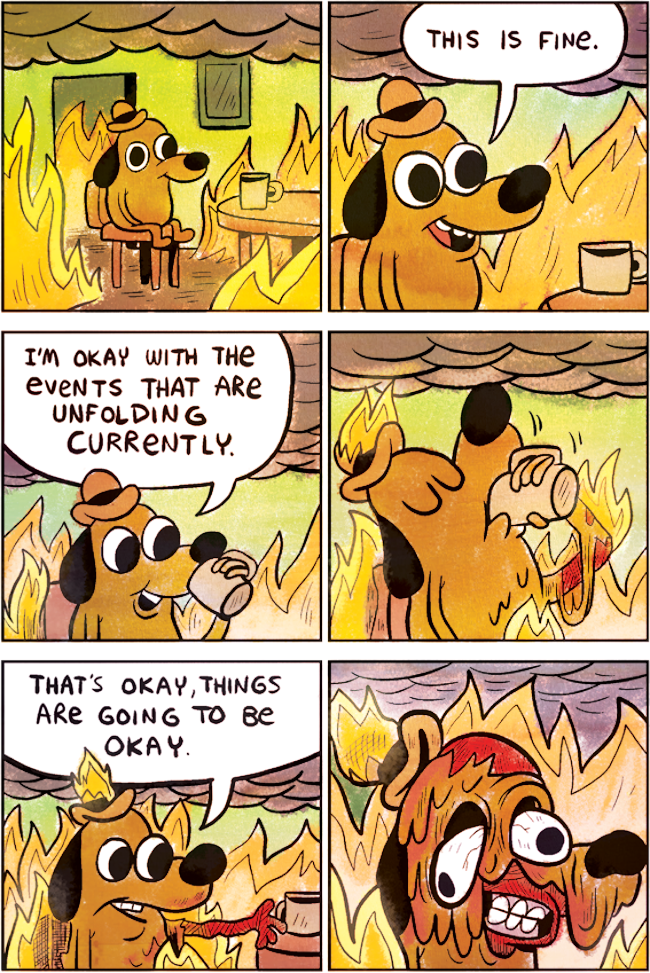

  K.C. Green (→ [Know your meme](https://knowyourmeme.com/memes/this-is-fine))

> > — In an environment that is screwed up visually, physically, and chemically, the best and simplest thing that architects, industrial designers, planners, etc., could do for humanity would be to stop working entirely. In all pollution, designers are implicated at least partially. [^fr1]
> 
> Ainsi parlait Victor Papanek en 1971 en préface de son ouvrage _Design for the real world, Human Ecology and Social Change._ Il est peu risqué de supposer que ces propos et les idées qui les ont commandés étaient encore antérieurs. Celui qui fut distingué à la fin de sa vie par la Fondation IKEA aurait été bien inspiré de s’en tenir là. Hélas, il ajoutait ensuite :
> 
> > — But in this book I take a more affirmative view: It seems to me that we can go beyond not working at all, and work positively. Design can and must become a way in which young people can participate in changing society[^fr2].
> 
> Et voilà magnifiquement résumée l’intemporelle et apparemment indépassable contradiction du design, celle qui fait de lui une discipline _simultanément consciente d’être une part du problème sans pouvoir se résoudre à ne pas être une part de la solution._

[^fr1]: Dans un environnement visuellement, physiquement et chimiquement saccagé, le mieux que puissent faire les architectes, designers industriels, planificateurs etc. qui souhaitent aider l’humanité serait d’arrêter de travailler totalement. Dans toute pollution, ils sont au moins partiellement responsables.

[^fr2]: Mais dans ce livre, je développerai plus encore : mieux qu’abandonner totalement le travail, il me semble que nous pouvons travailler de façon constructive. Le design peut et doit devenir une façon dont les jeunes gens participent à changer la société.

Ce texte est l’introduction de l’article _Design éthique — mort du design_ publié en 2018 par [Design non éthique](https://designonethic.medium.com/) à la veille de la première conférence _Ethics by design_ organisée à Nantes :

> Ethics by design est le principal événement francophone dédiée à la conception numérique responsable et durable. Son objectif est de rassembler une communauté d'acteurs variés, participants chacun à leur manière à l'élaboration et la recherche d'un numérique éthique. 

---

Ces trois citations, ces trois points de vue et d’expression (ainsi que les ouvrages, articles ou conférences qui les développent), permettent de signaler la complexité de la pensée critique du design contemporain dans les relations qu’il entretient avec l’_éthique_, avec les enjeux de la « responsabilité » politique, sociale, environnementale… des designers.

Les trublion⋅nes de Design non éthique démarrent en citant Victor Papanek, et son ouvrage phare de 1971, _Design for a real world_[^dfarw]. L’introduction de l’article signale « l’intemporelle et apparemment indépassable contradiction du design, celle qui fait de lui une discipline simultanément consciente d’être une part du problème sans pouvoir se résoudre à ne pas être une part de la solution ».

[^dfarw]: _Design pour un monde réel: économie humaine et changement social_, édité en français par les [Presses du réel](https://www.lespressesdureel.com/ouvrage.php?id=8623&menu=0).

Cette émergence de Design non éthique, de 2018 à 2022, et sa critique virulente d’_Ethics by design_ avait permis d’animer une riche discussion dans un [cours de Cultures numériques](/web/pages/culturenum/ethique/) qui avait donné lieu à une [réponse publique](https://designonethic.medium.com/conversations-1-ae02afb6dbf9) de DNÉ.

--- 

Les questionnements violents qui ne manquent sans doute pas d’agiter les étudiant⋅es d’écoles d’art (on l’espère ; sans quoi l’anesthésie dont iels souffriraient serait terrible – Netflix, Instagram, TikTok auraient gagné ? On ne le pense pas…) traversent évidemment le champ du design, embarqué qu’il est au cœur de ces questions économiques, politiques, sociales, environnementales… 

Dans l’espace du numérique, ces questionnements sont exacerbés : la vague de l’« intelligence artificielle », la société de surveillance et la technopolice, l’impact écologique, la désinformation, la fuite en avant du technosolutionnisme, la puissance politique des big tech, l’inéluctabilité préssentie de la numérisation du monde…

La proposition de travail du semestre cherche à travailler ces enjeux, à la fois pour les regarder avec clairvoyance (_this is NOT fine_), mais aussi pour permettre peut-être de découvrir quelques pistes de réflexion et d’action à même de donner un peu d’espoir et de perspectives positives, fussent-elles humbles et minimales (_*some* things *might* be fine_).

## Publication collective

Nous travaillerons ce semestre à l’élaboration d’une publication (un _reader_, une curation, une compilation), conçue et produite à la fois de manière collective et individuelle.

Un premier ensemble de textes et d’images est à télécharger. Ce premier corpus nous donnera du grain à moudre pour les premières séances mais devra être augmenté.

[télécharger](https://ateliers.esad-pyrenees.fr/tmp/thisisfine-26-09-2024.zip) {.bigbutton}

[accéder au pad](https://pad.esad-pyrenees.club/p/thisisfine) {.bigbutton}

Il contient des textes bruts, plus ou moins (plutôt moins) libres de droits, en français ou en anglais. Textes contemporains ou historiques, traitant du design, des technologies, de l’environnement ou de la société. Il contient des images de multiples provenances, sous licences libres, ou déjà soumises à une vaste circulation. Contemporaines ou historiques, issues des tréfonds du web ou reproduites en des millions d’occurences. Tout est volontairement réuni sans grande cohérence éditoriale.

### Éditorialisation

Un premier enjeu de _This is fine_ est de vous proposer d’augmenter et d’organiser ces contenus de manière à leur donner une cohérence. De faire des choix dans les textes ou dans l’iconographie, mais aussi de proposer au collectif d’augmenter le corpus par des propositions que vous serez invité⋅es à faire au groupe dans la première demi-heure de chaque session.

### Production 

Nous aurons à mettre en page ces textes et ces images, à déterminer les circulations, les confrontations ou même les hybridations entre ces contenus et à fabriquer une publication – entendue commme dispositif qui _rend public_ et _s’adresse à un public_.

Deux objectifs finaux pourront être visés : 
- la production d’un (ou plusieurs) site(s) web ;
- la production d’un (ou plusieurs) document(s) imprimé(s).

### Progressivité

La succession de séances sera largement basée sur le canevas dessiné par le projet [Textedit](../textedit/), nous permettant de découvir :
- les enjeux de la typographie (composition de texte) à l’écran, en débutant par les plus petis écrans ;
- les questions du _responsive web design_, l’adaptation d’une mise en page aux différents types d’écrans ;
- les questions de navigation hypertextuelles, d’index, d’interfaces ;
- les possibles ouverts par le _web to print_ (ou comment fabriquer des livres avec du code et des outils « non conventionnels »)

### Évaluation

L’évaluation du travail se base sur l’implication individuelle et au sein du collectif, l’assiduité, la publication et la documentation des projets ainsi que sur l’appropriation personnelle des outils techniques, graphiques et conceptuels abordés. La qualité et la maîtrise de la production graphique seront des enjeux forts.

## Calendrier
    

| Date                | Programme                 |
| ------------------- | ------------------------- |    
| jeudi 26/09         | Lancement du projet       |
| vendredi 04/09      | Typographie à l’écran     |
| jeudi 10/10         | Typographie à l’écran     |
| vendredi 18/10      | RWD, du mobile à l’écran  |
| vendredi 01/11      | RWD, du mobile à l’écran  |
| jeudi 07/11         | _Suivi & travail individuel/collectif_ |
| vendredi 15/11      | _Suivi & travail individuel/collectif_ |
| jeudi 21/11         | RWD, de l’écran au papier |
| vendredi 29/11      | RWD, de l’écran au papier |
| jeudi 5/12          | _Suivi & travail individuel/collectif_ |
| vendredi 13/12      | _Suivi & travail individuel/collectif_ |
| jeudi 19/12         | _Suivi & travail individuel/collectif_ |
| 20/12 → 05/01       | Publication en ligne      |

<!-- > « Comment contrecarrer l’empiètement des nouveaux systèmes et appareils électroniques sur des communaux qui sont plus intimes à notre être et plus subtils que les prés ou les routes – ces communaux qui sont au moins aussi précieux que le silence. Le silence (…) est indispensable à l’émergence de la personnalité. Il nous est ravi par des machines qui singent les humains. Nous pourrions facilement être rendus tributaires de machines pour notre parole et notre pensée comme nous le sommes déjà pour nos déplacements. » -->

