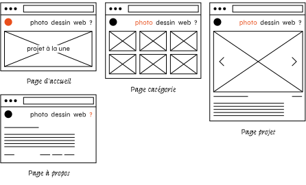
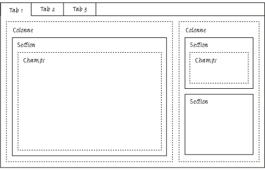

# Blueprints

> Le terme *blueprint* désigne, en anglais, une reproduction d'un plan détaillé, ce que l'on appelle en dessin technique un dessin de définition. Le terme, signifiant littéralement « impression en bleu », provient d'un procédé d'imprimerie, la cyanotypie, puis la diazographie. — [wikipedia](https://fr.wikipedia.org/wiki/Blueprint)


## Modèle de données

Les *blueprints* permettent de déterminer le modèle de données de chaque type de page (quelles données pour quelle page). Ce modèle se traduira en champs de saisie dans le *panel*.

Dans le contexte du portfolio,  plusieurs scénarios peuvent être envisagés. NB: Les *wireframes* ci-dessous permettent d’imaginer des **structures de données** différentes ; ils n’impliquent pas (encore) de choix de mise en page.

### Scénario 1

- Une page d’accueil avec un projet à la une : un blueprint `home` 
- Des catégories : un blueprint `category`
- Une page projet : un blueprint `project`
- Une page à propos : un blueprint `about`



[→ Voir les blueprints pour ce scénario](scenario-1/)

### Scénario 2

- Une page d’accueil avec la liste des projets : pas de blueprint nécessaire
- Une page projet de type “vidéo” : un blueprint `video`
- Une page projet de type “photo” : un blueprint `photo`
- Une page projet de type “galerie” : un blueprint `gallery`
- Une page projet de type “journal” : un blueprint `journal`, etc.


[→ Voir les blueprints pour ce scénario](scenario-2/)


[↗ Documentation sur les blueprints](https://getkirby.com/docs/guide/blueprints/introduction)    
[↗ Exemples de blueprints](https://getkirby.com/docs/reference/panel/samples)

## Les champs {#champs}

Kirby propose par défaut un large ensemble de champs, qui permettent la saisie de la plupart des données que l’on peut souhaiter (sinon, regarder les [plugins](https://getkirby.com/plugins)).

<div class="gridlist" markdown="1">

- [**Checkboxes**](https://getkirby.com/docs/reference/panel/fields/checkboxes)   
Une liste de cases à cocher

- [**Date**](https://getkirby.com/docs/reference/panel/fields/date)   
Un champ de sélection de date

- [**Files**](https://getkirby.com/docs/reference/panel/fields/files)   
Un champ de sélection de fichiers 

- [**Number**](https://getkirby.com/docs/reference/panel/fields/number)   
Un champ de saisie de nombre avec validation

- [**Pages**](https://getkirby.com/docs/reference/panel/fields/pages)   
Un champ de sélection de pages

- [**Select**](https://getkirby.com/docs/reference/panel/fields/select)   
Un simple champ de sélection

- [**Tags**](https://getkirby.com/docs/reference/panel/fields/tags)   
Un champ de saisie de tags avec autocomplétion

- [**Text**](https://getkirby.com/docs/reference/panel/fields/text)   
Un champ de saisie standard à une ligne

- [**Textarea**](https://getkirby.com/docs/reference/panel/fields/textarea)   
Une zone de texte, qui se redimensionne automatiquement et comporte des boutons de formatage intégrés.

- [**Toggle**](https://getkirby.com/docs/reference/panel/fields/toggle)   
Interrupteur à bascule : oui ou non

- [**Url**](https://getkirby.com/docs/reference/panel/fields/url)   
Un champ de saisie d'URL avec validation

</div>

Mais aussi : [Email](https://getkirby.com/docs/reference/panel/fields/email),
[Multiselect](https://getkirby.com/docs/reference/panel/fields/multiselect),
[Radio](https://getkirby.com/docs/reference/panel/fields/radio),
[Range](https://getkirby.com/docs/reference/panel/fields/range),
[Structure](https://getkirby.com/docs/reference/panel/fields/structure),
[Time](https://getkirby.com/docs/reference/panel/fields/time),
[Tel](https://getkirby.com/docs/reference/panel/fields/tel),
[Users](https://getkirby.com/docs/reference/panel/fields/users),
[Info](https://getkirby.com/docs/reference/panel/fields/info),
[Line](https://getkirby.com/docs/reference/panel/fields/line),
[Headline](https://getkirby.com/docs/reference/panel/fields/headline),
[Hidden](https://getkirby.com/docs/reference/panel/fields/hidden)…


## Interface d’administration

Le *panel* de Kirby peut être personnalisé pour s'adapter à chaque projet. À cette fin, on utilise les *blueprints* pour configurer la mise en page des champs de formulaire.

*[YAML]: YAML Ain't Markup Language

Les *blueprints* sont des fichiers de configuration écrits en [YAML](https://fr.wikipedia.org/wiki/YAML) qui permettent de personnaliser l’apparence et l’interface du *panel*. Ils sont stockés dans le dossier `/site/blueprints`.
Ils peuvent être basés sur de simples *presets* ou être spécifiquement définis, de manière à concevoir des interfaces d’administrations complexes contenant onglets, colonnes et sections.



Exemple de blueprint pour ce *layout* : 

```yaml
tabs:
  tab-1:
    label: Tab 1
    columns:
      - width : 2/3
        sections:
          main:
            type: fields
            headline: Informations
            fields :
              subtitle:
                label: Sous-titre
                type: text
              text:
                label: Texte
                type: textarea
      - width: 1/3
        sections:
          meta:
            type: fields
            headline: Fichiers
            fields :
              descrition:
                type: text
              keywords:
                type: tags
          files:
            type: files
            headline: Fichiers
  tab-2:
    label: Tab 2
    fields:
      truc:
        label: Truc
        type: text
  tab-3:
    label: Tab 3
    fields:
      bidule:
        label: Bidule
        type: text
```        


## Ensuite…

La structure du contenu est bien formalisée, l’interface d’admin est fonctionelle et ergonomique ; on passe à l’affichage des informations dans les pages :

[→ Les templates](../templates/){.bigbutton}
