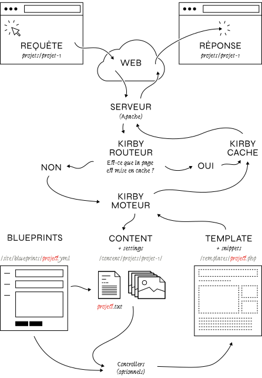

# Kirby

*[CMS]: Content management system (système de gestion de contenu)

Contrairement à de nombreux CMS, Kirby est un CMS sans base de données. Les informations sont stockées sous la forme d’une arborescence de dossiers et de fichiers. Il est  simple à mettre en œuvre, à publier en ligne, et très flexible. 

[Lire *Kirby in a nutshell*](https://getkirby.com/docs/cookbook/setup/kirby-in-a-nutshell)

Les principes de son fonctionnement sont néanmoins assez similaires à la plupart des outils alternatifs (Wordpress, Indexhibit, Grav…).

### Licence

On peut tester Kirby gratuitement mais sa mise en ligne nécessite l’achat d’une licence. Les étudiants peuvent bénéficier d’un [tarif réduit](https://getkirby.com/buy#students).

## Fonctionnement

## Structure générale

| dossier | description  |
| --- | --- |
| `/content` | Le contenu du site  |
| `/site` | Le dossier du projet. Il contient les templates, la configuration, les plugins et les *blueprints*. |
| `/assets` | Un dossier qui contient les fichiers CSS, javascript et les images statiques (logo, icônes). |
| `/kirby`| L'application Kirby. On n’y touche pas… |
| `/media` | Dossier géré par Kirby qui contient les images publiques et les vignettes. On n’y touche pas… |

## Contenu

Le contenu (textes, images, vidéos…) du site est stocké sous la forme d’une arborescence de dossier et de fichiers dans le dossier `content` et directement éditable et manipulable grâce à un éditeur de texte et l’explorateur de fichiers.

## Le *panel* et les *blueprints*

Néanmoins, il est souvent plus confortable d’éditer ce contenu grâce à une interface d’administration accessible à l’adresse http://localhost/portfolio/panel.

Les *blueprints* permettent deux choses : ils décrivent le *modèle de données* de vos pages et déterminent la structure du *panel*. La structure (ou le modèle) de données permet de spécifier quelles informations sont nécessaires pour chaque type de page (la page “à propos” contiendra un texte d’intro, une adresse e-mail, un pdf pour le CV, une liste de réseaux sociaux ; la page “projets” contiendra une liste des projets ; la page “projet” contiendra un texte, une série d’images, une date, etc.)

*[RTFM]: Read the fucking manual

## *RTFM*

Kirby possède une documentation précise et extensive : un [guide de démarrage](https://getkirby.com/docs/guide), un “[livre de recettes](https://getkirby.com/docs/cookbook)” pour accomplir les taches les plus fréquentes, un [guide de référence](https://getkirby.com/docs/reference) pour tous les termes, méthodes et fonctions du CMS, un [forum](https://forum.getkirby.com/) très actif, un riche [écosystème de plugins](https://getkirby.com/plugins) et de [thèmes](https://www.getkirby-themes.com/).

[→ Structurer les données](../blueprints/){.bigbutton}
