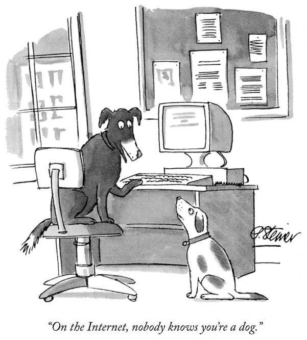
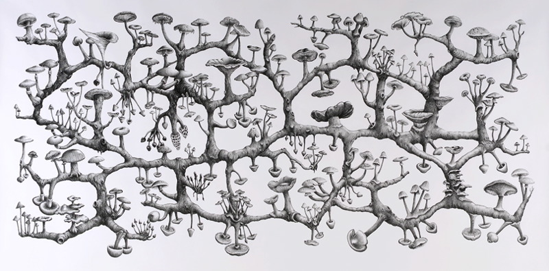
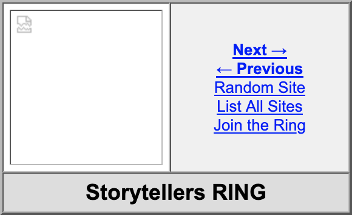

# Stotytellers – RING

Explore the notion of extimacy and create a character. His reality oscillates between reality and fiction. You have extracted his substance from your intimate identity and you should be ready to project him online to the public audience. 

Our proposal is to project this character into the world, to contextualize him, to make him meet the city, the inhabitants, the students (from your own class, from the school), the landscape, the architecture. 
The mode can be that of fiction, essay, poetry or documentary, visual experimentation… Can be narrative (or not).    
↯ Write an auto-fiction from this character. Produce media (texts, audio recordings, photographic images, video images, but also, why not, drawings, sketches, graphic samples) that bear witness to this character's encounter with the world.

## Terms and Conditions

One constraint is to produce an hypertextual writing: fragmentary, multimedia, non-linear, tree-like. The principle is not to produce a comic strip, a video, or a textual narrative, but a hybrid object mixing different media (drawings, videos, texts) in which the user/visitor/reader can make his own way.    
↯ linking these media in a tree structure and a non-linear hypertext navigation.

## Design & code 

Produce a radical and minimal graphic universe, limited by the constraints of self-publishing. The technical limits imposed by the implementation of a website made up of html, css (and media) files coded by hand and put online by ftp allow us to focus on the essential: the contents and the circulation between them. 

> “In today’s highly commercialized web of multinational corporations, proprietary applications, read-only devices, search algorithms, Content Management Systems, WYSIWYG editors, and digital publishers, it becomes an increasingly radical act to hand-code and self-publish experimental web art and writing projects.” — *[J.R. Carpenter](https://en.wikipedia.org/wiki/J.R._Carpenter)*

## Collective constraint

Involve in your production an "object" (a situation, a physical object, a place, a meeting between two characters) belonging to the production of one of your classmates in order to create a link between the two productions, and thus create a circle / a [web ring](https://pl.wikipedia.org/wiki/Webring).    
↯ some kind of cadavre exquis

