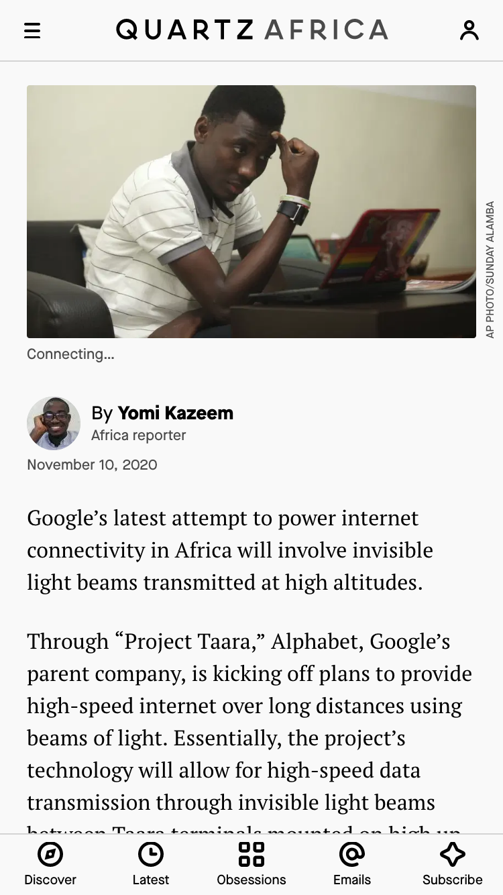
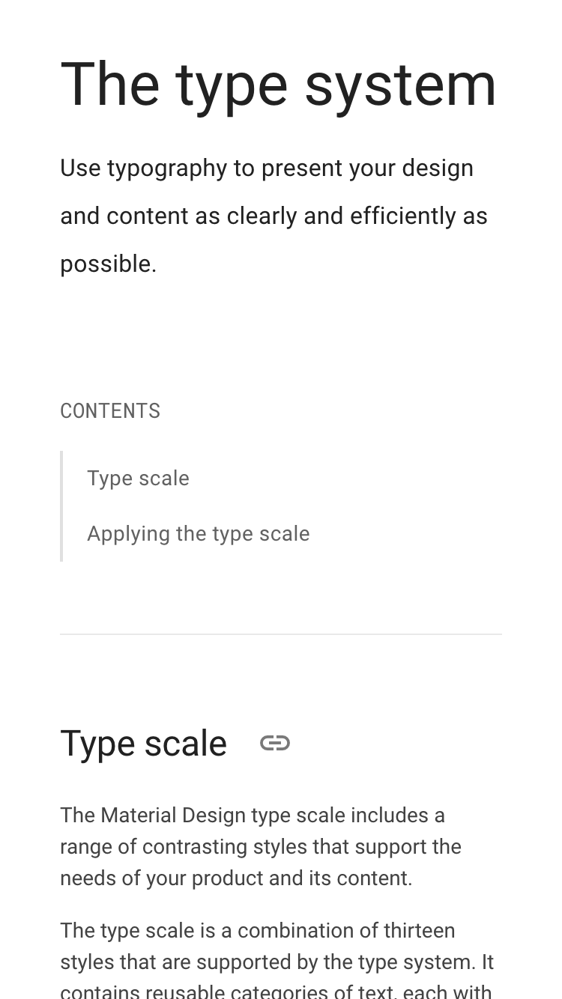
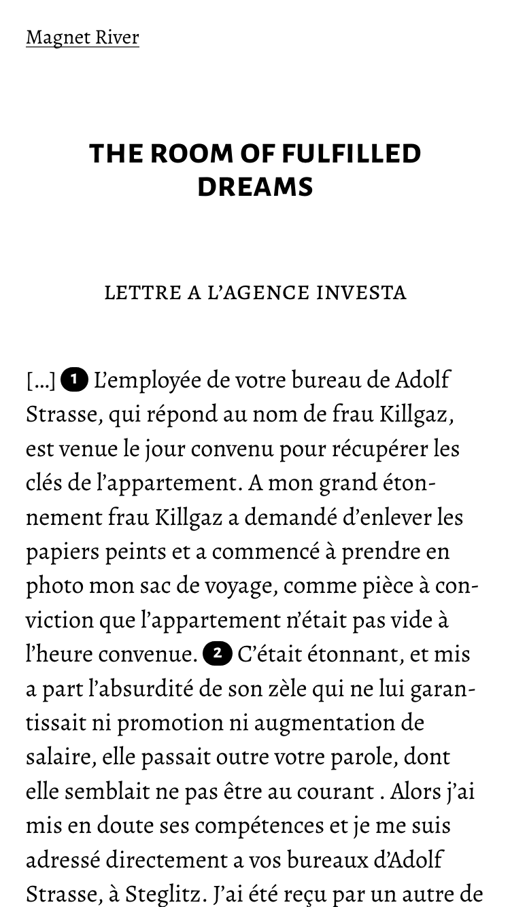
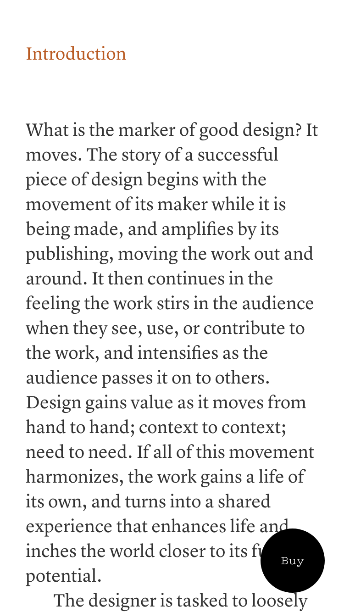
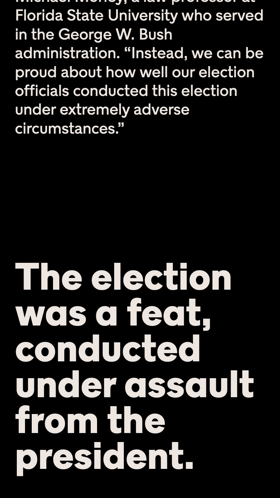
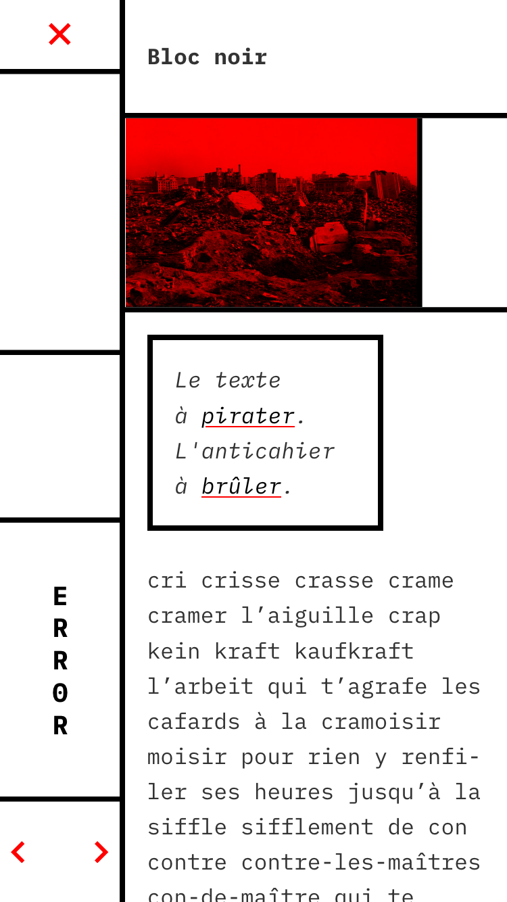

<header markdown="1">
# Text Edit
</header>

***

<header markdown="1" id="intro" >
## Objectif

###### Composer un texte responsive  {.objectif}
###### ↓
###### mobile {.objectif1}
###### ↕
###### écran {.objectif2}
###### ↕
###### papier {.objectif3}
</header>

<header id="cil"  markdown="1" >
## Le texte
# Le code fait loi
## De la liberté dans le cyberespace
### —  Lawrence Lessig
</header>

*Code is law* est le titre d’un article de référence écrit par Lawrence Lessig en janvier 2000 pour Havard Magazine.

Lawrence Lessig est professeur de droit des affaires au Centre Berkman de la Harvard Law School. Dans cet article, il présente le code comme la "loi du cyberpespace", proposant que selon comment le code est conçu il modifie radicalement la façon dont on peut utiliser les outils informatiques ou numériques.

L'auteur analyse notamment la régulation d'internet, ce que contrôle le code, évoque les architectures du cyberespace et enfin les valeurs sous-jacentes du code : les codeurs (majoritairement hommes, blancs, de classes sociales aisées) écrivent le code, mais avons-nous démocratiquement un mot à dire dans les valeurs qu'ils mettent dans celui-ci ?

La traduction du texte a été produite par Barbidule, Siltaar, Goofy & Don Rico pour Framasoft. L’article original est en ligne sur [Harvard Magazine](https://harvardmagazine.com/2000/01/code-is-law-html)

Devenu un “classique”, le texte a inspiré de nombreuses réactions. Lionel Maurel en a proposé un renversement, « Law Is Code », [sur son blog S.I.Lex](https://scinfolex.com/2014/01/24/comment-code-is-law-sest-renverse-en-law-is-code/). Véronique Bonnet, présidente de l’April, professeur de philosophie, propose [Code is Education](https://www.april.org/code-education-un-editorial-de-rentree-de-veronique-bonnet-presidente-de-l-april). Olivier Ertzscheid, pas avare en jeux de mots annonçait « [Code is Jail / business / money / judge](https://affordance.typepad.com/mon_weblog/2015/03/code-is-law-and-code-is-jail.html) ».  

Lessig est notamment l’un des fondateurs des licences [*Creative Commons*](https://creativecommons.org/) et l’auteur du livre *Free Culture*, [téléchargeable légalement ici-même](../zones/texts/lessing_freeculture.odt).

<a class="button" href="https://framablog.org/2010/05/22/code-is-law-lessig/">Lire le texte</a>

****

## 1. Mobile *text* first

L’approche *mobile first*, notamment développée par Luke Wroblewski dans son ouvrage éponyme – lire [ici](https://www.dropbox.com/s/u07bwpgbkjkdoem/Mobile_first_ed1_v1.pdf?dl=0) – permet de se concentrer sur l’accessibilité et la lisibilité du contenu dans les conditions de mise en page les plus contraintes.

Il s’agit donc dans un premier temps de veiller à la qualité de la composition typographique : choix des familles de caractères, gestion de la hiérarchie, espace blanc, adaptation du corps de texte au support, etc.

### Quelques exemples de composition de texte 

  <figure>
    
    <figcaption><a href="https://www.lemonde.fr/big-browser/article/2020/07/17/les-emojis-au-c-ur-de-batailles-de-representation_6046552_4832693.html">LeMonde.fr</a></figcaption>
  </figure>
  <figure>
    
    <figcaption><a href="https://qz.com/africa/1931111/googles-project-taara-to-deliver-fast-speed-internet-to-africans/">QZ.com</a></figcaption>
  </figure>
  <figure>
    
    <figcaption><a href="https://modus.medium.com/on-the-visual-weariness-of-the-web-8af1c969ce73">Medium.com</a></figcaption>
  </figure>
  <figure>
    
    <figcaption><a href="https://material.io/design/typography/the-type-system.html">Material.io</a></figcaption>
  </figure>
  <figure>
    
    <figcaption><a href="http://magnetriver.com/contents/the-room-of-fulfilled-dreams">MagnetRiver.com</a></figcaption>
  </figure>
  <figure>
    
    <figcaption><a href="https://qalqalah.org/fr/carnets-de-recherche/myriam-suchet-opening-en-forme-de-mind-opener">Qalqalah.org</a></figcaption>
  </figure>
  <figure>
    
    <figcaption><a href="https://shapeofdesignbook.com/chapters/00-introduction/">ShapeOfDesignBook.com</a></figcaption>
  </figure>
  <figure>
    
    <figcaption><a href="https://www.nytimes.com/interactive/2020/11/07/magazine/election-voting-democracy.html">NYTimes.com</a></figcaption>
  </figure>
  <figure>
    
    <figcaption><a href="https://www.error.re/bloc-noir/">Error.re</a></figcaption>
  </figure>

***

## 2. Vibration

Le design graphique est un langage dont la richesse réside dans la tension qu’il entretient entre art et communication, entre la mise en forme d’un matériau informatif et la création d’une vibration esthétique et sensible. 

<blockquote class="cyborgs">
      
  
The important question then, is not: Are we becoming cyborgs? It is: What kind of cyborg do we want to be, now and in the future?    

  <cite>Mark Zuckerberg à la conférence Samsung au MWC2016, photo © Facebook + Sean Ness, <i>Human+Machine Futures in Full Color: Extending Our Senses and Ourselves</i> (IFTF, 2015) cité par la <a href="http://www.zite.fr/wp-content/uploads/2017/11/Brochure_Z9_Google.pdf">revue Z</a></cite>
</blockquote>

Tout exercice de design propose au designer de s’approprier le contenu à mettre en forme. Les contraintes issues de l’approche *mobile first*, notamment spatiales, ne doivent pas empêcher l’audace et l’ambition dans la mise en page ou la composition typographique. 

La convocation d’images, de citations, d’illustrations est possible. Tout comme est possible – souhaitable – la création d’un rythme au sein du document, qui soutienne la lecture.

Le paratexte (titre et sous-titre, auteur, date, colophon et crédits) doit être questionné et pris en charge pour le donner à lire : dans quel ordre doit-on afficher ces éléments ? Quels registres hiérarchiques doit-on proposer ? Est-il envisageable de commencer par le texte et de finir par le titre ? Quelles sections, phrases, mots, mettre en exergue ?

***

## 3. Think fluid

Le web est un média *fluide*.  

☞ Une page Web est un document liquide : si on redimensionne la fenêtre d’un navigateur affichant un simple document HTML, les éléments s’adaptent à l’espace disponible et “coulent” à l’intérieur. Le “viewport”, la zone visible du navigateur n’a pas de dimension fixe, elle est “scrollable”, “zoomable” et sa dimension originelle, qui s’adapte naturellement à la quantité de contenu, est inconnue. 

☞ Le Web est fluide temporellement, il est animé, il accueille des mouvements spatiaux, des vidéos et des animations, il est en transition entre de multiples états. 

☞ Sa fluidité est aussi celle de son contenu. Il est traversé par des flux de données en évolution constante, qui émettent des signaux, se répondent

<blockquote class="fluide">

Le design fluide crée des architectures fluides : des structures malléables, liquides, capables de supporter toutes sortes de contenus

<cite>Louise Drulhe, <a href="https://louisedrulhe.fr/designfluide/#manifeste">Design Fluide, Manifeste</a></cite>
</blockquote>

### Références et ressources

*[Responsive 💧 man ](http://projects.niravigad.com/responsive_man/)* par Nir Avigad. *[The Quick brown 🦊](https://www.thequickbrown.com/)* par Jonhatan Puckey. *[Requête 🚀 spatiale](https://raphaelbastide.com/workshops/requetespatiale/)*, workshop de Louise Drulhe et Raphaël Bastide. *[What You See 👀  Is What You Get](https://whatyouseeiswhatyouget.net)* par Jonas Lund.

Quelques ressources sur la [micro et macro typographie](../../ressources/typo/macromicro/) et les bases du *[Responsive web design](../../ressources/rwd/)*, ainsi que quelques exemples liés au [RWD](../../exemples/#rwd) ou à la mise en page avec [flex](../../exemples/#flex) et [grid](../../exemples/#grid), voire même à la [mise en page de texte responsive](../../exemples/text/).

***

## 4. Print it!

Depuis [sa version 2](http://www.yoyodesign.org/doc/w3c/css2/cover.html), en 1998, le langage CSS permet de spécifier des propriétés dédiées (⇒ donner une forme spécifique) aux documents web imprimés. Si les fabricants de navigateurs n’en ont pas fait une grande priorité dans leurs développements, des designers ont investi cet espace et en ont fait un champ d’expérimentation, d’exploration et de production. 

La section [html2print](../../ressources/html2print/) offre une introduction à ces pratiques et référence des outils, inititatives et exemples de projets.

Parmi ces outils, la librairie [Paged.js](https://pagedjs.org/) est l’une des initiatives les plus abouties et prometteuses. Basée sur les standards CSS Print définis par le W3C, elle permet de mettre en page des documents paginés (= des livres, des magazines, des fanzines), de les imprimer ou d’en générer des pdf depuis le navigateur.

La documentation –en anglais– de la librairie est importante. Lire notamment [Getting Started with Paged.js](https://www.pagedjs.org/documentation/02-getting-started-with-paged-js/) et [Named Page](https://www.pagedjs.org/documentation/08-named-pages/). Le dépôt Gitlab recèle de très nombreux et utiles exemples : 

Julien Taquet (et Julie Blanc) répondent régulièrement aux questions posées sur [mattermost](https://mattermost.pagedmedia.org/pagedmedia/channels/town-square).

Un exemple, récapitulatif de l’ensemble des étapes parcourues, est accessible ici :

<a class="button" href="../../exemples/textedit/">Go To Print</a>

<footer markdown="1" >
—

Police de titrage : [Sprat](https://github.com/EthanNakache/Sprat-type), [Ethan Nakache](http://www.ethannakache.com/)
</footer>

