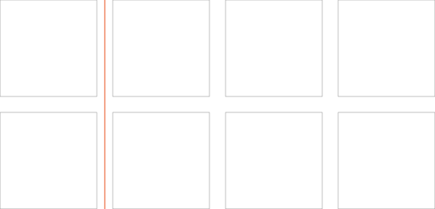
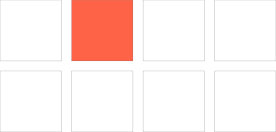
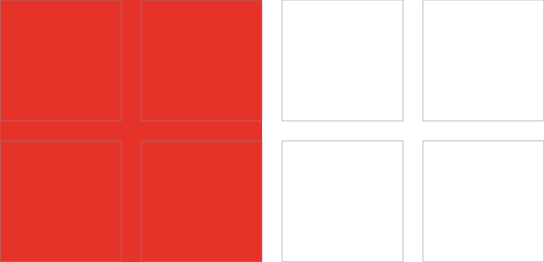
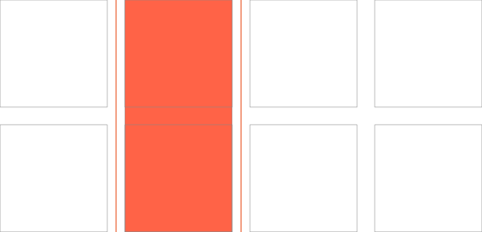
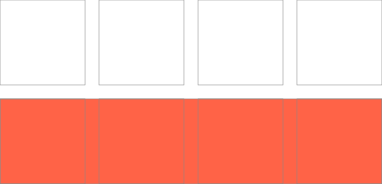
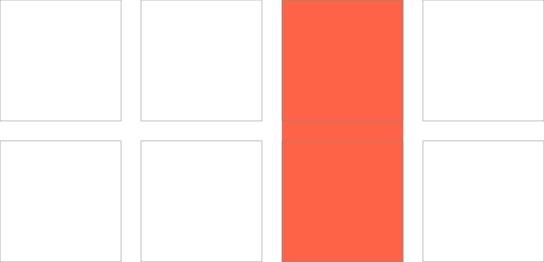
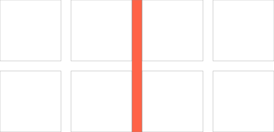
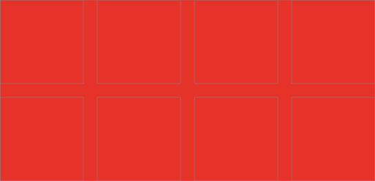
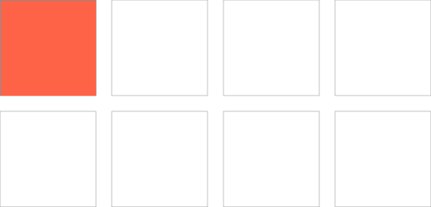

# CSS Grid layout
<style>
img {max-width: 300px}
</style>

*Grid layout* est le module CSS dédié à la mise en page.
Il est apparu après des années de bricolage ou furent utilisées des techniques parfois approximatives souvent complexes et contre-intuitives (tables, floats, inline-blocks).

Il diffère de [Flexbox](../flexbox) principalement par le fait qu’il est dédié à des *layouts* bi-dimensionnels (lignes **et** colonnes), là où flexbox est dédié aux layouts uni-dimensionnels (lignes **ou** colonnes).

## Ressources en ligne

De nombreuses ressources sont disponibles en ligne : [Gridbyexample.com](https://gridbyexample.com/examples/), les grilles, par l’exemple… ; *Visual cheat sheet*, [toutes les propriétés, illustrées](http://grid.malven.co/) ; [CSS Grid Cheat Sheet](https://alialaa.github.io/css-grid-cheat-sheet/), *your ultimate CSS grid visual guide* ; [☞ Layoutland](https://www.youtube.com/layoutland), les vidéos éclairantes de Jen Simmons ; [_Grid experiments_](https://codepen.io/search/pens?q=grid+experiment) sur Codepen…

## Exemples

*   Quelques [exemples](../../../exemples/#grid) sur le site de l’atelier web


# Démarrer

On crée un “contexte de grille” en appliquant la déclaration `display: grid` à un élément HTML. 
```css
.container { display: grid; }
```
Cette déclaration va permettre de définir un ensemble de pistes, formées de lignes et de colonnes, définissant des “cellules”.

```css
.container { 
  display: grid; 
  grid-template-columns: 1fr 1fr 1fr; /* définit explicitement une grille de trois colonnes */
  grid-template-rows: repeat(3, 1fr); /* définit explicitement  une grille de trois lignes, avec "repeat()" */
}
```

Cet ensemble “virtuel” de lignes et de colonnes va permettre aux enfants de ce conteneur de devenir des `grid-items` qui seront positionnées au sein des cellules de la grille.

On peut souhaiter déterminer une goutière (un espace entre les lignes et colonnes) :

```css
.container { 
  display: grid; 
  gap: 1em; /* espace uniforme ou bien: */
  gap: 1em 2em; /* espace de 2em entre les colonnes, 1em entre les lignes */
}
```

## Implicite _vs_ explicite

Il est souvent souhaitable de laisser le navigateur déterminer le nombre de lignes (voire même de colonnes) nécessaires pour afficher les enfants d’une grille dans ses cellules.

Plutôt que la déclaration ci-dessus, on préférera parfois utiliser celle-ci :

```css
.container { 
  display: grid; 
  gap:.5em;
  /* autant de colonnes que possible (auto-fill), dont la largeur est au minimum 300px */
  grid-template-columns: repeat(auto-fill, minmax(300px, 1fr)); 
  /* on ne définit pas de lignes, le navigateur en créera autant que nécessaire */
}
```

<div resizable class="intrinsic">
  <p>1</p>
  <p>2</p>
  <p>3</p>
  <p>4</p>
  <p>5</p>
  <p>6</p> 
</div>

## Positionnement des éléments

Les éléments d’une grille peuvent être excplicitement affectés à une cellule.

```html
<body>
  <nav>nav</nav>
  <section>section</section>
  <article>article</article>
  <aside>aside</aside>
</body>
```
```css
body {
    display: grid; /* crée une grille */
    grid-template-columns: 150px 500px; /* crée deux colonnes */
    grid-template-rows: 100px 200px; /* crée deux lignes */
    grid-column-gap: 20px; /* goutière verticale */
    grid-row-gap: 20px; /* goutière horizontale */
}
nav {
    /* ligne 1, colonne 1 */
    grid-row: 1; grid-column: 1;
}
section {
    /* ligne 1, colonne 2 */
    grid-row: 1; grid-column: 2;
}
article {
    /* ligne 2, colonne 1 */
    grid-row: 2; grid-column: 1;
}
aside {
    /* ligne 2, colonne 2 */
    grid-row: 2; grid-column: 2;
}
```
<div class="ex2">
  <nav>nav</nav>
  <section>section</section>
  <article>article</article>
  <aside>aside</aside>
</div>


## Zones

En complément de `grid-template-columns` et de `grid-template-rows`, on peut **nommer** les emplacements à l’aide de chaines de caractères  ou de lettres, grâce à la propriété `grid-template-areas`.
```
section {
    display: grid;
    grid-template-areas: "entete entete"
                         "navigation contenu"
                         "pied pied";
}
nav {
    grid-area: navigation; /* placement de <nav> dans l'emplacement “navigation” */
}
```

<div class="container ex3" >
  <header>header</header>
  <aside>aside</aside>
  <nav>nav</nav>
  <footer>footer</footer>
</div>


## Flexibilité

CSS Grid introduit des unités plus complexes que les habituels `px`, `%`, `em`, qui permettent notamment de s'adapter à la taille des contenus et d’aporter beaucoup de flexibilité à la mise en page.

| Unité     | Détails     |
| :------------- | :------------- |
| `fr`  | fraction(s) de l'espace restant |
| `min-content`  | se rapporte à la largeur (ou hauteur) de l'élément le plus petit |
| `max-content`  | se rapporte à la largeur (ou hauteur) de l'élément le plus grand |
| `minmax(min, max)`  | exemple `minmax(min-content, 20%)` correspond à largeur 20% (ou hauteur), mais au  minimum largeur (ou hauteur) du contenu |
| `auto`  | s'adapte à la largeur (ou hauteur) du contenu |
| `fit-content`  | identique à auto et aussi à `minmax(min-content, max-content)` |


## Ressources

Quelques liens pour débroussailler le terrain…

### Tutoriaux complets

*   [CSS Grid Layout, guide complet](https://la-cascade.io/css-grid-layout-guide-complet/), La Cascade, (fr)
*   [Les bases](https://developer.mozilla.org/fr/docs/Web/CSS/CSS_Grid_Layout), sur Mozilla Developper Network (fr)
*   [CSS3 Grid Layout](https://www.alsacreations.com/article/lire/1388-css3-grid-layout.html), sur Alsacreations (fr)

### Examples

*   [gridbyexample.com](https://gridbyexample.com/examples/), les grilles, par l’exemple…
*   [CSS Grid Cheat Sheet](https://alialaa.github.io/css-grid-cheat-sheet/), your ultimate CSS grid visual guide


### Vocabulaire

Quelques précisions de vocabulaire sur les notions essentielles nécessaires à la compréhension de Grid layout.


#### Lignes (*line*)
Les lignes (*lines*) verticales et horizontales qui divisent la grille et en colonnes (*columns*) et en lignes (*rows*).



#### Cellule (*cell*)
Une seule unité d’une grille CSS.



#### Zone (*area*)
Un espace rectangulaire déterminé par quatre lignes.



#### Piste (*track*)
L’espace horizontal ou vertical entre deux lignes de la grille.



#### Ligne (*row*)
Une piste horizontale d’une grille.



#### Colonne (*column*)
Une piste verticale d’une grille.



#### Gouttière (*gutter*)
L’espace entre les lignes et les colonnes dans une grille.



#### Conteneur (*container*)
Le conteneur qui contient la totalité de la grille CSS. C’est l’élément auquel on affecte la propriété `display: grid` ou `display: inline-grid`.



#### Élément (*grid item*)
Tout élément qui est l’enfant direct d’un conteneur de grille.
