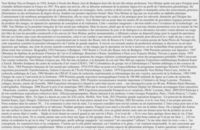
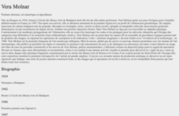
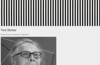
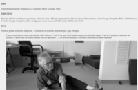
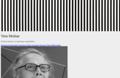
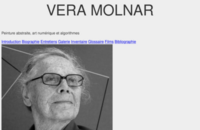
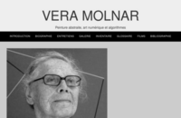
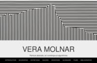
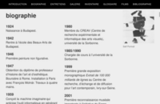
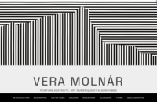

# Processus pratique

Ce “pas-à-pas” est dédié à montrer le processus de structuration d’un document HTML en vue de lui appliquer de la mise en forme CSS.

👉 Les exemples HTML et CSS sont commentés. Il faut afficher le code source des pages pour accéder aux commentaires (`cmd/ctrl + U` sous Firefox ou `cmd/ctrl + maj + U` pour Chrome).

Les [exemples peuvent être téléchargés](css-pas-a-pas.zip).

## 1 – Déterminer un espace de travail


Créer un dossier pour ranger les documents HTML (les *pages*) et les ressources associées (feuille de style, images, etc.). Voir [HTML / Bien démarrer](../../html/start).

## 2 – Asssocier une feuille de style à un document HTML

[](examples/01.html)

Lire la section [Appliquer du style](../), et utiliser la liaison décrite dans le point 3 (CSS externe).

#### [Exemple #1](examples/01.html) : HTML textuel non balisé

## 3 – Baliser le HTML

[](examples/03.html)

Pour pouvoir mettre en page et en forme le document, il faut commencer par déterminer sa structure grâce au balisage HTML.

#### [Exemple #2](examples/02.html) : HTML textuel balisé


Dans l’exemple 2, seul le contenu textuel brut est structuré en titres et en paragraphes. L’exemple 3 ajoute les informations d’italique (pour les titres de œuvres et des ouvrages) et les liens vers d’autres pages web.

#### [Exemple #3](examples/03.html) : HTML textuel balisé plus finement

## 4 – Structurer le HTML

[](examples/04.html)

Pour pouvoir structurer visuellement le document, il faut pouvoir découper le flux du texte en des éléments qui regroupent les informations en “sections”. 

HTML propose de nombreuses balises dédiées : `header` pour les entêtes, `footer` pour le “pied de page”, `main` pour distinguer le contenu principal d’une page, `article` ou `section` pour diviser le contenu en différentes parties, voire `div`, balise non-sémantique (elle n’a pas de *sens*, contrairement aux autres précédement citées) qui permet simplement de diviser le contenu en blocs.

#### [Exemple #4](examples/04.html) : HTML textuel structuré en “sections”


## 5 – Associer les médias

[](examples/05.html)

À la base textuelle brute, on peut ajouter des médias : images, sons ou vidéos, qu’on peut intégrer directement dans le flux du texte, en entête des sections, ou en listes.

#### [Exemple #5](examples/05.html) : Ajout des médias


## 6 – Préciser le HTML

[](examples/06.html)

Pour pouvoir être plus facilement mis en forme, les éléments HTML peuvent recevoir des attributs qui vont permettre de les sélectionner plus précisément en CSS. En savoir plus sur les [sélecteurs CSS](../selectors) (voir notamment [`class`](../selectors/#class) et [`id`](../selectors/#id)).

#### [Exemple #6](examples/06.html) : Ajout de classes et d’identifiants

L’attribut [`class`](../selectors/#class) sert à déterminer plusieurs éléments qui recevront une même mise en forme ; l’attribut [`id`](../selectors/#id) permet de déterminer des éléments uniques.

## 7 – Créer une sous-navigation

[](examples/07.html)

La présence d’attributs `id` sur les sections permet de créer une navigation à l’intérieur de la page : l’attribut `href` du lien doit correspondre à l’`id` de la section cible précédé par un `#`.
```
<a href="#introduction">aller à l’introduction</a>
<section id="introduction">…</section>
```

#### [Exemple #7](examples/07.html) : Navigation interne

## 8 – Principes typographiques

[](examples/08.html)

On peut commencer par produire des choix typographiques : déterminer la famille de caractères, le corps de texte et la hiérarchie typographique. Lire la page consacrée aux [styles dédiés au texte](../text/), mais aussi les informations sur [l’intégration de fontes web](../../typo/webfonts/) ou plus généralement les pages consacrées à [la typo à l’écran](../../typo/).

👉 Les exemples CSS sont commentés. Il faut afficher le code source de la [feuille de style](examples/style-08.css) pour accéder aux commentaires.

#### [Exemple #8](examples/08.html) : Styles typographiques

## 9 – Principes de mise en page

[](examples/09.html)

Si jusqu’ici, il n’y avait que peu de choix graphiques à produire, cette phase détermine des directions nécessairement subjectives.

Nous allons :

* déterminer les principes généraux (taille max des images, des paragraphes)
* mettre en page l’entête et la navigation
* fixer la navigation en haut de page
* distinguer les sections par un arrière-plan différent et de l’espace intérieur

#### [Exemple #9](examples/09.html) : Mise en page

## 10 – Affiner la mise en forme

[](examples/10.html)

Objectifs :

* corriger l’orthographe :)
* améliorer la galerie et la mise en page des images
* préciser certains styles grâce aux attributs `class` et `id`
* différencier la famille de caractères pour certaines sections
* créer des liens dans la galerie pour afficher les images en taille originale

#### [Exemple #10](examples/10.html) : Mise en page affinée


## 11 – Aller plus loin

[](examples/11.html)

Objectifs :

* choix typographique plus précis
* mise en relief des informations importantes

#### [Exemple #11](examples/11.html) : Aller plus loin

## 12 – Faire vibrer

[](examples/12.html)

Ces étapes ont permis de produire une mise en forme fonctionelle, assez simple et relativement efficace pour présenter le contenu. Rendre le contenu accessible et lisible est le premier enjeu du designer.

Une ambition supplémentaire, et également nécessaire, serait de transmettre *à travers les formes* graphiques et typographiques un supplément d’âme, qui rendrait mieux justice au contenu (ici, le travail de Vera Molnár), et produirait une vibration esthétique plus puissante.

Pour ce faire, une *intention* doit guider la mise en forme CSS – et quelques modifications mineures doivent être apportées à la structure HTML.

#### [Exemple #12](examples/12.html) : Vibration
