# CTRL + Alt + print

Pourquoi et comment créer des documents imprimés avec des outils alternatifs \[ et notamment avec les langages du web \].

Explorées par de nombreux collectifs de graphistes et d’artistes depuis plus d’une dizaine d’années, les “approches alternatives de production d’objets imprimés” rassemblent des logiques de conception qui tentent de s’affranchir de la domination des outils logiciels habituels du design éditorial (Adobe, Microsoft et autres suites bureautiques propriétaires) pour faire l’expérience d’une forme d’autonomie reconquise. Basées sur l’usage de logiciels libres, volontiers expérimentales, ces pratiques ont acquis au fil du temps une maturité qui leur confère aujourd’hui une légitimité jusque dans le champ de l’édition traditionnelle. 

Les pratiques du _web to print_, ou _html to print_, forment un sous-ensemble de cette dynamique. Elles visent à produire des documents imprimés grâce à l’utilisation des langages du web (HTML, CSS et JavaScript), en s’appuyant sur les capacités de gestion du texte, des images ou des médias des navigateurs, ainsi qu’en bénéficiant des capacités nativement collaboratives et décentralisées du web. 

## En images

<figure>
    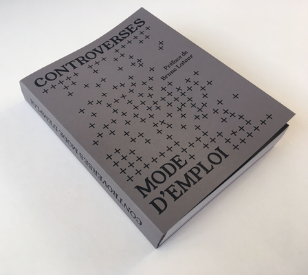
    <figcaption>Sarah Garcin : <a href="https://controverses.org/mode-demploi/">Controverses mode d’emploi</a></figcaption>
</figure>
<figure>
    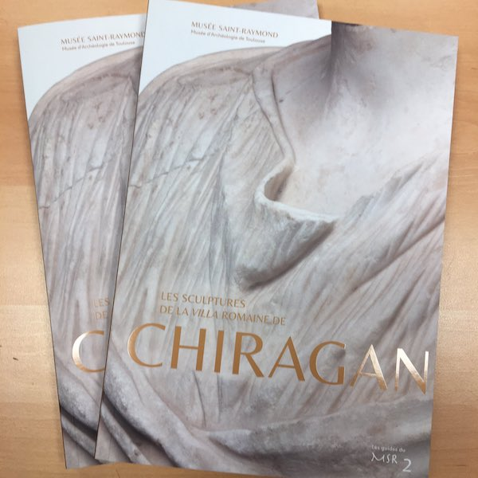
    <figcaption>Julie Blanc : <a href="https://controverses.org/mode-demploi/">Les sculptures de la villa Chiragan</a></figcaption>
</figure>
<figure>
    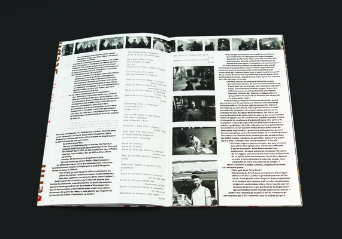
    <figcaption>Luuse : <a href="https://gitlab.com/Luuse/poisson-eveque">Poisson Éveque</a></figcaption>
</figure>
<figure>
    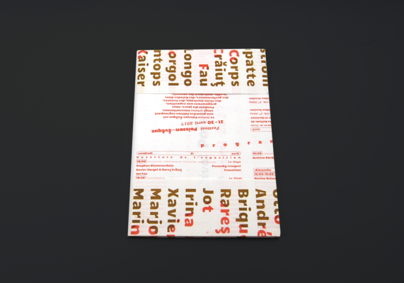
    <figcaption>Luuse : <a href="https://gitlab.com/Luuse/poisson-eveque">Poisson Éveque</a></figcaption>
</figure>
<figure>
    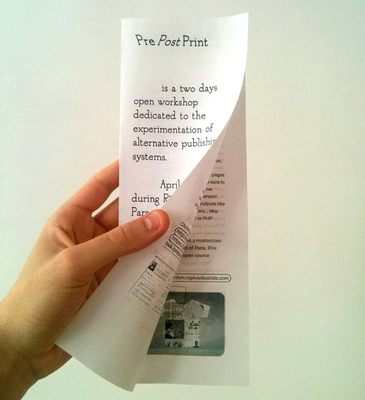
    <figcaption>Raphaël Bastide : <a href="https://prepostprint.org/">Flyer PPP</a></figcaption>
</figure>
<figure>
    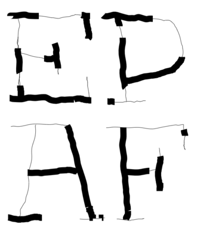
    <figcaption>Raphaël Bastide : <a href="https://raphaelbastide.com/epaf/">Each page a function</a></figcaption>
</figure>
<figure>
    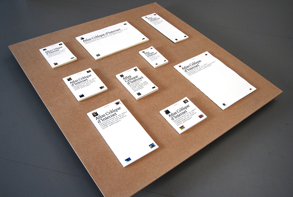
    <figcaption>Louise Drulhe : <a href="https://louisedrulhe.fr/internet-atlas/">Atlas Critique de l’Internet</a></figcaption>
</figure>
<figure>
    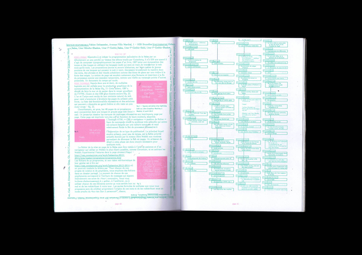
    <figcaption>Open Source publishing : <a href="http://osp.kitchen/work/balsamine.2020-2021/">Balsamine</a></figcaption>
</figure>
<figure>
    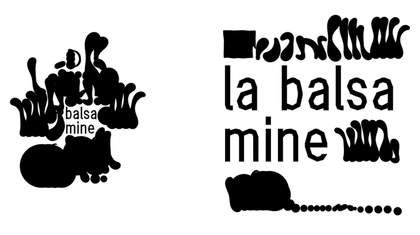
    <figcaption>Open Source publishing : <a href="http://osp.kitchen/work/balsamine.2020-2021/">Balsamine</a></figcaption>
</figure>
<figure>
    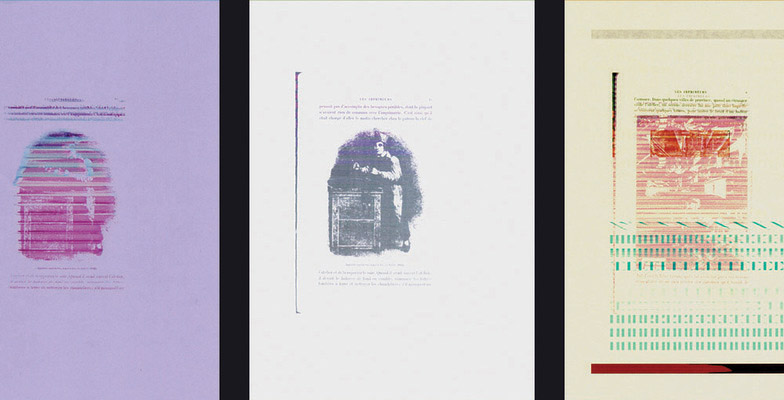
    <figcaption>Bonjour Monde : <a href="http://bonjourmonde.net/">Workshop Gutenberg</a></figcaption>
</figure>
<figure>
    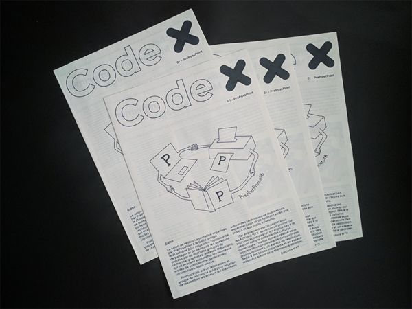
    <figcaption><a href="http://editions-hyx.com/fr/code-x">Code X</a></figcaption>
</figure>
<figure>
    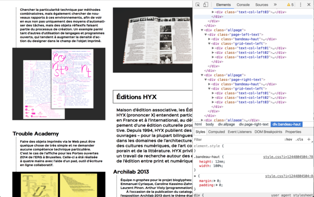
    <figcaption><a href="http://editions-hyx.com/fr/code-x">Code X</a></figcaption>
</figure>
<figure>
    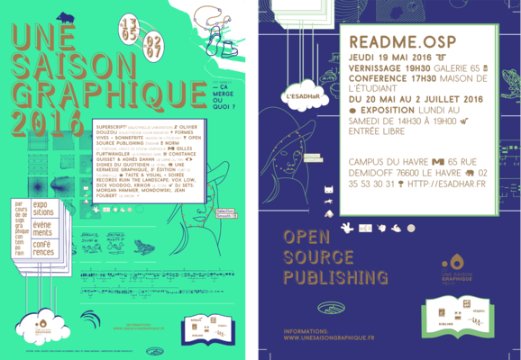
    <figcaption>Open Source publishing : <a href="http://osp.kitchen/workshop/saison-graphique/">Une saison graphique</a></figcaption>
</figure>
<figure>
    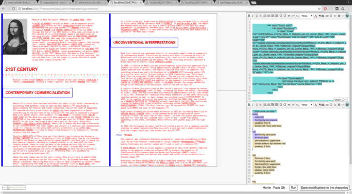
    <figcaption>Luuse : <a href="https://gitlab.com/Luuse/pad2print/">pad2print</a></figcaption>
</figure>
<figure>
    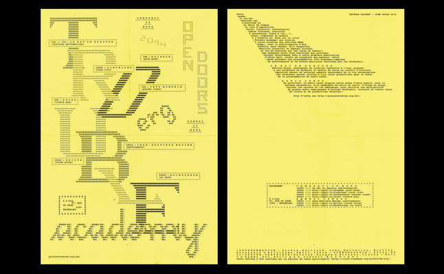
    <figcaption>After Howl : <a href="https://afterhowl.tumblr.com/">Trouble Academy</a>  </figcaption>
</figure>

## Exemples pratiques

Voir les exemples dans la [section dédiée](/web/pages/exemples/#htmltoprint) du site des ateliers Web, ou dans la page consacrée à [Paged.js](pagedjs/#more).

## Pourquoi ?

Pourquoi s’engager dans les processus web to print / les approches alternatives de production d’objets imprimés 

> « Les technologies du web offrent un environnement de publication ouvert et décentralisé. Les documents web sont ainsi éditables en différents endroits et temporalités par une variété de personnes et d'outils, rompant avec la logique linéaire de l'ère Gutenberg. ¶ Dans cet espace, la notion de flux est centrale: le flux des données, allant de la conversion de documents "bruts" vers la production de multiples formats; le flux des formes produites, conditionné par la struture du HTML et la logique de «cascade» des feuilles de style; ou encore le flux des personnes et les nouveaux moyens de collaboration qui leurs sont offerts par le net. ¶ Si cet espace offre de nouvelles possibilités, cela ne va pas sans poser de questions. Comment penser un design alors sans le subordonner au contenu? Comment publier sur différents formats sans nier la spécificité des différents supports? Comment tester et combiner différentes pistes de mise en page? Comment se partager les taches tout en permettant à tous d'avoir une vue d'ensemble sur l'objet produit ? »  — [OLA](http://ola4.outilslibresalternatifs.org/#00-ola)

### Parce que c’est amusant
Les pratiques du _web to print_ ont pour essence celles du _hacking_, entendu comme un ensemble de pratiques comprenant : « le partage des connaissances, le refus de l’autorité et la promotion de la décentralisation, le perfectionnisme, la primauté de la pratique (_hands-on imperative_), et le jeu, l’amusement comme première et principale motivation. »[^hacking],

[^hacking]:  Lire « l’éthique des hackers », Steven Levy, _in_ Hackers: Heroes of the Computer Revolution.

Le jeu et l’amusement, la satisfaction que procure le détournement d’un outil ou d’une technique, la joie procurée par les chemins buissonniers, la liberté reconquise sur les injonctions,  l’_encapacitation_ que procure l’expérience de l’autonomie… toutes ces dimensions sont au cœur des approches proposées par les logiques alternatives de production d’objets imprimés.

### Dominer ses outils, ne pas être dominé⋅e par eux

Les outils de la création graphique sont aujourd’hui concentrés dans les mains de grandes firmes (notamment Adobe et Apple) dont les décisions sont liées à leur mode d’existance _en tant que_ grandes firmes (capitalistes). Leur mode de facturation (la location de l'outil de travail), leur pratique éhontée de l’obsolescence programmée et du contrôle de leurs utilisateurs, l’absence d’interopérabilité de leurs outils en font des écosystèmes fermés, des prisons dorées, dans lesquelles les designers graphiques sont souvent contraint⋅es d’évoluer, et dont ils et elles deviennent dépendants.

Si des alternatives libres ([Gimp](https://www.gimp.org/), [Inkscape](https://inkscape.fr/), [Scribus](https://www.scribus.net/)) ou commerciales ([Affinity](https://affinity.serif.com/)) existent ou émergent, Adobe a établi une puissante hégémonie sur l’écosystème logiciel de la création graphique. Ce qui n’est pas sans poser quelques problèmes:

☞ En 2020, les dépenses marketing de la firme s’élèvent à 3,591 milliards de dollars. En 2022, Adobe rachète Figma pour 20 milliards de dollars.

### Embrasser la fluidité

Les contenus d’un ouvrage imprimé doivent être définis et figés en amont de l’intervention d’un⋅e designer. Une fois cette intervention débutée, le travail de mise en œuvre de la mise en pages ne peut que difficilement être partagé par plusieurs acteur⋅ices. Internet et le web sont des espaces conçus pour l’échange dînformations, il sont donc beaucoup naturellement en adéquation avec les logiques collaboratives. 

Certains outils numériques (git, etherpad) ont fondé leur approche sur cette capacité des espaces numériques au temps réel, à l’échange et au partage. Le contenu peut alors être conçu et développé _en même temps_ que la mise en page, la réalisation d’illustrations photographiques ou dessinées.

Les perspectives du _single source publishing_ permettent également à un même contenu de se déployer sur différents médias : web, print, e-pub, PDF.

### Explorer de nouvelles formes

L’homogénéité des outils dominants de la chaîne graphique produit un formatage de l'expérience esthétique. Le conditionnement dans lesquels ces outils nous enferment semble difficilement perceptible tellement leur complexité fonctionnelle est étendue, mais de très nombreuses décisions sont prises avant que le premier geste graphique ait été esquissé.

La logique profondément _responsive_ du web, les capacités de CSS à se décliner selon les médias, les possibilités du code informatique dans le traitement de données (en [JavaScript](../js), mais aussi en [Python](../python/), en [PHP](../php/), ou via des librairies comme [p5.js](../canvas/) ou [paper.js](../canvas/)) démultiplient les possibilités dans lesquelles les outils habituels nous maintiennent.

> <big>« Quel que soit le code hacké, quelle que soit sa forme, langage programmatique ou poétique, mathématique ou musical, nous créons la possibilité de mettre au monde des formes nouvelles. Pas toujours de grandes choses, pas même de bonnes choses, mais de nouvelles choses. »</big>    
— McKenzie Wark, A Hacker Manifesto