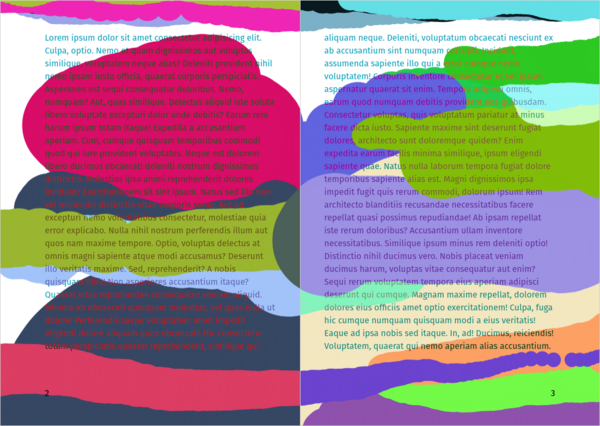
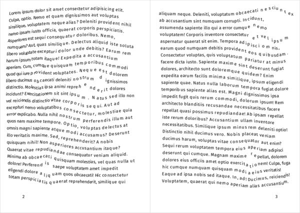
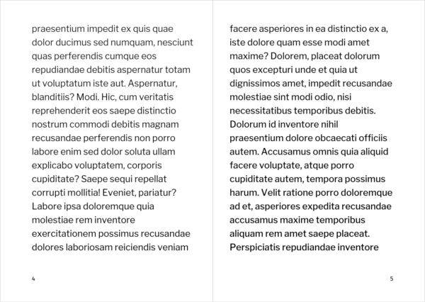
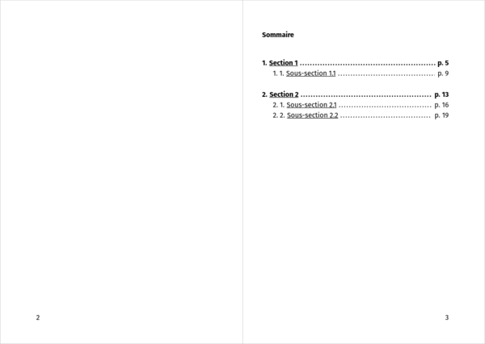
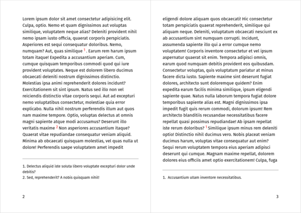
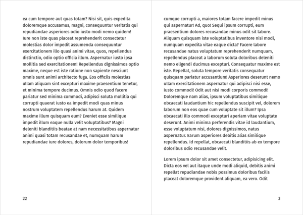

# Paged.js

Paged.js est une bibliothèque JavaScript open-source permettant de concevoir un contenu paginé dans un navigateur et de générer des documents PDF destinés à l’impression, en utilisant les langages du web (HTML, CSS et JavaScript).

Elle est aujourd’hui l’un des outils les plus performants pour le _web to print_, particulièrement lorsque l’on veut concevoir des documents multi-pages.

## Par où commencer ?

1 — Un navigateur web: [Ungoogled Chromium](https://github.com/Eloston/ungoogled-chromium#downloads) ou [Chromium](https://download-chromium.appspot.com/) (à défaut, Edge ou Chrome)

2 — Un serveur web : Paged.js a besoin d’un server web pour être exécuté. Sur Windows ou sur OSX : utiliser l’extension [live server](https://marketplace.visualstudio.com/items?itemName=ritwickdey.LiveServer) (Go Live) de VSCode ou pour OSX / linux, dans un  terminal :    

```bash
cd votre/dossier/de/travail
php -S localhost:8888  
# ou bien    
python -m SimpleHTTPServer 8888
# ou bien    
python3 -m http.server 8888
# ces 3 commandes permettent d’accéder à la page web sur http://localhost:8888
```    


3 — Un code source de base grâce au [Minute Hack](https://ateliers.esad-pyrenees.fr/web/minute-hack/?is_paged) de Raphaël Bastide ou en **[téléchargeant ce fichier zip](ctrl-alt-print.zip)**.

4 — Une bonne documentation ! RTFM sur [pagedjs.org/documentation](https://www.pagedjs.org/documentation/).
*[RTFM]: Read the fucking manual

## Comment ça marche ?

La librairie Paged.js permet de transformer un document “flux” en un document “paginé”, capable d’utiliser différents gabarits de pages, d’afficher des titres courants ou des numéros de pages, de générer une table des matières, etc.

L’exécution de paged.js va transformr le code-source HTML & CSS en un ensemble complexe d’éléments et de styles qui permettent de prévisualiser dans le navigateur le comportement de l’impression ou la génération de PDF.

Paged.js utilise les spécifications CSS prévues depuis CSS 2.1 (voir [la section précédente](../css2)).

### Définir le format du document
On peut définir le format de page et les marges grâce à la règle `@page`.
```css
@page {
  size: 148mm 210mm;
  margin: 1cm;
}
/* on peut également définir des comportements différents pour les 
pages de gauche et de droite ; ici, les “petits” et “grands fonds”
– marges intérieures et extérieures – sont inversés */
@page :left{
  margin: 33mm 23mm 65mm 45mm; 
}
@page :right{
  margin: 33mm 45mm 65mm 23mm;
}
```
On peut également déterminer des repères de coupe et une marge de fond perdu :
```css
@page {
  /* … */
  marks: crop;
  bleed: 4mm;
}
```
Paged.js générera alors un ensemble d’éléments HTML et de variables CSS qui permettront de mettre en pages le contenu et ses marges. Lire dans la documentation, la [règle @page](https://www.pagedjs.org/documentation/05-designing-for-print/#page-rule).

Voir [exemple 01](exemples/basics.html). 


### Définir des gabarits de page
Pour spécifier des “types” de pages singuliers (entrées de chapitre, couverture, page d’iconographie, etc.), on affecte une `class` à un élément du HTML. En CSS, on déclare une nouvelle page-type, puis on affecte cette page-type à cette `.class` grâce à une déclaration `page: typedepage`. Lire dans la documentation, les [pages nommées](https://www.pagedjs.org/documentation/08-named-pages/).
```html
<header class="couverture">
  <h1>Titre</h1>
  <h2>Sous-titre</h2>  
</header>
```
```css
@page macouverture {
  margin: 0;
  background: black;
}
.couverture { 
  page: macouverture;
  color: white;
}
```

Voir [exemple 02](exemples/gabarits.html). 

### Ajouter des numéros de page et des titres courants

Les _margin boxes_ créées par Paged.js peuvent accuillir du contenu: généré automatiquement, tels des numéros de page, ou présents dans le HTML (section courante, titre du document, etc.).

```css
@page :left{ 
  @bottom-left {
    content: counter(page);
  }
}
@page :right{ 
  @bottom-right {
    content: counter(page);
  }
}
/* pas de numéro de page pour la couverture */
@page macouverture {
  @bottom-right { content: none; }
  @bottom-left { content: none; }
}
```

Voir [exemple 03](exemples/folios.html). 


Paged.js offre d’autres possibilités que les compteurs de page, notamment grâce aux propriétés _[string-set](https://www.pagedjs.org/documentation/07-generated-content-in-margin-boxes/#named-string-classical-running-headersfooters)_ et _[position: running](https://www.pagedjs.org/documentation/07-generated-content-in-margin-boxes/#running-elements-headersfooter-with-specific-complex-content)_ (lire la documentation :).  Ici, un exemple avec `position: running()` :

```html
<section>
  <p class="title">Titre courant</p>
  <h1>…</h1>
  <p>…</p>
</section>
```

```css
/* supprime l’élément .title de l’affichage grâce à la déclaration position: running() */
.title {
  position: running(monTitreCourant);
}
/* injecte l’élément définit dans running() dans une margin-box */
@page {
  @top-center {
    content: element(monTitreCourant)
  }
}
```

Voir [exemple 04](exemples/titrecourant.html). 

## Aller plus loin {#more}


<div class="scrollables" >


<figure>
    
    <figcaption><a href="exemples/interactive.html">interactif</a></figcaption>
</figure>

<figure>
    
    <figcaption><a href="exemples/doublepage.html">Double-page d’image</a></figcaption>
</figure>


<figure>
    
    <figcaption><a href="exemples/jsafter.html">JS après</a></figcaption>
</figure>

<figure>
    
    <figcaption><a href="exemples/jsbefore.html">JS avant</a></figcaption>
</figure>

<figure>
    
    <figcaption><a href="exemples/toc.html">Table des matières</a></figcaption>
</figure>

<figure>
    
    <figcaption><a href="exemples/footnotes.html">Notes de bas de page</a></figcaption>
</figure>
<figure>
    
    <figcaption><a href="exemples/imposition.html">impression en livret</a></figcaption>
</figure>
</div>

Ces principes de base permettent de mettre en pages un contenu relativement rapidement. Mais de nombreuses possibilités graphiques peuvent encore être explorées, chacune demandant une approche spécifique. Ci-dessous viendront s’ajouter des liens vers des résolutions concrètes, des exemples plus complexes ou des problèmes courants.

Pour comprendre, [téléchargez les examples](pagedjs-exemples.zip) et examinez leur code source.

* Générer une [table des matières](exemples/toc.html)
* Gérer des [notes de bas de page](exemples/footnotes.html)
* Double-page avec [une seule image](exemples/doublepage.html)
* Exécuter du javascript [avant](exemples/jsbefore.html) ou [après](exemples/jsafter.html) l’action de Paged.js
* Imposer le document pour une [impression directe en livret](exemples/imposition.html)
* Éxécuter Paged.js [à la demande](exemples/ondemand.html)
* [Recharger le document à la même page](exemples/reloadinplace.html) en cas de modification css/html
* Rendre interactive [chaque page](exemples/interactive.html) d’un livre
* [Peindre les lettres](exemples/paintletters/index.html) d’un livre


On peut aussi parcourir les exemples de Julien Taquet sur [gitlab.pagedmedia.org](https://gitlab.pagedmedia.org/julientaq/book-of-cook/) ou sur [codepen.io/julientaq](https://codepen.io/julientaq/), les [experiments](https://gitlab.pagedmedia.org/tools/experiments) sur le gitlab de PagedMedia, ou les [démos](https://gitlab.com/prepostprint/demos) de Raphaël Bastide / PrePostPrint.

Un espace de discussion et de support est accessible sur le Mattermost de [coko.foundation](https://mattermost.coko.foundation/coko/channels/pagedjs). Julien Taquet et l’équipe de Paged.js y répondent aux questions des utilisateur·ices, quelque soit leur niveau de compétences ;)