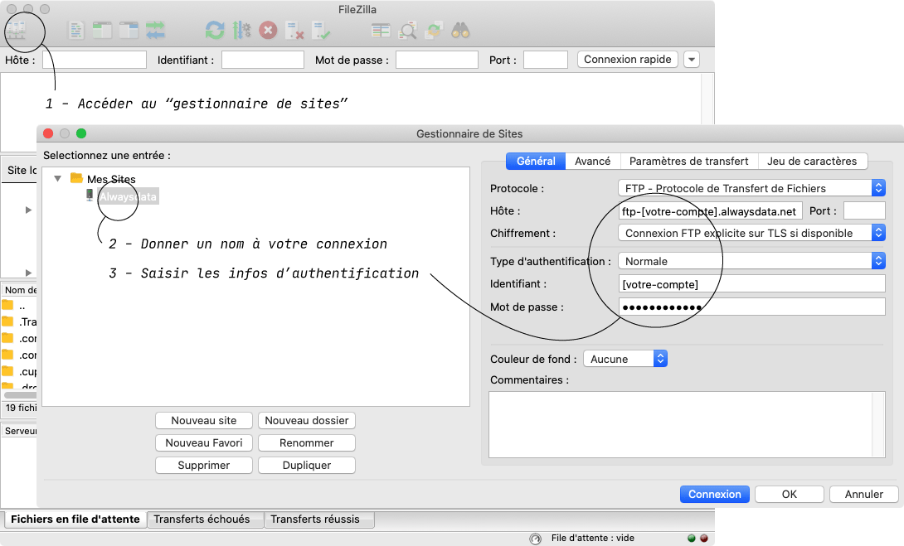
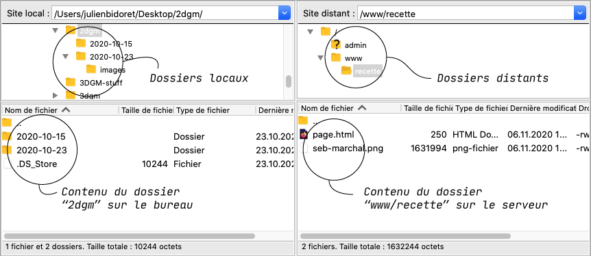

# Mise en ligne {#ftp}

Il existe aujourd’hui de nombreuses manières de mettre en ligne un site web, afin qu’il soit accessible au plus grand nombre (et notamment à vos enseignants !).

La plus ancienne et robuste est d’utiliser un logiciel FTP (*File Transfer Protocol*) pour copier les fichiers de votre ordinateur vers votre espace sur un serveur web.

## Qu’est-ce que c’est / à quoi ça sert

Le protocole FTP permet de transférer des fichiers situés sur votre disque dur vers un serveur web, afin qu’ils deviennent accessibles à l’ensemble des internautes qui en connaissent l’adresse (URL).

## Pré-requis {#pre-requis}

### Un hébergeur personnel…

<div markdown="1">

Il est intéressant de disposer de son propre espace chez un hébergeur. Le coût annuel d’un hébergement est de quelques dizaines d’euros[^perso]. 

[^perso]: En France, les hébergeurs les plus courants sonts [ovh](https://ovh.com/), [gandi](https://gandi.net) ou [online](https://www.online.net/fr/hebergement-web). [LWS](https://www.lws.fr/) ou [Hostinger](https://www.hostinger.fr/) ont des offres de prix intéressantes. Les offres d’[Alwaysdata](https://www.alwaysdata.com/) sont plus onéreuses, mais un espace disque de 200 Mo est offert aux étudiants de l’ÉSAD ([me contacter](mailto:julien.bidoret@esad-pyrenees.fr)).

</div>

### *OU BIEN ! * un accès au serveur de l’ÉSAD
Si vous ne disposez pas de votre propre hébergement, un espace de publication collectif est disponible pour les étudiant⋅es de l’ÉSAD Pyrénées, visible depuis le menu [**archives**](../../../archives). Les indentifiants vous ont sans doute été transmis par e-mail (dans le cas contraire, [me contacter](mailto:julien.bidoret@esad-pyrenees.fr)).

### Un client (logiciel) FTP

Il existe de nombreux logiciels capables de se connecter à un serveur en FTP, tel que [Cyberduck](https://cyberduck.io/) ou [FileZilla](https://filezilla-project.org/). Télécharger Cyberduck et l’installer (n’utiliser Filezilla qu’en cas de difficultés avec Cyberduck).


### Un nom de domaine \*

\* Bien que n’étant pas indispensable à la suite du processus décrit ci-dessous, un nom de domaine vous permet de personnaliser l’adresse à laquelle votre site sera accessible sur le web.

<details>

<summary>En savoir plus</summary>

<div  markdown="1">

Un domaine a trois parties qui se lisent de droite à gauche:

* **Domaine de premier niveau** (ou TLD): il existe des domaines génériques (.com, .org, .net) et spécifiques à des pays (.us, .nl, .fr).
* **Nom de domaine** : un nom tel que wikipedia ou esad-pyrenees, pouvant inclure des lettres, des chiffres, mais pas d’espace ni de point.
* **Sous-domaine** (facultatif). Bien que cette troisième partie soit facultative, la plupart des sites Web utilisent `www` comme sous-domaine par défaut.

On n’achète pas de domaine, mais on le loue à celui qui gère le TLD qu’on a choisi. Les entreprises qui gèrent des domaines Internet sont appelées *registrars* de domaines. En France, [gandi](https://gandi.net) ou [ovh](https://ovh.com/) sont parmi les _registrars_ les plus connus, mais la plupart des hébergeurs vous proposent d’associer (parfois gratuitement, ou à prix réduit la 1<sup>re</sup> année) un domaine à votre hébergement.

NB: le service [freenom.com](https://www.freenom.com/) permet de trouver des noms de domaine gratuits (en .tk, .ml, .ga, .cf et .gq).

Sur l’offre gratuite d’Alwaysdata, le domaine est *alwaysdata.net* et le sous-domaine correspond au nom de votre compte ; par exemple : [esad-pyrenees.alwaysdata.net](https://esad-pyrenees.alwaysdata.net) si l’identifiant du compte est *esad-pyrenees*. Le processus ci-dessous utilise un compte gratuit sur Alwaysdata.

</div>

</details>


## Démarrer {#demarrer}

Un site web est composé de nombreux fichiers : contenu textuel, code, feuilles de styles, contenus média, etc. organisés en dossiers et sous-dossiers. Relire [HTML/Bien démarrer](../html/start/)

<p class="" markdown="0" style="background:tomato; color:white; padding:1em; font-size:1.5em">Éviter les accents, espaces, capitales dans les noms des fichiers et dossiers. </p>


<p class="" markdown="0" style="background:tomato; color:white; padding:1em; font-size:1.5em">La page d’accueil de chaque dossier doit se nommer <code style="background:rgba(0,0,0,.4)">index.html</code></p>

Par exemple:

<pre markdown="0">
<span class="icon-folder-open"></span> mon_site
    <span class="icon-folder-open"></span> css
        <span class="icon-file-empty"></span> style.css
    <span class="icon-folder-open"></span> images
        <span class="icon-file-empty"></span> image.jpg
    <span class="icon-file-empty"></span> index.html
    <span class="icon-file-empty"></span> page2.html
</pre>

### Récupérer les identifiants et mot de passe de connexion


<div class="blink">
    <p>
        👇 Cliquez sur un des boutons ci-dessous pour adapter le contenu de cette page à l’hébergement sur les serveurs d’Alwaysdata  ou  sur le serveur de l’ÉSAD:
    </p>
</div>

<button id="esad" class="bigbutton button-config activeconfig" >Hébergement ÉSAD ?</button>
<button id="alwaysdata" class="bigbutton button-config" >Hébergement Alwaysdata ?</button>

<div class="esad open config" markdown="1">

Si vous ne disposez pas d’un hébergement perso, les identifiants de connexion au serveur de l’ÉSAD vous ont été transmis par e-mail.

Attention, la connexion au serveur FTP de l’ÉSAD se fait grâce au mode SFTP 

1. L’**hôte SFTP** (ou **serveur**) : ftp.esad-pyrenees.fr
2. Le **port** : \[XXXX\]
2. Le **nom d’utilisateur** : \[lecompteutilisateur\]
3. Le **mot de passe** : \[L3m0tdep4sse\!]

</div>


<div class="alwaysdata config" markdown="1">

Pour déposer des fichiers sur votre espace dans le serveur d’Alwaysdata, il vous faut connaitre les identifiants permettant de vous y connecter. Ces informations sont accessibles depuis le menu “Accès distant / FTP” de [l’interface d’administration](https://admin.alwaysdata.com/) de votre compte sur alwaysdata.


1. L’**hôte FTP** (ou **serveur**) : ftp-\[votrecompte\].alwaysdata.net
2. Le **nom d’utilisateur** : \[votrecompte\]
3. Le **mot de passe** : \[votr3m0tdep4sse\!]

</div>


## Logiciels (clients) FTP {#clients}

Pour afficher la documentation relative au logiciel que vous utilisez (ou que vous avez pu installer), cliquer sur l’un des deux boutons ci-dessous : 

<a href="#details-cyberduck" class="bigbutton ftp-details" >🐥 Cyberduck ?</a> 
<a href="#details-filezilla" class="bigbutton ftp-details" >🦖 Filezilla ?</a>

<div id="details-cyberduck" class="details" markdown="1">

### Cyberduck {#cyberduck}

Cyberduck est un client FTP libre et gratuit qui vous permet de vous connecter à votre serveur pour y déposer et manipuler des fichiers.
Il est téléchargeable ici : https://cyberduck.io

Si l’interface est en anglais, vous pouvez modifier l’option dans les préférences de langue du logiciel.

L’écran d’accueil de l’interface s’ouvre sur les “signets” (les connexions déjà enregistrées). Notre objectif est de créer un nouveau signet, pour pouvoir nous re-connecter au serveur sans avoir à saisir les infos de connexion à chaque fois.


Une fois les informations de connexion saisie dans les champs de la fenêtre dédiée, on peut fermer la fenêtre. Le signet se retrouve alors enregistré dans la liste.


Vous pouvez alors double-cliquer sur le signet pour démarrer la connexion. Si un alerte de sécurité s’affiche, n’hésitez pas à cocher la case “ne plus afficher” et à continuer.


Si vous avez saisi les bonnes informations de connexion, la fenêtre de Cyberduck affiche alors le contenu de votre espace sur le serveur.


</div>

<div id="details-filezilla" class="details" markdown="1">

### Filezilla {#filezilla}

Filezilla est un logiciel *open source* plus ancien que Cyberduck et doté d’une interface un peu plus complexe.

Il permet notamment d’afficher à la fois le contenu local (à gauche – les fichiers de notre propre ordinateur) et le contenu distant (à droite – le contenu du serveur).



Cliquer sur l’icône en haut à gauche (Gestionnaire de sites), créez un nouveau site (équivalent à un “signet” sur Cyberduck), puis saisissez les informations d’authentification dans la partie droite.

Le “Chiffrement” devrait être établi sur “Connexion FTP explicite sur TLS si disponible” et le “type d’authentification" sur “Normale”.


Une boîte de dialogue vous proposera d’enregistrer votre mot de passe. Et une alerte de sécurité s’affichera peut-être.



Contrairement à Cyberduck qui nécessite l’utilisation du Finder ou de l’explorateur de fichiers Windows pour pouvoir glisser les fichiers vers l’espace en ligne, Filezilla offre un navigateur de fichiers locaux. Son seul “défaut” est d’afficher les dossiers et les fichiers dans deux zones séparées.


</div>

## Mise en ligne {#structure}


<div class="config open esad" markdown="1">

Si vous ne disposez pas d’un hébergement perso, le serveur de l’ésad contient une arborescence dédiée à chaque promotion. Sélectionnez la votre, puis le dossier à votre nom.

</div>


<div class="config alwaysdata" markdown="1">

Sur Alwaysdata, par défaut, l’utilisateur FTP à la “racine” de l’espace disque (qui contient les dossiers ` admin ` et ` www `). 

Par défaut également, **le serveur affiche au visiteur le contenu du dossier `www`**[^info].

[^info]: Cette option est configurable dans [l’interface d’administration](https://admin.alwaysdata.com/) de votre compte, via le menu “Web / Sites” → “Default site / Modifier” (si vous n’avez pas de nom de domaine, il est préférable de laisser la configuration par défaut).


Si vous disposez d’un nom de domaine, Alwaysdata permet de créer plusieurs sites, accessibles via différentes adresses. Dans le cas présent, nous allons héberger **plusieurs projets sur le même site**, grâce à une page d’index personnalisée. 

Dans Cyberduck ou Filezilla, en double-cliquant sur `www`, on peut accéder au contenu du dossier que verront les visiteurs du site.


Un fichier `index.html` y est placé par défaut et correspond à la page d’accueil temporaire de votre site (dans le cas présent, http://esad-pyrenees.alwaysdata.net ; ou pour vous http://[votrecompte].alwaysdata.net). Vous allez pouvoir le supprimer pour le remplacer par votre propre page d’accueil.

</div>

### Créer une page d’accueil personnalisée


On crée alors un fichier html très simple (la CSS peut même y être intégrée), contentant quelques liens vers les dossiers des projets, voire même les fichiers de présentation (notes d’intention, maquettes, storyboard ou wireframes).

Dans cet exemple, on postule deux projets, `projet-1` et `projet-2` qui contiennent chacun quelques fichiers :

<pre markdown="0">
<span class="icon-file-empty"></span> index.html ← page d’accueil personnalisée
<span class="icon-folder-open"></span> projet-1
    <span class="icon-file-empty"></span> index.html
    <span class="icon-file-empty"></span> note.pdf
    <span class="icon-file-empty"></span> storyboard.pdf
    <span class="icon-file-empty"></span> maquettes.pdf
<span class="icon-folder-open"></span> projet-2
    <span class="icon-file-empty"></span> index.html
    <span class="icon-file-empty"></span> note.pdf
</pre>

``` html
<!DOCTYPE html>
<html lang="fr">
    <head>
        <meta charset="utf-8">
        <meta name="viewport" content="width=device-width, initial-scale=1.0">
        <title>ESAD Pyrénées</title>
        <style>
            body { margin: 2em; font-size: max(2em, 4vw); font-family: sans-serif;}
            a { color: black; text-decoration: none;}
            a:hover { color: tomato}
        </style>
    </head>
    <body>
        <p>
            ÉSAD Pyrénées 
        </p>
        <p>
            <a href="projet-1/index.html">→ projet 1</a><br>
            <a href="projet-1/note.pdf">↪ note d’intention</a><br>
            <a href="projet-1/storyboard.pdf">↪ storyboard</a><br>
            <a href="projet-1/maquettes.pdf">↪ maquettes</a>
        </p>
        <p>
            <a href="projet-2/index.html">→ projet 2</a><br>
            <a href="projet-2/note.pdf">↪ note d’intention</a>
        </p>        
    </body>
</html>
```

<div class="config open esad" markdown="1">

Vous pouvez alors téléverser (uploader) ce fichier `index.html` ainsi que les dossiers contenant le code de vos projets à l’intérieur de votre dossier personnel, par un simple glisser/déposer.

La structure de votre FTP deviendra donc :

<pre markdown="0">
<span class="icon-folder-open"></span> / (2022-2023)
    <span class="icon-folder-open"></span> [votre-promo]
        <span class="icon-folder-open"></span> [votre-nom]
            <span class="icon-file-empty"></span> index.html
            <span class="icon-folder-open"></span> projet-1
                <span class="icon-folder-open"></span> css
                <span class="icon-folder-open"></span> img
                <span class="icon-file-empty"></span> index.html
                <span class="icon-file-empty"></span> …
            <span class="icon-folder-open"></span> projet-2
                <span class="icon-folder-open"></span> css
                <span class="icon-folder-open"></span> img
                <span class="icon-file-empty"></span> index.html
                <span class="icon-file-empty"></span> …
    
</pre>


Une fois que les fichiers ont été transférés via le protocole FTP, on peut y accéder dans un navigateur web en HTTP en saisissant l’URL :    
http://ateliers.esad-pyrenees.fr/web/archives/2022-2023/votre-promo/votre-nom.

</div>

<div class="config alwaysdata" markdown="1">


Vous pouvez alors téléverser (uploader) ce fichier `index.html` ainsi que les dossiers contenant le code de vos projets à l’intérieur du dossier `www`, par un simple glisser/déposer.

La structure de votre FTP deviendra donc :

<pre markdown="0">
<span class="icon-folder-open"></span> / (racine)
    <span class="icon-folder-open"></span> admin
    <span class="icon-folder-open"></span> www
        <span class="icon-file-empty"></span> index.html
        <span class="icon-folder-open"></span> projet-1
            <span class="icon-folder-open"></span> css
            <span class="icon-folder-open"></span> img
            <span class="icon-file-empty"></span> index.html
            <span class="icon-file-empty"></span> …
        <span class="icon-folder-open"></span> projet-2
            <span class="icon-folder-open"></span> css
            <span class="icon-folder-open"></span> img
            <span class="icon-file-empty"></span> index.html
            <span class="icon-file-empty"></span> …
    
</pre>


Une fois que les fichiers ont été transférés via le protocole FTP, on peut y accéder dans un navigateur web en HTTP en saisissant l’URL :    
http://votre-compte.alwaysdata.net.

</div>


## Erreurs fréquentes {#faq}


<div class="config open esad" markdown="1">

#### Ouverture de session échouée. 530 Login or password incorrect. 
Vous vous êtes trompé·e dans l’une des informations de connexion (nom de serveur hôte, mode SFTP, port, nom d’utilisateur ou mot de passe). 

#### La page d’accueil ne s’affiche pas
Si seule une liste de fichiers et de sous-dossiers s’affiche, vous avez sans doute oublié de nommer votre page d’accueil `index.html`.

</div>

<div class="config alwaysdata" markdown="1">

#### Ouverture de session échouée. 530 Login or password incorrect. 
Vous vous êtes trompé·e dans une des informations de connexion (nom de serveur hôte FTP, nom d’utilisateur ou mot de passe). Vous pouvez les vérifier dans [l’interface d’administration](https://admin.alwaysdata.com/ftp/) de votre compte sur Alwaysdata, et éventuellement réinitialiser le mot de passe.

#### Forbidden! You don't have permission to access … on this server.
Si l’ouverture de votre site (http://[votrecompte].alwaysdata.net) dans un navigateur produit une erreur de ce type, c’est vraisemblablement que vous avez oublié de nommer `index.html` la page d’accueil de votre projet.

#### Not Found! The requested URL / was not found on this server
Si l’ouverture de votre site (http://[votrecompte].alwaysdata.net) dans un navigateur produit une erreur de ce type, c’est vraisemblablement que vous avez oublié de téléverser votre contenu à l’intérieur du dossier `www` (ou du dossier alternatif spécifié dans [l’interface d’administration](https://admin.alwaysdata.com/site/) de votre site sur Alwaysdata).

</div>

#### Les images / styles ne s’affichent pas
Vérifiez que vous avez bien utilisé des [URLs relatives](../html/content/#urls-relatives) dans les chemins vers vos images, médias et fichiers css (et pas des URLs “absolues”, qui commencent par `file://…` ou `/`).
Rappelez-vous également que les <strong class="blink" markdown="1">accents, espaces, capitales doivent être proscrits dans les noms des fichiers et dossiers !</strong>