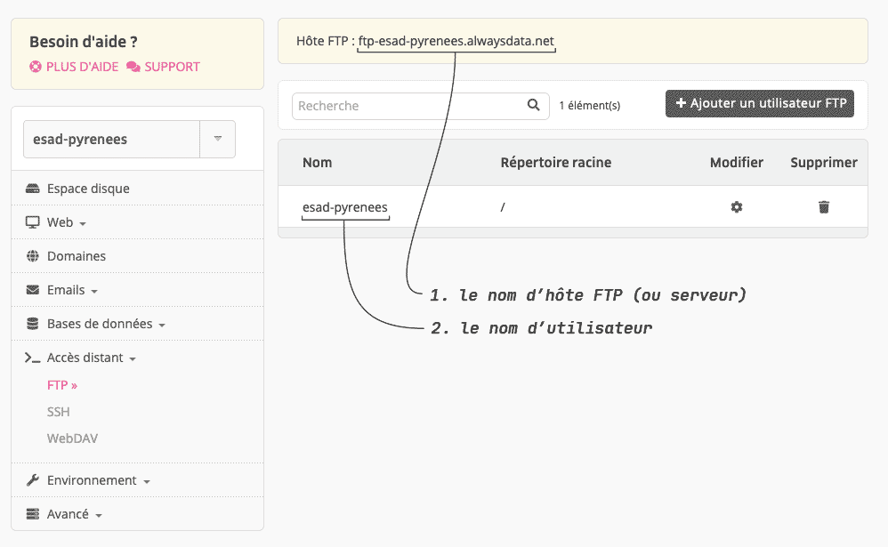
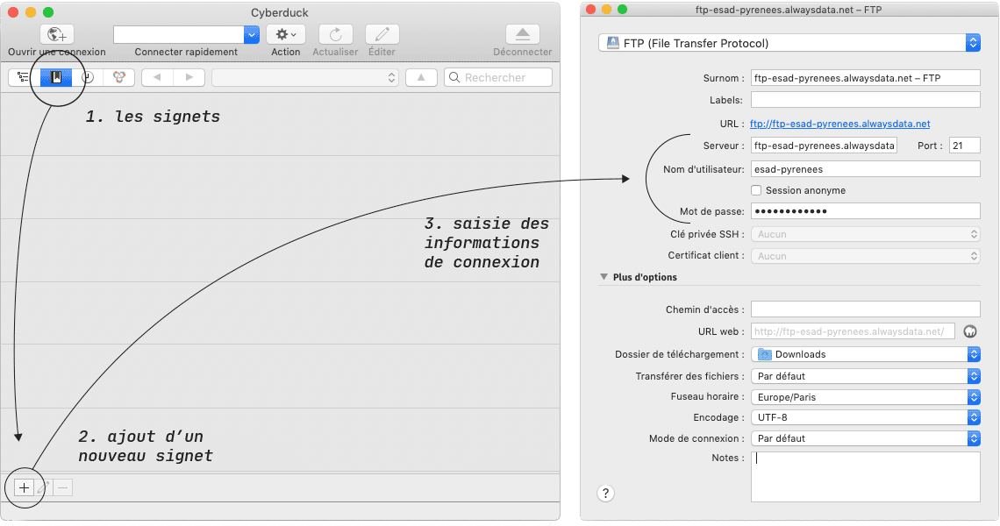
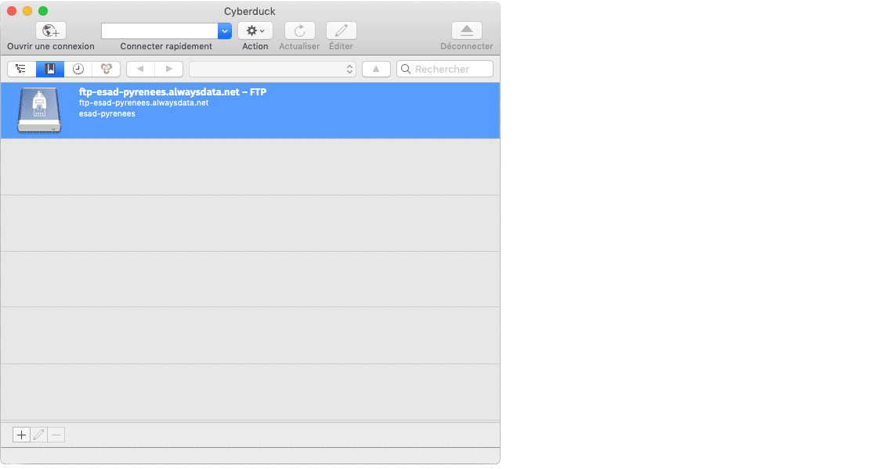
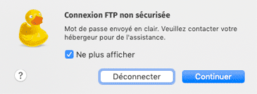
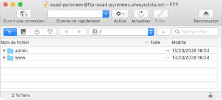
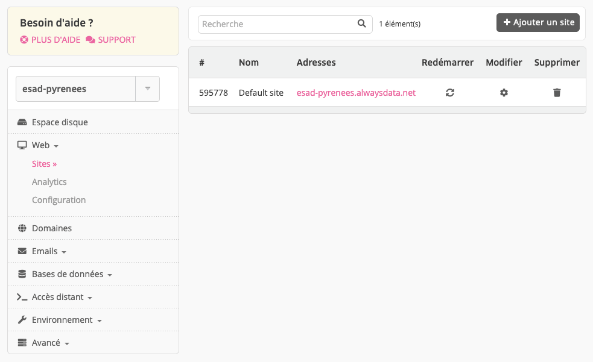
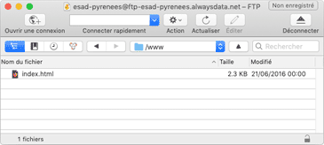
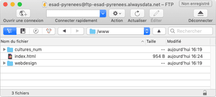

# Mise en ligne

Il existe aujourd’hui de nombreuses manières de mettre en ligne un site web, afin qu’il soit accessible au plus grand nombre (et notamment à vos enseignants).

La plus ancienne et robuste est d’utiliser un logiciel FTP (*File Transfer Protocol*) pour copier les fichiers de votre ordinateur vers votre espace sur un serveur web.

## Pré-requis

### Un hébergeur

Il est nécessaire de disposer d’un espace chez un hébergeur. Le coût annuel d’un hébergement est de quelques dizaines d’euros. En France, les hébergeurs les plus courants sonts [ovh](https://ovh.com/), [gandi](https://gandi.net) ou [online](https://www.online.net/fr/hebergement-web). [LWS](https://www.lws.fr/) est un hébergeur français dont les offres de prix sont très intéressantes. Les offres d’[Alwaysdata](https://www.alwaysdata.com/) sont plus onéreuses, mais un espace disque de 200 Mo est offert aux étudiants en suivant [ce lien](https://alws.link/gyB4xU46).

### Un nom de domaine

Le nom de domaine vous permet de personnaliser l’adresse à laquelle votre site sera accessible sur le web.

Pour rappel, un domaine a trois parties qui se lisent de droite à gauche:

- **Domaine de premier niveau** (ou TLD): il existe des domaines génériques (.com, .org, .net) et spécifiques à des pays (.us, .nl, .fr).
- **Nom de domaine** : un nom tel que wikipedia ou esad-pyrenees, pouvant inclure des lettres, des chiffres, mais pas d’espace ni de point.
- **Sous-domaine** (facultatif). Bien que cette troisième partie soit facultative, la plupart des sites Web utilisent www comme sous-domaine par défaut.

On n’achète pas de domaine, mais on le loue à celui qui gère le TLD qu’on a choisi. Les entreprises qui gèrent des domaines Internet sont appelées *registrars* de domaines. En France, [gandi](https://gandi.net) ou [ovh](https://ovh.com/) sont parmi les registrars les plus connus, mais la plupart des hébergeurs vous proposent d’associer (parfois gratuitement, ou à prix réduit la 1<sup>re</sup> année) un domaine à votre hébergement.

Sur l’offre gratuite d’Alwaysdata, le domaine est *alwaysdata.net* et le sous-domaine correspond au nom de votre compte ; par exemple : [esad-pyrenees.alwaysdata.net](https://esad-pyrenees.alwaysdata.net). Le processus ci-dessous utilise un compte gratuit sur Alwaysdata.

### Un client (logiciel) FTP

Il existe de nombreux logiciels capables de se connecter à un serveur en FTP, tel que [Cyberduck](https://cyberduck.io/), [FileZilla](https://filezilla-project.org/) ou [Transmit](https://panic.com/transmit/) (MacOS). Le processus ci-dessous utilise Cyberduck.


## Démarrer

Un site web est composé de nombreux fichiers : contenu textuel, code, feuilles de styles, contenus média, etc. organisés en dossiers et sous-dossiers. Relire [HTML/Bien démarrer](../html/start/)

<strong class="blink" markdown="1">Accents, espaces, capitales doivent être proscrits dans les noms des fichiers et dossiers !</strong>

<pre markdown="0">
<span class="icon-folder-open"></span> mon_site
    <span class="icon-folder-open"></span> css
        <span class="icon-file-empty"></span> style.css
    <span class="icon-folder-open"></span> images
        <span class="icon-file-empty"></span> image.jpg
    <span class="icon-file-empty"></span> index.html
    <span class="icon-file-empty"></span> page2.html
</pre>

### Récupérer les identifiants et mot de passe de connexion

Pour déposer des fichiers sur votre espace dans le serveur d’Alwaysdata, il vous faut conaitre les identifiants permettant de vous y connecter. Ces informations sont accessibles depuis le menu “FTP” de [l’interface d’administration](https://admin.alwaysdata.com/) de votre compte sur alwaysdata.



1. L’**hôte FTP** : ftp-[votrecompte].alwaysdata.net
2. Le **nom d’utilisateur** : [votrecompte]
3. Le **mot de passe** : [votr3m0tdep4sse!]

### Cyberduck

Cyberduck est un client FTP libre et gratuit qui vous permet de vous connecter à votre serveur pour y déposer et manipuler des fichiers.
Il est téléchargeable ici : https://cyberduck.io

Si l’interface est en anglais, vous pouvez modifier l’option dans les préférences de langue du logiciel.

L’écran d’accueil de l’interface s’ouvre sur les “signets” (les connexions déjà enregistrées). Notre objectif est de créer un nouveau signet, pour pouvoir nous re-connecter au serveur sans avoir à saisir les infos de connexion à chaque fois.



Une fois les informations de connexion saisie dans les champs de la fenêtre dédiée, on peut fermer la fenêtre. Le signet se retrouve alors enregistré dans la liste.



Vous pouvez alors double-cliquer sur le signet pour démarrer la connexion. Si un alerte de sécurité s’affiche, n’hésitez pas à cocher la case “ne plus afficher” et à continuer.



Si vous avez saisi les bonnes informations de connexion, la fenêtre de Cyberduck affiche alors le contenu de votre espace sur le serveur.



Par défaut, l’utilisateur FTP d’Alwaysdata a accès à la “racine” de l’espace disque (qui contient les dossiers ` admin ` et ` www `). Par défaut également, le serveur affiche au visiteur le contenu du dossier `www`. Cette option est configurable dans [l’interface d’administration](https://admin.alwaysdata.com/) de votre compte, via le menu “Web / Sites” → “Default site / Modifier”.

 

Si vous disposez d’un nom de domaine, Alwaysdata permet de créer plusieurs sites, accessibles via différentes adresses. Dans le cas présent, nous allons héberger **plusieurs projets sur le même site**, grâce à une page d’index personnalisée.

### Mise en ligne

Dans Cyberduck, en double-cliquant sur `www`, on peut accéder au contenu du dossier que verront les visiteurs du site.



Un fichier `index.html` y est placé par défaut et correspond à la page d’accueil temporaire de votre site (dans le cas présent, http://esad-pyrenees.alwaysdata.net ; ou pour vous http://[votrecompte].alwaysdata.net). Vous allez pouvoir le supprimer pour le remplacer par votre propre page d’accueil.

On crée alors un fichier html très simple (la CSS peut même y être intégrée), contentant quelques liens vers les dossiers des projets, voire même les fichiers de présentation (notes d’intention, maquettes, storyboard ou wireframes).

``` html
<!DOCTYPE html>
<html lang="fr">
    <head>
        <meta charset="utf-8">
        <meta name="viewport" content="width=device-width, initial-scale=1.0">
        <title>ESAD Pyrénées</title>
        <style>
            body { margin: 2em; font-size: max(2em, 4vw); font-family: sans-serif;}
            a { color: black; text-decoration: none;}
            a:hover { color: tomato}
        </style>
    </head>
    <body>
        <p>
            ÉSAD Pyrénées 
        </p>
        <p>
            <a href="webdesign/index.html">→ webdesign</a><br>
            <a href="webdesign/note.pdf">↪ note d’intention</a><br>
            <a href="webdesign/storyboard.pdf">↪ storyboard</a><br>
            <a href="webdesign/maquettes.pdf">↪ maquettes</a>
        </p>
        <p>
            <a href="cultures_num/index.html">→ cultures numériques</a><br>
            <a href="cultures_num/note.pdf">↪ note d’intention</a>
        </p>        
    </body>
</html>
```

Vous pouvez alors téléverser (uploader) ce fichier `index.html` ainsi que les dossiers contenant le code de vos projets à l’intérieur du dossier `www`, par un simple glisser/déposer.




## Erreurs fréquentes

#### Ouverture de session échouée. 530 Login or password incorrect. 
Vous vous êtes trompé·e dans une des informations de connexion (nom de serveur hôte FTP, nom d’utilisateur ou mot de passe). Vous pouvez les vérifier dans [l’interface d’administration](https://admin.alwaysdata.com/ftp/) de votre compte sur Alwaysdata, et éventuellement réinitialiser le mot de passe.

#### Forbidden! You don't have permission to access … on this server.
Si l’ouverture de votre site (http://[votrecompte].alwaysdata.net) dans un navigateur produit une erreur de ce type, c’est vraisemblablement que vous avez oublié de nommer `index.html` la page d’accueil de votre projet.

#### Les images / styles ne s’affichent pas
Vérifiez que vous avez bien utilisé des [URLs relatives](../html/content/#urls-relatives) dans les chemins vers vos images, médias et fichiers css (et pas des URLs “absolues”, qui commencent par `file:///…`).
Rappelez-vous également que les <strong class="blink" markdown="1">accents, espaces, capitales doivent être proscrits dans les noms des fichiers et dossiers !</strong>