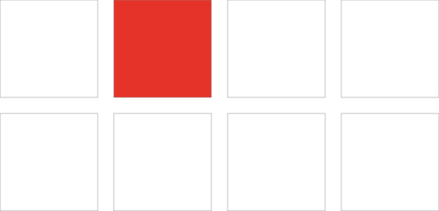
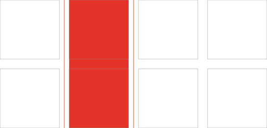
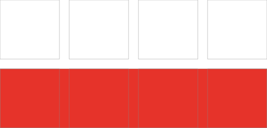
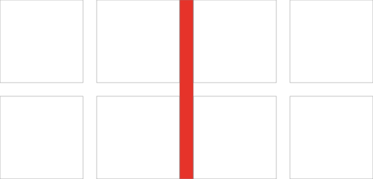
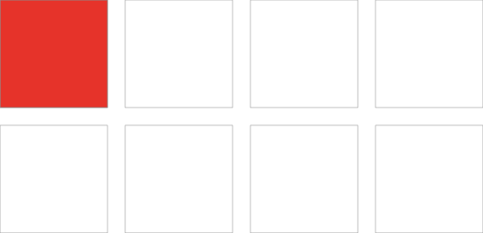

# CSS Grid layout

*Grid layout* est le module CSS dédié à la mise en page.
Il est apparu après des années de bricolage ou furent utilisées des techniques parfois approximatives souvent complexes et contre-intuitives (tables, floats, inline-blocks).

Il diffère de [Flexbox](../flex) principalement par le fait qu’il est dédié à des *layouts* bi-dimensionnels (lignes **et** colonnes), là où flexbox est dédié aux layouts uni-dimensionnels (lignes **ou** colonnes).

## Ressources en ligne

*   [Gridbyexample.com](https://gridbyexample.com/examples/), les grilles, par l’exemple…
*   *Visual cheat sheet*, [toutes les propriétés, illustrées](http://grid.malven.co/)
*   [CSS Grid Cheat Sheet](https://alialaa.github.io/css-grid-cheat-sheet/), *your ultimate CSS grid visual guide*
*   [Grid experiments](https://codepen.io/search/pens?q=grid+experiment) sur Codepen
*   Quelques [exemples](../../exemples/#grid) sur le site de l’atelier web

[→ C’est parti](start/){.bigbutton}

## Vocabulaire

Quelques précisions sur les notions essentielles nécessaires à la compréhension de Grid layout.

#### Lignes (*line*)
Les lignes (*lines*) verticales et horizontales qui divisent la grille et en colonnes (*columns*) et en lignes (*rows*).

#### Cellule (*cell*)
Une seule unité d’une grille CSS.

#### Zone (*area*)
Un espace rectangulaire déterminé par quatre lignes.

#### Piste (*track*)
L’espace horizontal ou vertical entre deux lignes de la grille.

#### Ligne (*row*)
Une piste horizontale d’une grille.

#### Colonne (*column*)
Une piste verticale d’une grille.

#### Gouttière (*gutter*)
L’espace entre les lignes et les colonnes dans une grille.

#### Conteneur (*container*)
Le conteneur qui contient la totalité de la grille CSS. C’est l’élément auquel on affecte la propriété `display: grid` ou `display: inline-grid`.

#### Élément (*grid item*)
Tout élément qui est l’enfant direct d’un conteneur de grille.

