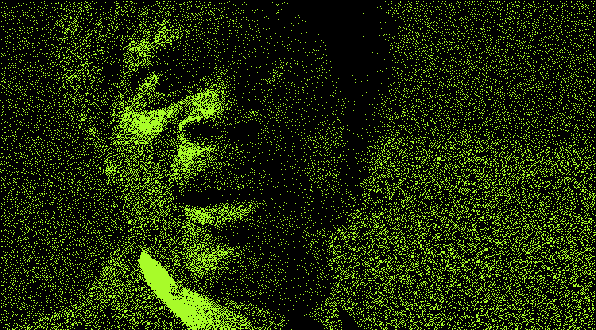

# Chapter 2

## 

Now that we know who you are, I know who I am. I'm not a mistake! It all makes sense! In a comic, you know how you can tell who the arch-villain's going to be? He's the exact opposite of the hero. And most times they're friends, like you and me! I should've known way back when…[^nb] 

[^nb]: You know why, David? Because of the kids. They called me Mr Glass.

My money's in that office, right? If she start giving me some bullshit about it ain't there, and we got to go someplace else and get it, I'm gonna shoot you in the head then and there. Then I'm gonna shoot that bitch in the kneecaps, find out where my goddamn money is. She gonna tell me too. Hey, look at me when I'm talking to you, motherfucker. You listen: we go in there, and that nigga Winston or anybody else is in there, you the first motherfucker to get shot. You understand?

## Your bones don't break, mine do. 

That's clear. Your cells react to bacteria and viruses differently than mine. You don't get sick, I do. That's also clear. But for some reason, you and I react the exact same way to water. We swallow it too fast, we choke. We get some in our lungs, we drown. However unreal it may seem, we are connected, you and I. We're on the same curve, just on opposite ends.

Your bones don't break, mine do. That's clear. Your cells react to bacteria and viruses differently than mine. You don't get sick, I do. That's also clear. But for some reason, you and I react the exact same way to water. We swallow it too fast, we choke. We get some in our lungs, we drown. However unreal it may seem, we are connected, you and I. We're on the same curve, just on opposite ends.
