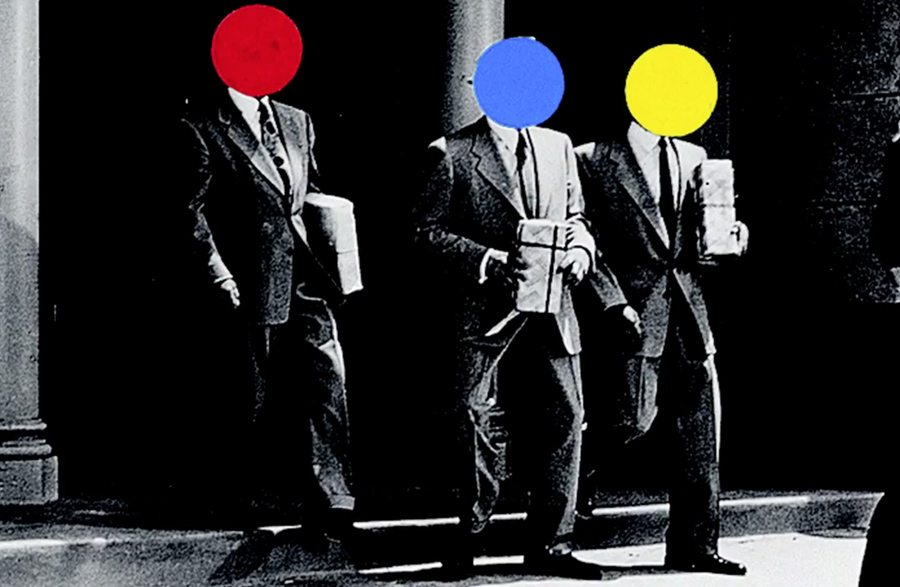

# Scrappy

Le scrapping consiste à effectuer des requêtes vers des services web (des sites, des API) pour en recevoir des informations et les enregistrer localement. Dans le cas d’API, c’est souvent prévu et autorisé. Dans le cas de sites web, c’est moins souvent autorisé, et donc d’autant plus utile :)

Cet exemple se propose de télécharger un ensemble d’images [légalement mises à disposition](https://www.loc.gov/free-to-use/) par la _Library of Congress_ : un [ensemble de portraits](https://www.loc.gov/free-to-use/c-m-bell-studio-collection/) par Charles Milton Bell.

Cette opération demandera d’inspecter avec soin le code HTML des pages qui contiennent les ressources que l’on veut télécharger. 

## Environnement virtuel

Python se manipule via la ligne de commande (rappel de quelques notions de [CLI – _Command Line Interface_](../../cli/)).

Sous Windows, il est recommandé d’utiliser PowerShell[^wcli] plutôt que l’interpréteur de commandes CMD. Au long de cette introduction, des détails sont donnés pour cet environnement quand il diffère de l’environnement MacOs / Linux.

[^wcli]: Ou encore mieux, WSL. [Voir ici](../../cli/).

Il est souhaitable d’utiliser un _environnement virtuel_ pour installer des paquets Python dans un environnement isolé, afin de stabiliser les versions des paquets utilisées dans un projet et éviter les conflits.

On crée l’environnement virtuel "env" en ligne de commande :

```sh
cd ~/mes_sites_web # pour se positionner dans l’arborescence du site 
mkdir scrappy # créer un dossier pour l’ensemble du projet
cd scrappy # rentrer dans ce nouveau dossier
python -m venv env # créer l’environnement dans ce dossier
```

Cela va créer dans votre projet (ou ailleurs, selon l’endroit où on lance la commande) un dossier `env` qui contiendra une copie de l’exécutable Python et les paquets qui seront installés dans le projet.

Une fois l’environnement virtuel créé, il faut _l’activer_ :

```sh
source env/bin/activate
# Ou bien
. env/bin/activate
# NB: pour le désactiver, on pourra faire :
# deactivate
```

<details> 
<summary>⚠ Windows</summary>
<p>Il faut autoriser l’éxécution des scripts. Dans PowerShell, saisir : </p>
<pre><code class="language-sh language-bash">Set-ExecutionPolicy -ExecutionPolicy Bypass -Scope Process -Force</code>
</pre>
<p>Puis, pour activer l’environnement virtuel :</p>
<pre><code class="language-sh language-bash">./venv/Scripts/activate.ps1</code>
</pre>
<p>Ou bien :</p>
<pre><code class="language-sh language-bash">source venv\Scripts\activate</code>
</details>


### Installer les bibliothèques utiles

On peut maintenant installer les bibliothèques python qui seront nécessaires, grâce à `pip`, un outil d’installation de paquets Python (notamment ceux présents sur [PyPI](https://pypi.org/)). Elles seront installées avec leurs dépendances dans l’environnement virtuel.

Les paquets ou bibliothèques Python suivantes doivent être installés : `requests` (pour faire des requêtes HTTP), `BeautifulSoup` (puissante librairie de lecture / écriture de HTML), `slugify` (ppour transformer des chaînes de caractères en “slugs”, sans accents, espaces, caractères spéciaux) et `lxml`, un simple “parser” de XML (pour analyser le HTML).

```sh
pip install requests beautifulsoup4 python-slugify lxml
```


<details> 
<summary>⚠ Windows</summary>
<p>Si la commande `pip` ne fonctionne pas, utiliser à la place `python -m pip`.</p></details>

## Structure du projet

Une fois les bibliothèques installées, on peut commencer à écrire notre script de scrapping, `scrap.py`, en le créant dans le dossier grâce à notre éditeur de texte favori.

```sh
mkdocs new mon_projet
```
Le projet se structure ainsi :

<pre markdown="0">
<span class="icon-folder-open"></span> scrappy
    <span class="icon-folder-open"></span> env
    <span class="icon-folder-open"></span> output
    <span class="icon-file-empty"></span> scrap.py
</pre>

- Le dossier `env` est celui de l’environnement virtuel ; on n’y touche pas.
- Le sous-dosssier `output` servira à stocker les résultats de notre exploration. 
- Le fichier `scrap.py` est notre script principal.

## Scraping

Pour une meilleure compréhension du processus, l’ensemble des opérations à effectuer sera découpé en plusieurs étapes. Première étape : la récolte des URLs des page de détail des images.

### URLs des images

##### scrap.py (pseudo-code) {.filename}
```python
# On effectue une requête vers "https://www.loc.gov/free-to-use/c-m-bell-studio-collection/"
# On lit le document HTML obtenu avec BeautifulSoup 
# On inspecte tous les éléments <figure> contenus dans le document pour récupérer les URLs des pages de détail de chaque image
# On stocke chaque URL dans une liste "urls"
# Pour chaque élément de la liste, on effectue une nouvelle requête
# On lit ce nouveau document avec BeautifulSoup 
# On récupère l’URL de l’image grâce à la balise <meta property="og:image">
# On stocke cette URL dans une liste "images"
# On enregistre cette liste en tant que fichier json
```
On peut l’invoquer avec :
```sh
env/bin/python scrap.py
```

##### scrap.py {.filename}
```python
import requests
from bs4 import BeautifulSoup
import json

baseurl = "https://www.loc.gov"
loc = baseurl + "/free-to-use/c-m-bell-studio-collection/"

r = requests.get(loc)
soup = BeautifulSoup(r.text, "lxml")

urls = []
photos = soup.find_all("figure")
for p in photos:
  a = baseurl + p.find("a")["href"]
  urls.append(a)

images = []
for url in urls:
  r = requests.get(url)
  soup = BeautifulSoup(r.text, "lxml")
  metas = soup.find_all(attrs = {"property": "og:image"})
  images.append(metas[0]['content'])

with open('images.json', 'w') as f:
  json.dump(images, f)
```
À la suite de l’exécution de ce script, un fichier `images.json` contient les urls de l’ensemble des images à télécharger :

<pre markdown="0">
<span class="icon-folder-open"></span> scrappy
    <span class="icon-folder-open"></span> env
    <span class="icon-folder-open"></span> output
    <span class="icon-file-empty"></span> images.json
    <span class="icon-file-empty"></span> scrap.py
</pre>

### Téléchargement des images

Un nouveau script, `download.py`, va permettre de télécharger chacune des images dans le dossier `output`:

##### scrap.py (pseudo-code) {.filename}
```python
# On lit le fichier "images.json" qui contient les URLs des images
# On crée le dossier "output" s’il n’existe pas
# Pour chaque élément de la liste d’images, on détermine son chemin de destination 
# Si le chemin existe (l’image a déjà été téléchargée), on passe à la suivante
# Sinon, on effectue une requête vers l’URL
# Si la requête est fructueuse (status_code=200), on enregistre l’image à son emplacement de destination
```
On peut l’invoquer avec :
```sh
env/bin/python download.py
```

##### download.py {.filename}
```python
import requests
import json
import os

# load json
with open('images.json', 'r') as f:
  images = json.load(f)

# create output directory
base_dir = os.getcwd()
out_dir = os.path.join(base_dir, "output")
if not os.path.exists(out_dir):
  os.mkdir(out_dir)
print("Putting downloaded files into: " + out_dir)

# loop through images URLs list
for url in images:
  
  print(f"(Trying to download: {url}" )

  out_file = os.path.join(out_dir, os.path.basename(url))
  if os.path.isfile(out_file):
    print("Skipping, file already downloaded\n")
    continue
  
  try:
    r = requests.get(url)
  except:
    print("Request failed, skipping")
    continue

  if r.status_code == 200:
    with open(out_file, 'wb') as f:
      print(f"Writing image to: {out_file}")
      f.write(r.content)
  else:
    print("Error downloading, HTTP response code was: " + str(r.status_code))
    continue
```

Si tout s’est bien passé 🤞, les images ont été téléchargées dans le dossier `output`.

## Traitement des images

La prochaine étape se propose d’utiliser le paquet python `face_recognition` pour détecter automatiquement les visages à l’intérieur de ces portraits afin de produire des faux John Baldessari.



On peut [écouter Tom Waits](https://youtu.be/eU7V4GyEuXA?si=m558CoqP_HBnCMTN) raconter son histoire en six minutes.

Installons la librairie [`face_recognition`](https://github.com/ageitgey/face_recognition/), qui permet de détecter des visages à l’intérieur d’une image.

Cette librairie requiert l’installation préalable de `dlib` et  `cmake`. Si la commande ci-dessous n’installe pas `dlib` automatiquement, se référer au processus d’installation documenté depuis la [page de `face_recognition`](https://github.com/ageitgey/face_recognition/). 

```sh
pip install face_recognition
```

### Parcours du dossier d’images

On va alors parcourir l’ensemble du dossier d’images téléchargées:

```py
import os

with os.scandir('output') as entries:
  for entry in entries:
    if entry.name.endswith(('.jpg', '.png', '.gif', '.webp')):
      print(entry.path)
```

Chaque chemin de fichier devrait être affiché dans la console. Si c’est bien le cas, on va lire chaque image et essayer d’y détecter un visage.

Il faut préalablement importer la bibliothèque `face_recognition`.

### Détection des visages

```py
import os
import face_recognition as fr

def detectFaces(file):
  image = fr.load_image_file(file)
  face_locations = fr.face_locations(image, number_of_times_to_upsample=0, model="cnn")
  print(f"I found {len(face_locations)} face(s) in this photograph.")

with os.scandir('output') as entries:
  for entry in entries:
    if entry.name.endswith(('.jpg', '.png', '.gif', '.webp')):
      detectFaces(entry.path)
```

La documentation de `face_recognition` nous signale que plusieurs visages peuvent être reconnus. Une boucle est donc nécessaire pour pouvoir traiter chaque visage et connaitre sa position :

```py
# extrait de code
for face_location in face_locations:
  top, right, bottom, left = face_location # cette notation permet de décomposer la liste retournée en plusieurs variables
  print(f"A face is located at position top: {top}, left: {left}, bottom: {bottom}, right: {right}")
```
### Génération des svg

On peut alors passer à la génération d’un svg pour chaque image, qui contiendra à la fois l’image et un cercle de couleur, centré sur la position des visages. Le `svg` résultant ressemblera à ça :
```xml
<svg viewbox="0 0 500 1000" width="500" height="1000" xmlns="http://www.w3.org/2000/svg" xmlns:xlink="http://www.w3.org/1999/xlink">
  <!-- l’image possède un attribut xlink:href qui spécifie le chemin vers l’image -->
  <image width="500" height="1000" xlink:href="output/image.jpg"/>
  <!-- les attributs cx, cy et r définissent les positions x, y et le rayon du cercle -->
  <circle cx="267.5" cy="451.5" r="39.5" />
</svg>
```

La balise `<svg>` doit contenir une `viewbox` et des attributs `width` et `height` spécifiques à la taille de l’image.

Une nouvelle bibliothèque (promis, c’est la dernière…) doit être importée pour pouvoir mesurer l’image source et transmettre l’information au code `svg` : `pillow` (dérivée de PIL, Python Image Library).

```sh
pip install pillow
```

L’import de cette bibliothèque permettra de mesurer l’image :
```py
# extrait de code
from PIL import Image

def detectFaces(file):
  # …
  im = Image.open(file)
  width, height = im.size
```
Python va désormais nous permettre de générer le code `svg` complet pour chaque image :


```py
# extrait de code
import face_recognition as fr
from PIL import Image

def detectFaces(file):
  image = fr.load_image_file(file)
  face_locations = fr.face_locations(image, number_of_times_to_upsample=0, model="cnn")
  print(f"I found {len(face_locations)} face(s) in this photograph.") 

  # Measure the image with PIL
  im = Image.open(file)
  width, height = im.size

  # Generate a `svg` string
  svg = f'<svg viewbox="0 0 {width} {height}" width="{width}" height="{height}" xmlns="http://www.w3.org/2000/svg" xmlns:xlink="http://www.w3.org/1999/xlink">'
  svg += f'<image width="{width}" height="{height}" xlink:href="{file}"/>'

  for face_location in face_locations:
      top, right, bottom, left = face_location
      print(f"A face is located at position top: {top}, left: {left}, bottom: {bottom}, right: {right}")
      # Mathématiques avancées (non…) pour positionner le centre et le rayon
      # du cercle à partir des informations top, right, bottom et left
      cx = (right - left) / 2 + left
      cy = (bottom - top) / 2 + top
      r = (right - left) / 2
      svg += f'<circle cx="{cx}" cy="{cy}" r="{r}" />'
  svg += "</svg>"
  print(svg)
```

Le code `svg` de notre fichier étant créé, il ne reste qu’à l’enregistrer en tant que `fichier.svg`. 

```py
# extrait de code
basename = os.path.basename(file) # ← on récupère le nom du fichier
svgname = f"output/{basename}.svg" # ← …auquel on ajoute ".svg"
f = open(f"output/{svgname}", "w") # ← on range le fichier dans le bon dossier
f.write(svg)
```

Pour de faux Baldessari plus convaincants, ajoutons un peu de couleur aléatoire :
```py
# extrait de code
import random

# …
color = random.choice(["red", "blue", "yellow", "green", "pink"])
svg += f'<circle cx="{cx}" cy="{cy}" r="{r}" fill="{color}"/>'
```

## Finalisation / fignolage

Pour finir, on peut générer un fichier html pour afficher l’ensemble des fichiers.

```py
with os.scandir('svgs/output') as entries:
  # on crée une chaine de déut pour notre fichier HTML :
  html = '<!DOCTYPE html><html lang="fr"><head><meta charset="UTF-8"><title>Baldessari</title></head><body>'

  for entry in entries:
    if entry.name.endswith(('.jpg', '.png', '.gif', '.webp')):
      # plutôt que simplement exécuter detectFaces, on modifie la fonction
      # pour qu’elle retourne le chemin vers le fichier svg
      svg = detectFaces(entry.path)
      html += f""

  html += "</body></html>"
  with open(f"svg.html", "w") as f:
      f.write(html)
```

Le fichier fignolé devient:

##### detectfaces.py {.filename}
```py
from PIL import Image
import os
import face_recognition as fr
from pathlib import Path
import random

def detectFace(file):
  image = fr.load_image_file(file)

  # Detect faces
  # Detection can be improved (but takes more time…) with number_of_times_to_upsample=2
  face_locations = fr.face_locations(image, number_of_times_to_upsample=2, model="cnn")
  print(f"I found {len(face_locations)} face(s) in this photograph.") 

  # File name
  basename = os.path.basename(file) # ← on récupère le nom du fichier
  svgname = f"output/{basename}.svg" # ← …auquel on ajoute ".svg"
  
  # Measure the image with PIL
  im = Image.open(file)
  width, height = im.size

  # Generate a `svg` string
  svg = f'<svg viewbox="0 0 {width} {height}" width="{width}" height="{height}" xmlns="http://www.w3.org/2000/svg" xmlns:xlink="http://www.w3.org/1999/xlink">'
  svg += f'<image width="{width}" height="{height}" xlink:href="{ basename }"/>'

  for face_location in face_locations:
      top, right, bottom, left = face_location
      print(f"A face is located at position top: {top}, left: {left}, bottom: {bottom}, right: {right}")
      # Mathématiques avancées (non…) pour positionner le centre et le rayon
      # du cercle à partir des informations top, right, bottom et left
      cx = (right - left) / 2 + left
      cy = (bottom - top) / 2 + top
      r = (right - left) / 2
      color = random.choice(["red", "blue", "yellow", "green", "pink"])
      svg += f'<circle cx="{cx}" cy="{cy}" r="{r}" fill="{color}"/>'
  svg += "</svg>"

  # Enregistrement
  f = open(svgname, "w") 
  f.write(svg)

  # On renvoie le code svg à la boucle principale
  return svg

with os.scandir('output') as entries:
  # on crée une chaine de déut pour notre fichier HTML :
  html = '<!DOCTYPE html><html lang="fr"><head><meta charset="UTF-8"><title>Baldessari</title></head><body>'
  for entry in entries:
    if entry.name.endswith(('.jpg', '.png', '.gif', '.webp')):
      # plutôt que simplement exécuter detectFaces, on modifie la fonction
      # pour qu’elle retourne le chemin vers le fichier svg
      svg = detectFace(entry.path)
      html += svg + "\n"
  html += "</body></html>"
  with open(f"output/svg.html", "w") as f:
    f.write(html)
```

On peut l’invoquer avec :

```sh
env/bin/python detectfaces.py
```
