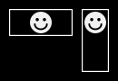
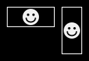
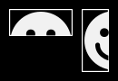
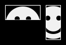
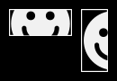
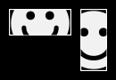
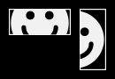
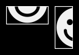
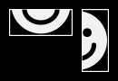

# SVG

SVG (_Scalable Vector Graphics_) est un format d’images vectorielles particulièrement utile et puissant pour le web.

Les fichiers SVG peuvent être édités dans un logiciel de dessin vectoriel ([Inkscape](https://inkscape.org/), Illustrator, [SnapSVG](http://snapsvg.io/)), mais aussi depuis un éditeur de code : basé sur XML, un langage de balisage similaire au HTML, son code est relativement aisé à lire et à comprendre.


L’introduction ci-dessous est liée à l’utilisation de svg dans le contexte du projet [Déambulations](../../projets/deambulations/) associant dessin et webdesign. Elle implique l’utilisation conjointe d’outils de dessin et d’éditeur de code.

## Images interactives

Dans le contexte de ce projet, le format SVG peut servir à associer un fichier bitmap (ou image « matricielle » : `jpg`, `png`, `webp`) à des éléments interactifs (`a`), pour être intégré dans une page web responsive.

### Intégrer un fichier dans une page web.

À cette fin, les fichiers SVG ne pourront pas être inclus dans la page en tant qu’images ; le code complet du SVG devra être inclus dans la page HTML :

```html
<body>
    <!-- pas comme ça : -->
    
    <!-- mais comme ça : -->
    <svg width="1600" height="1600" … >
        <!-- … -->
    </svg>
</body>
```

### Simplification du code natif


Dans cet exemple, on utilisera une image (`godot.png`), enregistrée dans le même dossier que les fichiers SVG.

En ouvrant le fichier `godot.png` dans Inkscape[^inkscape] (ou Illustrator), on pourra créer et exporter un fichier SVG contenant à la fois l’image et des éléments vectoriels. 

⚠️ Le fichier bitmap (`jpg`, `png`…) peut être ouvert directement dans Inkscape ou Illustrator ; il faudra néanmoins veiller, lors de l’ouverture ou de l’enregistrement à **lier** les images et pas les **incorporer**. Dans Illustrator, le plan de travail devra être redimensionné à la taille de l’image.

Enregistré en tant que “SVG simple”, le fichier résultant peut être ouvert, lu et modifié dans un éditeur de code. Le code ressemble à ça (n’ayez pas peur…) :
```svg
<?xml version="1.0" encoding="UTF-8" standalone="no"?>
<!-- Created with Inkscape (http://www.inkscape.org/) -->
<svg
   version="1.1"
   id="svg1" 
   width="1600"
   height="1600"
   viewBox="0 0 1600 1600"
   xmlns:xlink="http://www.w3.org/1999/xlink"
   xmlns="http://www.w3.org/2000/svg"
   xmlns:svg="http://www.w3.org/2000/svg">
  <defs
     id="defs1" />
  <g
     id="g1">
    <image
       width="1600"
       height="1600"
       preserveAspectRatio="none"
       xlink:href="godot.png"
       id="image1" />
  </g>
</svg>
```
On constate que la syntaxe est proche de ce qu’on connaît en HTML, et qu’elle partage des attributs communs (ici, `id` ou `width` et `height`, mais on pourra également trouver des `class`, `style`, etc.).

Un passage par l’outil d’optimisation [SVGOMG](https://jakearchibald.github.io/svgomg/) permet de le simplifier en :
```svg
<svg width="1600" height="1600" xmlns:xlink="http://www.w3.org/1999/xlink" xmlns="http://www.w3.org/2000/svg">
    <image width="1600" height="1600" preserveAspectRatio="none" xlink:href="godot.png"/>
</svg>
```
### Ajouter des éléments vectoriels

On peut alors dessiner des éléments vectoriels (à la plume, ou en utilisant l’outil de vectorisation d’image matricielle d’Inkscape) :

```svg
<svg width="1600" height="1600" xmlns:xlink="http://www.w3.org/1999/xlink" xmlns="http://www.w3.org/2000/svg">
    <image width="1600" height="1600" preserveAspectRatio="none" xlink:href="godot.png"/>
    <!-- un rectangle -->
    <rect width="1300" height="1300" x="150" y="200" />
    <!-- un cercle ou une ellipse -->
    <circle cx="512" cy="653" r="128" />
    <!-- un tracé vectoriel -->
    <path d="m 916.2729,1306.372 c 48.1556,-11.0513 18.55291,-78.8817 21.96576,-113.853 -2.45027,-50.8545 -7.84742,-101.4353 -16.88179,-151.4709 -3.47495,-57.13398 12.66694,-112.84982 15.29162,-169.74706 4.17391,-54.32155 9.35373,-108.62351 16.08136,-162.57081 9.08847,-37.9406 -0.73762,-71.71054 -24.78509,-102.92862 -19.50981,-5.22488 -15.21956,55.1467 -33.3096,70.19839 -9.37246,25.27298 -43.45161,78.31062 -70.82762,45.98419 -34.23116,-35.95875 -22.23597,-89.86858 -30.53729,-134.75714 -12.8157,-15.77232 10.20024,-46.09783 7.27158,-14.42088 -0.0445,31.2079 36.79661,41.26863 38.76896,72.37637 9.66383,-26.56594 -31.73053,-50.24646 12.22187,-75.53359 22.06759,-26.03168 -0.81054,-72.52223 37.7081,-90.26944 42.05105,-15.39849 -2.32787,-56.85282 7.25478,-87.79357 -32.66266,-15.89561 -10.79458,-32.67472 9.7907,-40.80794 -2.56876,-48.07817 52.46099,-63.78597 89.45141,-45.78651 43.33155,9.05163 10.57705,68.50552 42.22555,76.56019 27.7962,16.03518 -36.1899,18.41176 -9.0436,39.79575 -6.3047,42.07892 64.5826,2.12957 86.525,25.98079 49.5105,24.69236 87.349,68.94955 117.7839,114.31496 25.1208,43.20873 -21.7168,87.00884 -23.2116,127.1801 21.0242,51.19621 41.6633,103.06518 53.9363,157.18531 3.7935,33.14908 26.8662,81.29267 -14.8519,98.84583 -23.3416,27.1333 1.1333,77.16738 -2.89,112.95838 4.8137,37.5594 -0.675,75.4813 6.7207,112.6939 3.8921,36.1552 -5.0412,75.6066 5.6145,109.9254 25.7867,6.5695 18.0206,40.691 16.8637,65.4029 -22.0143,15.1754 -77.8087,12.83 -65.2496,-29.6575 -25.1272,-92.6917 -38.9492,-276.9075 -50.9353,-309.5169 -12.6699,-34.8028 -11.0444,-111.38476 -65.9976,-81.01727 -26.0228,7.96919 -12.4992,43.91288 -46.0035,42.37736 -51.48487,6.08381 -21.888,54.54351 -34.9574,88.92871 -5.9884,30.1895 9.0958,195.2807 1.2092,280.1451 -27.13024,13.2497 -66.60056,21.6481 -107.18976,8.7405" />
</svg>
```
### Déterminer l’apparence des éléments

Les attributs de style de ces éléments (remplissage, contours) vont pouvoir être déterminés en CSS, au sein même de l’élément SVG ou dans le fichier CSS associé à la page.
```css
rect { fill: rgba(0,0,0,.2); }
circle { stroke: purple; stroke-width: 10px; opacity: 0.4; }
path { fill: blueviolet; mix-blend-mode: multiply;}
```

⚠️ Le remplissage d’un élémeent vectoriel ne doit pas être établi à `none` ; cela aurait pour effet de le rendre inaccessible au click ou au survol.

[Voir l’exemple 1](exemples/exemple-svg-1.html) (et regarder son code-source).


### Rendre interactifs les éléments

On peut alors créer des liens hypertextes au sein même du code `svg`:

```svg
<svg width="1600" height="1600" xmlns:xlink="http://www.w3.org/1999/xlink" xmlns="http://www.w3.org/2000/svg">
    <image width="1600" height="1600" preserveAspectRatio="none" xlink:href="godot.png"/>
    <!-- avec une simple balise <a>, pour changer de page -->
    <a href="vladimir.html">
      <circle cx="512" cy="653" r="128" />
    </a>
</svg>
```
Ou utiliser javascript pour produire des interactions :
```html
<svg width="1600" height="1600" xmlns:xlink="http://www.w3.org/1999/xlink" xmlns="http://www.w3.org/2000/svg">
    <image width="1600" height="1600" preserveAspectRatio="none" xlink:href="godot.png"/>
    <!-- en déterminant un "id" -->
    <circle cx="512" cy="653" r="128" id="estragon"/>
</svg>
<script>
    document.querySelector('#estragon').onclick = () => {
      alert("Il faut revenir demain.")
    }
</script>
```
[Voir l’exemple 2](exemples/exemple-svg-2.html) (cliquer sur l’élément violet, et regarder le code-source :).

### Maîtriser les dimensions d’affichage

Un problème de taille (et de dimensions) se pose alors ! La maîtrise du dimensionnement du SVG ne peut être atteinte via les règles `width` ou `max-width` tant que l’attribut `viewbox` n’est pas ajouté à l’élément `<svg>` :

```html
  <svg viewbox="0 0 1600 1600" width="1600" height="1600" …
```
Les courts articles traduits en français [_Comprendre SVG preserveAspectRatio_](https://la-cascade.io/articles/comprendre-svg-preserveaspectratio) et [_Comprendre SVG viewBox et viewport_](https://la-cascade.io/articles/comprendre-svg-viewbox-et-viewport) sont particulièrement éclairants à ce sujet.

Voir [l’exemple 3](exemples/exemple-svg-3.html) et [l’exemple 4](exemples/exemple-svg-4.html), qui permettent de “contenir” le svg dans la page.

Si on veut “remplir la page”, un nouvel attribut va devoir être affecté à l’élément `<svg>` : `preserveAspectRatio`. Cet attribut possède deux paramètres qui permettent de définir le comportement de position et de recadrage du svg à l’intérieur de son `viewbox`. 

```html
  <svg preserveAspectRatio="xMidYMid slice" viewbox="0 0 1600 1600" width="1600" height="1600" …
```

Ces paramètres sont `<align>` et `<meetOrSlice>`. Ces propriétés d’alignement ou de dimensionnement sont comparables à ce qu’on peut atteindre en CSS grâce à `background-size` ou `object-fit` (avec `background-position` et `object-position`). 

Voir [l’exemple 5](exemples/exemple-svg-5.html).

<style>tr {border:none}</style>


Les propriétés d’alignement avec `meet`:

<table style="max-width:var(--p-width); ">
<tr>
<td><p>xMinYMin meet</p></td>
<td><p>xMidYMin meet</p></td>
<td><p>xMaxYMin meet</p></td>
</tr><tr>
<td><p>xMinYMid meet</p></td>
<td><p>xMidYMid meet</p></td>
<td><p>xMaxYMid meet</p></td>
</tr><tr>
<td><p>xMinYMax meet</p></td>
<td><p>xMidYMax meet</p></td>
<td><p>xMaxYMax meet</p></td>
</tr>
</table>

Les propriétés d’alignement avec `slice`:

<table style="max-width:var(--p-width)">
<tr>
<tr>  
<td><p>xMinYMin slice</p></td>
<td><p>xMidYMin slice</p></td>
<td><p>xMaxYMin slice</p></td>
</tr><tr>
<td><p>xMinYMid slice</p></td>
<td><p>xMidYMid slice</p></td>
<td><p>xMaxYMid slice</p></td>
</tr><tr>
<td><p>xMinYMax slice</p></td>
<td><p>xMinYMax slice</p></td>
<td><p>xMaxYMax slice</p></td>
</tr>
</table>

~~Images~~ Idée empruntée à l’article <a href="https://alistapart.com/article/practical-svg/">Practical SVG</a> de Chris Coyer.

## Ressources en ligne

### Redimensionner des SVG

Pour comprendre comment, à quelle taille, avec quel ajustement afficher des SVG dans une page web.

- [How to scale SVG](https://css-tricks.com/scale-svg/)
- [Comprendre SVG preserveAspectRatio](https://la-cascade.io/articles/comprendre-svg-preserveaspectratio)
- [Comprendre SVG viewBox et viewport](https://la-cascade.io/articles/comprendre-svg-viewbox-et-viewport)

### Dessiner “à la main” (avec du code)

C’est plus simple et plus amusant qu’on ne croît.

- [How To Create Simple Shapes And Lines](https://vanseodesign.com/web-design/svg-shapes-lines/)
- [Creating Paths With Line Commands](https://vanseodesign.com/web-design/svg-paths-line-commands/)
- [Creating Paths With Curve Commands](https://vanseodesign.com/web-design/svg-paths-curve-commands/)
- [The SVG `path` Syntax: An Illustrated Guide ](https://css-tricks.com/svg-path-syntax-illustrated-guide/)

### Ressources générales

À compléter.

- [Pocket Guide to Writing SVG](https://svgpocketguide.com/)
- [6 Common SVG Fails (and How to Fix Them)](https://css-tricks.com/6-common-svg-fails-and-how-to-fix-them/)

### Outils en ligne

À compléter.

- [SVGOMG](https://jakearchibald.github.io/svgomg/) pour optimiser et nettoyer des fichiers SVG.
- [Vecta/Nano](https://vecta.io/nano), humblement autoproclamé _World's Best SVG Compressor_.


[^inkscape]: [Inkscape](https://inkscape.org/) est un outil performant, libre et gratuit. Aucune raison  de ne pas l’adopter en parallèle, sinon à la place d’Illustrator.